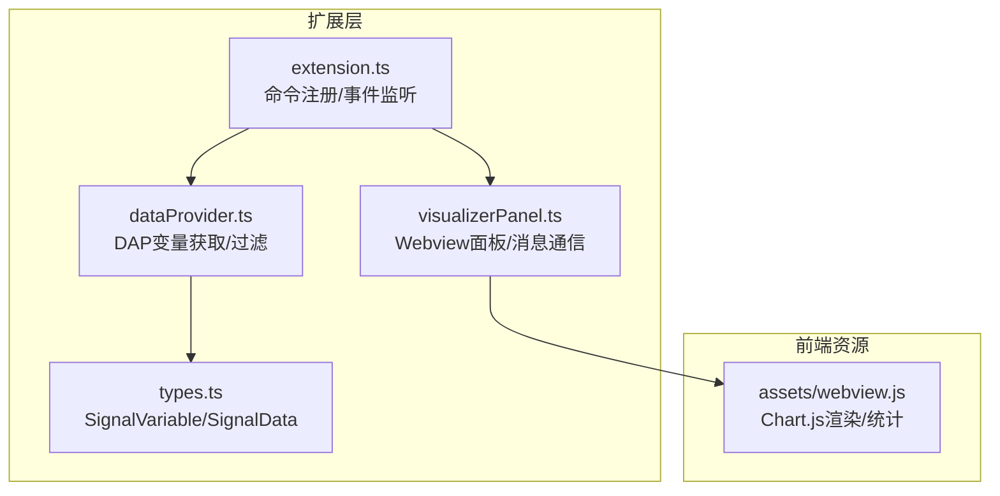
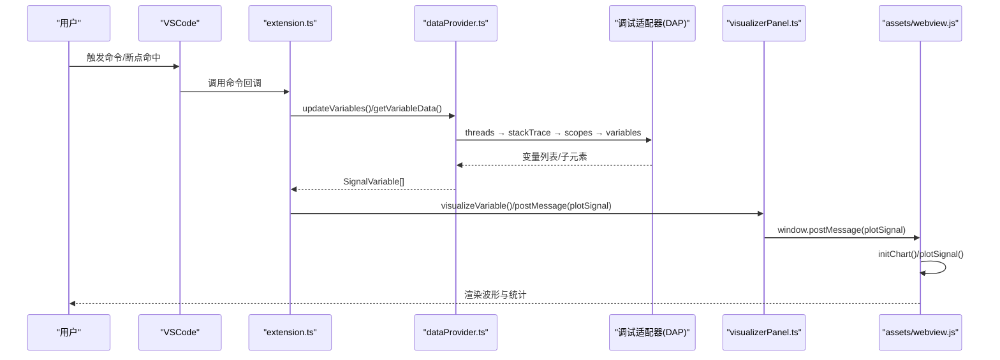
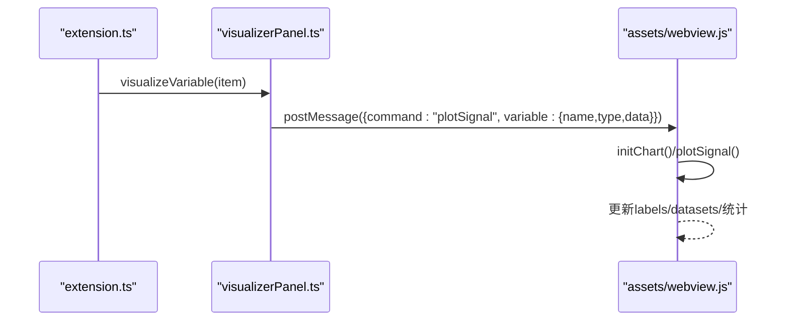
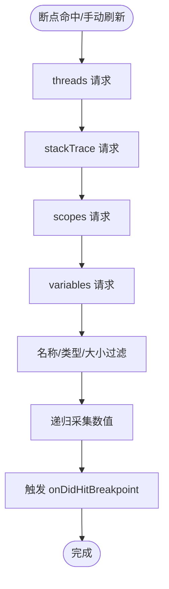
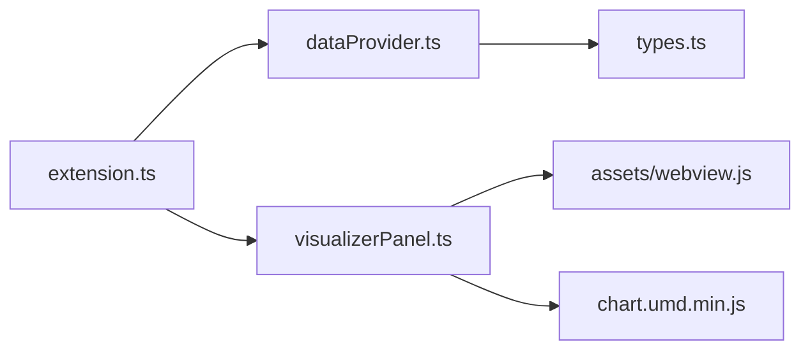

# API 参考

<cite>
**本文引用的文件**
- [package.json](file://package.json)
- [QUICKSTART.md](file://QUICKSTART.md)
- [src/extension.ts](file://src/extension.ts)
- [src/dataProvider.ts](file://src/dataProvider.ts)
- [src/visualizerPanel.ts](file://src/visualizerPanel.ts)
- [src/types.ts](file://src/types.ts)
- [assets/webview.js](file://assets/webview.js)
</cite>

## 目录
1. [简介](#简介)
2. [项目结构](#项目结构)
3. [核心组件](#核心组件)
4. [架构总览](#架构总览)
5. [详细组件分析](#详细组件分析)
6. [依赖关系分析](#依赖关系分析)
7. [性能考量](#性能考量)
8. [故障排查指南](#故障排查指南)
9. [结论](#结论)
10. [附录](#附录)

## 简介
本参考文档面向 VSCode 扩展开发者与使用者，系统梳理“雷达信号可视化”扩展的公共 API、消息协议、数据格式、通信流程与错误处理机制。重点覆盖：
- VSCode 命令 API：命令注册、触发与参数规范
- Webview 消息协议：握手、绘图数据传输与前端渲染
- Debug Adapter Protocol（DAP）扩展：变量获取、过滤与数据采集
- 类型定义与接口签名：SignalVariable、SignalData
- 版本管理与兼容性：基于 VSCode 引擎版本与配置项
- 安全、性能与使用限制：CSP、降采样、资源释放

## 项目结构
项目采用分层设计：扩展入口负责命令注册与调试事件监听；数据提供者负责与调试器交互并过滤变量；可视化面板负责 Webview 生命周期与消息通信；类型定义统一数据契约；前端脚本负责图表渲染与统计。

**图表来源**
- [src/extension.ts:46-188](file://src/extension.ts#L46-L188)
- [src/dataProvider.ts:56-702](file://src/dataProvider.ts#L56-L702)
- [src/visualizerPanel.ts:44-424](file://src/visualizerPanel.ts#L44-L424)
- [src/types.ts:21-95](file://src/types.ts#L21-L95)
- [assets/webview.js:1-494](file://assets/webview.js#L1-L494)

**章节来源**
- [package.json:17-85](file://package.json#L17-L85)
- [QUICKSTART.md:42-57](file://QUICKSTART.md#L42-L57)

## 核心组件
- 扩展入口（extension.ts）：注册命令、监听调试事件、桥接数据提供者与可视化面板
- 数据提供者（dataProvider.ts）：实现 TreeDataProvider，封装 DAP 请求链，过滤信号变量，递归采集数值
- 可视化面板（visualizerPanel.ts）：管理 WebviewPanel 生命周期，建立扩展↔Webview 双向消息通道
- 类型定义（types.ts）：SignalVariable、SignalData 接口
- 前端脚本（assets/webview.js）：Chart.js 初始化、消息处理、降采样与统计

**章节来源**
- [src/extension.ts:46-188](file://src/extension.ts#L46-L188)
- [src/dataProvider.ts:56-702](file://src/dataProvider.ts#L56-L702)
- [src/visualizerPanel.ts:44-424](file://src/visualizerPanel.ts#L44-L424)
- [src/types.ts:21-95](file://src/types.ts#L21-L95)
- [assets/webview.js:1-494](file://assets/webview.js#L1-L494)

## 架构总览
扩展通过 VSCode API 注册命令与视图，利用 DebugAdapterTrackerFactory 捕获 DAP 事件，按配置过滤变量并通过 DAP 请求链获取数值，再通过 Webview 与 Chart.js 渲染波形与统计信息。

**图表来源**
- [src/extension.ts:78-111](file://src/extension.ts#L78-L111)
- [src/dataProvider.ts:243-399](file://src/dataProvider.ts#L243-L399)
- [src/visualizerPanel.ts:264-275](file://src/visualizerPanel.ts#L264-L275)
- [assets/webview.js:70-96](file://assets/webview.js#L70-L96)

## 详细组件分析

### VSCode 命令 API
- 命令注册与触发
  - rsv.openPanel：打开/激活可视化面板
  - rsv.visualizeVariable：可视化选中信号变量
  - rsv.refreshSignals：手动刷新变量列表
- 菜单与视图集成
  - 视图容器与视图定义
  - 视图标题栏与上下文菜单命令
- 配置项
  - rsv.autoDisplayOnBreakpoint：断点命中时自动展示
  - rsv.signalNamePatterns：变量名匹配模式
  - rsv.maxArraySize：最大数组长度限制

命令参数与返回
- rsv.openPanel：无参数，返回面板实例（单例）
- rsv.visualizeVariable：参数 item（SignalVariable），返回 void
- rsv.refreshSignals：无参数，返回 void

错误处理
- 命令回调中未显式 try/catch，依赖 VSCode 错误报告机制
- 断点命中自动展示时，若无匹配变量则不展示面板

最佳实践
- 使用 context.subscriptions 管理命令与事件订阅，避免泄漏
- 在面板关闭时正确 dispose 资源

**章节来源**
- [package.json:55-84](file://package.json#L55-L84)
- [src/extension.ts:78-146](file://src/extension.ts#L78-L146)

### Webview 消息协议
- 握手与初始化
  - 扩展 → Webview：postMessage({ command: 'init' })
  - Webview → 扩展：postMessage({ command: 'ready' })
- 绘图数据
  - 扩展 → Webview：postMessage({ command: 'plotSignal', variable: { name, type, data } })
  - Webview → 扩展：当前未使用
- 数据格式
  - variable.name：字符串
  - variable.type：字符串
  - variable.data：数值数组（number[]）

前端处理流程
- Webview 加载完成后初始化 Chart.js
- 监听消息，收到 plotSignal 后更新图表数据、标签与统计面板
- 对大数据集进行降采样，保证渲染性能

**图表来源**
- [src/visualizerPanel.ts:264-275](file://src/visualizerPanel.ts#L264-L275)
- [assets/webview.js:70-96](file://assets/webview.js#L70-L96)
- [assets/webview.js:355-419](file://assets/webview.js#L355-L419)

**章节来源**
- [src/visualizerPanel.ts:207-222](file://src/visualizerPanel.ts#L207-L222)
- [assets/webview.js:70-96](file://assets/webview.js#L70-L96)

### Debug Adapter Protocol（DAP）扩展
- 事件拦截
  - DebugAdapterTrackerFactory 拦截调试适配器消息
  - 捕获 "stopped" 事件后触发变量更新
- 变量获取四步请求链
  - threads → stackTrace → scopes → variables
- 变量过滤
  - 名称模式匹配（支持通配符）
  - 数组类型判断（value 含 "[0]" 或 "array"，或 variablesReference > 0）
  - 大小限制（从 value 提取长度并与阈值比较）
- 数值采集
  - 递归遍历复合变量（std::vector 等），收集叶子节点数值
  - 递归深度限制，防止异常数据结构导致无限递归
- 事件发布
  - onDidHitBreakpoint：断点命中后通知扩展自动展示面板

**图表来源**
- [src/dataProvider.ts:175-204](file://src/dataProvider.ts#L175-L204)
- [src/dataProvider.ts:243-399](file://src/dataProvider.ts#L243-L399)
- [src/dataProvider.ts:414-441](file://src/dataProvider.ts#L414-L441)
- [src/dataProvider.ts:563-634](file://src/dataProvider.ts#L563-L634)

**章节来源**
- [src/dataProvider.ts:175-204](file://src/dataProvider.ts#L175-L204)
- [src/dataProvider.ts:243-399](file://src/dataProvider.ts#L243-L399)
- [src/dataProvider.ts:414-441](file://src/dataProvider.ts#L414-L441)
- [src/dataProvider.ts:563-634](file://src/dataProvider.ts#L563-L634)

### 类型定义与接口签名
- SignalVariable
  - name: string
  - value: string
  - type: string
  - variablesReference: number
  - children: boolean
- SignalData
  - name: string
  - data: number[]
  - type: string

用途
- TreeDataProvider 数据契约
- Webview 通信数据结构

**章节来源**
- [src/types.ts:59-65](file://src/types.ts#L59-L65)
- [src/types.ts:90-94](file://src/types.ts#L90-L94)

### Webview 生命周期与资源管理
- 单例模式：currentPanel 静态属性确保唯一实例
- 生命周期事件：面板创建、激活、关闭
- 资源释放：dispose 时清理事件订阅与面板实例
- 安全策略：CSP + nonce，仅允许本地资源加载

**章节来源**
- [src/visualizerPanel.ts:44-164](file://src/visualizerPanel.ts#L44-L164)
- [src/visualizerPanel.ts:407-423](file://src/visualizerPanel.ts#L407-L423)
- [src/visualizerPanel.ts:317-392](file://src/visualizerPanel.ts#L317-L392)

## 依赖关系分析
- 扩展入口依赖数据提供者与可视化面板
- 数据提供者依赖 VSCode 调试 API 与 DAP
- 可视化面板依赖 Chart.js 与 VSCode Webview API
- 类型定义被数据提供者与可视化面板共同使用

**图表来源**
- [src/extension.ts:46-188](file://src/extension.ts#L46-L188)
- [src/dataProvider.ts:56-702](file://src/dataProvider.ts#L56-L702)
- [src/visualizerPanel.ts:44-424](file://src/visualizerPanel.ts#L44-L424)
- [src/types.ts:21-95](file://src/types.ts#L21-L95)
- [assets/webview.js:1-494](file://assets/webview.js#L1-L494)

**章节来源**
- [src/extension.ts:46-188](file://src/extension.ts#L46-L188)
- [src/dataProvider.ts:56-702](file://src/dataProvider.ts#L56-L702)
- [src/visualizerPanel.ts:44-424](file://src/visualizerPanel.ts#L44-L424)
- [src/types.ts:21-95](file://src/types.ts#L21-L95)
- [assets/webview.js:1-494](file://assets/webview.js#L1-L494)

## 性能考量
- 大数据集降采样：当数据点超过阈值时进行等间隔采样，保证渲染流畅
- 递归深度限制：防止异常数据结构导致无限递归
- Webview 保留上下文：retainContextWhenHidden=true，隐藏时保留 DOM 状态，提升切换体验
- 事件驱动刷新：TreeDataProvider 使用事件触发刷新，避免轮询

**章节来源**
- [assets/webview.js:380-388](file://assets/webview.js#L380-L388)
- [src/dataProvider.ts:570-572](file://src/dataProvider.ts#L570-L572)
- [src/visualizerPanel.ts:146-152](file://src/visualizerPanel.ts#L146-L152)

## 故障排查指南
- 侧边栏未显示雷达信号视图
  - 确认在扩展开发宿主窗口中并已启动调试会话
- 信号变量列表为空
  - 确认调试器已暂停，变量名符合配置模式
- 图表不显示
  - 检查变量是否为数组类型且包含数值数据
- 断点命中未自动展示面板
  - 检查配置项 rsv.autoDisplayOnBreakpoint 是否启用
  - 确认调试适配器支持 "stopped" 事件拦截

**章节来源**
- [QUICKSTART.md:31-41](file://QUICKSTART.md#L31-L41)
- [src/extension.ts:139-146](file://src/extension.ts#L139-L146)

## 结论
本扩展通过 VSCode 命令与 Webview API、DAP 协议与 Chart.js 实现了从调试器提取信号变量、过滤与采集数值、并在可视化面板中渲染波形与统计的功能。其设计遵循 VSCode 扩展开发规范，具备良好的事件驱动刷新、资源管理与安全策略。建议在生产环境中进一步完善错误处理与日志记录，并考虑对不同调试器的 DAP 行为差异进行适配。

## 附录

### API 一览与参数规范
- 命令
  - rsv.openPanel：打开/激活可视化面板
  - rsv.visualizeVariable(item: SignalVariable)：可视化指定变量
  - rsv.refreshSignals：刷新变量列表
- 配置项
  - rsv.autoDisplayOnBreakpoint: boolean
  - rsv.signalNamePatterns: string[]
  - rsv.maxArraySize: number

**章节来源**
- [package.json:18-36](file://package.json#L18-L36)
- [src/extension.ts:78-111](file://src/extension.ts#L78-L111)

### 消息协议与数据格式
- 握手
  - 扩展 → Webview：{ command: 'init' }
  - Webview → 扩展：{ command: 'ready' }
- 绘图
  - 扩展 → Webview：{ command: 'plotSignal', variable: { name: string, type: string, data: number[] } }

**章节来源**
- [src/visualizerPanel.ts:244-248](file://src/visualizerPanel.ts#L244-L248)
- [assets/webview.js:70-96](file://assets/webview.js#L70-L96)

### 类型定义
- SignalVariable
  - name: string
  - value: string
  - type: string
  - variablesReference: number
  - children: boolean
- SignalData
  - name: string
  - data: number[]
  - type: string

**章节来源**
- [src/types.ts:59-65](file://src/types.ts#L59-L65)
- [src/types.ts:90-94](file://src/types.ts#L90-L94)

### 安全与性能特性
- 安全
  - Webview 使用 CSP 与 nonce，仅允许本地资源加载
- 性能
  - 大数据集降采样
  - 递归深度限制
  - 事件驱动刷新

**章节来源**
- [src/visualizerPanel.ts:317-392](file://src/visualizerPanel.ts#L317-L392)
- [assets/webview.js:380-388](file://assets/webview.js#L380-L388)
- [src/dataProvider.ts:570-572](file://src/dataProvider.ts#L570-L572)