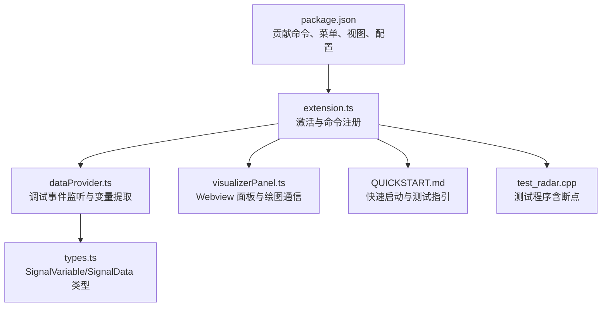
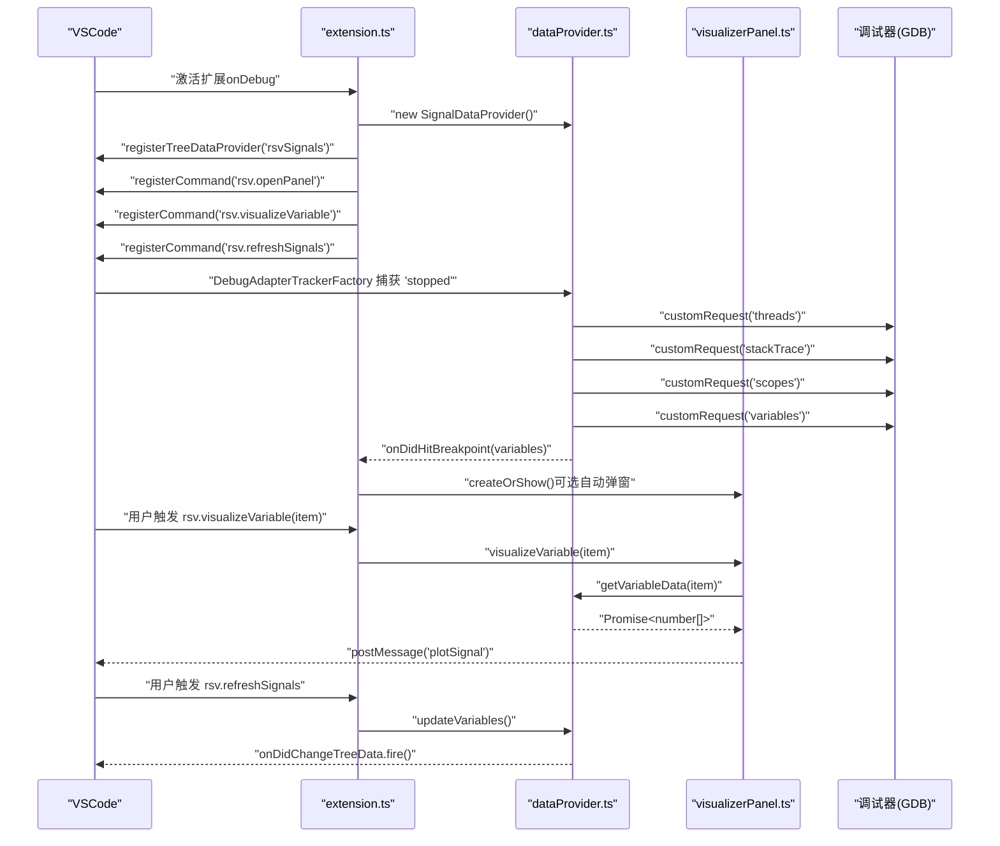
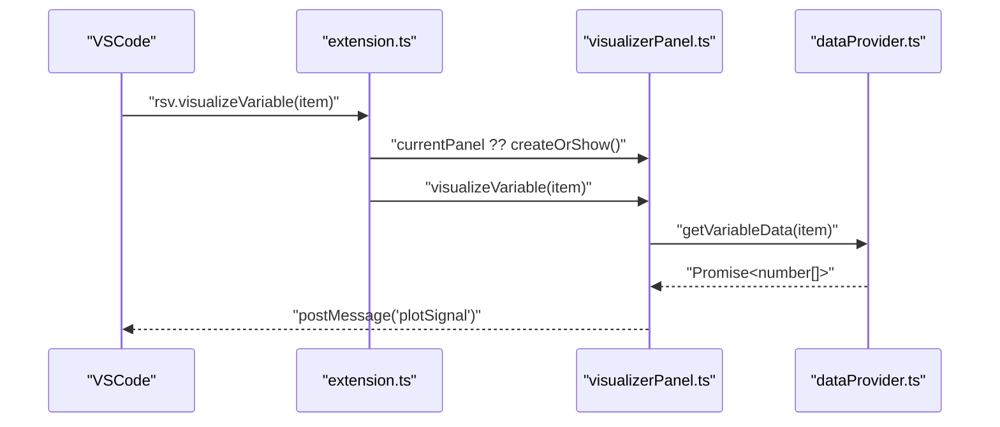
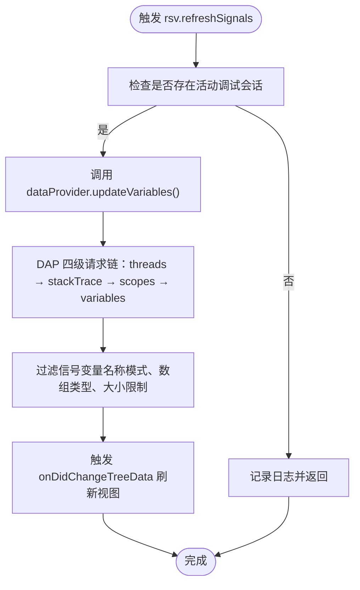
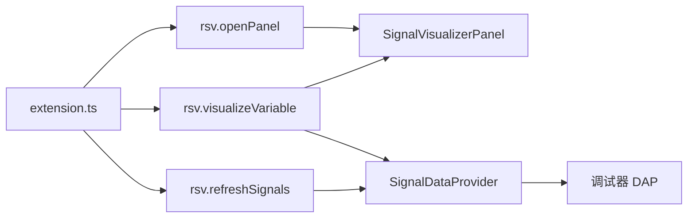

# VSCode 命令 API

<cite>
**本文引用的文件**
- [package.json](file://package.json)
- [extension.ts](file://src/extension.ts)
- [dataProvider.ts](file://src/dataProvider.ts)
- [visualizerPanel.ts](file://src/visualizerPanel.ts)
- [types.ts](file://src/types.ts)
- [QUICKSTART.md](file://QUICKSTART.md)
- [test_radar.cpp](file://test_radar.cpp)
</cite>

## 目录
1. [简介](#简介)
2. [项目结构](#项目结构)
3. [核心组件](#核心组件)
4. [架构总览](#架构总览)
5. [详细组件分析](#详细组件分析)
6. [依赖关系分析](#依赖关系分析)
7. [性能考量](#性能考量)
8. [故障排查指南](#故障排查指南)
9. [结论](#结论)
10. [附录](#附录)

## 简介
本文件系统性梳理 VSCode 扩展“Radar Signal Visualizer”的命令 API，重点覆盖以下三个命令的完整规范：
- rsv.visualizeVariable：将当前选中的信号变量在可视化面板中绘制
- rsv.openPanel：打开雷达信号可视化面板
- rsv.refreshSignals：手动刷新信号变量列表

文档内容涵盖命令功能描述、参数要求、触发条件、使用场景、激活事件、菜单集成、快捷键绑定、调用示例、错误处理与最佳实践、生命周期与状态管理、与 VSCode 主框架交互机制，以及配置选项对命令行为的影响与自定义方法。

## 项目结构
该项目采用典型的 VSCode 扩展结构，核心入口为扩展入口文件，配合数据提供者与可视化面板两类核心模块，以及类型定义与贡献清单。

**图表来源**
- [package.json:17-84](file://package.json#L17-L84)
- [extension.ts:46-188](file://src/extension.ts#L46-L188)
- [dataProvider.ts:56-702](file://src/dataProvider.ts#L56-L702)
- [visualizerPanel.ts:44-424](file://src/visualizerPanel.ts#L44-L424)
- [types.ts:21-95](file://src/types.ts#L21-L95)
- [QUICKSTART.md:1-66](file://QUICKSTART.md#L1-L66)
- [test_radar.cpp:1-63](file://test_radar.cpp#L1-L63)

**章节来源**
- [package.json:17-84](file://package.json#L17-L84)
- [extension.ts:46-188](file://src/extension.ts#L46-L188)

## 核心组件
- 命令注册与生命周期管理：在扩展激活时注册三个命令，均通过 context.subscriptions 管理生命周期，确保停用时自动释放。
- 数据提供者（SignalDataProvider）：负责监听调试事件、通过 DAP 获取变量、过滤信号变量、维护树视图数据源。
- 可视化面板（SignalVisualizerPanel）：基于 WebviewPanel 实现单例模式，承载 Chart.js 图表渲染与扩展↔Webview 通信。
- 类型系统（types.ts）：定义 SignalVariable 与 SignalData 接口，明确变量元数据与绘图数据结构。

**章节来源**
- [extension.ts:46-188](file://src/extension.ts#L46-L188)
- [dataProvider.ts:56-702](file://src/dataProvider.ts#L56-L702)
- [visualizerPanel.ts:44-424](file://src/visualizerPanel.ts#L44-L424)
- [types.ts:21-95](file://src/types.ts#L21-L95)

## 架构总览
命令 API 的工作流围绕“调试事件→变量提取→树视图更新→命令触发→面板渲染”展开。调试事件由 DebugAdapterTrackerFactory 捕获，变量提取通过 DAP 四级请求链完成，过滤与大小限制由配置驱动，命令回调负责调用面板或刷新树视图。

**图表来源**
- [extension.ts:46-188](file://src/extension.ts#L46-L188)
- [dataProvider.ts:138-399](file://src/dataProvider.ts#L138-L399)
- [visualizerPanel.ts:264-275](file://src/visualizerPanel.ts#L264-L275)

## 详细组件分析

### 命令：rsv.openPanel
- 功能描述：打开雷达信号可视化面板。若面板已存在则激活，否则创建新面板。
- 参数要求：无参数。
- 触发条件：用户在命令面板输入命令标题、通过快捷键（若已绑定）、或在扩展开发主机中按 F5 启动调试后自动激活。
- 使用场景：首次打开可视化界面、重复唤起面板、在多面板环境中聚焦。
- 激活事件：扩展激活时注册命令；面板关闭时通过 dispose() 清理资源。
- 菜单集成：无专用菜单项，可通过命令面板或快捷键触发。
- 快捷键绑定：未在贡献清单中声明快捷键，需用户自行在键盘快捷方式中配置。
- 调用示例：在命令面板输入“Open Radar Visualizer”，或在扩展开发主机中按 F5 后自动激活。
- 错误处理：若扩展未激活或面板创建失败，VSCode 将报告错误；建议检查扩展是否正确安装与启用。
- 最佳实践：首次使用建议先在调试会话中命中断点以确保变量可用；面板采用单例模式，避免重复创建。

**章节来源**
- [package.json:55-69](file://package.json#L55-L69)
- [extension.ts:78-80](file://src/extension.ts#L78-L80)
- [visualizerPanel.ts:102-164](file://src/visualizerPanel.ts#L102-L164)

### 命令：rsv.visualizeVariable
- 功能描述：将当前选中的信号变量在可视化面板中绘制波形图。若面板不存在则创建。
- 参数要求：item（树节点对象），由 VSCode 自动传入，包含 SignalVariable 元数据。
- 触发条件：在“Radar Signals”视图中右键点击变量项，选择“Visualize Signal”。
- 使用场景：断点命中后快速查看变量波形；手动选择变量进行对比分析。
- 激活事件：扩展激活时注册命令；面板关闭时通过 dispose() 清理资源。
- 菜单集成：通过 menus.view/item/context 贡献，仅在视图中启用。
- 快捷键绑定：未在贡献清单中声明快捷键，需用户自行配置。
- 调用示例：在 Signals 视图中右键任意变量，选择“Visualize Signal”。
- 错误处理：若无活动调试会话或变量数据获取失败，将抛出错误并提示；建议检查调试器状态与变量类型。
- 最佳实践：确保变量为数组类型且数值可解析；面板采用单例模式，避免重复创建。

**图表来源**
- [extension.ts:95-98](file://src/extension.ts#L95-L98)
- [visualizerPanel.ts:264-275](file://src/visualizerPanel.ts#L264-L275)
- [dataProvider.ts:515-531](file://src/dataProvider.ts#L515-L531)

**章节来源**
- [package.json:78-83](file://package.json#L78-L83)
- [extension.ts:95-98](file://src/extension.ts#L95-L98)
- [visualizerPanel.ts:264-275](file://src/visualizerPanel.ts#L264-L275)
- [dataProvider.ts:515-531](file://src/dataProvider.ts#L515-L531)

### 命令：rsv.refreshSignals
- 功能描述：手动刷新信号变量列表。当调试适配器未正确上报“stopped”事件或用户步进后需要主动更新时使用。
- 参数要求：无参数。
- 触发条件：在“Radar Signals”视图顶部工具栏点击“刷新”按钮。
- 使用场景：调试器兼容性问题、手动步进后需要更新变量集合。
- 激活事件：扩展激活时注册命令；面板关闭时通过 dispose() 清理资源。
- 菜单集成：通过 menus.view/title 贡献，仅在视图中启用。
- 快捷键绑定：未在贡献清单中声明快捷键，需用户自行配置。
- 调用示例：在 Signals 视图顶部点击“刷新”按钮。
- 错误处理：若无活动调试会话，将记录日志并返回；建议检查调试器状态。
- 最佳实践：在多调试会话场景下，注意当前会话是否仍处于活动状态。

**图表来源**
- [extension.ts:109-111](file://src/extension.ts#L109-L111)
- [dataProvider.ts:243-399](file://src/dataProvider.ts#L243-L399)

**章节来源**
- [package.json:70-84](file://package.json#L70-L84)
- [extension.ts:109-111](file://src/extension.ts#L109-L111)
- [dataProvider.ts:243-399](file://src/dataProvider.ts#L243-L399)

## 依赖关系分析
- 命令与模块耦合：
  - rsv.openPanel 依赖 SignalVisualizerPanel 单例与数据提供者。
  - rsv.visualizeVariable 依赖 SignalVisualizerPanel 与数据提供者。
  - rsv.refreshSignals 依赖数据提供者。
- 调试事件与数据流：
  - DebugAdapterTrackerFactory 捕获“stopped”事件，触发 dataProvider.updateVariables()。
  - dataProvider 通过 DAP 请求链获取变量，过滤后刷新树视图并触发自定义事件。
- 配置影响：
  - rsv.autoDisplayOnBreakpoint 控制断点命中时是否自动弹窗。
  - rsv.signalNamePatterns 控制变量名匹配规则。
  - rsv.maxArraySize 控制最大数组大小，避免超大数据影响性能。

**图表来源**
- [extension.ts:78-111](file://src/extension.ts#L78-L111)
- [visualizerPanel.ts:102-164](file://src/visualizerPanel.ts#L102-L164)
- [dataProvider.ts:138-399](file://src/dataProvider.ts#L138-L399)

**章节来源**
- [extension.ts:78-111](file://src/extension.ts#L78-L111)
- [dataProvider.ts:138-399](file://src/dataProvider.ts#L138-L399)

## 性能考量
- DAP 请求链为异步操作，涉及网络/IPC 调用，应避免频繁触发；建议通过“刷新”按钮或断点事件触发。
- 变量过滤包含三步：名称模式匹配、数组类型检查、大小限制；合理配置 rsv.signalNamePatterns 与 rsv.maxArraySize 可显著减少处理时间。
- Webview 面板启用 retainContextWhenHidden，隐藏时保留 DOM 状态，提升体验但占用内存；建议在长时间调试后手动关闭面板释放资源。
- 递归收集数值时设置最大深度，防止异常数据结构导致无限递归。

[本节为通用性能建议，无需特定文件引用]

## 故障排查指南
- 侧边栏未显示“Radar Signals”图标
  - 确认在扩展开发主机窗口中并已启动调试会话。
- 信号变量列表为空
  - 确保调试器已暂停；检查变量名是否匹配配置的模式（默认包含 *signal*, *data*, *pulse*, *sample*）。
- 图表不显示
  - 检查变量是否为数组类型且包含数值数据；确认面板已创建且未被关闭。
- 断点命中未自动弹窗
  - 检查 rsv.autoDisplayOnBreakpoint 配置；确认调试适配器正确上报“stopped”事件。
- 刷新按钮无效
  - 确认存在活动调试会话；检查调试器兼容性。

**章节来源**
- [QUICKSTART.md:31-41](file://QUICKSTART.md#L31-L41)
- [extension.ts:139-146](file://src/extension.ts#L139-L146)
- [dataProvider.ts:243-399](file://src/dataProvider.ts#L243-L399)

## 结论
本扩展通过三条命令与调试事件紧密集成，形成“断点触发→变量提取→面板可视化的闭环”。命令设计遵循 VSCode 扩展开发规范，使用单例面板与事件驱动刷新，结合配置项实现灵活的行为控制。建议用户在使用前了解调试器兼容性与变量类型要求，并通过配置项优化性能与体验。

[本节为总结性内容，无需特定文件引用]

## 附录

### 命令清单与规范对照
- rsv.openPanel
  - 类型：命令
  - 参数：无
  - 触发：命令面板、快捷键（可配置）
  - 行为：创建或激活可视化面板
- rsv.visualizeVariable
  - 类型：命令
  - 参数：item（SignalVariable）
  - 触发：视图上下文菜单
  - 行为：在面板中绘制所选变量
- rsv.refreshSignals
  - 类型：命令
  - 参数：无
  - 触发：视图标题栏按钮
  - 行为：刷新信号变量列表

**章节来源**
- [package.json:55-69](file://package.json#L55-L69)
- [package.json:70-84](file://package.json#L70-L84)
- [extension.ts:78-111](file://src/extension.ts#L78-L111)

### 配置项对命令行为的影响
- rsv.autoDisplayOnBreakpoint（布尔，默认 true）
  - 影响：断点命中时是否自动弹出可视化面板
- rsv.signalNamePatterns（数组，默认包含 *signal*, *data*, *pulse*, *sample*）
  - 影响：过滤变量的名称匹配规则
- rsv.maxArraySize（数字，默认 100000）
  - 影响：变量数组大小上限，避免超大数据影响性能

**章节来源**
- [package.json:18-37](file://package.json#L18-L37)
- [extension.ts:139-146](file://src/extension.ts#L139-L146)
- [dataProvider.ts:414-441](file://src/dataProvider.ts#L414-L441)

### 调试与测试建议
- 使用提供的测试程序设置断点，验证变量提取与面板渲染。
- 在扩展开发主机中按 F5 启动调试，观察断点命中与自动弹窗行为。
- 如需调试扩展代码，可在源码中设置断点并按 F5 启动扩展开发主机。

**章节来源**
- [QUICKSTART.md:18-30](file://QUICKSTART.md#L18-L30)
- [test_radar.cpp:34-62](file://test_radar.cpp#L34-L62)