# Webview 消息协议

<cite>
**本文档引用的文件**
- [package.json](file://package.json)
- [extension.ts](file://src/extension.ts)
- [dataProvider.ts](file://src/dataProvider.ts)
- [visualizerPanel.ts](file://src/visualizerPanel.ts)
- [types.ts](file://src/types.ts)
- [webview.js](file://assets/webview.js)
- [webview.css](file://assets/webview.css)
- [test_radar.cpp](file://test_radar.cpp)
</cite>

## 目录
1. [简介](#简介)
2. [项目结构](#项目结构)
3. [核心组件](#核心组件)
4. [架构概览](#架构概览)
5. [详细组件分析](#详细组件分析)
6. [消息协议规范](#消息协议规范)
7. [依赖关系分析](#依赖关系分析)
8. [性能考虑](#性能考虑)
9. [故障排除指南](#故障排除指南)
10. [结论](#结论)

## 简介

本文档详细说明了 VSCode 扩展与 Webview 之间的双向通信机制。该项目实现了雷达信号可视化功能，通过 VSCode 扩展与 Webview 的消息协议实现调试器数据的实时可视化。

## 项目结构

项目采用模块化设计，主要包含以下核心文件：

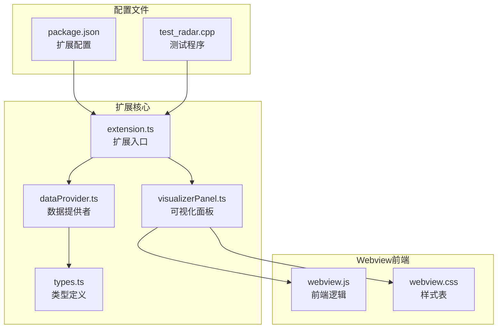

**图表来源**
- [extension.ts:1-200](file://src/extension.ts#L1-L200)
- [visualizerPanel.ts:1-451](file://src/visualizerPanel.ts#L1-L451)

**章节来源**
- [package.json:1-102](file://package.json#L1-L102)
- [extension.ts:1-200](file://src/extension.ts#L1-L200)

## 核心组件

### 扩展入口组件
- **extension.ts**: VSCode 扩展的主入口文件，负责注册命令、事件监听和生命周期管理
- **package.json**: 扩展配置文件，定义激活事件、命令和视图容器

### 数据处理组件
- **dataProvider.ts**: 核心数据提供者，实现 TreeDataProvider 接口，负责与调试器交互
- **types.ts**: TypeScript 类型定义，提供强类型支持

### Webview 组件
- **visualizerPanel.ts**: Webview 面板管理器，实现单例模式和消息通信
- **webview.js**: Webview 前端逻辑，负责图表渲染和用户交互
- **webview.css**: Webview 样式表，支持 VSCode 主题适配

**章节来源**
- [extension.ts:46-188](file://src/extension.ts#L46-L188)
- [visualizerPanel.ts:44-424](file://src/visualizerPanel.ts#L44-L424)

## 架构概览

系统采用分层架构设计，实现了清晰的职责分离：

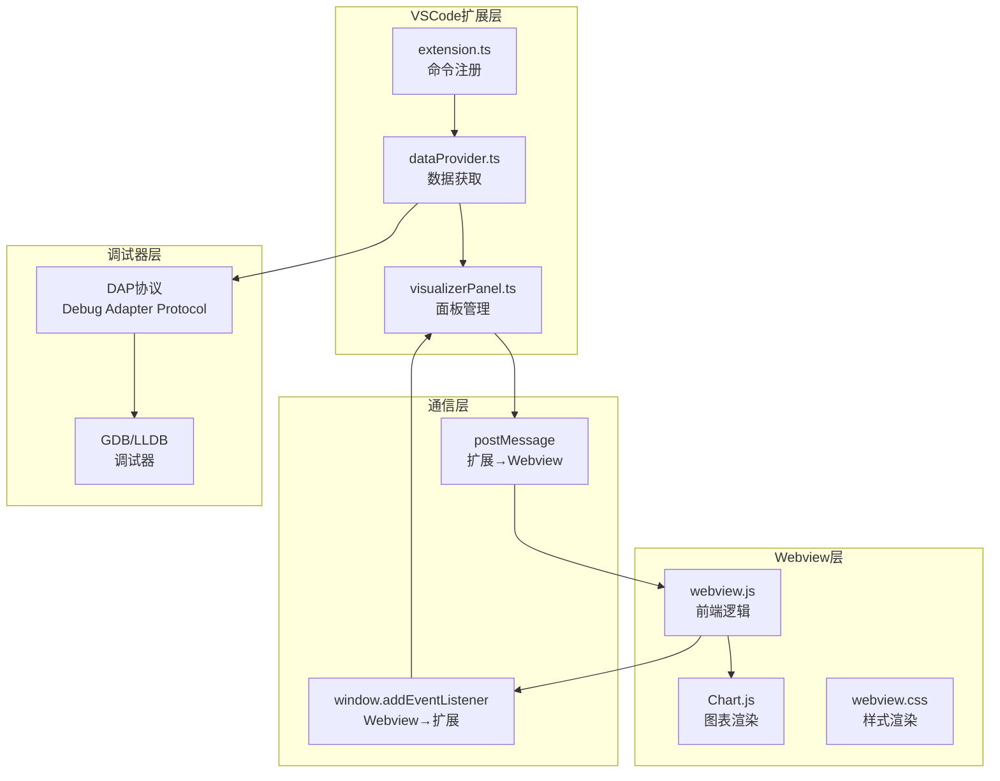

**图表来源**
- [visualizerPanel.ts:195-222](file://src/visualizerPanel.ts#L195-L222)
- [webview.js:50-96](file://assets/webview.js#L50-L96)

## 详细组件分析

### 扩展与 Webview 通信机制

#### 消息发送流程

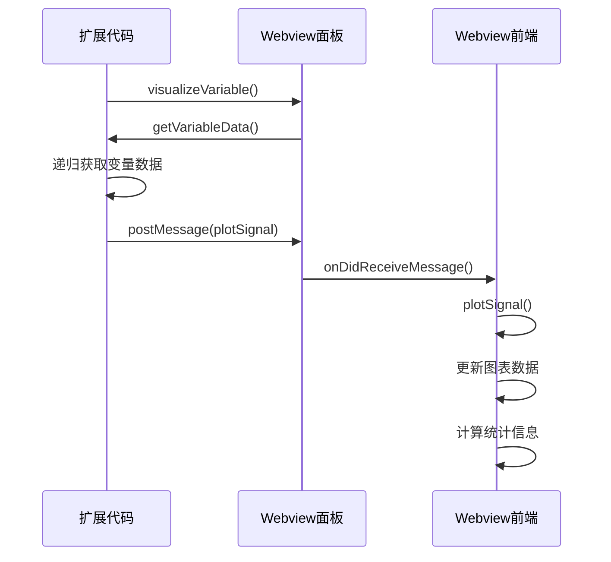

**图表来源**
- [visualizerPanel.ts:264-275](file://src/visualizerPanel.ts#L264-L275)
- [webview.js:355-419](file://assets/webview.js#L355-L419)

#### 消息接收流程

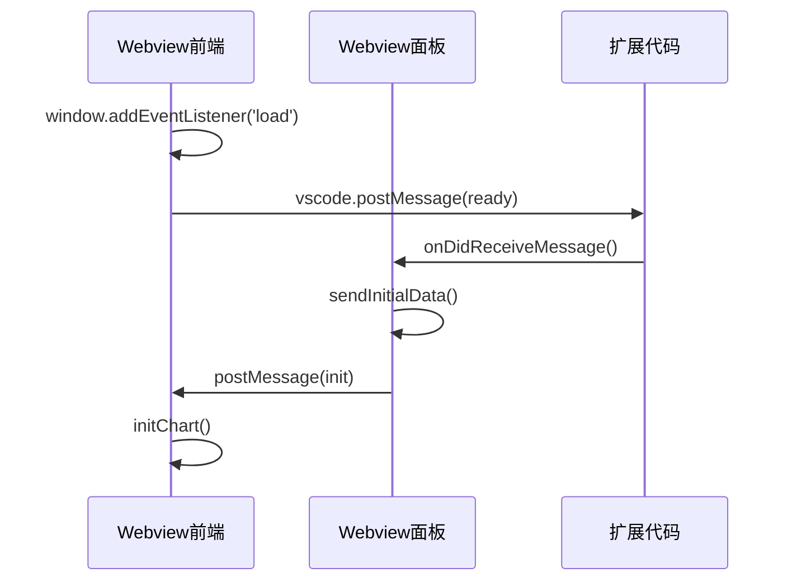

**图表来源**
- [webview.js:50-96](file://assets/webview.js#L50-L96)
- [visualizerPanel.ts:207-222](file://src/visualizerPanel.ts#L207-L222)

### 数据获取与处理

#### DAP 协议数据获取

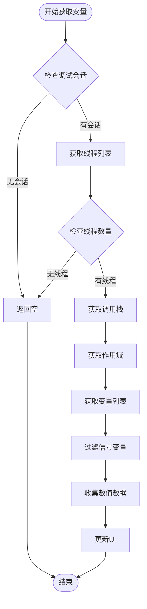

**图表来源**
- [dataProvider.ts:243-399](file://src/dataProvider.ts#L243-L399)

**章节来源**
- [dataProvider.ts:230-399](file://src/dataProvider.ts#L230-L399)

### Webview 图表渲染

#### 图表初始化流程

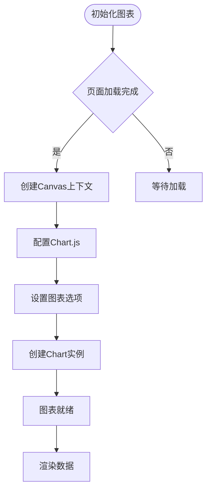

**图表来源**
- [webview.js:111-345](file://assets/webview.js#L111-L345)

**章节来源**
- [webview.js:111-345](file://assets/webview.js#L111-L345)

## 消息协议规范

### 消息类型定义

#### 扩展→Webview 消息

| 消息类型 | 命令字段 | 数据载荷 | 用途 |
|---------|---------|---------|------|
| 初始化消息 | `init` | `{}` | 握手确认，通知 Webview 可以接收数据 |
| 绘图消息 | `plotSignal` | `{variable: SignalData}` | 发送信号数据进行可视化 |

#### Webview→扩展消息

| 消息类型 | 命令字段 | 数据载荷 | 用途 |
|---------|---------|---------|------|
| 就绪消息 | `ready` | `{}` | 通知扩展 Webview 已加载完成 |

### 数据结构规范

#### SignalData 接口

```typescript
interface SignalData {
    name: string;      // 信号名称
    data: number[];    // 数值数组（用于绘图）
    type: string;      // 变量类型
}
```

#### SignalVariable 接口

```typescript
interface SignalVariable {
    name: string;               // 变量名
    value: string;              // GDB 显示的值（字符串形式）
    type: string;               // 变量的 C++ 类型
    variablesReference: number; // DAP 变量引用 ID
    children: boolean;          // 是否有子节点
}
```

### 消息处理流程

#### 扩展端消息处理

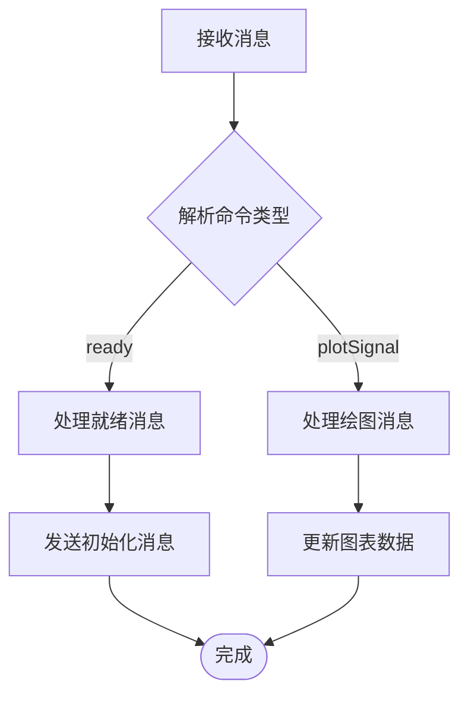

**图表来源**
- [visualizerPanel.ts:207-222](file://src/visualizerPanel.ts#L207-L222)

#### Webview 端消息处理

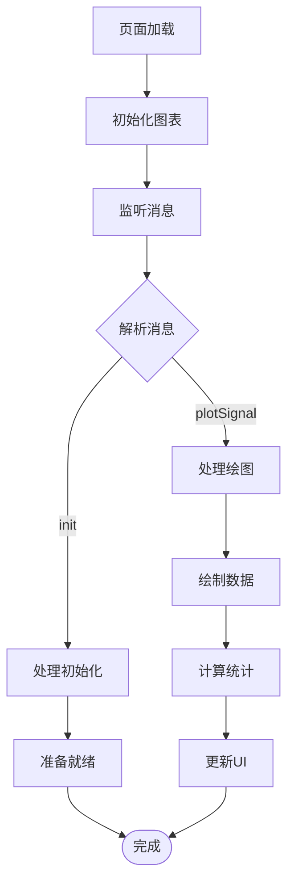

**图表来源**
- [webview.js:70-96](file://assets/webview.js#L70-L96)

**章节来源**
- [types.ts:59-94](file://src/types.ts#L59-L94)
- [visualizerPanel.ts:207-275](file://src/visualizerPanel.ts#L207-L275)
- [webview.js:70-419](file://assets/webview.js#L70-L419)

## 依赖关系分析

### 组件依赖图

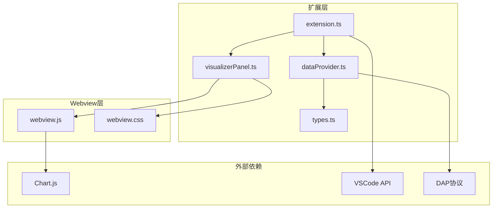

**图表来源**
- [visualizerPanel.ts:28-31](file://src/visualizerPanel.ts#L28-L31)
- [webview.js:1-27](file://assets/webview.js#L1-L27)

### 数据流向分析

#### 正向数据流（调试器→Webview）

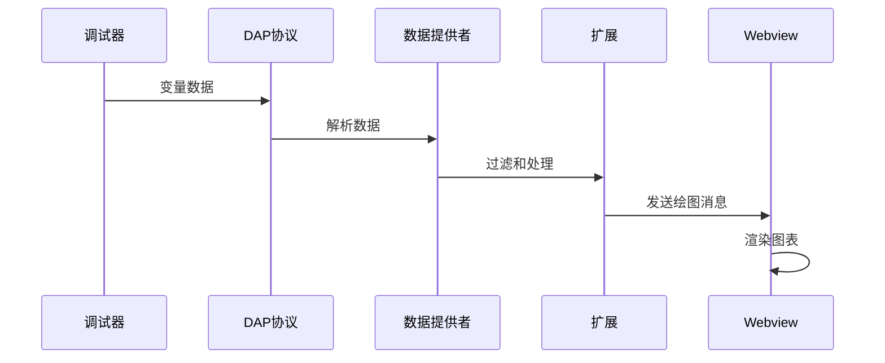

**图表来源**
- [dataProvider.ts:243-399](file://src/dataProvider.ts#L243-L399)
- [visualizerPanel.ts:264-275](file://src/visualizerPanel.ts#L264-L275)

**章节来源**
- [extension.ts:138-146](file://src/extension.ts#L138-L146)
- [dataProvider.ts:138-205](file://src/dataProvider.ts#L138-L205)

## 性能考虑

### 内存管理

#### 资源清理机制

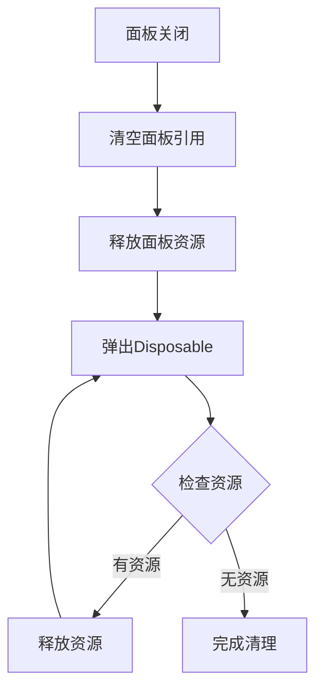

**图表来源**
- [visualizerPanel.ts:407-423](file://src/visualizerPanel.ts#L407-L423)

### 性能优化策略

#### 大数据集降采样

Webview 实现了智能降采样机制，避免大数据集导致的性能问题：

- **阈值设定**: 当数据点超过 10,000 个时启用降采样
- **算法实现**: 等间隔采样，保持信号趋势完整性
- **性能收益**: 将渲染时间从 O(n) 降低到 O(10,000)

#### 图表渲染优化

- **响应式设计**: 自动适应面板大小变化
- **动画控制**: 300ms 平滑过渡动画
- **交互优化**: 最近点检测，提升用户体验

**章节来源**
- [visualizerPanel.ts:395-423](file://src/visualizerPanel.ts#L395-L423)
- [webview.js:364-419](file://assets/webview.js#L364-L419)

## 故障排除指南

### 常见问题诊断

#### Webview 无法加载

**症状**: Webview 面板空白或显示错误

**诊断步骤**:
1. 检查 CSP 配置是否正确
2. 验证资源 URI 转换是否成功
3. 确认脚本加载顺序

#### 消息通信失败

**症状**: 图表不更新或无响应

**诊断步骤**:
1. 检查 `ready` 消息是否正确发送
2. 验证 `plotSignal` 消息格式
3. 确认事件监听器是否注册

#### 数据获取异常

**症状**: 变量列表为空或数据不正确

**诊断步骤**:
1. 验证 DAP 请求格式
2. 检查调试会话状态
3. 确认变量过滤规则

### 调试工具使用

#### VSCode 开发者工具

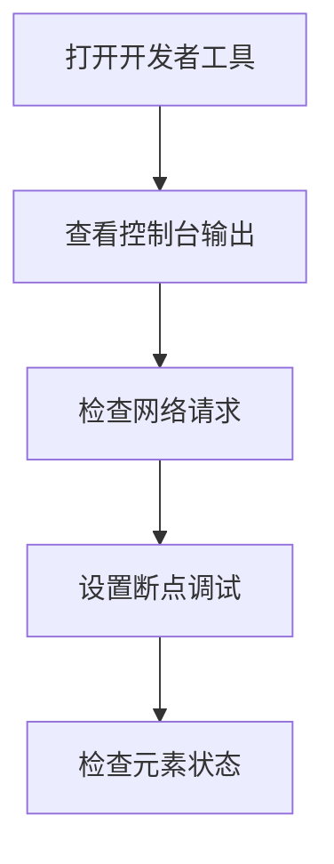

**图表来源**
- [webview.js:22-25](file://assets/webview.js#L22-L25)

#### 日志记录最佳实践

- **扩展端**: 使用 `console.log` 记录关键流程
- **Webview端**: 使用 `console.log` 记录消息处理
- **错误处理**: 捕获异常并记录详细信息

**章节来源**
- [extension.ts:244-247](file://src/extension.ts#L244-L247)
- [webview.js:396-398](file://assets/webview.js#L396-L398)

## 结论

本项目实现了完整的 VSCode 扩展与 Webview 消息通信协议，具有以下特点：

### 技术优势
- **双向通信**: 实现了扩展与 Webview 之间的完整消息交换
- **类型安全**: 使用 TypeScript 提供强类型支持
- **性能优化**: 包含大数据集降采样和资源管理机制
- **主题适配**: 支持 VSCode 主题自动切换

### 架构特色
- **模块化设计**: 清晰的职责分离和依赖关系
- **异步处理**: 完善的 Promise 和事件处理机制
- **错误处理**: 全面的异常捕获和用户反馈
- **生命周期管理**: 完善的资源清理和内存防护

该消息协议为 VSCode 扩展开发提供了良好的参考模板，特别适用于需要实时数据可视化的调试工具场景。