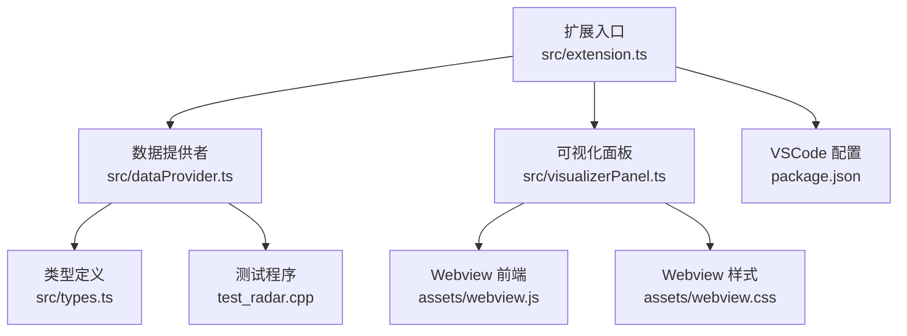
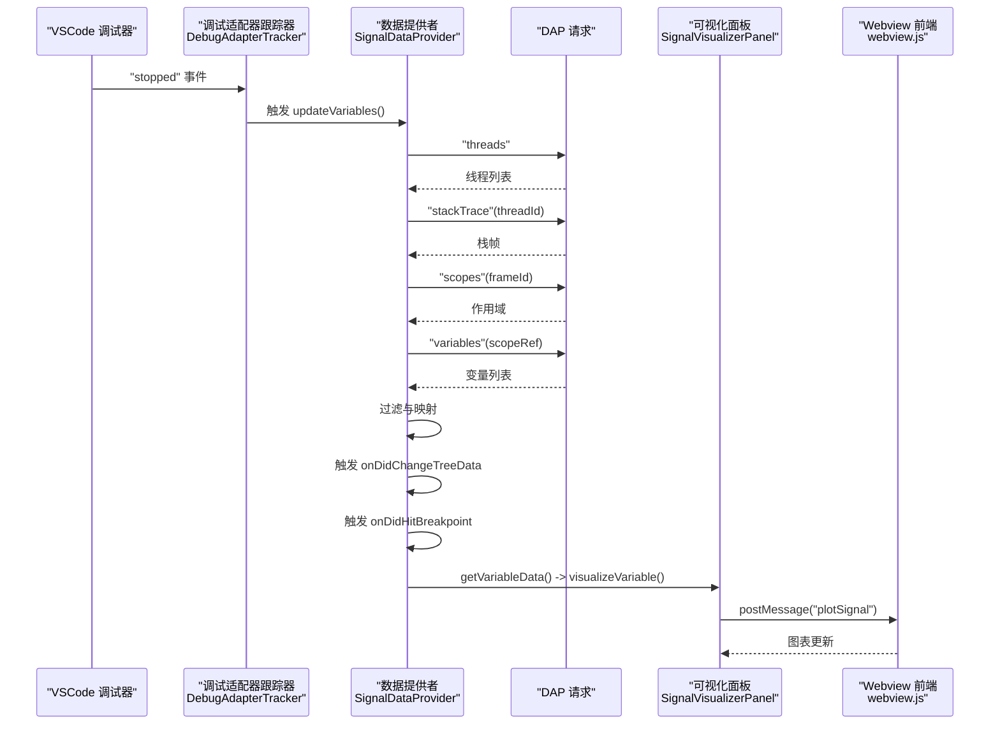
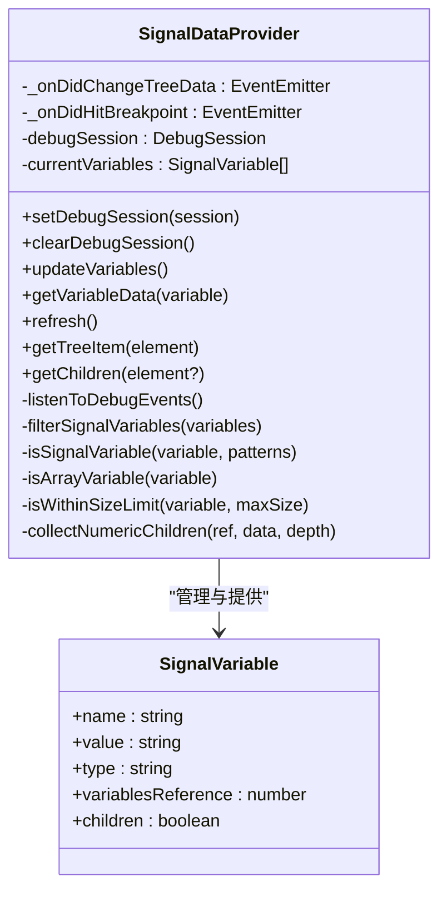
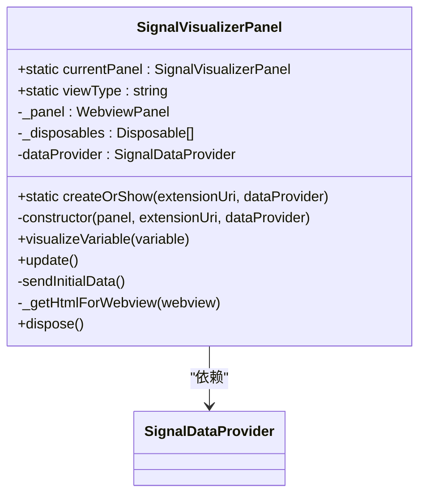
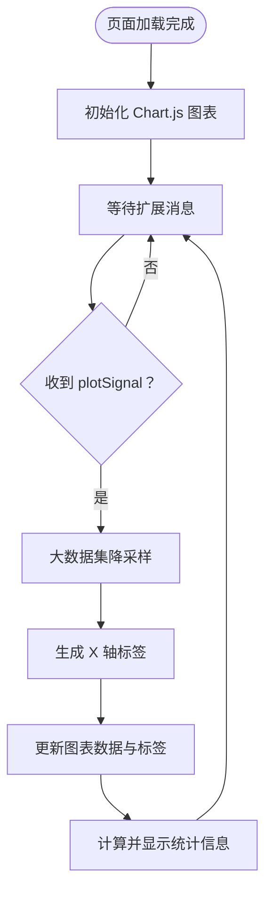
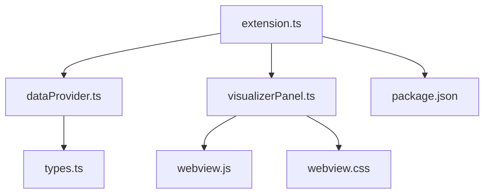

# 调试器接口

<cite>
**本文档引用的文件**
- [package.json](file://package.json)
- [extension.ts](file://src/extension.ts)
- [dataProvider.ts](file://src/dataProvider.ts)
- [visualizerPanel.ts](file://src/visualizerPanel.ts)
- [types.ts](file://src/types.ts)
- [webview.js](file://assets/webview.js)
- [webview.css](file://assets/webview.css)
- [test_radar.cpp](file://test_radar.cpp)
</cite>

## 目录
1. [简介](#简介)
2. [项目结构](#项目结构)
3. [核心组件](#核心组件)
4. [架构总览](#架构总览)
5. [详细组件分析](#详细组件分析)
6. [依赖关系分析](#依赖关系分析)
7. [性能考虑](#性能考虑)
8. [故障排除指南](#故障排除指南)
9. [结论](#结论)
10. [附录](#附录)

## 简介
本项目为 VSCode 调试器扩展，专注于在 GPU/GDB 调试过程中可视化雷达信号数据。扩展通过 Debug Adapter Protocol（DAP）与调试器通信，自动识别并提取信号变量，提供实时波形图展示与统计信息。本文档面向开发者与高级用户，系统阐述扩展与 VSCode 调试框架的集成接口、变量检测与数据提取流程、实时更新机制、回调与事件处理、状态管理、调试会话生命周期、变量过滤与数据转换策略、错误处理与超时管理、重连机制以及性能监控与最佳实践。

## 项目结构
项目采用模块化组织，核心文件如下：
- 扩展入口与生命周期管理：src/extension.ts
- DAP 数据提供者：src/dataProvider.ts
- Webview 可视化面板：src/visualizerPanel.ts
- 类型定义：src/types.ts
- VSCode 配置与视图菜单：package.json
- Webview 前端逻辑与样式：assets/webview.js、assets/webview.css
- 测试程序：test_radar.cpp

**图表来源**
- [extension.ts:46-188](file://src/extension.ts#L46-L188)
- [dataProvider.ts:56-702](file://src/dataProvider.ts#L56-L702)
- [visualizerPanel.ts:44-424](file://src/visualizerPanel.ts#L44-L424)
- [types.ts:59-94](file://src/types.ts#L59-L94)
- [webview.js:50-96](file://assets/webview.js#L50-L96)
- [webview.css:64-237](file://assets/webview.css#L64-L237)
- [package.json:13-84](file://package.json#L13-L84)
- [test_radar.cpp:34-62](file://test_radar.cpp#L34-L62)

**章节来源**
- [package.json:1-102](file://package.json#L1-L102)
- [extension.ts:1-200](file://src/extension.ts#L1-L200)
- [dataProvider.ts:1-703](file://src/dataProvider.ts#L1-L703)
- [visualizerPanel.ts:1-451](file://src/visualizerPanel.ts#L1-L451)
- [types.ts:1-95](file://src/types.ts#L1-L95)
- [webview.js:1-494](file://assets/webview.js#L1-L494)
- [webview.css:1-237](file://assets/webview.css#L1-L237)
- [test_radar.cpp:1-63](file://test_radar.cpp#L1-L63)

## 核心组件
- 扩展入口与生命周期
  - 注册命令：打开面板、可视化变量、刷新信号列表
  - 监听调试会话事件：开始、结束、活动会话切换
  - 自动断点命中响应：根据配置自动展示可视化面板
- 数据提供者（SignalDataProvider）
  - DAP 四级请求链：threads → stackTrace → scopes → variables
  - 变量过滤：名称模式、数组类型、大小限制
  - 数据提取：递归收集复合变量的数值
  - 事件发布：断点命中事件、树视图数据变更事件
- 可视化面板（SignalVisualizerPanel）
  - Webview 单例管理
  - 与扩展的双向消息通信
  - 初始 HTML 生成与资源加载
- 类型定义（SignalVariable、SignalData）
  - 明确变量元数据与实际数据结构
- Webview 前端（webview.js、webview.css）
  - Chart.js 初始化与配置
  - 信号绘制、统计计算与 UI 更新
  - 主题适配与响应式布局

**章节来源**
- [extension.ts:46-188](file://src/extension.ts#L46-L188)
- [dataProvider.ts:56-702](file://src/dataProvider.ts#L56-L702)
- [visualizerPanel.ts:44-424](file://src/visualizerPanel.ts#L44-L424)
- [types.ts:59-94](file://src/types.ts#L59-L94)
- [webview.js:50-494](file://assets/webview.js#L50-L494)
- [webview.css:64-237](file://assets/webview.css#L64-L237)

## 架构总览
扩展通过 DebugAdapterTrackerFactory 拦截 DAP 消息，检测断点命中事件，自动触发变量更新；随后通过 DAP 请求获取当前栈帧变量，过滤出信号变量并提取数值；可视化面板通过 Webview 接收数据并渲染图表。

**图表来源**
- [extension.ts:138-146](file://src/extension.ts#L138-L146)
- [dataProvider.ts:175-204](file://src/dataProvider.ts#L175-L204)
- [dataProvider.ts:243-399](file://src/dataProvider.ts#L243-L399)
- [visualizerPanel.ts:264-275](file://src/visualizerPanel.ts#L264-L275)
- [webview.js:70-96](file://assets/webview.js#L70-L96)

## 详细组件分析

### 数据提供者（SignalDataProvider）
- 职责
  - 监听调试事件与会话状态
  - 通过 DAP 四级请求链获取变量
  - 过滤信号变量并提取数值
  - 管理树视图数据与事件
- 关键接口
  - setDebugSession(session) / clearDebugSession()：会话状态管理
  - updateVariables()：DAP 请求与变量更新
  - getVariableData(variable)：数值提取入口
  - onDidChangeTreeData / onDidHitBreakpoint：事件发布
- 变量过滤机制
  - 名称模式匹配（支持通配符）
  - 数组类型判断（基于显示字符串与引用 ID）
  - 大小限制检查（正则提取长度）
- 数据提取策略
  - 递归遍历 variablesReference，收集数值
  - 深度限制防止异常数据结构导致无限递归
  - 数组元素优先解析，非数组元素递归查找

**图表来源**
- [dataProvider.ts:56-702](file://src/dataProvider.ts#L56-L702)
- [types.ts:59-65](file://src/types.ts#L59-L65)

**章节来源**
- [dataProvider.ts:56-702](file://src/dataProvider.ts#L56-L702)
- [types.ts:59-65](file://src/types.ts#L59-L65)

### 可视化面板（SignalVisualizerPanel）
- 职责
  - Webview 单例管理与生命周期控制
  - 与扩展的双向消息通信
  - 初始 HTML 生成与资源加载
- 关键接口
  - createOrShow(extensionUri, dataProvider)：单例工厂
  - visualizeVariable(variable)：数据传输入口
  - update() / dispose()：内容更新与资源释放
- 安全与性能
  - CSP + nonce 保障脚本安全
  - retainContextWhenHidden 保留上下文提升体验
  - 本地资源根目录配置

**图表来源**
- [visualizerPanel.ts:44-424](file://src/visualizerPanel.ts#L44-L424)

**章节来源**
- [visualizerPanel.ts:44-424](file://src/visualizerPanel.ts#L44-L424)

### Webview 前端（webview.js、webview.css）
- 职责
  - Chart.js 初始化与配置
  - 接收扩展数据并绘制波形
  - 计算并显示统计信息
  - 主题适配与响应式布局
- 关键流程
  - 初始化：load 事件触发图表创建
  - 数据接收：message 事件处理 plotSignal
  - 统计计算：遍历数组计算 min/max/mean
  - 降采样：大数据集等间隔采样保证性能

**图表来源**
- [webview.js:50-96](file://assets/webview.js#L50-L96)
- [webview.js:355-419](file://assets/webview.js#L355-L419)
- [webview.js:456-493](file://assets/webview.js#L456-L493)

**章节来源**
- [webview.js:50-494](file://assets/webview.js#L50-L494)
- [webview.css:64-237](file://assets/webview.css#L64-L237)

### 扩展入口（extension.ts）
- 职责
  - 注册命令与菜单
  - 监听调试会话事件
  - 自动断点命中响应
- 关键事件
  - onDidChangeActiveDebugSession：设置/清除活动会话
  - onDidStartDebugSession / onDidTerminateDebugSession：调试开始/结束提示
  - onDidReceiveDebugSessionCustomEvent：自定义事件（本项目通过跟踪器拦截）

**章节来源**
- [extension.ts:46-188](file://src/extension.ts#L46-L188)

## 依赖关系分析
- 扩展入口依赖数据提供者与可视化面板
- 数据提供者依赖 VSCode 调试 API 与 DAP
- 可视化面板依赖 Webview API 与 Chart.js
- 类型定义为跨模块共享契约
- VSCode 配置定义视图、命令与菜单

**图表来源**
- [extension.ts:27-29](file://src/extension.ts#L27-L29)
- [dataProvider.ts:35-36](file://src/dataProvider.ts#L35-L36)
- [visualizerPanel.ts:28-30](file://src/visualizerPanel.ts#L28-L30)
- [types.ts:59-94](file://src/types.ts#L59-L94)
- [webview.js:1-27](file://assets/webview.js#L1-L27)
- [webview.css:1-25](file://assets/webview.css#L1-L25)
- [package.json:17-84](file://package.json#L17-L84)

**章节来源**
- [extension.ts:27-29](file://src/extension.ts#L27-L29)
- [dataProvider.ts:35-36](file://src/dataProvider.ts#L35-L36)
- [visualizerPanel.ts:28-30](file://src/visualizerPanel.ts#L28-L30)
- [types.ts:59-94](file://src/types.ts#L59-L94)
- [webview.js:1-27](file://assets/webview.js#L1-L27)
- [webview.css:1-25](file://assets/webview.css#L1-L25)
- [package.json:17-84](file://package.json#L17-L84)

## 性能考虑
- DAP 请求链
  - 四级请求为必要开销，建议在断点命中时触发，避免频繁轮询
  - 变量过滤减少后续处理负担
- 数据提取
  - 递归深度限制（默认 5）防止异常结构导致性能问题
  - 大数组大小限制（默认 100000）避免超大变量影响性能
- Webview 渲染
  - 降采样至 10000 点以内保证 Chart.js 性能
  - 使用 retainContextWhenHidden 保留上下文，避免重复初始化
- 资源加载
  - 本地资源根目录与 CSP 配置减少网络与安全开销
  - 非cesium 一次性加载，避免重复请求

[本节为通用性能指导，无需列出具体文件来源]

## 故障排除指南
- 侧边栏无 Radar Signals 图标
  - 确认在扩展开发宿主窗口中并已启动调试会话
- 信号变量列表为空
  - 确认调试器已暂停，变量名匹配配置模式（默认包含 *signal*, *data*, *pulse*, *sample*）
- 图表不显示
  - 检查变量是否为数组类型且包含数值数据
- 断点命中未自动弹窗
  - 检查配置项 autoDisplayOnBreakpoint 是否启用
  - 确认调试适配器兼容，跟踪器能拦截到 "stopped" 事件
- 调试会话切换后数据未更新
  - 确认 onDidChangeActiveDebugSession 事件已正确设置会话

**章节来源**
- [extension.ts:138-146](file://src/extension.ts#L138-L146)
- [extension.ts:159-165](file://src/extension.ts#L159-L165)
- [extension.ts:174-187](file://src/extension.ts#L174-L187)
- [QUICKSTART.md:31-41](file://QUICKSTART.md#L31-L41)

## 结论
本扩展通过 DebugAdapterTrackerFactory 与 DAP 四级请求链实现与 VSCode 调试框架的深度集成，提供自动变量检测、过滤与数据提取能力，并通过 Webview 实时渲染雷达信号波形。其事件驱动架构、严格的错误处理与性能优化策略确保了良好的用户体验与稳定性。建议在实际项目中结合配置项与日志输出持续优化变量识别规则与渲染性能。

[本节为总结性内容，无需列出具体文件来源]

## 附录

### 调试会话生命周期管理
- 会话开始：onDidStartDebugSession 触发提示
- 活动会话切换：onDidChangeActiveDebugSession 设置/清除当前会话
- 会话结束：onDidTerminateDebugSession 清空数据并刷新视图

**章节来源**
- [extension.ts:159-187](file://src/extension.ts#L159-L187)

### 变量过滤与数据转换
- 过滤规则
  - 名称模式：支持通配符，大小写不敏感
  - 类型判断：基于显示字符串与 variablesReference
  - 大小限制：从显示字符串提取长度并比较
- 数据转换
  - 递归收集数值，深度限制
  - 数组元素优先解析，非数组元素递归查找

**章节来源**
- [dataProvider.ts:414-499](file://src/dataProvider.ts#L414-L499)
- [dataProvider.ts:515-634](file://src/dataProvider.ts#L515-L634)

### 错误处理、超时与重连
- 错误处理
  - DAP 请求异常捕获与日志输出
  - 数据提取失败时显示错误消息
- 超时管理
  - DAP 请求为异步 IPC 调用，建议在扩展层设置合理超时与重试策略（当前实现未内置超时）
- 重连机制
  - 会话切换时自动重新设置会话引用
  - 断点命中事件触发变量更新，实现"断点 → 重连更新"的效果

**章节来源**
- [dataProvider.ts:396-398](file://src/dataProvider.ts#L396-L398)
- [dataProvider.ts:516-527](file://src/dataProvider.ts#L516-L527)
- [extension.ts:159-165](file://src/extension.ts#L159-L165)

### 配置项与最佳实践
- 配置项
  - rsv.autoDisplayOnBreakpoint：断点命中后自动展示面板
  - rsv.signalNamePatterns：变量名模式列表
  - rsv.maxArraySize：最大数组大小限制
- 最佳实践
  - 合理设置数组大小上限，避免影响性能
  - 使用通配符模式精准匹配信号变量
  - 在复杂容器结构中注意递归深度限制

**章节来源**
- [package.json:21-35](file://package.json#L21-L35)
- [dataProvider.ts:426-428](file://src/dataProvider.ts#L426-L428)
- [dataProvider.ts:570-572](file://src/dataProvider.ts#L570-L572)