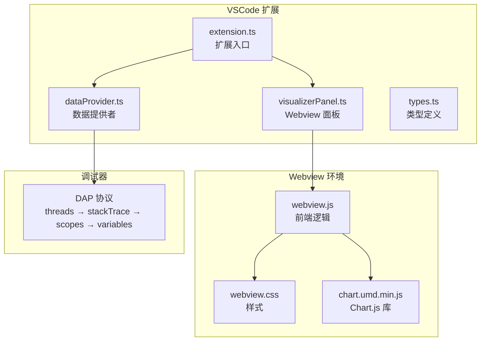
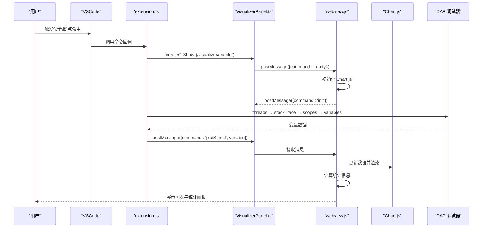
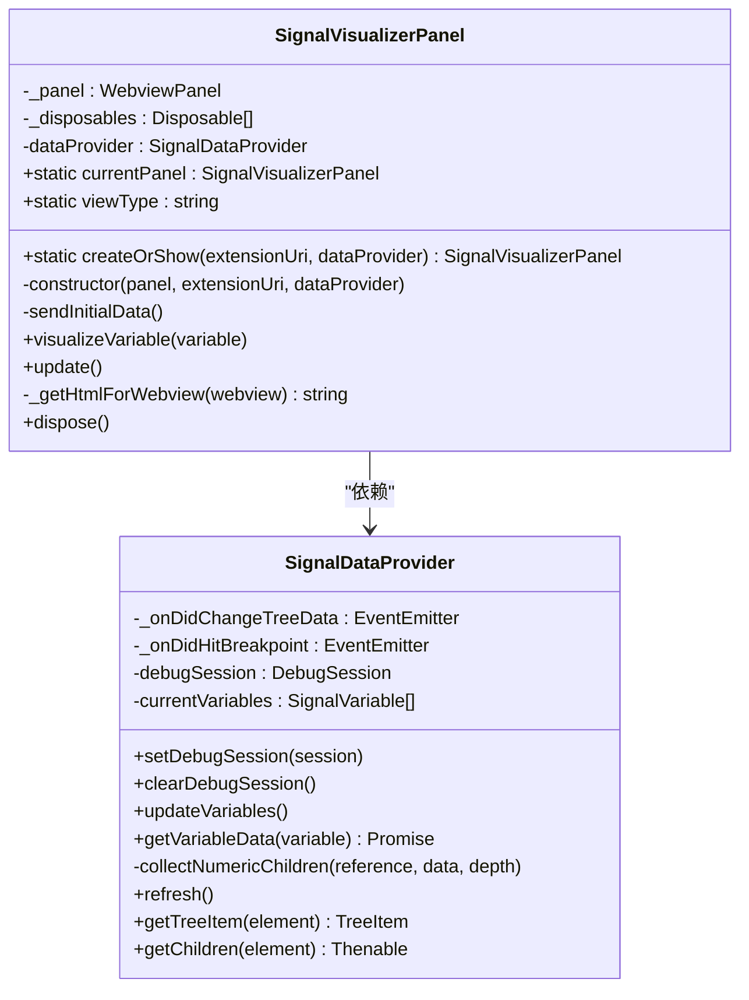
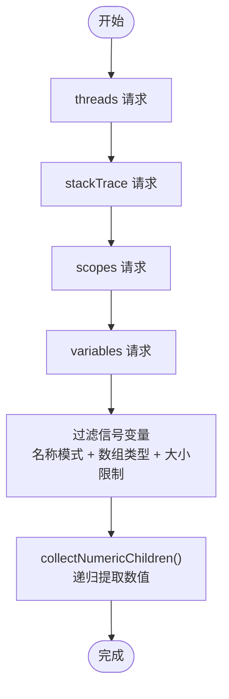
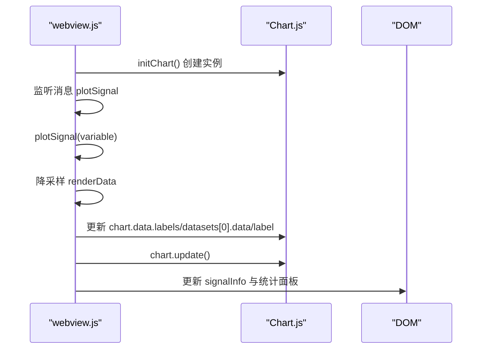
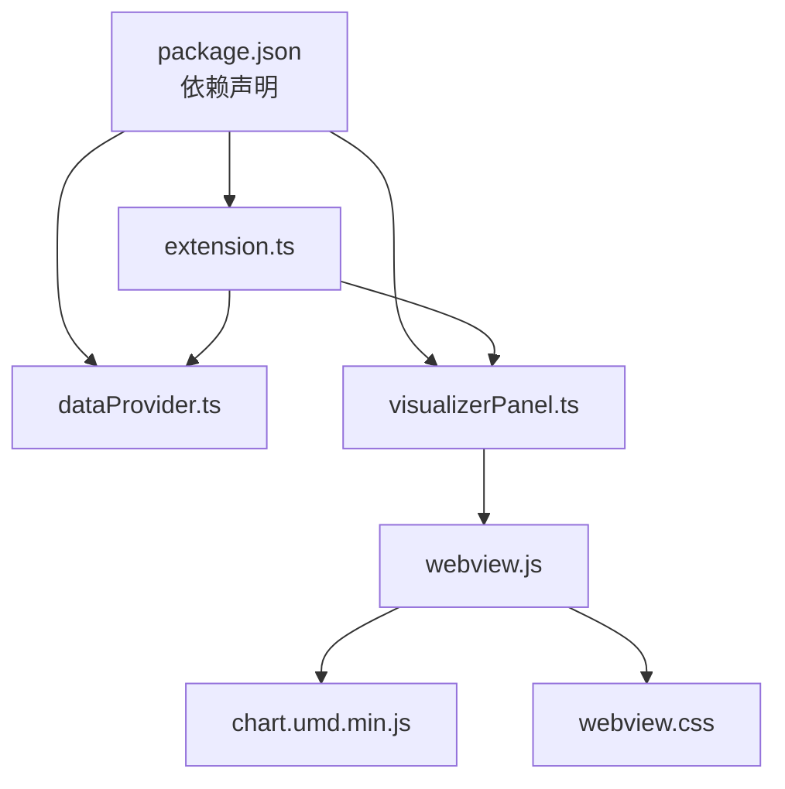

# Chart.js 图表集成

<cite>
**本文档引用的文件**
- [package.json](file://package.json)
- [src/extension.ts](file://src/extension.ts)
- [src/dataProvider.ts](file://src/dataProvider.ts)
- [src/visualizerPanel.ts](file://src/visualizerPanel.ts)
- [src/types.ts](file://src/types.ts)
- [assets/webview.js](file://assets/webview.js)
- [assets/webview.css](file://assets/webview.css)
- [assets/chart.umd.min.js](file://assets/chart.umd.min.js)
- [QUICKSTART.md](file://QUICKSTART.md)
</cite>

## 目录
1. [简介](#简介)
2. [项目结构](#项目结构)
3. [核心组件](#核心组件)
4. [架构总览](#架构总览)
5. [详细组件分析](#详细组件分析)
6. [依赖关系分析](#依赖关系分析)
7. [性能考虑](#性能考虑)
8. [故障排除指南](#故障排除指南)
9. [结论](#结论)
10. [附录](#附录)

## 简介
本项目是一个基于 VSCode 扩展的雷达信号可视化工具，集成了 Chart.js 图表库在 Webview 环境中的完整工作流。项目通过 DAP（Debug Adapter Protocol）与调试器交互，实时获取变量数据并在 Webview 中以折线图形式展示雷达信号波形。本文档深入解释了 Chart.js 在 Webview 环境中的初始化过程、配置选项和渲染机制，涵盖折线图的坐标轴设置、样式定制、交互行为和动画效果，以及数据结构设计、响应式布局实现和性能优化策略。

## 项目结构
项目采用模块化设计，核心文件分布如下：
- 扩展入口与生命周期管理：src/extension.ts
- 数据提供者：src/dataProvider.ts（DAP 交互、变量过滤、数据提取）
- Webview 面板管理：src/visualizerPanel.ts（Webview 创建、通信、HTML 生成）
- 类型定义：src/types.ts（SignalVariable、SignalData 接口）
- Webview 前端逻辑：assets/webview.js（Chart.js 初始化、数据渲染、统计计算）
- 样式表：assets/webview.css（VSCode 主题适配、响应式布局）
- Chart.js 库：assets/chart.umd.min.js（UMD 格式，可在 Webview 中直接使用）
- 项目配置：package.json（依赖、命令、视图、配置）

**图表来源**
- [src/extension.ts:46-188](file://src/extension.ts#L46-L188)
- [src/dataProvider.ts:233-399](file://src/dataProvider.ts#L233-L399)
- [src/visualizerPanel.ts:142-231](file://src/visualizerPanel.ts#L142-L231)
- [assets/webview.js:50-96](file://assets/webview.js#L50-L96)
- [assets/webview.css:64-237](file://assets/webview.css#L64-L237)
- [assets/chart.umd.min.js:1-21](file://assets/chart.umd.min.js#L1-L21)

**章节来源**
- [package.json:1-102](file://package.json#L1-L102)
- [src/extension.ts:1-200](file://src/extension.ts#L1-L200)
- [src/dataProvider.ts:1-703](file://src/dataProvider.ts#L1-L703)
- [src/visualizerPanel.ts:1-451](file://src/visualizerPanel.ts#L1-L451)
- [src/types.ts:1-95](file://src/types.ts#L1-L95)
- [assets/webview.js:1-494](file://assets/webview.js#L1-L494)
- [assets/webview.css:1-237](file://assets/webview.css#L1-L237)
- [assets/chart.umd.min.js:1-21](file://assets/chart.umd.min.js#L1-L21)

## 核心组件
- 扩展入口（extension.ts）：注册命令、树视图、调试事件监听，实现自动断点可视化。
- 数据提供者（dataProvider.ts）：实现 DAP 四级请求链，过滤信号变量，递归提取数值数据。
- Webview 面板（visualizerPanel.ts）：创建 WebviewPanel，生成 HTML，处理消息通信，管理生命周期。
- 前端逻辑（webview.js）：初始化 Chart.js，处理数据更新，实现降采样与统计计算。
- 样式表（webview.css）：VSCode 主题适配，Flexbox 布局，响应式容器。
- Chart.js 库（chart.umd.min.js）：UMD 格式，支持 Webview 环境。

**章节来源**
- [src/extension.ts:46-188](file://src/extension.ts#L46-L188)
- [src/dataProvider.ts:233-399](file://src/dataProvider.ts#L233-L399)
- [src/visualizerPanel.ts:142-231](file://src/visualizerPanel.ts#L142-L231)
- [assets/webview.js:50-96](file://assets/webview.js#L50-L96)
- [assets/webview.css:64-237](file://assets/webview.css#L64-L237)
- [assets/chart.umd.min.js:1-21](file://assets/chart.umd.min.js#L1-L21)

## 架构总览
项目采用分层架构：扩展层（VSCode API）、数据层（DAP 协议）、Webview 层（Chart.js）。扩展层负责生命周期管理和命令注册；数据层负责与调试器交互并提取信号数据；Webview 层负责渲染图表和用户交互。

**图表来源**
- [src/extension.ts:78-98](file://src/extension.ts#L78-L98)
- [src/visualizerPanel.ts:207-222](file://src/visualizerPanel.ts#L207-L222)
- [assets/webview.js:70-96](file://assets/webview.js#L70-L96)
- [src/dataProvider.ts:243-399](file://src/dataProvider.ts#L243-L399)

## 详细组件分析

### Webview 面板管理（visualizerPanel.ts）
- 单例模式：确保同一时间只有一个可视化面板实例，避免重复创建。
- WebviewPanel 配置：启用脚本、保留上下文、本地资源根目录。
- HTML 生成：使用 CSP + nonce 保障安全，加载本地资源（Chart.js、webview.js、webview.css）。
- 消息通信：扩展 → Webview（plotSignal）；Webview → 扩展（ready）。
- 生命周期管理：dispose() 清理静态实例、面板和事件订阅。

**图表来源**
- [src/visualizerPanel.ts:44-424](file://src/visualizerPanel.ts#L44-L424)
- [src/dataProvider.ts:56-702](file://src/dataProvider.ts#L56-L702)

**章节来源**
- [src/visualizerPanel.ts:44-424](file://src/visualizerPanel.ts#L44-L424)

### 数据提供者（dataProvider.ts）
- DAP 四级请求链：threads → stackTrace → scopes → variables，获取变量列表。
- 信号变量过滤：名称模式匹配（支持通配符）、数组类型判断、大小限制检查。
- 递归数据提取：collectNumericChildren() 递归遍历复合变量，提取数值数组。
- 事件驱动：onDidChangeTreeData 与 onDidHitBreakpoint 事件，支持自动断点可视化。

**图表来源**
- [src/dataProvider.ts:243-399](file://src/dataProvider.ts#L243-L399)
- [src/dataProvider.ts:563-634](file://src/dataProvider.ts#L563-L634)

**章节来源**
- [src/dataProvider.ts:233-399](file://src/dataProvider.ts#L233-L399)
- [src/dataProvider.ts:563-634](file://src/dataProvider.ts#L563-L634)

### Webview 前端逻辑（webview.js）
- Chart.js 初始化：创建折线图实例，配置坐标轴、样式、插件、交互。
- 数据更新：plotSignal() 接收扩展数据，执行降采样，更新图表与统计面板。
- 降采样算法：等间隔采样，限制最大渲染点数，保留整体趋势。
- 统计计算：最小值、最大值、平均值，避免展开运算符导致的调用栈溢出。

**图表来源**
- [assets/webview.js:111-345](file://assets/webview.js#L111-L345)
- [assets/webview.js:355-419](file://assets/webview.js#L355-L419)

**章节来源**
- [assets/webview.js:50-96](file://assets/webview.js#L50-L96)
- [assets/webview.js:111-345](file://assets/webview.js#L111-L345)
- [assets/webview.js:355-419](file://assets/webview.js#L355-L419)
- [assets/webview.js:456-493](file://assets/webview.js#L456-L493)

### 折线图配置详解（webview.js）
- 基础配置：type='line'，labels（采样点索引），datasets（单数据集）。
- 样式定制：borderColor、backgroundColor（半透明）、borderWidth、pointRadius、pointHoverRadius、fill、tension。
- 坐标轴设置：x/y 轴 type='linear'，title、ticks、grid 配置。
- 插件配置：legend（位置、颜色、点样式）、tooltip（模式、背景色、边框）。
- 交互行为：interaction.mode='nearest'、axis='x'、intersect=false。
- 动画效果：animation.duration=300ms。

**章节来源**
- [assets/webview.js:127-345](file://assets/webview.js#L127-L345)

### 数据结构设计（types.ts）
- SignalVariable：树视图节点数据结构（name、value、type、variablesReference、children）。
- SignalData：用于 Webview 通信的数据结构（name、data、type）。

**章节来源**
- [src/types.ts:59-94](file://src/types.ts#L59-L94)

### 响应式布局实现（webview.css）
- Flexbox 布局：.container 纵向排列，.chart-container flex: 1 自适应剩余空间。
- VSCode 主题适配：使用 --vscode-* CSS 变量，确保在深色/浅色主题下正常显示。
- 容器自适应：.chart-container 使用相对定位，Chart.js 需要此属性正确计算尺寸。
- 统计面板：.controls 横向排列，gap 控制间距，等宽字体便于数值对齐。

**章节来源**
- [assets/webview.css:64-237](file://assets/webview.css#L64-L237)

## 依赖关系分析
- package.json 声明依赖：chart.js、@types/chart.js、@types/node、@types/vscode、esbuild。
- 扩展入口依赖：vscode 命令注册、树视图、调试事件监听。
- 数据提供者依赖：vscode.DebugSession、DAP 请求、变量过滤与提取。
- Webview 面板依赖：vscode.WebviewPanel、CSP + nonce、本地资源加载。
- 前端逻辑依赖：Chart.js 库、DOM 操作、消息通信。

**图表来源**
- [package.json:98-100](file://package.json#L98-L100)
- [src/extension.ts:27-29](file://src/extension.ts#L27-L29)
- [src/visualizerPanel.ts:28-30](file://src/visualizerPanel.ts#L28-L30)
- [assets/webview.js:1-27](file://assets/webview.js#L1-L27)

**章节来源**
- [package.json:1-102](file://package.json#L1-L102)
- [src/extension.ts:27-29](file://src/extension.ts#L27-L29)
- [src/visualizerPanel.ts:28-30](file://src/visualizerPanel.ts#L28-L30)

## 性能考虑
- 大数据集降采样：当数据点超过阈值（如 10000）时，采用等间隔采样减少渲染负担，保留整体趋势。
- 渲染频率控制：Chart.js 动画 duration 控制在合理范围（如 300ms），避免频繁更新造成卡顿。
- 内存管理：WebviewPanel retainContextWhenHidden=true 保留上下文，提升体验；dispose() 及时清理事件订阅与面板资源。
- DOM 操作优化：批量更新 chart.data 后一次性 chart.update()，避免多次重绘。
- 统计计算优化：使用单次遍历同时计算 min、max、sum，避免多次数组扫描。

**章节来源**
- [assets/webview.js:380-388](file://assets/webview.js#L380-L388)
- [assets/webview.js:456-493](file://assets/webview.js#L456-L493)
- [assets/webview.js:231-233](file://assets/webview.js#L231-L233)
- [src/visualizerPanel.ts:407-423](file://src/visualizerPanel.ts#L407-L423)

## 故障排除指南
- 侧边栏无 Radar Signals 图标：确认在 Extension Development Host 窗口中，并已启动调试会话。
- 信号变量列表为空：确保调试器已暂停，变量名匹配配置模式（默认包含 *signal*, *data*, *pulse*, *sample*）。
- 图表不显示：检查变量是否为数组类型且包含数值数据；确认 Chart.js 已正确加载。
- Webview 无法加载：检查 CSP 配置与 nonce 使用，确保本地资源 URI 通过 asWebviewUri() 转换。
- 性能问题：大数据集时自动降采样；若仍卡顿，可适当降低渲染点数阈值或禁用动画。

**章节来源**
- [QUICKSTART.md:31-41](file://QUICKSTART.md#L31-L41)
- [assets/webview.js:360-362](file://assets/webview.js#L360-L362)
- [src/visualizerPanel.ts:317-392](file://src/visualizerPanel.ts#L317-L392)

## 结论
本项目成功地在 VSCode Webview 环境中集成了 Chart.js，实现了从调试器获取雷达信号数据到实时可视化展示的完整流程。通过合理的数据结构设计、响应式布局与性能优化策略，项目能够在大数据集场景下保持流畅的用户体验。扩展性方面，可通过插件系统进一步增强图表能力，或在配置中引入更多样式与交互选项。

## 附录
- 快速启动：安装依赖、编译扩展、编译测试程序、启动 VSCode 扩展开发模式、设置断点并测试。
- 常见问题：侧边栏图标缺失、变量列表为空、图表不显示等常见问题及解决方案。

**章节来源**
- [QUICKSTART.md:1-66](file://QUICKSTART.md#L1-L66)