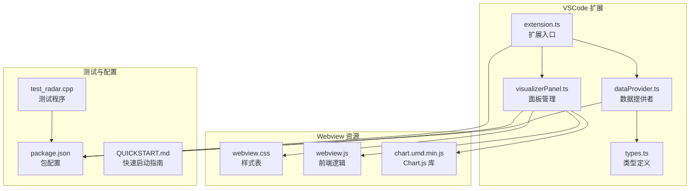
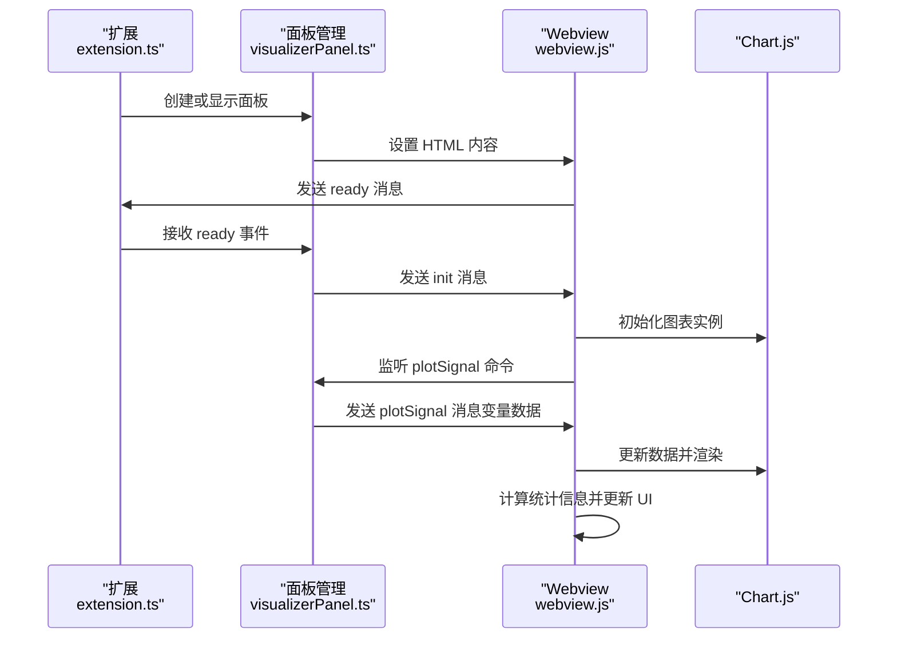
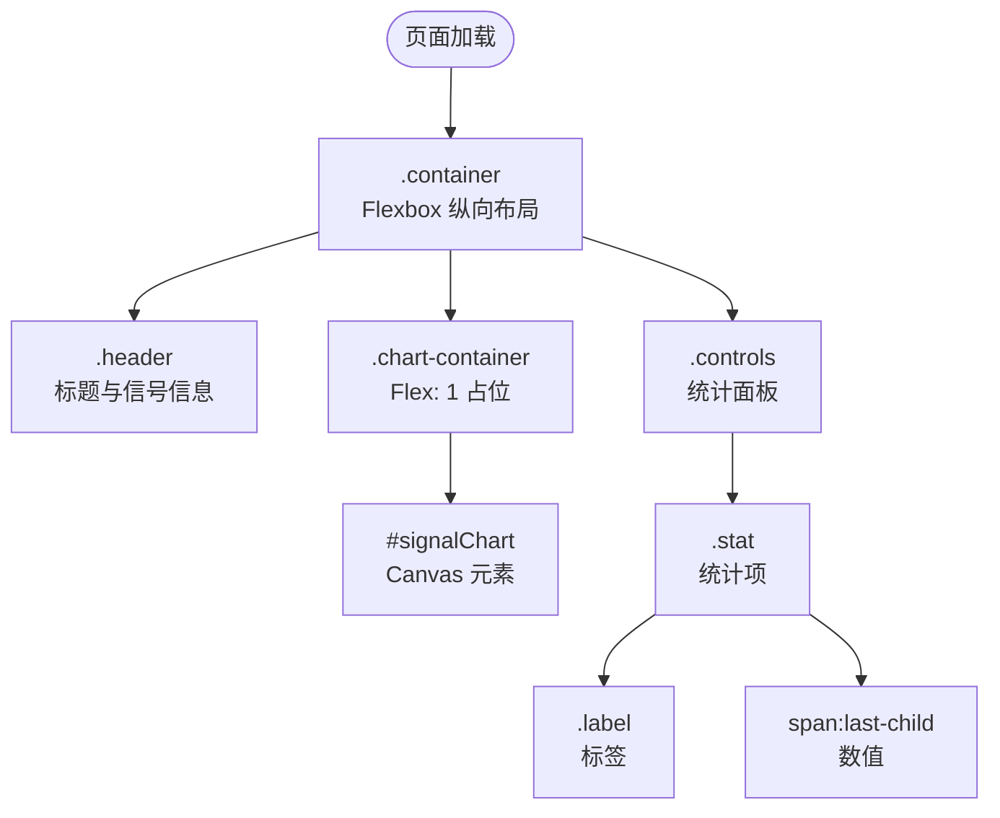
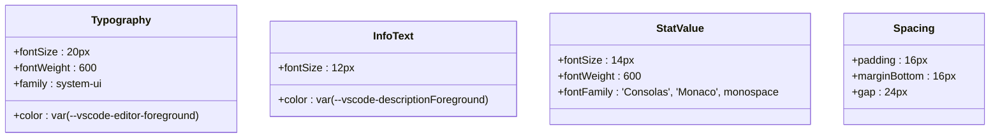
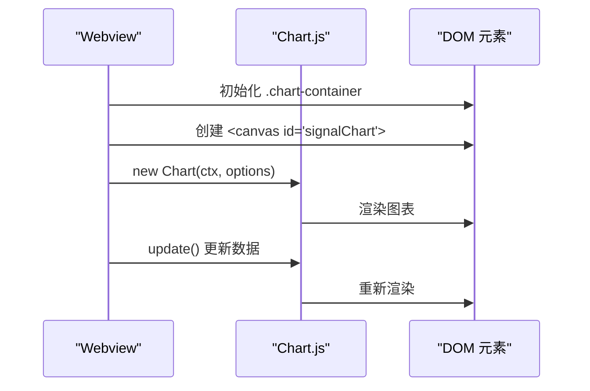
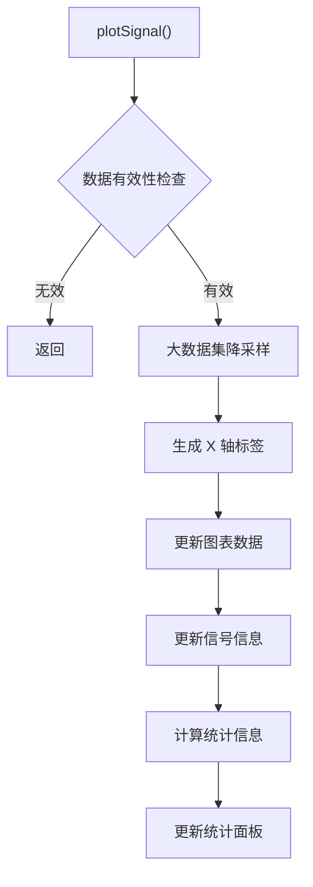
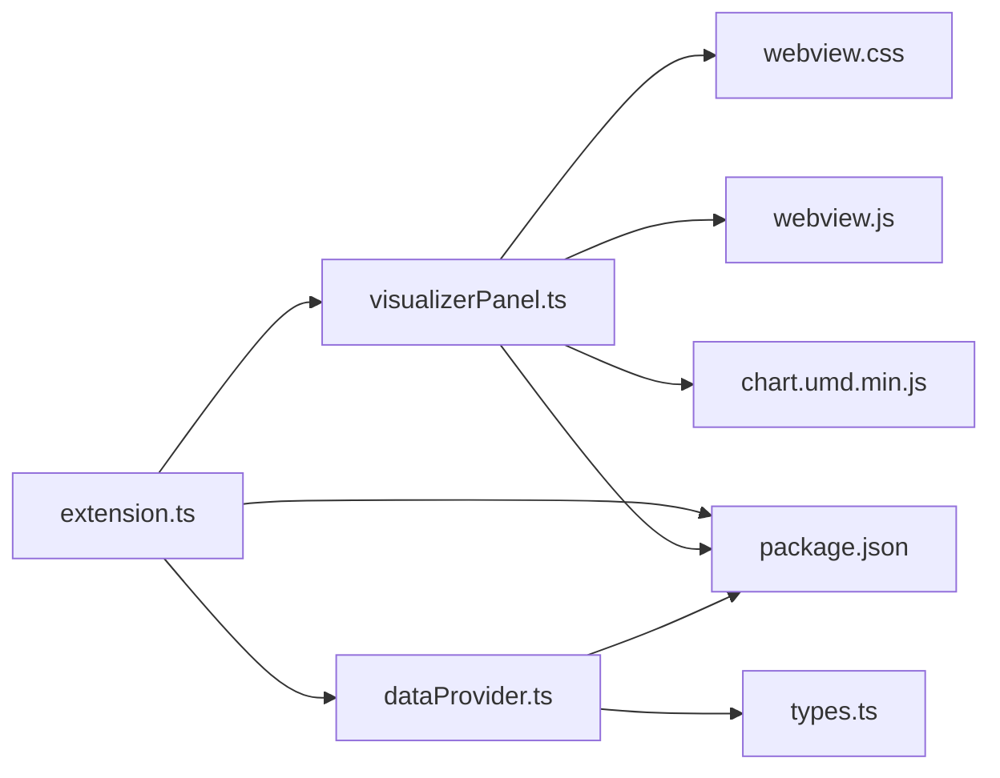

# UI 组件与样式设计

<cite>
**本文档引用的文件**
- [webview.css](file://assets/webview.css)
- [webview.js](file://assets/webview.js)
- [visualizerPanel.ts](file://src/visualizerPanel.ts)
- [dataProvider.ts](file://src/dataProvider.ts)
- [extension.ts](file://src/extension.ts)
- [types.ts](file://src/types.ts)
- [package.json](file://package.json)
- [test_radar.cpp](file://test_radar.cpp)
- [QUICKSTART.md](file://QUICKSTART.md)
</cite>

## 目录
1. [简介](#简介)
2. [项目结构](#项目结构)
3. [核心组件](#核心组件)
4. [架构概览](#架构概览)
5. [详细组件分析](#详细组件分析)
6. [依赖关系分析](#依赖关系分析)
7. [性能考量](#性能考量)
8. [故障排除指南](#故障排除指南)
9. [结论](#结论)
10. [附录](#附录)

## 简介
本项目为 VSCode 扩展，专注于 GPU 调试过程中的雷达信号可视化。通过 Webview 技术在 VSCode 内嵌浏览器环境中渲染 Chart.js 图表，实时展示调试器中的信号变量波形。本文档深入解析 UI 组件与样式设计，涵盖响应式布局、Flexbox 布局、网格系统应用、图表容器、信息面板、统计区域的样式配置，颜色方案选择依据（雷达信号可视化色彩搭配与可访问性考虑），字体设置、间距控制、视觉层次设计理念，以及样式定制指南（主题切换、暗色模式支持、移动端适配）。

## 项目结构
项目采用模块化组织，核心文件分布如下：
- assets：Webview 资源（CSS、JavaScript、Chart.js 库）
- src：TypeScript 扩展实现（面板管理、数据提供、类型定义、扩展入口）
- 根目录：包配置、构建脚本、测试程序、快速启动指南

**图表来源**
- [extension.ts:1-200](file://src/extension.ts#L1-L200)
- [visualizerPanel.ts:1-451](file://src/visualizerPanel.ts#L1-L451)
- [dataProvider.ts:1-703](file://src/dataProvider.ts#L1-L703)
- [webview.css:1-237](file://assets/webview.css#L1-L237)
- [webview.js:1-494](file://assets/webview.js#L1-L494)
- [package.json:1-102](file://package.json#L1-L102)

**章节来源**
- [QUICKSTART.md:42-57](file://QUICKSTART.md#L42-L57)
- [package.json:17-85](file://package.json#L17-L85)

## 核心组件
本项目的核心 UI 组件围绕 Webview 面板构建，包含：
- 容器布局（.container）：采用 Flexbox 纵向布局，占满视口高度，提供统一的内边距
- 图表容器（.chart-container）：Flexbox 占位，相对定位，支持 Chart.js 自适应
- 信息面板（.header）：标题与信号信息展示区域
- 统计面板（.controls）：底部统计信息面板，包含样本数、最小值、最大值、均值
- 图表画布（#signalChart）：Chart.js 渲染目标，占满父容器

样式设计遵循 VSCode 主题变量适配，确保在深色、浅色、高对比度主题下的一致表现。颜色方案采用青绿色系（rgb(75, 192, 192)），既符合雷达信号可视化语义，又具备良好的可访问性。

**章节来源**
- [webview.css:86-174](file://assets/webview.css#L86-L174)
- [webview.js:111-344](file://assets/webview.js#L111-L344)

## 架构概览
Webview 与扩展的通信采用双向消息机制：
- 扩展 → Webview：通过 postMessage 发送 plotSignal 命令，携带变量名、类型、数据
- Webview → 扩展：通过 window.postMessage 发送 ready 消息，通知扩展 Webview 已加载完成

**图表来源**
- [visualizerPanel.ts:207-222](file://src/visualizerPanel.ts#L207-L222)
- [visualizerPanel.ts:264-275](file://src/visualizerPanel.ts#L264-L275)
- [webview.js:50-96](file://assets/webview.js#L50-L96)
- [webview.js:111-344](file://assets/webview.js#L111-L344)

## 详细组件分析

### 布局系统与响应式设计
项目采用 Flexbox 作为主要布局模型，实现自适应的垂直分层结构：
- 容器布局：.container 使用 flex-direction: column，确保 header → chart-container → controls 的纵向排列
- 图表容器：chart-container 使用 flex: 1，自动填充剩余空间，实现图表自适应
- 统计面板：controls 使用 Flexbox 横向排列，gap 控制子元素间距，实现网格化布局效果

**图表来源**
- [webview.css:86-192](file://assets/webview.css#L86-L192)

**章节来源**
- [webview.css:86-192](file://assets/webview.css#L86-L192)

### 颜色方案与可访问性
颜色方案基于 VSCode 主题变量，确保跨主题一致性：
- 主题变量：使用 var(--vscode-editor-background)、var(--vscode-editor-foreground)、var(--vscode-panel-background) 等
- 图表颜色：青绿色系（rgb(75, 192, 192)）用于雷达信号可视化，具备良好的对比度和可识别性
- 辅助信息：使用 var(--vscode-descriptionForeground) 提供灰色系辅助文本，降低视觉干扰

可访问性考虑：
- 颜色对比度：主题变量确保在深色/浅色模式下具备足够的对比度
- 字体选择：使用系统字体栈，支持无障碍阅读
- 动态适配：无需硬编码颜色值，自动跟随 VSCode 主题变化

**章节来源**
- [webview.css:10-25](file://assets/webview.css#L10-L25)
- [webview.css:167-175](file://assets/webview.css#L167-L175)
- [webview.js:167-175](file://assets/webview.js#L167-L175)

### 字体设置与视觉层次
字体与间距设计体现清晰的视觉层次：
- 标题字体：h1 使用 20px 字号，600 字重，突出主标题
- 辅助信息：.signal-info 使用 12px 字号，灰色系颜色，提供补充信息
- 统计数值：.stat span:last-child 使用 14px 字号，600 字重，等宽字体，强调数值显示
- 间距控制：统一使用 16px 边距和 12px 内边距，确保视觉平衡

**图表来源**
- [webview.css:111-132](file://assets/webview.css#L111-L132)
- [webview.css:214-236](file://assets/webview.css#L214-L236)

**章节来源**
- [webview.css:111-132](file://assets/webview.css#L111-L132)
- [webview.css:214-236](file://assets/webview.css#L214-L236)

### 图表容器与 Chart.js 集成
图表容器设计专门考虑 Chart.js 的渲染需求：
- 容器属性：position: relative，border-radius: 4px，padding: 16px，border: 1px solid var(--vscode-panel-border)
- 画布尺寸：#signalChart 使用 100% 宽高，与父容器完美契合
- 图表配置：响应式布局、动画效果、坐标轴样式、交互行为均通过 Chart.js options 配置

**图表来源**
- [webview.css:153-174](file://assets/webview.css#L153-L174)
- [webview.js:111-344](file://assets/webview.js#L111-L344)

**章节来源**
- [webview.css:153-174](file://assets/webview.css#L153-L174)
- [webview.js:111-344](file://assets/webview.js#L111-L344)

### 信息面板与统计区域
信息面板与统计区域协同工作，提供完整的信号上下文：
- 信号信息：#signalInfo 显示变量名、类型和数据点数
- 统计面板：.controls 包含四个统计项，使用 Flexbox 实现网格化布局
- 数据处理：webview.js 实现大数据集降采样，确保渲染性能

**图表来源**
- [webview.js:355-419](file://assets/webview.js#L355-L419)

**章节来源**
- [webview.js:355-493](file://assets/webview.js#L355-L493)

### 主题适配与暗色模式支持
项目全面支持 VSCode 主题系统：
- 主题变量：使用 --vscode-* 前缀的 CSS 变量，自动适配深色/浅色/高对比度主题
- 面板样式：.chart-container 和 .controls 使用主题变量定义背景色和边框色
- 文本颜色：标题使用 editor-foreground，辅助信息使用 descriptionForeground

**章节来源**
- [webview.css:64-70](file://assets/webview.css#L64-L70)
- [webview.css:156-158](file://assets/webview.css#L156-L158)
- [webview.css:189-191](file://assets/webview.css#L189-L191)

## 依赖关系分析
扩展的依赖关系清晰明确，各模块职责分离：
- extension.ts 作为入口，协调面板管理和数据提供
- visualizerPanel.ts 负责 Webview 生命周期和 HTML 生成
- dataProvider.ts 处理调试器交互和数据提取
- types.ts 提供类型定义，确保代码健壮性

**图表来源**
- [extension.ts:27-29](file://src/extension.ts#L27-L29)
- [visualizerPanel.ts:28-29](file://src/visualizerPanel.ts#L28-L29)
- [dataProvider.ts:35-36](file://src/dataProvider.ts#L35-L36)
- [types.ts:21-65](file://src/types.ts#L21-L65)

**章节来源**
- [extension.ts:27-29](file://src/extension.ts#L27-L29)
- [visualizerPanel.ts:28-29](file://src/visualizerPanel.ts#L28-L29)
- [dataProvider.ts:35-36](file://src/dataProvider.ts#L35-L36)

## 性能考量
项目在性能方面采取多项优化措施：
- 大数据集降采样：当数据点超过 10000 个时，采用等间隔采样算法，保证渲染性能
- Chart.js 配置：responsive: true，maintainAspectRatio: false，确保图表自适应且无额外计算负担
- 资源加载：通过 asWebviewUri() 安全加载本地资源，避免网络延迟
- 内存管理：使用 Disposable 模式管理事件监听和面板生命周期

**章节来源**
- [webview.js:380-388](file://assets/webview.js#L380-L388)
- [webview.js:219-225](file://assets/webview.js#L219-L225)
- [visualizerPanel.ts:149-151](file://src/visualizerPanel.ts#L149-L151)

## 故障排除指南
常见问题及解决方案：
- Webview 无法加载：检查 CSP 配置和 nonce 生成，确保脚本和样式正确加载
- 图表不显示：确认变量数据类型为数组且包含数值，检查 plotSignal 命令传输的数据
- 面板空白：验证 VSCode 版本兼容性（^1.85.0），检查扩展激活事件
- 性能问题：大数据集会自动降采样，如仍存在问题，检查 maxArraySize 配置

**章节来源**
- [QUICKSTART.md:31-41](file://QUICKSTART.md#L31-L41)
- [package.json:7-8](file://package.json#L7-L8)

## 结论
本项目通过精心设计的 UI 组件与样式系统，成功实现了雷达信号在 VSCode 中的可视化展示。Flexbox 布局提供了优秀的响应式体验，VSCode 主题变量确保了跨主题的一致性，Chart.js 的集成带来了专业的图表渲染能力。项目在性能优化、可访问性和用户体验方面均表现出色，为 GPU 调试场景提供了强有力的工具支持。

## 附录

### 样式定制指南
- 主题切换：通过 VSCode 主题变量自动适配，无需手动修改
- 暗色模式：使用 --vscode-editor-background 等变量，自动切换深色/浅色
- 移动端适配：Flexbox 布局在移动设备上同样适用，但需注意触摸交互优化
- 自定义颜色：可在 Chart.js 配置中调整图表颜色，但建议保持与主题一致

### 组件设计模式
- 单例模式：SignalVisualizerPanel 采用单例模式，确保唯一面板实例
- 事件驱动：使用 EventEmitter 实现数据变化通知，避免轮询
- 依赖注入：通过构造函数注入数据提供者，提高模块解耦性
- 异步处理：DAP 请求采用 async/await，确保良好的用户体验

**章节来源**
- [visualizerPanel.ts:44-164](file://src/visualizerPanel.ts#L44-L164)
- [dataProvider.ts:56-82](file://src/dataProvider.ts#L56-L82)