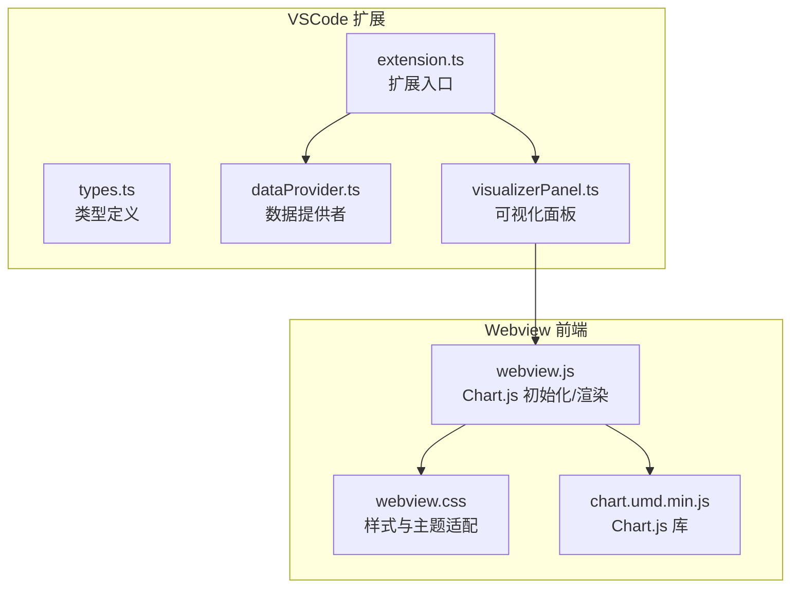
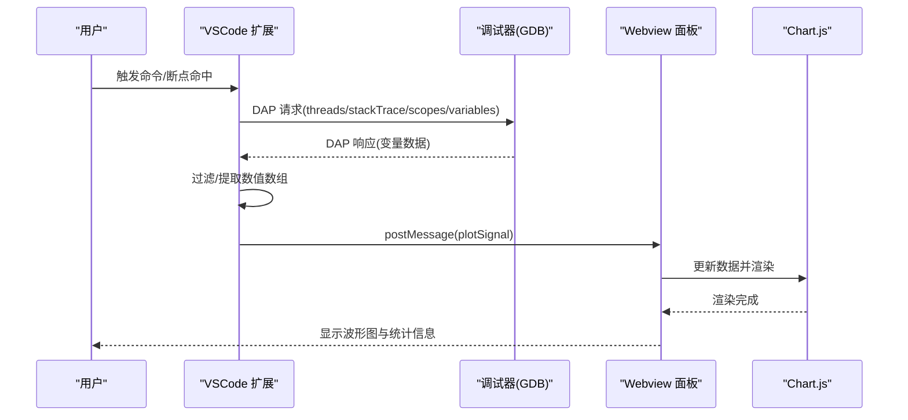
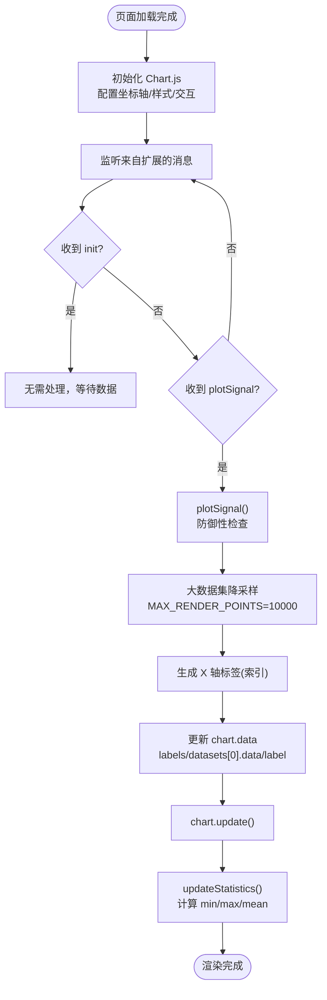
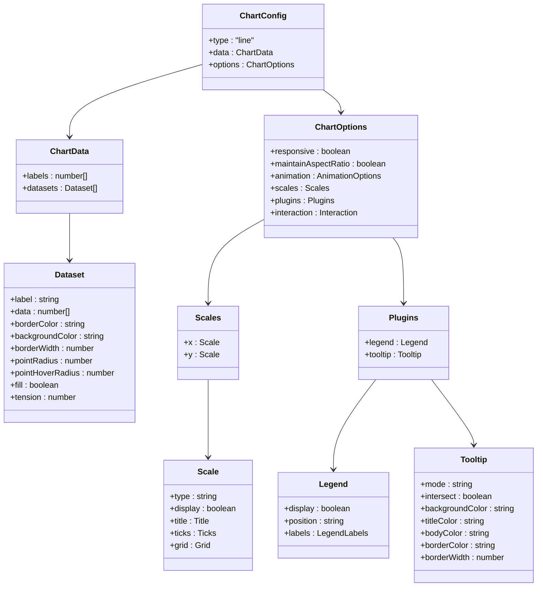
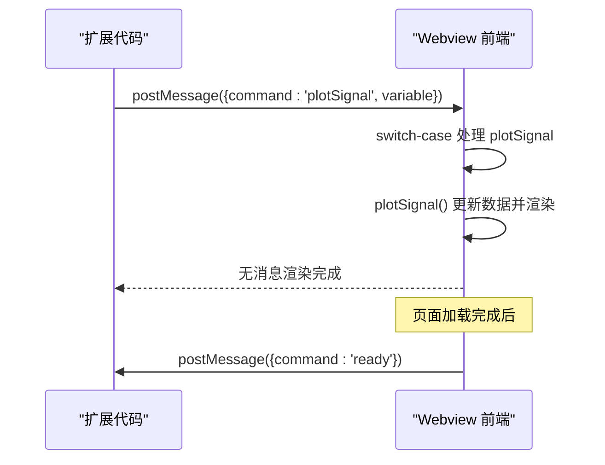
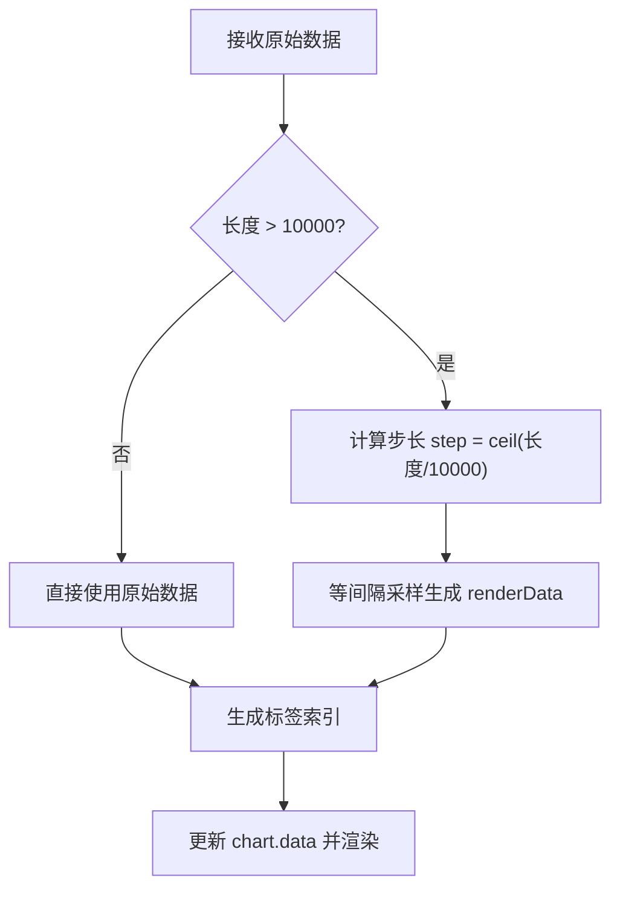
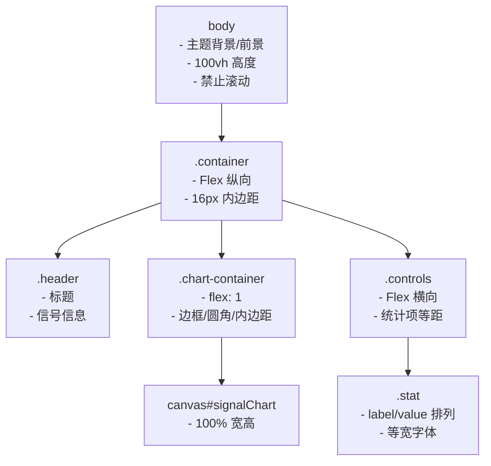
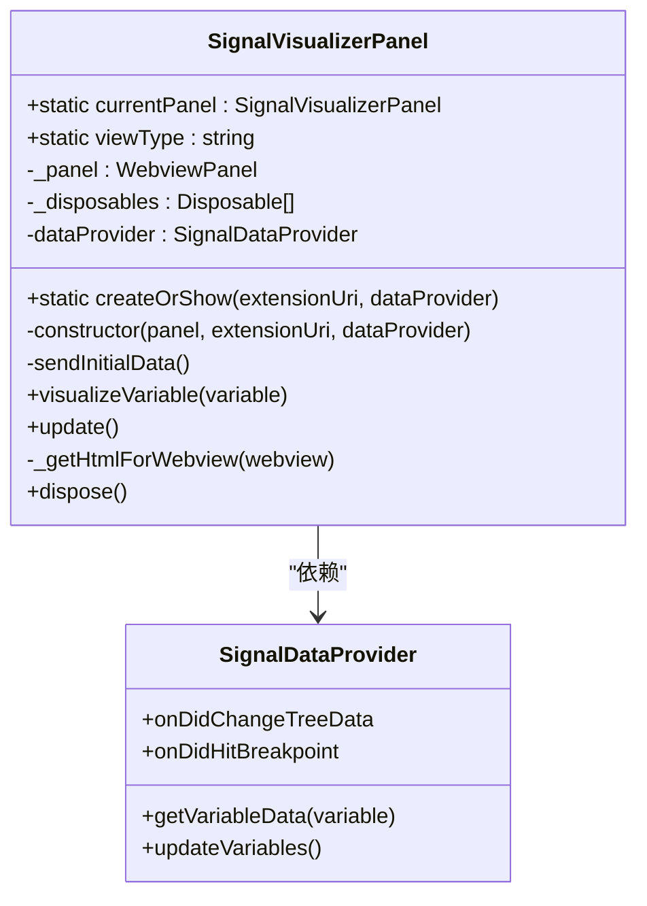
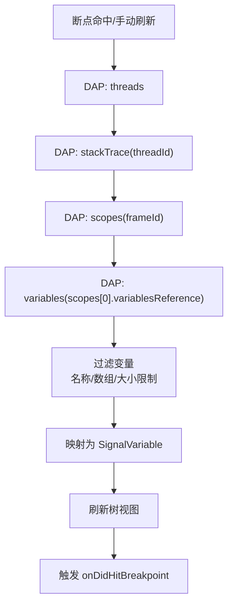
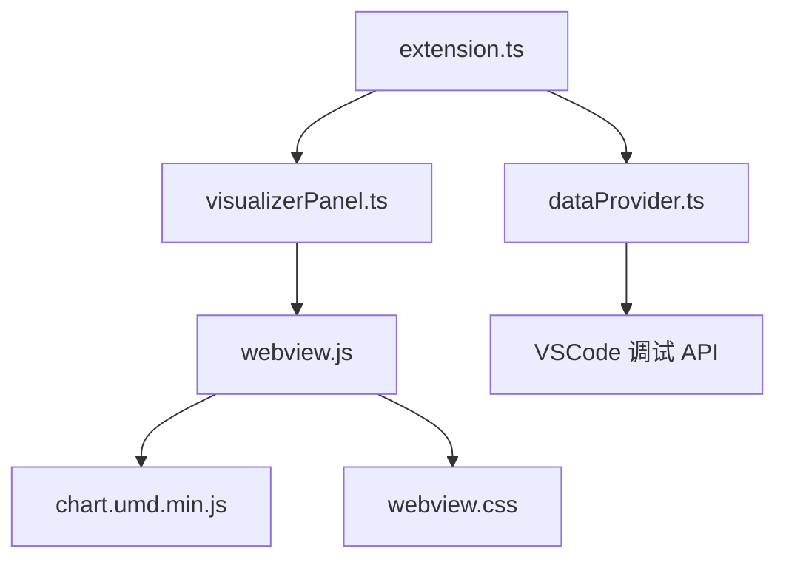

# Webview 前端实现

<cite>
**本文档引用的文件**
- [package.json](file://package.json)
- [QUICKSTART.md](file://QUICKSTART.md)
- [src/extension.ts](file://src/extension.ts)
- [src/types.ts](file://src/types.ts)
- [src/dataProvider.ts](file://src/dataProvider.ts)
- [src/visualizerPanel.ts](file://src/visualizerPanel.ts)
- [assets/webview.js](file://assets/webview.js)
- [assets/webview.css](file://assets/webview.css)
- [assets/chart.umd.min.js](file://assets/chart.umd.min.js)
</cite>

## 目录
1. [简介](#简介)
2. [项目结构](#项目结构)
3. [核心组件](#核心组件)
4. [架构总览](#架构总览)
5. [详细组件分析](#详细组件分析)
6. [依赖关系分析](#依赖关系分析)
7. [性能考虑](#性能考虑)
8. [故障排查指南](#故障排查指南)
9. [结论](#结论)

## 简介
本项目是一个 VSCode 扩展，用于在 GPU 调试过程中可视化雷达信号数据。扩展通过 VSCode 的调试适配器协议（DAP）从调试器获取变量数据，使用 Chart.js 在 Webview 中渲染波形图，并提供统计信息展示。本文档深入解析 Webview 前端实现，涵盖 Chart.js 集成、图表配置、消息通信协议、数据处理与可视化算法、CSS 样式设计与响应式布局、用户体验优化、性能优化与内存管理策略，以及 Webview 安全模型与错误处理机制。

## 项目结构
项目采用 VSCode 扩展标准结构，核心文件分布如下：
- 扩展入口与配置：package.json、src/extension.ts
- 类型定义：src/types.ts
- 数据提供者：src/dataProvider.ts（与调试器交互，提取变量数据）
- 可视化面板：src/visualizerPanel.ts（管理 Webview 面板，加载资源，建立消息通道）
- Webview 前端：assets/webview.js（Chart.js 初始化、消息处理、数据渲染、统计计算）
- 样式：assets/webview.css（VSCode 主题适配、Flex 布局、响应式设计）
- 图表库：assets/chart.umd.min.js（Chart.js 4.x）

**图表来源**
- [src/extension.ts:1-200](file://src/extension.ts#L1-L200)
- [src/dataProvider.ts:1-703](file://src/dataProvider.ts#L1-L703)
- [src/visualizerPanel.ts:1-451](file://src/visualizerPanel.ts#L1-L451)
- [assets/webview.js:1-494](file://assets/webview.js#L1-L494)
- [assets/webview.css:1-237](file://assets/webview.css#L1-L237)
- [assets/chart.umd.min.js:1-21](file://assets/chart.umd.min.js#L1-L21)

**章节来源**
- [package.json:1-102](file://package.json#L1-L102)
- [QUICKSTART.md:1-66](file://QUICKSTART.md#L1-L66)

## 核心组件
- 扩展入口（extension.ts）：注册命令、树视图、调试事件监听，协调数据提供者与可视化面板。
- 数据提供者（dataProvider.ts）：通过 DAP 与调试器交互，过滤信号变量，递归提取数值数组。
- 可视化面板（visualizerPanel.ts）：创建 WebviewPanel，加载本地资源，建立消息通道，发送绘图数据。
- Webview 前端（webview.js）：初始化 Chart.js，处理消息，渲染波形，计算统计信息。
- 样式（webview.css）：VSCode 主题适配、Flex 布局、响应式设计、统计面板样式。
- 图表库（chart.umd.min.js）：Chart.js 4.x，提供折线图渲染能力。

**章节来源**
- [src/extension.ts:1-200](file://src/extension.ts#L1-L200)
- [src/dataProvider.ts:1-703](file://src/dataProvider.ts#L1-L703)
- [src/visualizerPanel.ts:1-451](file://src/visualizerPanel.ts#L1-L451)
- [assets/webview.js:1-494](file://assets/webview.js#L1-L494)
- [assets/webview.css:1-237](file://assets/webview.css#L1-L237)
- [assets/chart.umd.min.js:1-21](file://assets/chart.umd.min.js#L1-L21)

## 架构总览
扩展采用“扩展代码 + Webview 前端”的双层架构：
- 扩展代码运行在 VSCode 进程中，负责与调试器交互、数据过滤与面板管理。
- Webview 前端运行在隔离的浏览器环境中，负责图表渲染与用户交互。

**图表来源**
- [src/extension.ts:138-147](file://src/extension.ts#L138-L147)
- [src/dataProvider.ts:243-399](file://src/dataProvider.ts#L243-L399)
- [src/visualizerPanel.ts:264-275](file://src/visualizerPanel.ts#L264-L275)
- [assets/webview.js:82-95](file://assets/webview.js#L82-L95)

## 详细组件分析

### Webview 前端（webview.js）
- Chart.js 初始化：在页面加载完成后创建折线图实例，配置坐标轴、样式、交互与插件。
- 消息通信：监听来自扩展的消息，处理 'init' 与 'plotSignal' 命令。
- 数据渲染：接收数值数组，进行大数据集降采样，生成 X 轴标签，更新图表数据并渲染。
- 统计计算：遍历原始数据计算最小值、最大值、平均值，更新底部统计面板。

**图表来源**
- [assets/webview.js:50-96](file://assets/webview.js#L50-L96)
- [assets/webview.js:111-345](file://assets/webview.js#L111-L345)
- [assets/webview.js:355-419](file://assets/webview.js#L355-L419)
- [assets/webview.js:456-493](file://assets/webview.js#L456-L493)

**章节来源**
- [assets/webview.js:1-494](file://assets/webview.js#L1-L494)

### Chart.js 集成与配置
- 图表类型：折线图（line），适合连续信号波形。
- 数据结构：单数据集，包含标签数组与数值数组。
- 样式配置：线条颜色、半透明填充、细线宽度、点半径与悬停半径、曲线张力。
- 坐标轴：线性数值轴，标题、刻度颜色、网格线透明度。
- 插件：图例（顶部显示，点样式）、提示框（索引模式，半透明黑底）。
- 交互：最近点模式，X 轴方向搜索，不需精确交点。

**图表来源**
- [assets/webview.js:127-344](file://assets/webview.js#L127-L344)

**章节来源**
- [assets/webview.js:111-345](file://assets/webview.js#L111-L345)

### 消息通信协议
- 扩展 → Webview：postMessage({ command: 'plotSignal', variable: { name, type, data } })
- Webview → 扩展：postMessage({ command: 'ready' })（在页面加载完成后发送）
- Webview 前端监听消息，处理 'init' 与 'plotSignal' 命令，分别用于握手与绘图数据传输。

**图表来源**
- [src/visualizerPanel.ts:207-222](file://src/visualizerPanel.ts#L207-L222)
- [assets/webview.js:70-95](file://assets/webview.js#L70-L95)

**章节来源**
- [src/visualizerPanel.ts:207-222](file://src/visualizerPanel.ts#L207-L222)
- [assets/webview.js:70-95](file://assets/webview.js#L70-L95)

### 数据处理与可视化算法
- 大数据集降采样：当数据点数超过 10000 时，按 ceil(长度/10000) 计算步长，等间隔采样，保证渲染性能。
- 统计计算：遍历原始数据一次计算 min、max、sum，再计算均值，避免使用 Math.min/max 的参数限制。
- 标签生成：基于降采样后的数据长度生成连续索引标签。

**图表来源**
- [assets/webview.js:380-419](file://assets/webview.js#L380-L419)

**章节来源**
- [assets/webview.js:355-419](file://assets/webview.js#L355-L419)

### CSS 样式设计与响应式布局
- 主题适配：使用 VSCode 主题变量（--vscode-editor-background、--vscode-editor-foreground 等）确保在深色/浅色主题下正常显示。
- Flex 布局：容器纵向排列，图表区域 flex: 1 自动填充剩余空间，底部统计面板横向排列。
- 响应式设计：Chart.js responsive 与 maintainAspectRatio 配置，结合 CSS Flex，使图表随面板大小变化而自适应。
- 统计面板：等宽字体、紧凑排版、颜色与主题一致。

**图表来源**
- [assets/webview.css:64-174](file://assets/webview.css#L64-L174)
- [assets/webview.css:185-236](file://assets/webview.css#L185-L236)

**章节来源**
- [assets/webview.css:1-237](file://assets/webview.css#L1-L237)

### 扩展与面板管理（visualizerPanel.ts）
- 单例模式：currentPanel 静态属性与 createOrShow 工厂方法，确保同一时间只有一个面板实例。
- Webview 配置：启用脚本、保留上下文、本地资源根目录。
- 资源加载：asWebviewUri 转换本地资源为 Webview 可访问 URI，CSP + nonce 保障安全。
- 消息通道：监听 Webview 的 ready 消息，发送初始化数据；对外提供 visualizeVariable 方法，将数据发送至 Webview。

**图表来源**
- [src/visualizerPanel.ts:44-164](file://src/visualizerPanel.ts#L44-L164)
- [src/visualizerPanel.ts:181-231](file://src/visualizerPanel.ts#L181-L231)
- [src/visualizerPanel.ts:264-275](file://src/visualizerPanel.ts#L264-L275)

**章节来源**
- [src/visualizerPanel.ts:1-451](file://src/visualizerPanel.ts#L1-L451)

### 数据提供者（dataProvider.ts）
- DAP 四级请求链：threads → stackTrace → scopes → variables，获取当前栈帧的变量列表。
- 变量过滤：名称模式匹配（支持通配符）、数组类型判断、大小限制检查。
- 数值提取：递归遍历复合变量（如 std::vector），收集叶子节点的数值，处理数组元素与嵌套结构。
- 事件驱动：onDidChangeTreeData 与自定义 onDidHitBreakpoint 事件，驱动 UI 更新与自动展示。

**图表来源**
- [src/dataProvider.ts:243-399](file://src/dataProvider.ts#L243-L399)
- [src/dataProvider.ts:414-441](file://src/dataProvider.ts#L414-L441)

**章节来源**
- [src/dataProvider.ts:1-703](file://src/dataProvider.ts#L1-L703)

### 类型定义（types.ts）
- SignalVariable：树视图节点数据结构，包含变量名、显示值、类型、DAP 变量引用 ID、子节点标记。
- SignalData：用于 Webview 通信的数据结构，包含名称、数值数组、类型。

**章节来源**
- [src/types.ts:1-95](file://src/types.ts#L1-L95)

## 依赖关系分析
- 扩展依赖：Chart.js 4.x（通过本地资源引入），VSCode API（调试、Webview、树视图）。
- Webview 依赖：Chart.js 库、自定义前端逻辑、样式表。
- 资源加载：Webview 通过 asWebviewUri 访问扩展内的本地资源，受 CSP 保护。

**图表来源**
- [package.json:98-100](file://package.json#L98-L100)
- [src/visualizerPanel.ts:328-330](file://src/visualizerPanel.ts#L328-L330)
- [assets/webview.js:388-389](file://assets/webview.js#L388-L389)

**章节来源**
- [package.json:1-102](file://package.json#L1-L102)
- [src/visualizerPanel.ts:317-392](file://src/visualizerPanel.ts#L317-L392)

## 性能考虑
- 大数据集渲染优化
  - 降采样：当数据点数超过 10000 时，按步长等间隔采样，减少渲染负担。
  - 线条配置：pointRadius 设为 0，避免大量点绘制；tension 为 0，使用直线连接，提升渲染速度。
  - 动画时长：300ms，平衡流畅度与性能。
- 内存管理
  - Webview 配置 retainContextWhenHidden: true，隐藏时保留上下文，避免频繁重建 DOM。
  - 单例面板管理，避免重复创建与资源泄漏。
  - dispose() 释放事件监听与面板资源。
- 数据处理
  - 一次遍历计算 min/max/sum，避免多次扫描与 Math.min/max 的参数限制。
  - 防御性检查：确保 chart、variable、data 存在后再更新。

[本节为通用性能建议，无需特定文件引用]

## 故障排查指南
- 侧边栏无雷达信号图标
  - 确认在 Extension Development Host 窗口中，并已启动调试会话。
- 信号变量列表为空
  - 确保调试器已暂停，变量名匹配配置模式（默认包含 *signal*, *data*, *pulse*, *sample*）。
- 图表不显示
  - 检查变量是否为数组类型且包含数值数据；确认断点已命中并触发自动展示。
- Webview 无法加载资源
  - 确认 localResourceRoots 已包含 assets 目录；检查 CSP 与 nonce 配置。
- 性能问题
  - 大数据集时会自动降采样；若仍卡顿，可减少数据点或调整渲染配置。

**章节来源**
- [QUICKSTART.md:31-66](file://QUICKSTART.md#L31-L66)

## 结论
本项目通过 VSCode 扩展与 Webview 的协同，实现了从调试器提取雷达信号数据到实时可视化渲染的完整流程。Webview 前端采用 Chart.js 进行高效渲染，结合降采样与合理的样式配置，兼顾性能与用户体验。扩展通过严格的资源加载策略与消息通信协议，确保了安全性与稳定性。未来可在图表类型扩展、自定义样式与交互功能方面进一步增强，以满足更复杂的可视化需求。