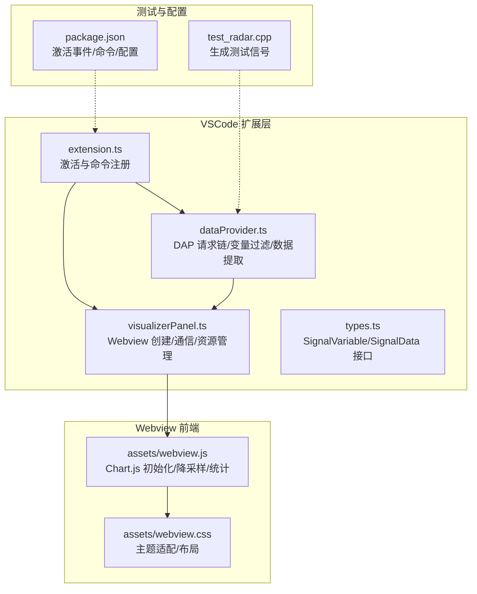
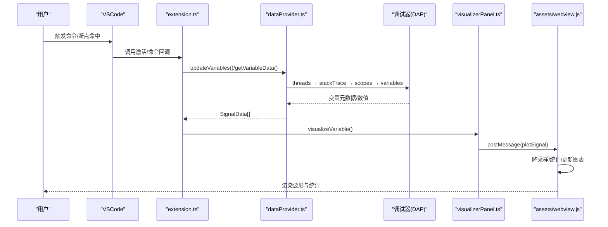
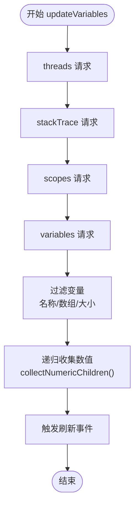
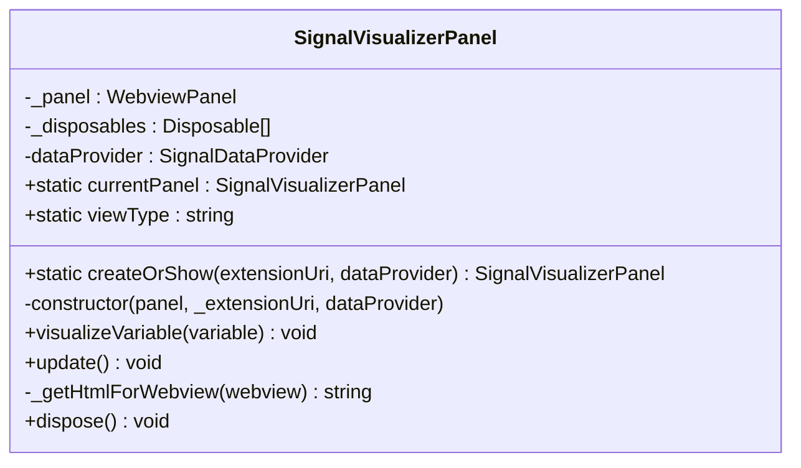
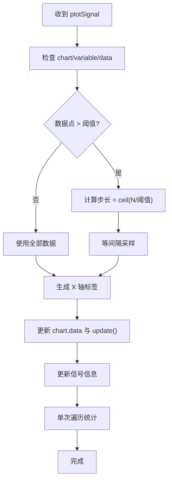
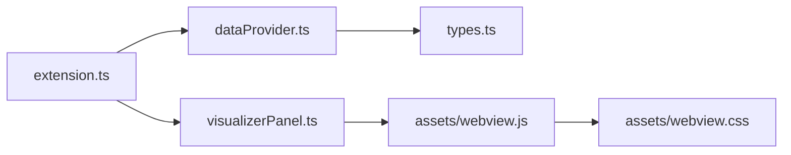
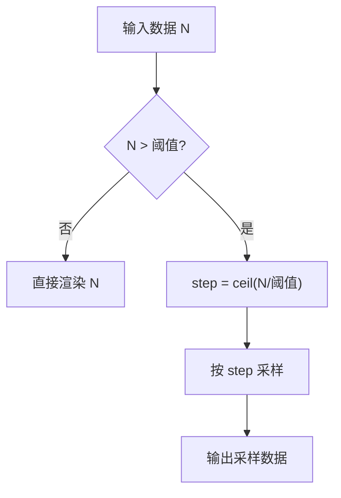

# 性能优化与数据处理

<cite>
**本文引用的文件**   
- [package.json](file://package.json)
- [src/extension.ts](file://src/extension.ts)
- [src/dataProvider.ts](file://src/dataProvider.ts)
- [src/visualizerPanel.ts](file://src/visualizerPanel.ts)
- [src/types.ts](file://src/types.ts)
- [assets/webview.js](file://assets/webview.js)
- [assets/webview.css](file://assets/webview.css)
- [test_radar.cpp](file://test_radar.cpp)
</cite>

## 目录
1. [简介](#简介)
2. [项目结构](#项目结构)
3. [核心组件](#核心组件)
4. [架构总览](#架构总览)
5. [详细组件分析](#详细组件分析)
6. [依赖关系分析](#依赖关系分析)
7. [性能考量](#性能考量)
8. [故障排查指南](#故障排查指南)
9. [结论](#结论)
10. [附录](#附录)

## 简介
本技术文档围绕 VSCode 扩展“雷达信号可视化”在 Webview 环境中的性能优化与数据处理展开，重点涵盖：
- 大数据集降采样策略与实现（等间隔采样、步长计算、质量权衡）
- 内存管理最佳实践（数据清理、资源释放、内存泄漏预防）
- 渲染性能优化（Canvas 重绘控制、动画帧率管理、浏览器兼容性）
- 统计计算高效实现（单次遍历、数值精度、边界处理）
- 性能监控、瓶颈识别与优化策略
- 性能测试案例与基准测试建议

## 项目结构
该项目采用 VSCode 扩展架构，核心分为：
- 扩展入口与命令注册（extension.ts）
- 调试数据提供者（dataProvider.ts，DAP 请求链、变量过滤与数据提取）
- Webview 可视化面板（visualizerPanel.ts，HTML/CSS/JS 承载）
- 前端图表与统计（assets/webview.js，Chart.js 驱动）
- 样式与主题适配（assets/webview.css）
- 类型定义（src/types.ts）
- 测试信号生成（test_radar.cpp）

**图表来源**
- [src/extension.ts:46-188](file://src/extension.ts#L46-L188)
- [src/dataProvider.ts:243-399](file://src/dataProvider.ts#L243-L399)
- [src/visualizerPanel.ts:142-231](file://src/visualizerPanel.ts#L142-L231)
- [assets/webview.js:111-345](file://assets/webview.js#L111-L345)
- [assets/webview.css:64-237](file://assets/webview.css#L64-L237)
- [package.json:13-84](file://package.json#L13-L84)
- [test_radar.cpp:34-62](file://test_radar.cpp#L34-L62)

**章节来源**
- [package.json:13-84](file://package.json#L13-L84)
- [src/extension.ts:46-188](file://src/extension.ts#L46-L188)
- [src/dataProvider.ts:243-399](file://src/dataProvider.ts#L243-L399)
- [src/visualizerPanel.ts:142-231](file://src/visualizerPanel.ts#L142-L231)
- [assets/webview.js:111-345](file://assets/webview.js#L111-L345)
- [assets/webview.css:64-237](file://assets/webview.css#L64-L237)
- [test_radar.cpp:34-62](file://test_radar.cpp#L34-L62)

## 核心组件
- 扩展入口与生命周期：注册命令、监听调试事件、自动展示面板、会话切换与结束处理。
- 数据提供者：基于 DAP 的四步请求链（threads → stackTrace → scopes → variables），变量过滤（名称模式、数组类型、大小限制），递归提取数值。
- 可视化面板：创建 WebviewPanel、CSP 安全策略、资源加载、消息通信、资源清理。
- 前端图表与统计：Chart.js 初始化、等间隔降采样、单次遍历统计、DOM 更新。

**章节来源**
- [src/extension.ts:46-188](file://src/extension.ts#L46-L188)
- [src/dataProvider.ts:243-399](file://src/dataProvider.ts#L243-L399)
- [src/visualizerPanel.ts:142-231](file://src/visualizerPanel.ts#L142-L231)
- [assets/webview.js:111-345](file://assets/webview.js#L111-L345)

## 架构总览
扩展通过 DAP 与调试器交互，提取变量数值后通过 Webview 传输至前端，使用 Chart.js 渲染波形并显示统计信息。整体数据流如下：

**图表来源**
- [src/extension.ts:78-111](file://src/extension.ts#L78-L111)
- [src/dataProvider.ts:243-399](file://src/dataProvider.ts#L243-L399)
- [src/visualizerPanel.ts:264-275](file://src/visualizerPanel.ts#L264-L275)
- [assets/webview.js:355-419](file://assets/webview.js#L355-L419)

## 详细组件分析

### 数据提供者（dataProvider.ts）
- DAP 四步请求链：threads → stackTrace → scopes → variables，获取当前栈帧作用域变量。
- 变量过滤：名称模式匹配（支持通配符）、数组类型判断、大小限制（配置项）。
- 递归提取数值：通过 variablesReference 递归遍历，收集叶子节点数值，防止无限递归。
- 事件驱动刷新：onDidChangeTreeData 与自定义 onDidHitBreakpoint 事件，减少轮询成本。

**图表来源**
- [src/dataProvider.ts:243-399](file://src/dataProvider.ts#L243-L399)
- [src/dataProvider.ts:414-441](file://src/dataProvider.ts#L414-L441)
- [src/dataProvider.ts:563-634](file://src/dataProvider.ts#L563-L634)

**章节来源**
- [src/dataProvider.ts:243-399](file://src/dataProvider.ts#L243-L399)
- [src/dataProvider.ts:414-441](file://src/dataProvider.ts#L414-L441)
- [src/dataProvider.ts:563-634](file://src/dataProvider.ts#L563-L634)

### 可视化面板（visualizerPanel.ts）
- 单例模式：createOrShow 静态工厂，确保唯一面板实例。
- Webview 安全：CSP + nonce，本地资源根目录配置，retainContextWhenHidden。
- 通信机制：onDidReceiveMessage 处理 'ready'，sendInitialData 发送 'init'。
- 资源管理：dispose 释放面板与订阅，避免内存泄漏。

**图表来源**
- [src/visualizerPanel.ts:44-164](file://src/visualizerPanel.ts#L44-L164)
- [src/visualizerPanel.ts:181-231](file://src/visualizerPanel.ts#L181-L231)
- [src/visualizerPanel.ts:407-423](file://src/visualizerPanel.ts#L407-L423)

**章节来源**
- [src/visualizerPanel.ts:44-164](file://src/visualizerPanel.ts#L44-L164)
- [src/visualizerPanel.ts:181-231](file://src/visualizerPanel.ts#L181-L231)
- [src/visualizerPanel.ts:407-423](file://src/visualizerPanel.ts#L407-L423)

### 前端图表与统计（assets/webview.js）
- Chart.js 初始化：折线图、响应式、交互配置、网格与图例。
- 等间隔降采样：当数据点超过阈值时，计算步长并等间隔采样，保证渲染性能。
- 单次遍历统计：同时计算最小值、最大值、总和，再求均值，避免多次遍历。
- DOM 更新：更新信号信息与统计面板，使用本地化格式与固定小数位。

**图表来源**
- [assets/webview.js:355-419](file://assets/webview.js#L355-L419)
- [assets/webview.js:456-493](file://assets/webview.js#L456-L493)

**章节来源**
- [assets/webview.js:111-345](file://assets/webview.js#L111-L345)
- [assets/webview.js:355-419](file://assets/webview.js#L355-L419)
- [assets/webview.js:456-493](file://assets/webview.js#L456-L493)

### 类型定义（src/types.ts）
- SignalVariable：树节点数据结构（名称、显示值、类型、DAP 引用、子节点标记）。
- SignalData：用于 Webview 通信的数据结构（名称、数值数组、类型）。

**章节来源**
- [src/types.ts:59-65](file://src/types.ts#L59-L65)
- [src/types.ts:90-94](file://src/types.ts#L90-L94)

## 依赖关系分析
- 扩展入口依赖数据提供者与可视化面板，二者通过命令与事件交互。
- 数据提供者依赖 VSCode 调试 API 与 DAP 协议，向上游提供结构化数据。
- 可视化面板依赖 Chart.js 与本地资源，负责安全加载与资源管理。
- 前端统计依赖浏览器环境的数组遍历与 DOM 更新。

**图表来源**
- [src/extension.ts:27-29](file://src/extension.ts#L27-L29)
- [src/dataProvider.ts:36-37](file://src/dataProvider.ts#L36-L37)
- [src/visualizerPanel.ts:28-30](file://src/visualizerPanel.ts#L28-L30)
- [assets/webview.js:111-345](file://assets/webview.js#L111-L345)
- [assets/webview.css:64-237](file://assets/webview.css#L64-L237)

**章节来源**
- [src/extension.ts:27-29](file://src/extension.ts#L27-L29)
- [src/dataProvider.ts:36-37](file://src/dataProvider.ts#L36-L37)
- [src/visualizerPanel.ts:28-30](file://src/visualizerPanel.ts#L28-L30)
- [assets/webview.js:111-345](file://assets/webview.js#L111-L345)
- [assets/webview.css:64-237](file://assets/webview.css#L64-L237)

## 性能考量

### 大数据集降采样
- 策略：等间隔采样（等距步长），在渲染阈值处进行采样，保证渲染性能。
- 步长计算：步长 = ceil(总长度 / 最大渲染点数)，避免过度采样导致信息丢失。
- 质量权衡：降采样保留整体趋势，牺牲细节；对雷达信号调试通常足够。

**图表来源**
- [assets/webview.js:380-388](file://assets/webview.js#L380-L388)

**章节来源**
- [assets/webview.js:380-388](file://assets/webview.js#L380-L388)

### 内存管理最佳实践
- 资源释放：面板 dispose 时清空静态实例、释放 WebviewPanel 与 Disposable 列表。
- 事件订阅：通过 context.subscriptions 或面板内部 _disposables 管理，避免悬挂监听。
- 数据清理：在调试会话结束时清空变量列表并刷新视图，避免残留数据占用内存。
- Webview 状态：retainContextWhenHidden 保留 DOM 状态，提升体验但占用内存，需结合业务权衡。

**章节来源**
- [src/visualizerPanel.ts:407-423](file://src/visualizerPanel.ts#L407-L423)
- [src/extension.ts:185-187](file://src/extension.ts#L185-L187)
- [src/dataProvider.ts:224-228](file://src/dataProvider.ts#L224-L228)

### 渲染性能优化
- Canvas 重绘控制：仅在数据到达时更新 chart.data 与 chart.update()，避免频繁重绘。
- 动画帧率管理：Chart.js 动画时长 300ms，平衡流畅与性能。
- 坐标轴与网格：限制 X 轴最大刻度数，降低渲染复杂度。
- 响应式布局：responsive + maintainAspectRatio:false，配合 CSS flex，减少重排。

**章节来源**
- [assets/webview.js:231-233](file://assets/webview.js#L231-L233)
- [assets/webview.js:269-272](file://assets/webview.js#L269-L272)
- [assets/webview.js:219-225](file://assets/webview.js#L219-L225)

### 统计计算高效实现
- 单次遍历：同时维护 min、max、sum，再计算均值，避免多次扫描。
- 边界处理：空数组直接返回；数值精度使用 toFixed(6) 与本地化格式化。
- 兼容性：避免使用展开运算符进行极大数据集的 Math.min/max，改用循环遍历。

**章节来源**
- [assets/webview.js:473-478](file://assets/webview.js#L473-L478)
- [assets/webview.js:489-493](file://assets/webview.js#L489-L493)

### 性能监控与瓶颈识别
- 监控点：DAP 请求耗时、数据提取耗时、前端降采样与统计耗时。
- 工具：VSCode 开发者工具（Webview 中按 Ctrl+Shift+I 打开）查看网络与性能面板。
- 建议：对超大数组增加配置项（如最大数组大小）与进度反馈，避免阻塞 UI。

**章节来源**
- [src/dataProvider.ts:426-428](file://src/dataProvider.ts#L426-L428)
- [assets/webview.js:456-493](file://assets/webview.js#L456-L493)

## 故障排查指南
- 断点命中无数据：确认 DebugAdapterTracker 捕获到 "stopped" 事件，检查 updateVariables() 是否被调用。
- 变量未显示：检查名称模式与大小限制配置，确认 isArrayVariable 与 isWithinSizeLimit 判断。
- 图表不渲染：检查 CSP 与 nonce 设置，确认 Chart.js 与 webview.js 顺序加载。
- 面板无法关闭：确认 dispose() 被调用，_disposables 列表已清空。

**章节来源**
- [src/dataProvider.ts:197-202](file://src/dataProvider.ts#L197-L202)
- [src/dataProvider.ts:426-441](file://src/dataProvider.ts#L426-L441)
- [src/visualizerPanel.ts:317-392](file://src/visualizerPanel.ts#L317-L392)
- [src/visualizerPanel.ts:407-423](file://src/visualizerPanel.ts#L407-L423)

## 结论
本项目通过 DAP 与 Webview 的协同，实现了从调试器到可视化面板的高效数据流转。前端采用等间隔降采样与单次遍历统计，兼顾性能与准确性；后端通过事件驱动与资源管理，保障扩展稳定性。建议在生产环境中引入更精细的性能监控与配置项，以应对更大规模数据与复杂调试场景。

## 附录

### 性能测试案例与基准建议
- 测试信号生成：使用 test_radar.cpp 生成脉冲、噪声、线性调频等信号，断点调试时触发可视化。
- 基准指标：
  - DAP 请求链耗时（threads/stackTrace/scopes/variables）
  - 降采样前后渲染时间（使用浏览器性能面板测量）
  - 统计计算耗时（大数据集下单次遍历 vs 多次遍历）
- 建议场景：
  - 小数据集（<1k）：验证 UI 响应与统计准确性
  - 中等数据集（1k~10k）：验证降采样与渲染流畅度
  - 大数据集（>10k）：验证降采样阈值与内存占用

**章节来源**
- [test_radar.cpp:34-62](file://test_radar.cpp#L34-L62)
- [assets/webview.js:380-388](file://assets/webview.js#L380-L388)
- [assets/webview.js:456-493](file://assets/webview.js#L456-L493)