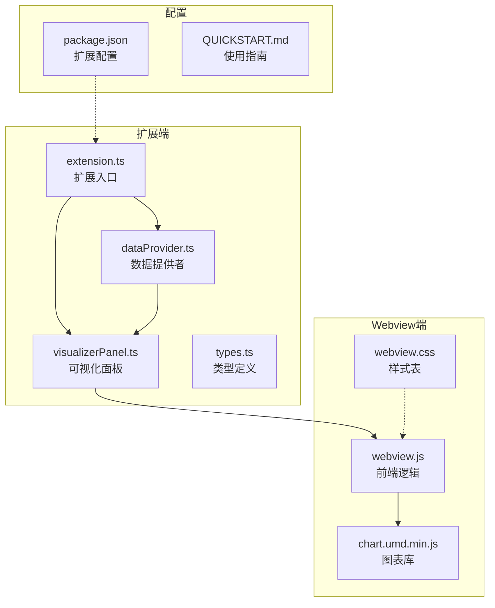
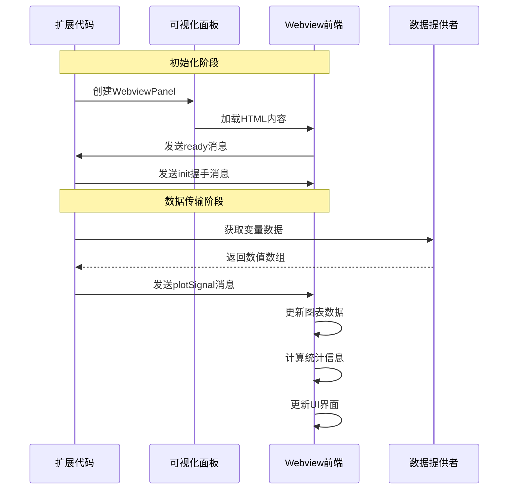
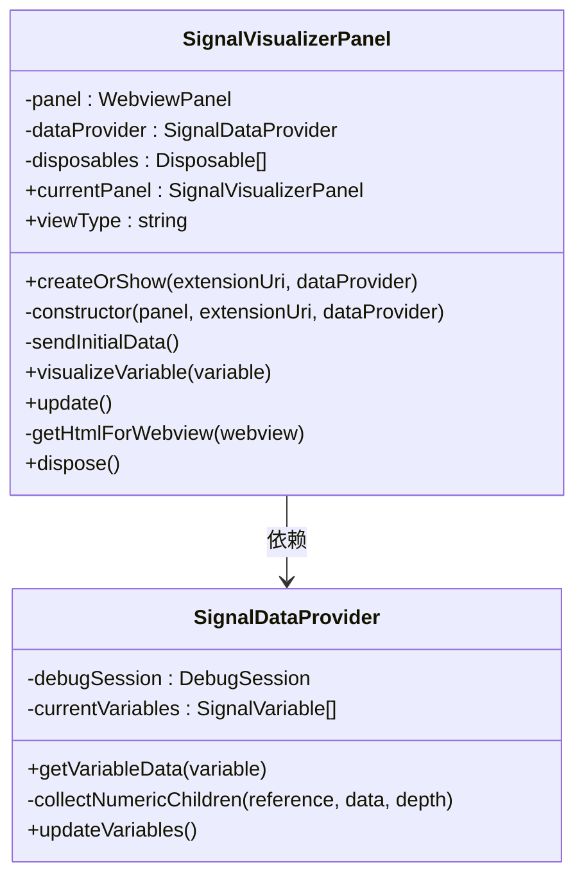
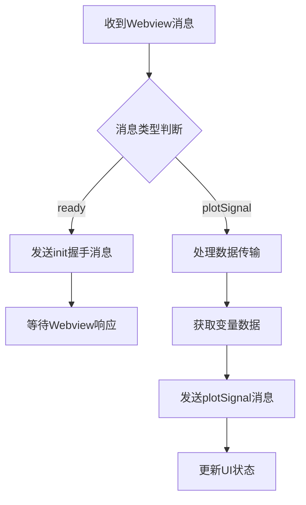
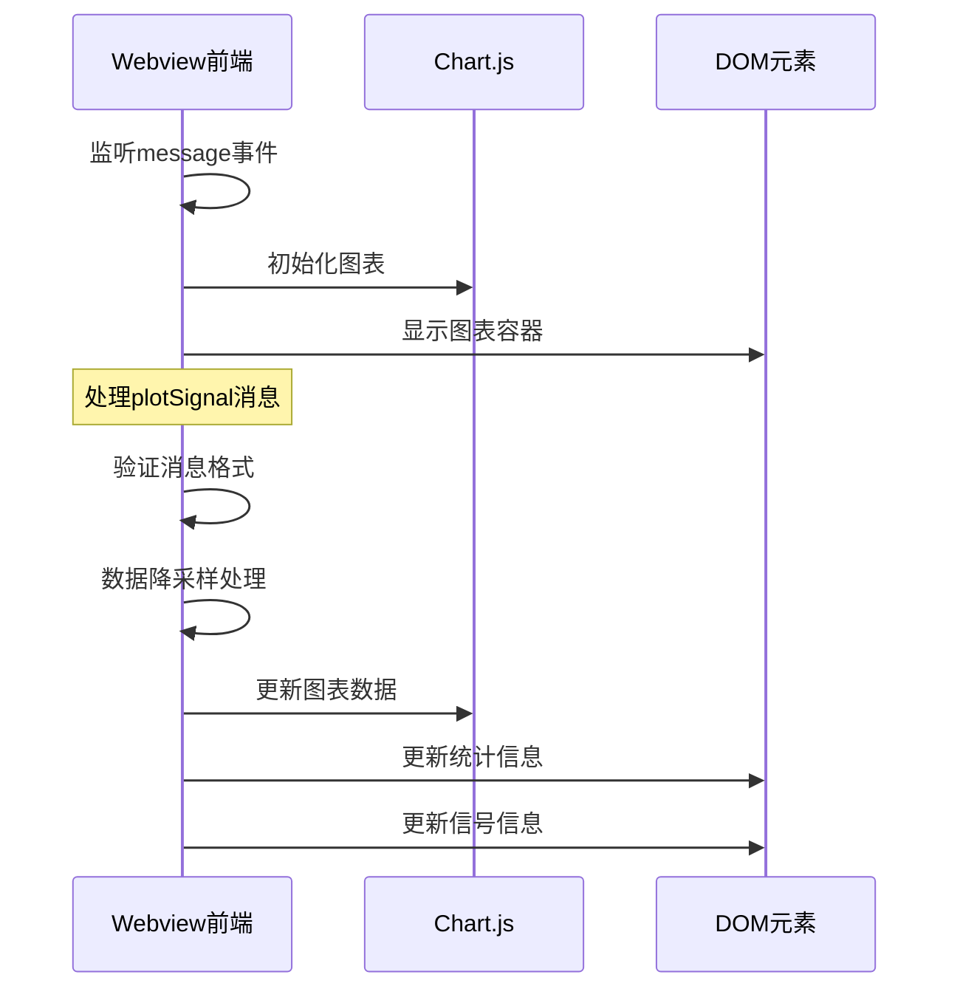
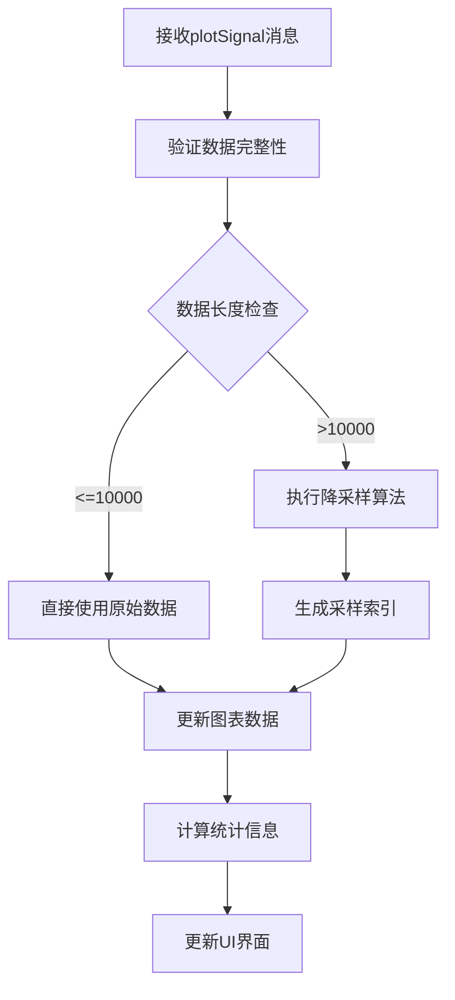
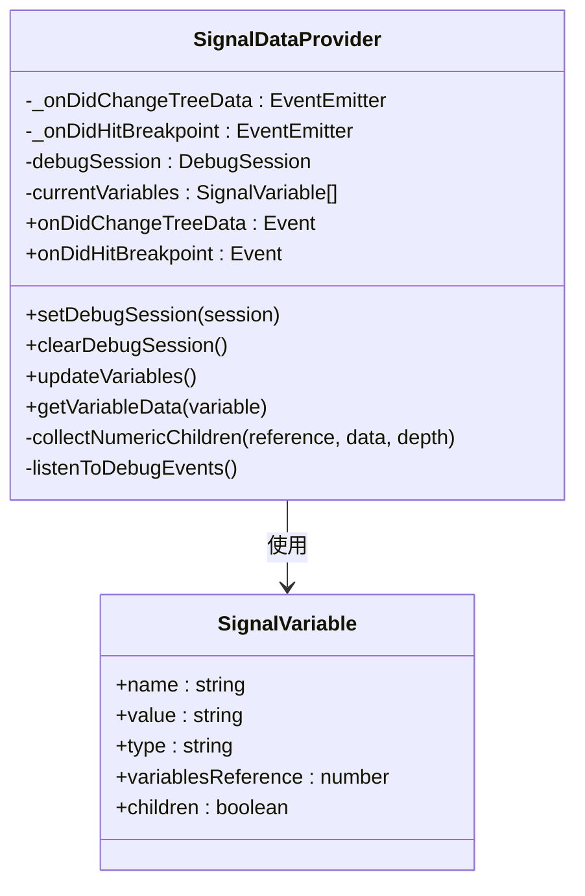
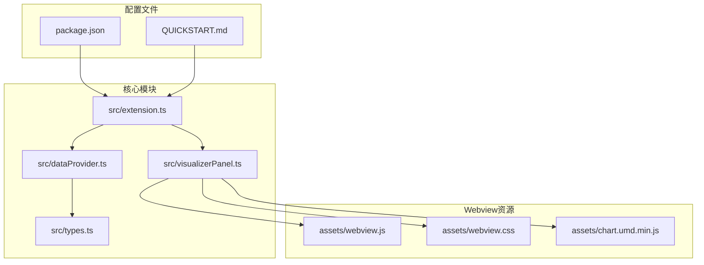
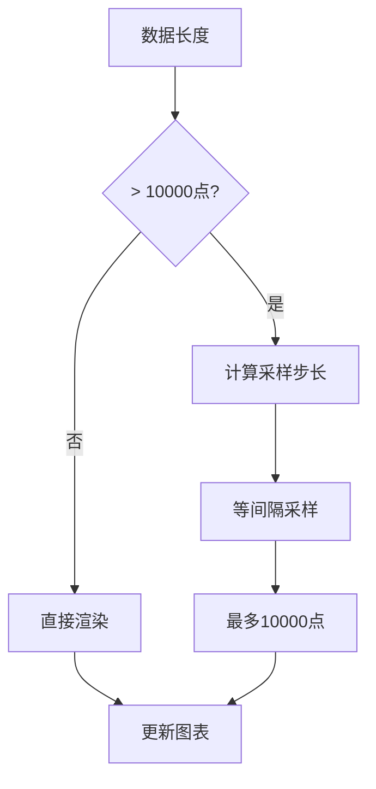

# 消息通信协议

<cite>
**本文档引用的文件**
- [src/extension.ts](file://src/extension.ts)
- [src/visualizerPanel.ts](file://src/visualizerPanel.ts)
- [src/dataProvider.ts](file://src/dataProvider.ts)
- [src/types.ts](file://src/types.ts)
- [assets/webview.js](file://assets/webview.js)
- [assets/webview.css](file://assets/webview.css)
- [package.json](file://package.json)
- [QUICKSTART.md](file://QUICKSTART.md)
- [test_radar.cpp](file://test_radar.cpp)
</cite>

## 目录
1. [简介](#简介)
2. [项目结构](#项目结构)
3. [核心组件](#核心组件)
4. [架构概览](#架构概览)
5. [详细组件分析](#详细组件分析)
6. [依赖关系分析](#依赖关系分析)
7. [性能考虑](#性能考虑)
8. [故障排除指南](#故障排除指南)
9. [结论](#结论)

## 简介

本文档详细阐述了 VSCode 扩展中 Webview 与扩展代码之间的消息通信协议。该雷达信号可视化项目实现了完整的双向通信机制，包括：

- **握手协议**：init 消息用于建立通信连接
- **数据传输协议**：plotSignal 消息用于传输信号数据
- **异步处理机制**：基于 Promise 和 async/await 的非阻塞通信
- **安全机制**：CSP（内容安全策略）和 nonce 验证
- **性能优化**：大数据集降采样和内存管理

## 项目结构

该项目采用模块化设计，主要包含以下核心模块：



**图表来源**
- [src/extension.ts:1-200](file://src/extension.ts#L1-L200)
- [src/visualizerPanel.ts:1-451](file://src/visualizerPanel.ts#L1-L451)
- [src/dataProvider.ts:1-703](file://src/dataProvider.ts#L1-L703)

**章节来源**
- [src/extension.ts:1-200](file://src/extension.ts#L1-L200)
- [package.json:1-102](file://package.json#L1-L102)

## 核心组件

### 通信协议概述

项目实现了基于 postMessage 的双向通信机制：

1. **扩展 → Webview**：使用 `panel.webview.postMessage()`
2. **Webview → 扩展**：使用 `vscode.postMessage()`

### 消息格式规范

#### 握手消息（init）

**发送端**：扩展代码
**接收端**：Webview 前端
**消息结构**：
```json
{
  "command": "init"
}
```

#### 数据传输消息（plotSignal）

**发送端**：扩展代码
**接收端**：Webview 前端
**消息结构**：
```json
{
  "command": "plotSignal",
  "variable": {
    "name": "变量名",
    "type": "变量类型",
    "data": [数值数组]
  }
}
```

**章节来源**
- [src/visualizerPanel.ts:244-248](file://src/visualizerPanel.ts#L244-L248)
- [assets/webview.js:82-94](file://assets/webview.js#L82-L94)

## 架构概览



**图表来源**
- [src/visualizerPanel.ts:207-222](file://src/visualizerPanel.ts#L207-L222)
- [src/visualizerPanel.ts:264-275](file://src/visualizerPanel.ts#L264-L275)
- [assets/webview.js:70-96](file://assets/webview.js#L70-L96)

## 详细组件分析

### 扩展端通信实现

#### SignalVisualizerPanel 类

该类实现了单例模式的 Webview 管理：



**图表来源**
- [src/visualizerPanel.ts:44-424](file://src/visualizerPanel.ts#L44-L424)
- [src/dataProvider.ts:56-703](file://src/dataProvider.ts#L56-L703)

#### 通信消息处理

扩展端的消息处理流程：



**图表来源**
- [src/visualizerPanel.ts:207-222](file://src/visualizerPanel.ts#L207-L222)
- [src/visualizerPanel.ts:264-275](file://src/visualizerPanel.ts#L264-L275)

**章节来源**
- [src/visualizerPanel.ts:181-231](file://src/visualizerPanel.ts#L181-L231)
- [src/visualizerPanel.ts:244-275](file://src/visualizerPanel.ts#L244-L275)

### Webview 端通信实现

#### webview.js 消息处理

Webview 端实现了完整的消息处理机制：



**图表来源**
- [assets/webview.js:70-96](file://assets/webview.js#L70-L96)
- [assets/webview.js:355-419](file://assets/webview.js#L355-L419)

#### 数据传输协议

Webview 端的数据处理流程：



**图表来源**
- [assets/webview.js:380-419](file://assets/webview.js#L380-L419)
- [assets/webview.js:456-493](file://assets/webview.js#L456-L493)

**章节来源**
- [assets/webview.js:50-96](file://assets/webview.js#L50-L96)
- [assets/webview.js:355-493](file://assets/webview.js#L355-L493)

### 数据提供者实现

#### SignalDataProvider 类

该类负责与调试器交互并提取变量数据：



**图表来源**
- [src/dataProvider.ts:56-703](file://src/dataProvider.ts#L56-L703)
- [src/types.ts:59-95](file://src/types.ts#L59-L95)

**章节来源**
- [src/dataProvider.ts:138-205](file://src/dataProvider.ts#L138-L205)
- [src/dataProvider.ts:243-399](file://src/dataProvider.ts#L243-L399)

## 依赖关系分析

### 模块依赖图



**图表来源**
- [src/extension.ts:27-29](file://src/extension.ts#L27-L29)
- [src/visualizerPanel.ts:28-30](file://src/visualizerPanel.ts#L28-L30)
- [src/dataProvider.ts:35-36](file://src/dataProvider.ts#L35-L36)

### 外部依赖

项目使用的主要外部依赖：

1. **Chart.js**：用于图表渲染
2. **VSCode API**：扩展开发框架
3. **TypeScript**：类型安全的开发语言

**章节来源**
- [package.json:98-100](file://package.json#L98-L100)
- [package.json:91-97](file://package.json#L91-L97)

## 性能考虑

### 大数据集处理

项目实现了智能的降采样机制来处理大数据集：



**图表来源**
- [assets/webview.js:380-388](file://assets/webview.js#L380-L388)

### 内存管理

1. **单例模式**：确保只有一个 WebviewPanel 实例
2. **资源清理**：及时释放事件监听器和定时器
3. **数据缓存**：retainContextWhenHidden 选项保持上下文状态

### 异步处理优化

1. **Promise 链式调用**：避免回调地狱
2. **并发处理**：合理安排数据获取顺序
3. **错误处理**：完善的异常捕获和恢复机制

## 故障排除指南

### 常见问题及解决方案

#### Webview 无法加载

**症状**：Webview 显示空白或加载失败
**原因**：
1. 资源路径配置错误
2. CSP 策略限制
3. 脚本加载顺序问题

**解决方案**：
1. 检查 `localResourceRoots` 配置
2. 验证 CSP 策略设置
3. 确认脚本加载顺序（Chart.js → webview.js）

#### 数据传输失败

**症状**：plotSignal 消息发送后无响应
**原因**：
1. 消息格式不正确
2. 数据类型不匹配
3. Webview 未准备好

**解决方案**：
1. 验证消息结构完整性
2. 检查数据类型转换
3. 确保在 ready 事件后发送数据

#### 性能问题

**症状**：大数据集渲染缓慢或卡顿
**原因**：
1. 数据点过多
2. 缺少降采样处理
3. 图表配置不当

**解决方案**：
1. 实施降采样算法
2. 优化图表渲染配置
3. 考虑分批加载数据

### 调试技巧

1. **Webview 开发者工具**：按 Ctrl+Shift+I 打开
2. **控制台日志**：使用 `console.log()` 输出调试信息
3. **消息监控**：监听 postMessage 事件
4. **网络面板**：检查资源加载状态

**章节来源**
- [QUICKSTART.md:31-41](file://QUICKSTART.md#L31-L41)
- [assets/webview.js:22-25](file://assets/webview.js#L22-L25)

## 结论

该雷达信号可视化项目实现了完整的 Webview 与扩展通信协议，具有以下特点：

1. **标准化协议**：基于 VSCode 官方 API 的标准通信机制
2. **安全可靠**：完整的 CSP 和 nonce 验证机制
3. **高性能**：智能降采样和内存管理优化
4. **易于维护**：模块化设计和清晰的代码结构
5. **用户友好**：直观的可视化界面和实时数据更新

该协议为 VSCode 扩展开发提供了良好的参考模板，特别是在 Webview 通信、数据处理和性能优化方面。