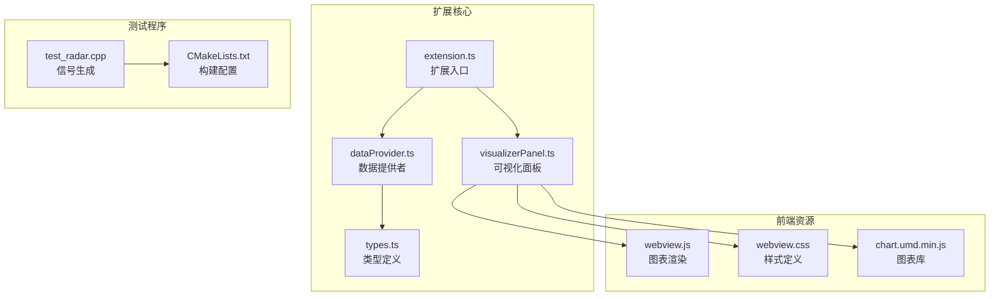
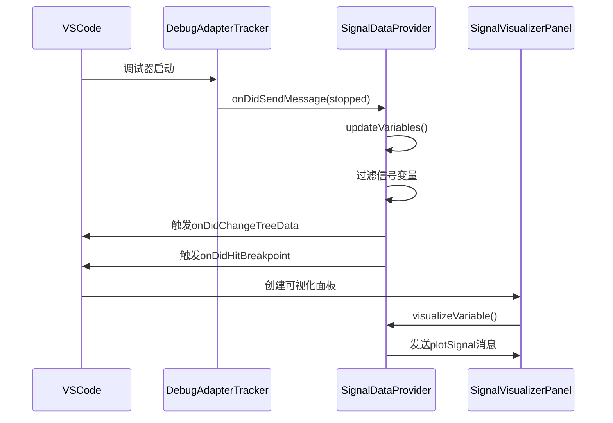

# 快速开始

<cite>
**本文档引用的文件**
- [package.json](file://package.json)
- [QUICKSTART.md](file://QUICKSTART.md)
- [src/extension.ts](file://src/extension.ts)
- [src/dataProvider.ts](file://src/dataProvider.ts)
- [src/visualizerPanel.ts](file://src/visualizerPanel.ts)
- [src/types.ts](file://src/types.ts)
- [src/dataProvider.ts](file://src/dataProvider.ts)
- [assets/webview.js](file://assets/webview.js)
- [test_radar.cpp](file://test_radar.cpp)
- [build.sh](file://build.sh)
- [CMakeLists.txt](file://CMakeLists.txt)
- [tsconfig.json](file://tsconfig.json)
</cite>

## 目录
1. [简介](#简介)
2. [项目结构](#项目结构)
3. [安装步骤](#安装步骤)
4. [配置说明](#配置说明)
5. [基本使用](#基本使用)
6. [开发环境搭建](#开发环境搭建)
7. [调试器配置](#调试器配置)
8. [常见使用场景](#常见使用场景)
9. [故障排除](#故障排除)
10. [性能考虑](#性能考虑)
11. [结论](#结论)

## 简介

Radar Signal Visualizer 是一个专为GPU调试设计的VSCode扩展，能够实时可视化雷达信号数据。该扩展通过与调试器的深度集成，自动捕获断点时的信号变量，并将其转换为直观的波形图，帮助开发者快速分析雷达信号处理过程中的数据特征。

该扩展的核心优势包括：
- **自动化断点检测**：自动捕获断点时的信号变量
- **实时波形可视化**：使用Chart.js渲染高质量波形图
- **智能数据过滤**：自动识别和筛选信号相关变量
- **丰富的统计信息**：提供最小值、最大值、平均值等关键指标
- **灵活的配置选项**：支持自定义变量匹配模式和显示行为

## 项目结构

该项目采用模块化架构设计，主要分为以下几个核心组件：



**图表来源**
- [src/extension.ts:1-200](file://src/extension.ts#L1-L200)
- [src/dataProvider.ts:1-703](file://src/dataProvider.ts#L1-L703)
- [src/visualizerPanel.ts:1-451](file://src/visualizerPanel.ts#L1-L451)

**章节来源**
- [package.json:1-102](file://package.json#L1-L102)
- [QUICKSTART.md:42-57](file://QUICKSTART.md#L42-L57)

## 安装步骤

### 系统要求
- VSCode 1.85.0 或更高版本
- Node.js 16.x 或更高版本
- CMake 3.10 或更高版本
- GDB 调试器支持

### 依赖安装

1. **克隆项目仓库**
```bash
git clone https://github.com/your-repo/radar-signal-visualizer.git
cd radar-signal-visualizer
```

2. **安装Node.js依赖**
```bash
npm install
```

3. **编译扩展**
```bash
npm run compile
```

4. **构建测试程序**
```bash
./build.sh
```

**章节来源**
- [QUICKSTART.md:3-16](file://QUICKSTART.md#L3-L16)
- [package.json:86-90](file://package.json#L86-L90)

## 配置说明

### 扩展配置选项

该扩展提供了三个主要的配置选项，可通过VSCode设置界面或settings.json文件进行配置：

| 配置项 | 类型 | 默认值 | 描述 |
|--------|------|--------|------|
| `rsv.autoDisplayOnBreakpoint` | boolean | true | 断点命中时自动显示可视化面板 |
| `rsv.signalNamePatterns` | array | ["*signal*", "*data*", "*pulse*", "*sample*"] | 识别信号变量的名称模式 |
| `rsv.maxArraySize` | number | 100000 | 自动可视化的最大数组大小 |

### 配置文件位置

配置文件位于以下位置：
- **用户设置**：`~/.config/Code/User/settings.json`
- **工作区设置**：项目根目录下的`.vscode/settings.json`

### 配置示例

```json
{
    "rsv.autoDisplayOnBreakpoint": true,
    "rsv.signalNamePatterns": ["*signal*", "*data*", "*pulse*", "*sample*", "*radar*"],
    "rsv.maxArraySize": 500000
}
```

**章节来源**
- [package.json:18-37](file://package.json#L18-L37)
- [src/dataProvider.ts:414-441](file://src/dataProvider.ts#L414-L441)

## 基本使用

### 启动调试会话

1. **打开测试程序**
   - 在VSCode中打开`test_radar.cpp`文件

2. **设置断点**
   - 在第46行（混合信号之后）设置断点

3. **启动GDB调试**
   - 按 `F5` 启动调试会话

4. **观察变量列表**
   - 程序在断点处暂停
   - 在左侧侧边栏找到 "Radar Signals" 图标并点击
   - 应该能看到 `pulse_data`, `noise_data`, `chirp_signal`, `mixed_signal` 等变量

5. **查看波形图**
   - 点击任意变量查看波形图
   - 图表显示信号的时域波形

### 手动刷新变量列表

当调试器未能正确捕获断点事件时，可以手动刷新变量列表：

1. 在 "Radar Signals" 视图中点击刷新按钮
2. 或者执行命令面板中的 "Refresh Signal Variables" 命令
3. 或者在扩展命令中选择 "rsv.refreshSignals"

### 右键菜单操作

在信号变量列表中，右键点击任意变量可以：
- 选择 "Visualize Signal" 查看波形图
- 查看变量的详细信息
- 执行其他上下文相关的操作

**章节来源**
- [QUICKSTART.md:18-30](file://QUICKSTART.md#L18-L30)
- [src/extension.ts:109-111](file://src/extension.ts#L109-L111)

## 开发环境搭建

### 开发工具要求

1. **VSCode扩展开发环境**
   - VSCode 1.85.0+
   - VSCode Extension Pack

2. **Node.js开发环境**
   - Node.js 16.x+
   - npm 8.x+

3. **TypeScript支持**
   - TypeScript 6.0+
   - esbuild 0.28+

### 开发环境配置

1. **安装开发依赖**
```bash
npm install
```

2. **启动开发模式**
   - 在VSCode中按 `F5` 启动调试
   - 会打开一个新的VSCode窗口（Extension Development Host）

3. **设置断点进行调试**
   - 在 `src/` 目录的TypeScript文件中设置断点
   - 在新窗口中触发扩展功能
   - 断点会在原窗口中触发

### 编译和打包

1. **开发编译**
```bash
npm run watch
```

2. **生产编译**
```bash
npm run compile
```

3. **发布准备**
```bash
npm run vscode:prepublish
```

**章节来源**
- [QUICKSTART.md:59-66](file://QUICKSTART.md#L59-L66)
- [package.json:86-90](file://package.json#L86-L90)

## 调试器配置

### 支持的调试器

该扩展与以下调试器兼容：
- **GDB**：GNU Debugger，支持C/C++调试
- **CUDA-GDB**：NVIDIA CUDA调试器
- **LLDB**：Apple LLVM Debugger

### 调试器设置

1. **GDB配置**
```json
{
    "version": "0.2.0",
    "configurations": [
        {
            "name": "Debug Radar Test",
            "type": "cppdbg",
            "request": "launch",
            "program": "${workspaceFolder}/build/test_radar",
            "args": [],
            "stopAtEntry": false,
            "cwd": "${workspaceFolder}",
            "environment": [],
            "externalConsole": false,
            "MIMode": "gdb",
            "miDebuggerPath": "/usr/bin/gdb",
            "setupCommands": [
                {
                    "description": "Enable pretty printing",
                    "text": "-enable-pretty-printing",
                    "ignoreFailures": true
                }
            ],
            "preLaunchTask": "build"
        }
    ]
}
```

2. **CUDA-GDB配置**
```json
{
    "version": "0.2.0",
    "configurations": [
        {
            "name": "Debug CUDA Radar",
            "type": "cuda-gdb",
            "request": "launch",
            "program": "${workspaceFolder}/build/test_radar",
            "args": [],
            "stopAtEntry": false,
            "cwd": "${workspaceFolder}",
            "environment": [],
            "externalConsole": false,
            "miDebuggerPath": "/usr/local/cuda/bin/cuda-gdb",
            "setupCommands": [
                {
                    "description": "Enable pretty printing",
                    "text": "-enable-pretty-printing",
                    "ignoreFailures": true
                }
            ]
        }
    ]
}
```

### 调试事件处理

扩展通过以下机制处理调试事件：



**图表来源**
- [src/dataProvider.ts:175-204](file://src/dataProvider.ts#L175-L204)
- [src/extension.ts:138-146](file://src/extension.ts#L138-L146)

**章节来源**
- [src/dataProvider.ts:138-204](file://src/dataProvider.ts#L138-L204)
- [src/extension.ts:159-187](file://src/extension.ts#L159-L187)

## 常见使用场景

### 场景1：雷达信号混合分析

1. **设置断点**
   - 在混合信号计算后的代码行设置断点

2. **分析混合信号**
   - 观察 `mixed_signal` 变量的波形
   - 对比 `pulse_data` 和 `noise_data` 的贡献

3. **参数调整验证**
   - 修改混合权重系数
   - 重新运行调试会话
   - 比较不同参数下的波形差异

### 场景2：噪声抑制效果评估

1. **生成噪声数据**
   - 使用 `generateNoiseSignal()` 函数创建噪声信号

2. **应用滤波算法**
   - 在滤波算法前后设置断点
   - 比较滤波前后的波形变化

3. **性能分析**
   - 观察滤波算法的执行时间和内存使用

### 场景3：脉冲压缩分析

1. **脉冲信号生成**
   - 使用 `generatePulseSignal()` 生成测试脉冲

2. **匹配滤波分析**
   - 在匹配滤波前后设置断点
   - 分析脉冲压缩的效果

3. **信噪比计算**
   - 结合统计信息面板分析信噪比改善

**章节来源**
- [test_radar.cpp:34-62](file://test_radar.cpp#L34-L62)
- [src/dataProvider.ts:414-441](file://src/dataProvider.ts#L414-L441)

## 故障排除

### 常见问题及解决方案

#### 问题1：侧边栏没有显示Radar Signals图标？

**可能原因**：
- 未在Extension Development Host窗口中
- 调试会话未启动
- 扩展未正确激活

**解决方法**：
1. 确保在Extension Development Host窗口中
2. 启动调试会话后再检查侧边栏
3. 重启VSCode扩展开发主机

#### 问题2：信号变量列表为空？

**可能原因**：
- 调试器未暂停
- 变量名不匹配配置模式
- 变量类型不符合要求

**解决方法**：
1. 确保调试器已经暂停
2. 检查变量名是否包含配置的模式（如signal、data、pulse、sample）
3. 确认变量是数组类型且包含数值数据

#### 问题3：图表不显示或显示异常？

**可能原因**：
- 变量数据格式不正确
- 数组大小超出限制
- Chart.js库加载失败

**解决方法**：
1. 检查变量数据是否为数值类型
2. 调整 `rsv.maxArraySize` 配置
3. 重新加载Webview面板

#### 问题4：断点命中但不自动显示面板？

**可能原因**：
- `autoDisplayOnBreakpoint` 配置为false
- 没有匹配到信号变量
- 调试会话状态异常

**解决方法**：
1. 检查 `rsv.autoDisplayOnBreakpoint` 配置
2. 确认变量列表中有信号变量
3. 重新启动调试会话

### 调试技巧

1. **启用详细日志**
   - 在扩展开发主机中查看输出面板
   - 关注Radar Signal Visualizer相关的日志信息

2. **检查变量过滤**
   - 确认变量名模式配置正确
   - 验证数组大小限制设置合理

3. **验证数据获取**
   - 检查DAP请求响应
   - 确认变量数据提取过程正常

**章节来源**
- [QUICKSTART.md:31-41](file://QUICKSTART.md#L31-L41)
- [src/dataProvider.ts:396-398](file://src/dataProvider.ts#L396-L398)

## 性能考虑

### 数据处理优化

1. **大数据集降采样**
   - 当数据点超过10000个时自动降采样
   - 保持波形趋势的同时提高渲染性能
   - 降采样算法：等间隔采样，保证最多10000个点

2. **内存管理**
   - 使用WeakMap避免内存泄漏
   - 及时清理事件监听器
   - 合理的资源释放策略

3. **渲染优化**
   - Chart.js配置优化：禁用点标记，使用直线连接
   - 动画效果适度：300ms过渡时间
   - 响应式布局：自动适应面板大小变化

### 配置建议

```json
{
    "rsv.autoDisplayOnBreakpoint": true,
    "rsv.signalNamePatterns": ["*signal*", "*data*", "*pulse*", "*sample*"],
    "rsv.maxArraySize": 100000
}
```

### 性能监控

1. **渲染时间监控**
   - 大数据集渲染时间：通常在100-500ms之间
   - 降采样后渲染时间：通常在50-200ms之间

2. **内存使用监控**
   - 单个信号变量内存占用：约2KB/样本
   - 面板内存占用：随数据集大小线性增长

**章节来源**
- [assets/webview.js:364-389](file://assets/webview.js#L364-L389)
- [src/visualizerPanel.ts:407-423](file://src/visualizerPanel.ts#L407-L423)

## 结论

Radar Signal Visualizer扩展为GPU调试提供了强大的信号可视化能力。通过自动化断点检测、智能变量过滤和高质量的波形渲染，开发者可以快速分析雷达信号处理过程中的数据特征。

### 主要优势

1. **自动化程度高**：自动捕获断点并显示相关变量
2. **可视化效果好**：使用Chart.js提供高质量波形图
3. **配置灵活**：支持自定义变量匹配模式和显示行为
4. **性能优化**：大数据集自动降采样，保证流畅体验
5. **易于使用**：直观的界面和简单的操作流程

### 适用场景

- **雷达信号处理**：分析脉冲压缩、匹配滤波等算法
- **信号质量评估**：噪声抑制、滤波效果分析
- **算法调试**：验证信号处理算法的正确性和性能
- **参数优化**：比较不同参数设置下的信号特征

### 未来发展方向

- 支持更多信号处理算法的专用视图
- 增加批量信号对比功能
- 提供更丰富的统计分析工具
- 支持自定义信号类型和显示样式

通过遵循本指南的步骤和最佳实践，新用户可以在最短时间内成功安装、配置并使用该扩展，充分发挥其在雷达信号调试中的价值。