# 技术架构

<cite>
**本文档引用的文件**
- [package.json](file://package.json)
- [extension.ts](file://src/extension.ts)
- [dataProvider.ts](file://src/dataProvider.ts)
- [visualizerPanel.ts](file://src/visualizerPanel.ts)
- [types.ts](file://src/types.ts)
- [webview.js](file://assets/webview.js)
- [webview.css](file://assets/webview.css)
- [test_radar.cpp](file://test_radar.cpp)
- [QUICKSTART.md](file://QUICKSTART.md)
- [CMakeLists.txt](file://CMakeLists.txt)
- [build.sh](file://build.sh)
</cite>

## 目录
1. [项目概述](#项目概述)
2. [系统架构总览](#系统架构总览)
3. [核心组件分析](#核心组件分析)
4. [VSCode 扩展框架集成](#vscode-扩展框架集成)
5. [Debug Adapter Protocol (DAP) 实现](#debug-adapter-protocol-dap-实现)
6. [Webview 技术应用](#webview-技术应用)
7. [数据流与事件驱动机制](#数据流与事件驱动机制)
8. [架构决策与权衡](#架构决策与权衡)
9. [安全性考虑](#安全性考虑)
10. [性能优化策略](#性能优化策略)
11. [可扩展性设计](#可扩展性设计)
12. [技术栈与依赖分析](#技术栈与依赖分析)
13. [系统上下文图](#系统上下文图)
14. [组件分解图](#组件分解图)
15. [结论](#结论)

## 项目概述

雷达信号可视化项目是一个专为 GPU 调试设计的 VSCode 扩展，旨在帮助开发者在调试过程中实时可视化雷达信号数据。该项目通过集成 VSCode 扩展框架、Debug Adapter Protocol (DAP) 和 Webview 技术，实现了从调试器获取信号变量、过滤筛选、数据提取到图表可视化的完整工作流。

项目的核心价值在于：
- **实时调试可视化**：在断点命中时自动展示雷达信号波形
- **GPU 调试支持**：专门针对 CUDA-GDB 等 GPU 调试器优化
- **智能变量识别**：基于名称模式自动识别信号相关变量
- **高性能渲染**：针对大数据集的降采样和优化渲染策略

## 系统架构总览

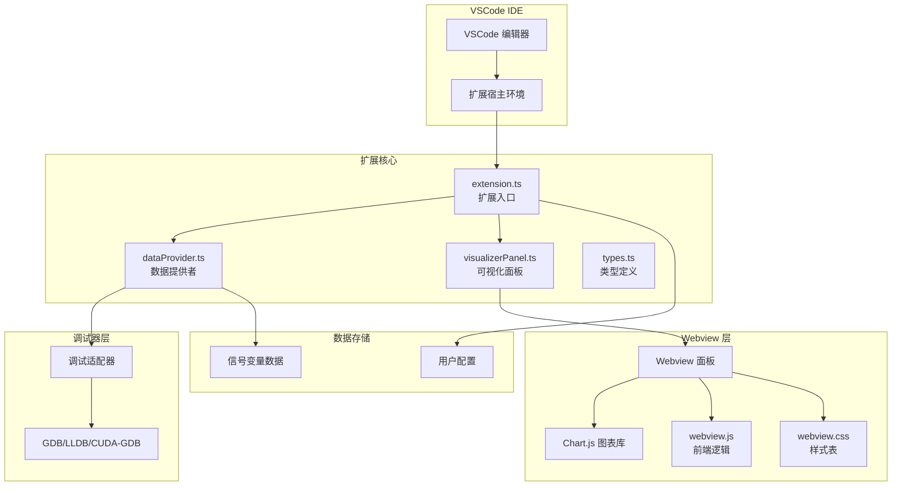

**图表来源**
- [extension.ts:46-188](file://src/extension.ts#L46-L188)
- [dataProvider.ts:56-205](file://src/dataProvider.ts#L56-L205)
- [visualizerPanel.ts:44-164](file://src/visualizerPanel.ts#L44-L164)

## 核心组件分析

### 扩展入口组件 (extension.ts)

扩展入口文件是整个系统的协调中心，负责初始化和管理所有核心组件。其主要职责包括：

- **组件初始化**：创建并配置数据提供者和可视化面板
- **命令注册**：注册所有用户可操作的命令（打开面板、可视化变量、刷新列表）
- **事件监听**：监听调试会话状态变化和断点命中事件
- **生命周期管理**：确保所有资源在扩展停用时正确释放

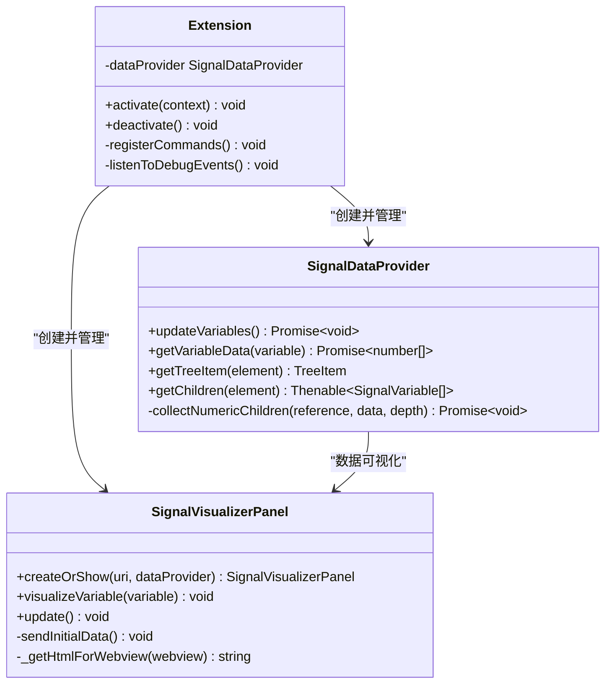

**图表来源**
- [extension.ts:46-188](file://src/extension.ts#L46-L188)
- [dataProvider.ts:56-703](file://src/dataProvider.ts#L56-L703)
- [visualizerPanel.ts:44-451](file://src/visualizerPanel.ts#L44-L451)

**章节来源**
- [extension.ts:46-188](file://src/extension.ts#L46-L188)

### 数据提供者组件 (dataProvider.ts)

数据提供者是系统的核心大脑，负责与调试器交互并提取变量数据。其架构特点包括：

- **TreeDataProvider 接口实现**：为 VSCode 树视图提供数据源
- **DAP 协议实现**：直接与调试器通信获取变量信息
- **智能过滤机制**：基于配置自动识别信号相关变量
- **事件驱动架构**：通过自定义事件通知 UI 更新

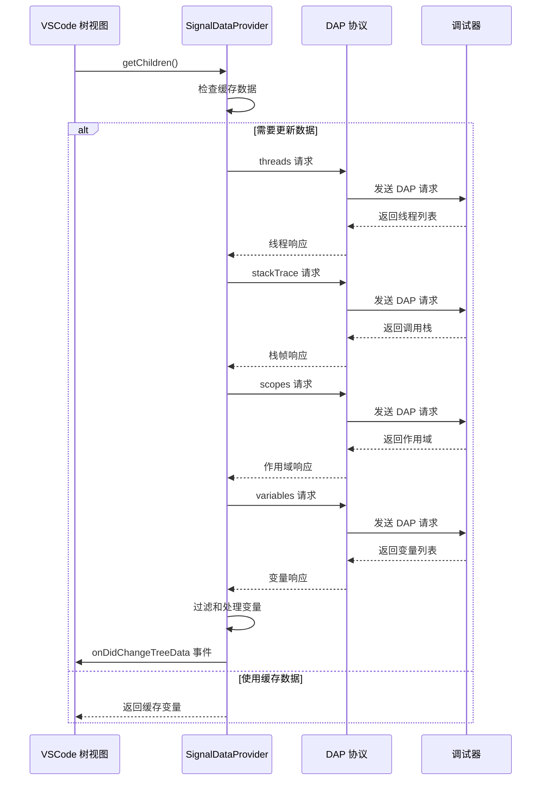

**图表来源**
- [dataProvider.ts:243-399](file://src/dataProvider.ts#L243-L399)

**章节来源**
- [dataProvider.ts:56-703](file://src/dataProvider.ts#L56-L703)

### 可视化面板组件 (visualizerPanel.ts)

可视化面板采用单例模式管理 Webview 面板，提供完整的信号可视化功能：

- **单例模式实现**：确保同一时间只有一个可视化面板
- **Webview 安全机制**：实现 CSP 和 nonce 保护
- **双向通信**：通过 postMessage 实现扩展与 Webview 的数据交换
- **Chart.js 集成**：提供高性能的信号波形渲染

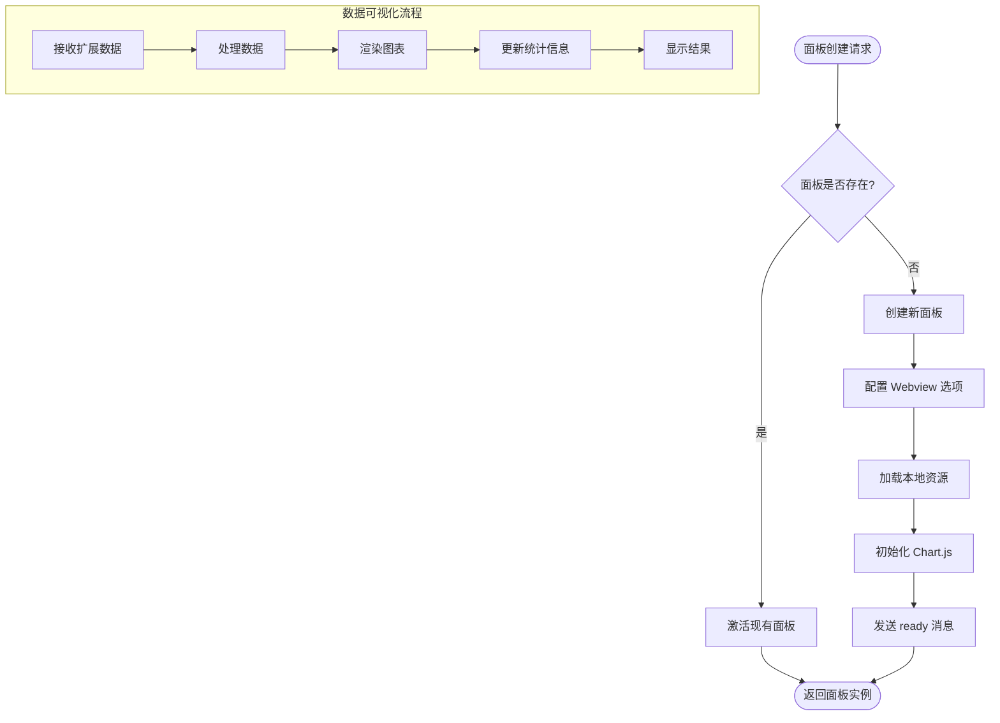

**图表来源**
- [visualizerPanel.ts:102-164](file://src/visualizerPanel.ts#L102-L164)
- [webview.js:50-96](file://assets/webview.js#L50-L96)

**章节来源**
- [visualizerPanel.ts:44-451](file://src/visualizerPanel.ts#L44-L451)

## VSCode 扩展框架集成

### 扩展生命周期管理

VSCode 扩展遵循严格的生命周期管理模式，确保资源的有效管理和释放：

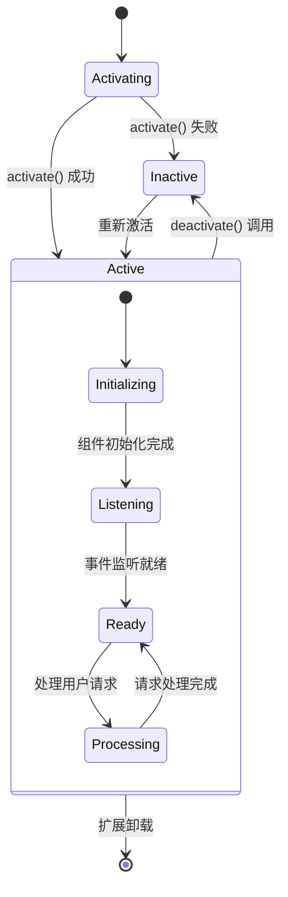

**图表来源**
- [extension.ts:46-188](file://src/extension.ts#L46-L188)

### 命令系统集成

扩展通过 VSCode 的命令系统提供用户交互接口：

- **命令注册**：在 package.json 中定义命令元数据
- **命令执行**：通过 registerCommand() 注册回调函数
- **菜单集成**：通过 package.json 的 menus 字段集成到 VSCode UI
- **快捷键支持**：支持键盘快捷键和命令面板访问

**章节来源**
- [package.json:55-84](file://package.json#L55-L84)
- [extension.ts:78-124](file://src/extension.ts#L78-L124)

## Debug Adapter Protocol (DAP) 实现

### DAP 协议架构

项目实现了完整的 DAP 四级请求链，确保与各种调试器的兼容性：

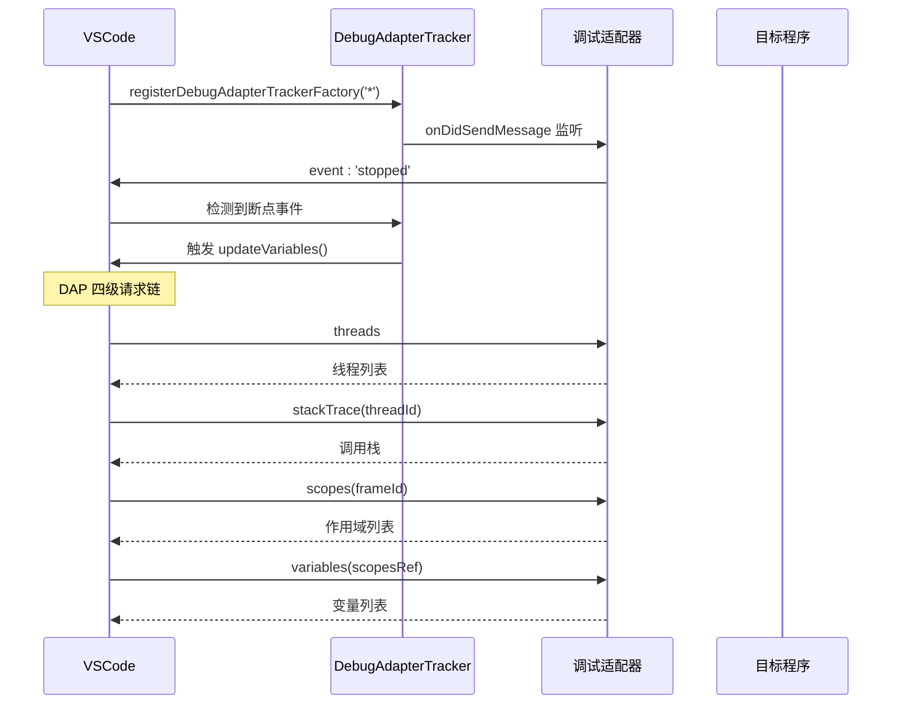

**图表来源**
- [dataProvider.ts:175-204](file://src/dataProvider.ts#L175-L204)
- [dataProvider.ts:259-369](file://src/dataProvider.ts#L259-L369)

### 变量数据提取机制

系统实现了复杂的变量数据提取算法，能够处理各种 C++ 容器类型：

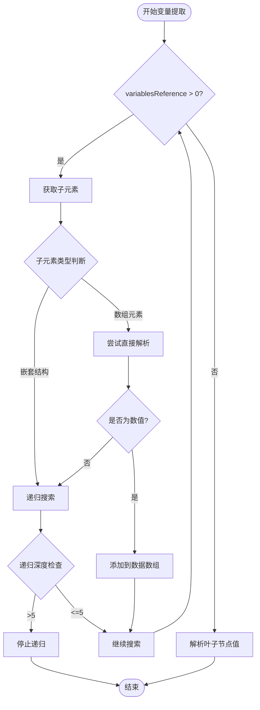

**图表来源**
- [dataProvider.ts:563-634](file://src/dataProvider.ts#L563-L634)

**章节来源**
- [dataProvider.ts:243-399](file://src/dataProvider.ts#L243-L399)

## Webview 技术应用

### Webview 安全架构

Webview 实现了严格的安全机制，确保与 VSCode 主进程的隔离：

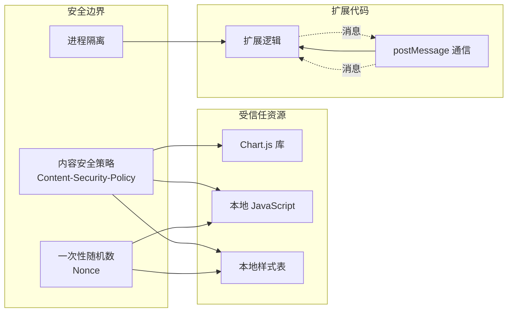

**图表来源**
- [visualizerPanel.ts:317-392](file://src/visualizerPanel.ts#L317-L392)
- [webview.js:50-96](file://assets/webview.js#L50-L96)

### 图表渲染优化

Webview 实现了针对大数据集的渲染优化策略：

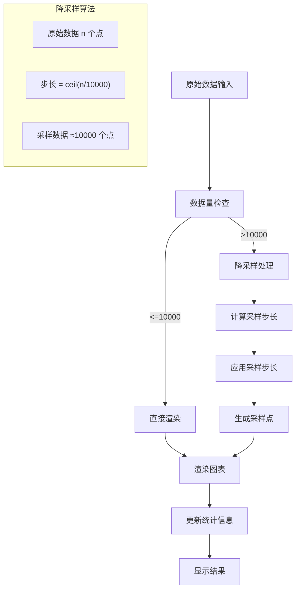

**图表来源**
- [webview.js:380-419](file://assets/webview.js#L380-L419)

**章节来源**
- [visualizerPanel.ts:282-392](file://src/visualizerPanel.ts#L282-L392)
- [webview.js:355-494](file://assets/webview.js#L355-L494)

## 数据流与事件驱动机制

### 事件驱动架构

系统采用事件驱动的设计模式，实现了松耦合的组件通信：

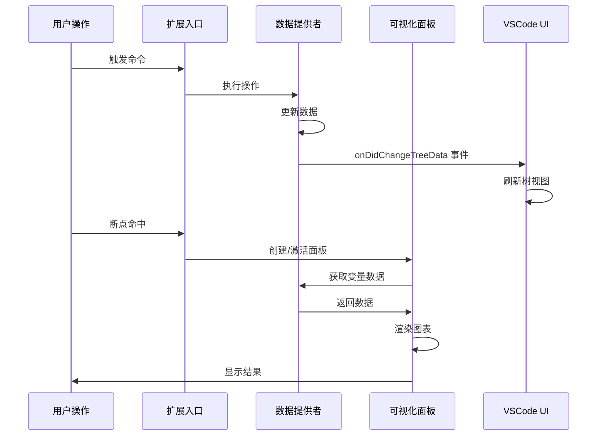

**图表来源**
- [extension.ts:139-146](file://src/extension.ts#L139-L146)
- [dataProvider.ts:73-94](file://src/dataProvider.ts#L73-L94)

### 数据流管道

系统实现了完整的数据处理管道，从调试器到可视化显示：

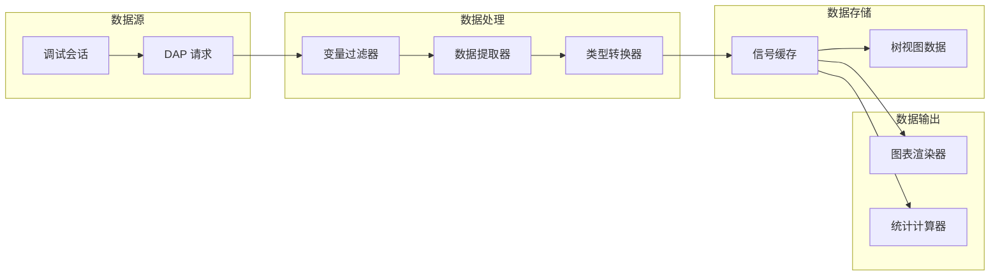

**图表来源**
- [dataProvider.ts:414-441](file://src/dataProvider.ts#L414-L441)
- [webview.js:456-493](file://assets/webview.js#L456-L493)

**章节来源**
- [extension.ts:139-187](file://src/extension.ts#L139-L187)
- [dataProvider.ts:414-634](file://src/dataProvider.ts#L414-L634)

## 架构决策与权衡

### 技术架构决策

项目在设计时采用了多项关键架构决策：

1. **单例模式的选择**：可视化面板采用单例模式，避免重复创建导致的资源浪费
2. **事件驱动架构**：通过自定义事件实现组件间的松耦合通信
3. **DAP 协议直接实现**：绕过 VSCode 标准 UI 流程，直接获取原始变量数据
4. **Webview 安全机制**：实现 CSP 和 nonce 保护，确保安全隔离

### 性能权衡

系统在性能方面做出了多项权衡：

- **内存 vs CPU**：使用 retainContextWhenHidden 选项在内存占用和性能之间取得平衡
- **精度 vs 速度**：大数据集降采样在显示精度和渲染速度之间找到平衡点
- **功能完整性 vs 复杂度**：简化变量提取逻辑，专注于核心信号可视化需求

### 兼容性考虑

项目在兼容性方面采取了多项措施：

- **多调试器支持**：通过 DebugAdapterTrackerFactory 支持所有类型的调试器
- **多平台兼容**：使用 VSCode 提供的跨平台 API
- **版本向前兼容**：遵循 VSCode 扩展 API 的演进趋势

## 安全性考虑

### Webview 安全机制

系统实现了多层次的安全防护机制：

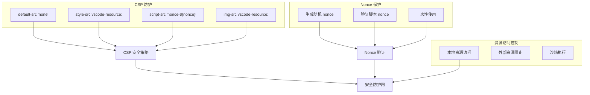

**图表来源**
- [visualizerPanel.ts:357-358](file://src/visualizerPanel.ts#L357-L358)
- [visualizerPanel.ts:443-450](file://src/visualizerPanel.ts#L443-L450)

### 数据安全策略

系统在数据处理方面实施了多项安全策略：

- **数据过滤**：通过配置项过滤无关变量，减少数据泄露风险
- **内存管理**：及时释放不再使用的数据，防止内存泄漏
- **错误处理**：完善的异常处理机制，避免敏感信息泄露

**章节来源**
- [visualizerPanel.ts:317-392](file://src/visualizerPanel.ts#L317-L392)
- [webview.js:355-419](file://assets/webview.js#L355-L419)

## 性能优化策略

### 渲染性能优化

系统实现了多项渲染性能优化策略：

1. **大数据集降采样**：超过 10,000 个点时自动降采样，保证渲染流畅性
2. **增量更新**：只更新发生变化的数据，避免全量重绘
3. **内存缓存**：缓存已处理的数据，避免重复计算

### 网络通信优化

DAP 通信层面的优化包括：

- **批量请求**：合理组织 DAP 请求顺序，减少往返次数
- **数据缓存**：缓存调试器响应，避免重复查询
- **异步处理**：使用 Promise 和 async/await 实现非阻塞操作

### 资源管理优化

系统在资源管理方面采取了多项优化措施：

- **Disposable 模式**：确保所有可释放资源得到正确管理
- **事件监听清理**：及时移除不再需要的事件监听器
- **Webview 生命周期管理**：合理管理 Webview 的创建和销毁

## 可扩展性设计

### 模块化架构

系统采用高度模块化的架构设计，便于功能扩展：

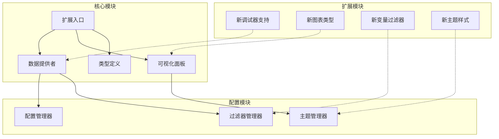

### 插件化设计

系统支持多种插件化扩展：

- **调试器插件**：支持新的调试器类型
- **图表插件**：支持不同的图表渲染引擎
- **过滤器插件**：支持自定义变量过滤规则
- **主题插件**：支持自定义视觉样式

## 技术栈与依赖分析

### 核心技术栈

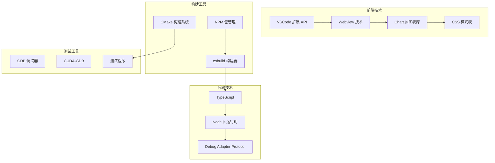

**图表来源**
- [package.json:98-100](file://package.json#L98-L100)
- [package.json:86-90](file://package.json#L86-L90)

### 第三方依赖

项目的主要第三方依赖包括：

- **Chart.js (^4.5.1)**：高性能的 JavaScript 图表库
- **@types/chart.js (^2.9.41)**：Chart.js 的 TypeScript 类型定义
- **@types/node (^25.6.0)**：Node.js 的 TypeScript 类型定义
- **@types/vscode (^1.116.0)**：VSCode 扩展 API 的 TypeScript 类型定义
- **esbuild (^0.28.0)**：快速的 JavaScript 构建工具
- **typescript (^6.0.3)**：TypeScript 编译器

### 版本兼容性

系统在版本兼容性方面考虑周全：

- **VSCode 版本**：支持 VSCode 1.85.0 及以上版本
- **Node.js 版本**：兼容现代 Node.js 运行时
- **TypeScript 版本**：使用稳定版本确保编译兼容性
- **Chart.js 版本**：选择经过验证的稳定版本

**章节来源**
- [package.json:7-100](file://package.json#L7-L100)

## 系统上下文图

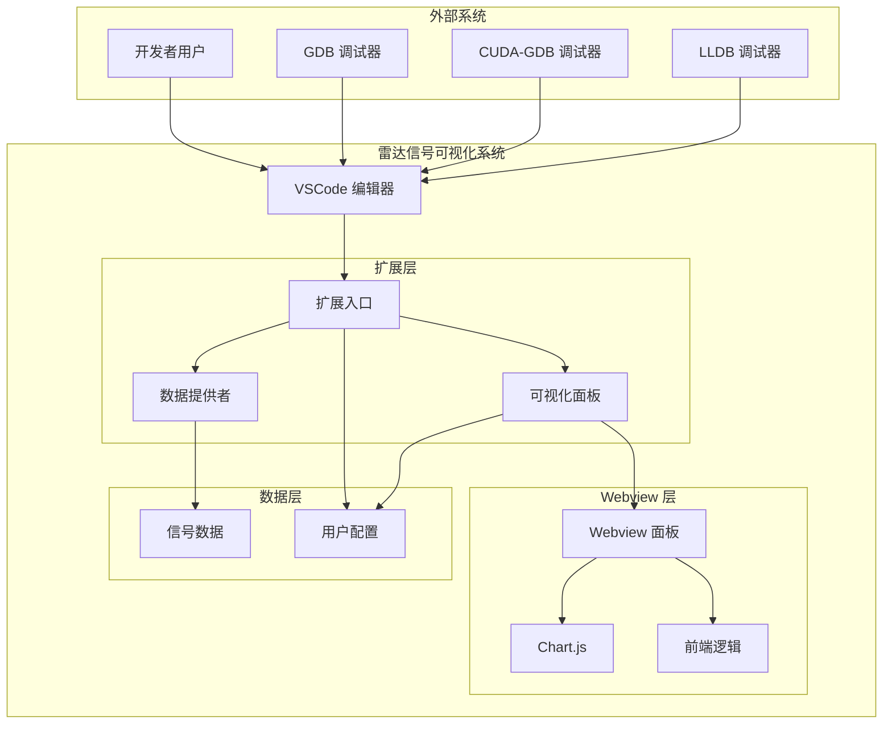

**图表来源**
- [extension.ts:46-188](file://src/extension.ts#L46-L188)
- [visualizerPanel.ts:142-153](file://src/visualizerPanel.ts#L142-L153)

## 组件分解图

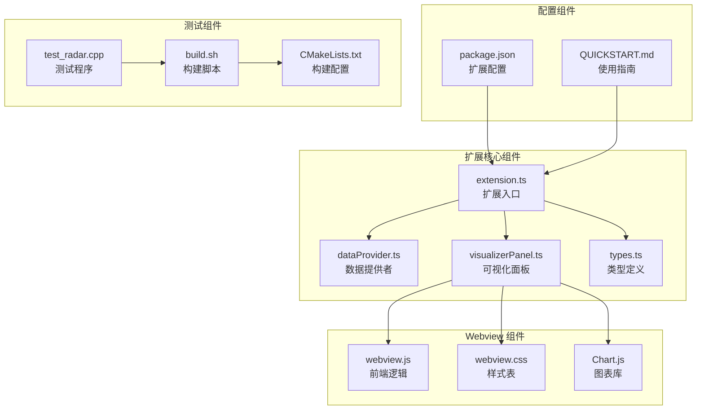

**图表来源**
- [extension.ts:27-29](file://src/extension.ts#L27-L29)
- [visualizerPanel.ts:28-30](file://src/visualizerPanel.ts#L28-L30)

## 结论

雷达信号可视化项目展现了现代 VSCode 扩展开发的最佳实践。通过精心设计的架构，项目成功地将调试器数据提取、智能变量识别、高性能可视化渲染等功能整合在一起，为 GPU 调试提供了强大的支持。

### 主要成就

1. **架构完整性**：实现了从调试器到可视化的完整数据流
2. **性能优化**：针对大数据集的渲染优化确保了良好的用户体验
3. **安全性保障**：严格的 Webview 安全机制保护了系统安全
4. **可扩展性**：模块化设计为未来功能扩展奠定了基础

### 技术亮点

- **DAP 协议直接实现**：绕过 VSCode 标准 UI 流程，直接获取原始变量数据
- **事件驱动架构**：通过自定义事件实现松耦合的组件通信
- **Webview 安全机制**：实现 CSP 和 nonce 保护，确保安全隔离
- **智能变量识别**：基于配置的变量过滤机制提高了实用性

### 未来发展方向

项目为未来的扩展提供了清晰的方向：
- 支持更多类型的调试器和信号格式
- 增强图表渲染能力，支持更多图表类型
- 扩展数据分析功能，提供更丰富的统计信息
- 改进用户界面，提供更好的交互体验

这个项目不仅是一个功能完整的工具，更是 VSCode 扩展开发的优秀范例，展示了如何在复杂的技术环境中实现优雅的解决方案。