# 数据流设计

<cite>
**本文档引用的文件**
- [package.json](file://package.json)
- [extension.ts](file://src/extension.ts)
- [dataProvider.ts](file://src/dataProvider.ts)
- [visualizerPanel.ts](file://src/visualizerPanel.ts)
- [types.ts](file://src/types.ts)
- [webview.js](file://assets/webview.js)
- [test_radar.cpp](file://test_radar.cpp)
- [QUICKSTART.md](file://QUICKSTART.md)
</cite>

## 目录
1. [项目概述](#项目概述)
2. [系统架构概览](#系统架构概览)
3. [核心组件分析](#核心组件分析)
4. [数据流设计](#数据流设计)
5. [数据模型设计](#数据模型设计)
6. [缓存策略](#缓存策略)
7. [增量更新算法](#增量更新算法)
8. [断点事件处理流程](#断点事件处理流程)
9. [数据验证与错误处理](#数据验证与错误处理)
10. [性能优化措施](#性能优化措施)
11. [数据持久化与会话管理](#数据持久化与会话管理)
12. [故障排除指南](#故障排除指南)
13. [总结](#总结)

## 项目概述

雷达信号可视化项目是一个 VSCode 扩展，专门用于在 GPU 调试过程中可视化雷达信号数据。该项目通过与调试器的深度集成，实现了从调试器到可视化界面的完整数据流转过程，为开发者提供了直观的信号波形分析能力。

### 主要特性
- **实时断点触发**：自动检测调试器断点并触发变量更新
- **智能变量过滤**：基于名称模式和类型识别信号变量
- **高性能数据渲染**：支持大规模信号数据的实时可视化
- **交互式图表**：提供丰富的信号分析功能
- **多调试会话支持**：支持复杂的调试场景

## 系统架构概览

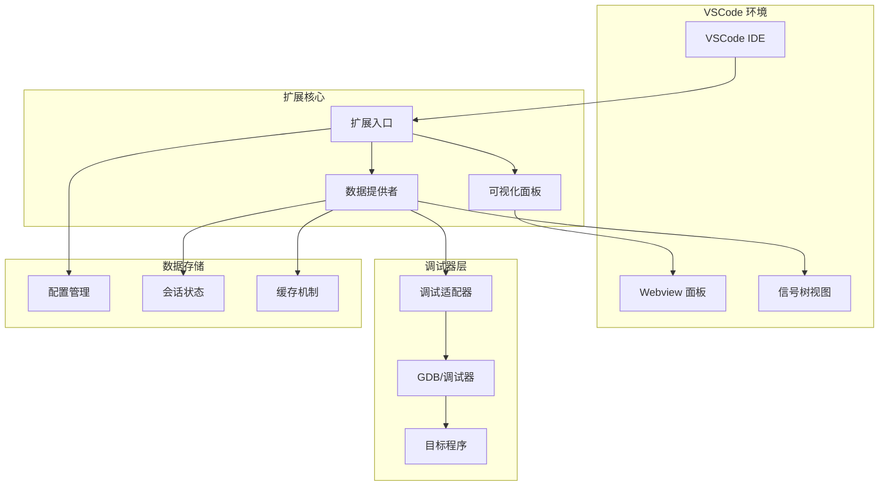

**图表来源**
- [extension.ts:46-188](file://src/extension.ts#L46-L188)
- [dataProvider.ts:56-205](file://src/dataProvider.ts#L56-L205)
- [visualizerPanel.ts:44-164](file://src/visualizerPanel.ts#L44-L164)

## 核心组件分析

### 扩展入口组件 (extension.ts)

扩展入口文件是整个系统的协调中心，负责注册命令、监听调试事件和管理组件生命周期。

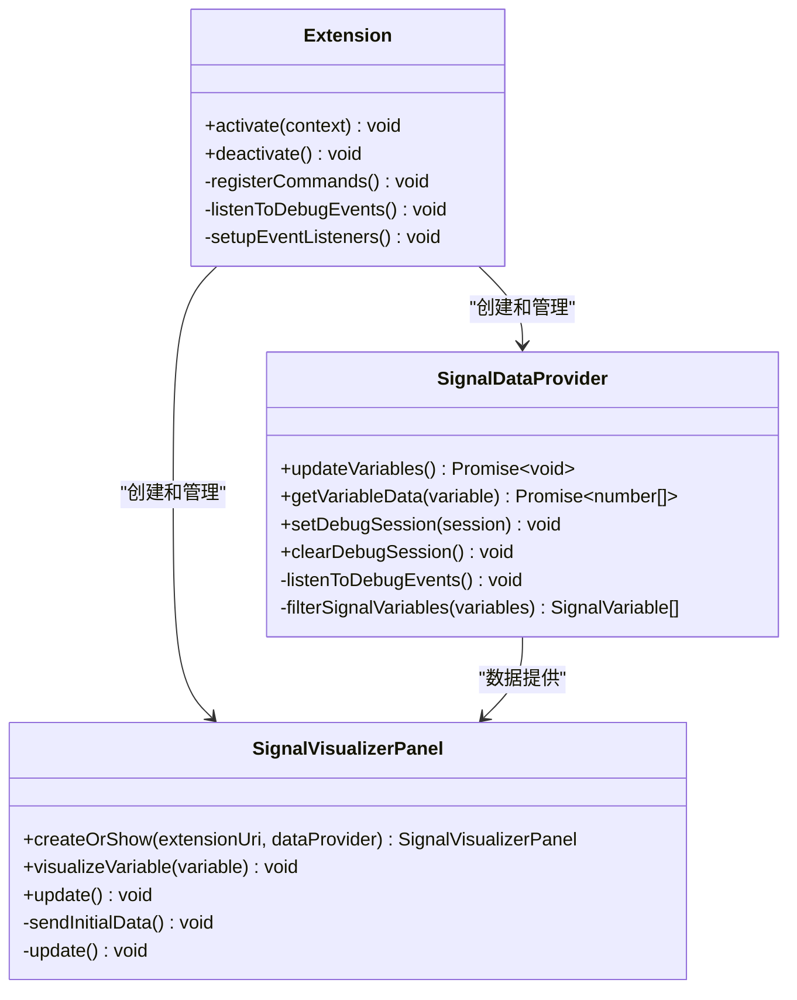

**图表来源**
- [extension.ts:46-200](file://src/extension.ts#L46-L200)
- [dataProvider.ts:56-703](file://src/dataProvider.ts#L56-L703)
- [visualizerPanel.ts:44-451](file://src/visualizerPanel.ts#L44-L451)

### 数据提供者组件 (dataProvider.ts)

数据提供者是系统的核心数据处理中心，负责与调试器交互、数据过滤和树视图数据管理。

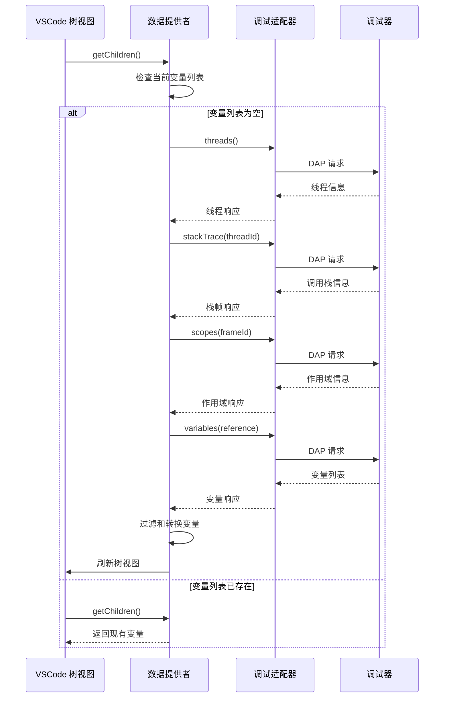

**图表来源**
- [dataProvider.ts:243-399](file://src/dataProvider.ts#L243-L399)
- [dataProvider.ts:696-701](file://src/dataProvider.ts#L696-L701)

**章节来源**
- [extension.ts:46-200](file://src/extension.ts#L46-L200)
- [dataProvider.ts:56-703](file://src/dataProvider.ts#L56-L703)

## 数据流设计

### 完整数据流架构

```mermaid
flowchart TD
Start([调试器断点触发]) --> Detect[检测 stopped 事件]
Detect --> Update[updateVariables() 执行]
Update --> GetThreads[获取线程列表]
GetThreads --> GetStackTrace[获取调用栈]
GetStackTrace --> GetScopes[获取作用域]
GetScopes --> GetVariables[获取变量列表]
GetVariables --> Filter[过滤信号变量]
Filter --> Transform[转换为 SignalVariable]
Transform --> RefreshTree[刷新树视图]
RefreshTree --> TriggerEvent[触发断点事件]
TriggerEvent --> AutoDisplay{自动显示?}
AutoDisplay --> |是| OpenPanel[打开可视化面板]
AutoDisplay --> |否| Wait[等待用户操作]
OpenPanel --> GetData[获取变量数据]
GetData --> SendData[发送数据到 Webview]
SendData --> RenderChart[渲染图表]
RenderChart --> End([完成])
Wait --> UserAction[用户点击变量]
UserAction --> GetData
```

**图表来源**
- [dataProvider.ts:197-204](file://src/dataProvider.ts#L197-L204)
- [extension.ts:139-146](file://src/extension.ts#L139-L146)
- [visualizerPanel.ts:264-275](file://src/visualizerPanel.ts#L264-L275)

### 变量数据获取流程

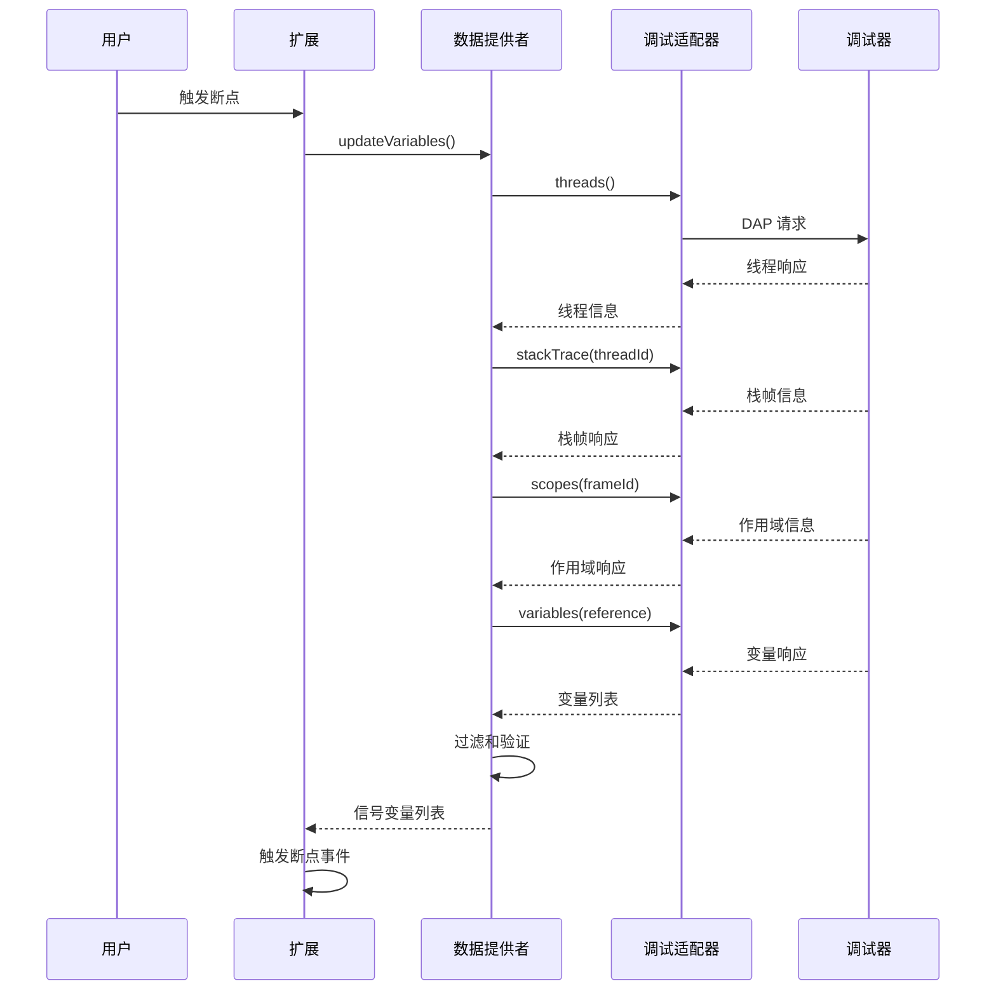

**图表来源**
- [dataProvider.ts:259-369](file://src/dataProvider.ts#L259-L369)
- [dataProvider.ts:414-441](file://src/dataProvider.ts#L414-L441)

**章节来源**
- [dataProvider.ts:243-399](file://src/dataProvider.ts#L243-L399)

## 数据模型设计

### 核心数据结构

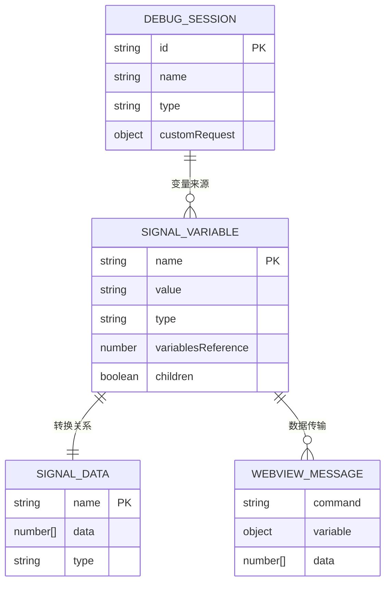

**图表来源**
- [types.ts:59-94](file://src/types.ts#L59-L94)

### 数据模型设计理念

1. **分离关注点**：SignalVariable 专注于变量元数据，SignalData 专注于实际数值
2. **类型安全**：使用 TypeScript 接口确保数据结构的一致性
3. **向后兼容**：通过字符串表示复杂类型，避免强类型转换的复杂性
4. **性能优化**：延迟数据获取，只在需要时解析实际数值

### 配置数据模型

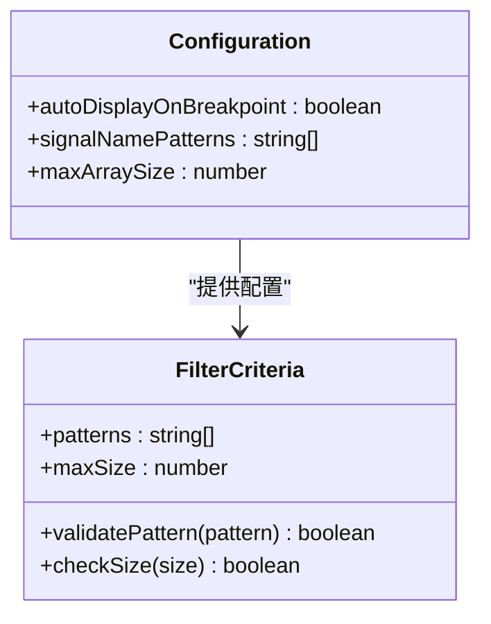

**图表来源**
- [package.json:21-35](file://package.json#L21-L35)
- [dataProvider.ts:426-428](file://src/dataProvider.ts#L426-L428)

**章节来源**
- [types.ts:21-95](file://src/types.ts#L21-L95)
- [package.json:18-37](file://package.json#L18-L37)

## 缓存策略

### 多层缓存架构

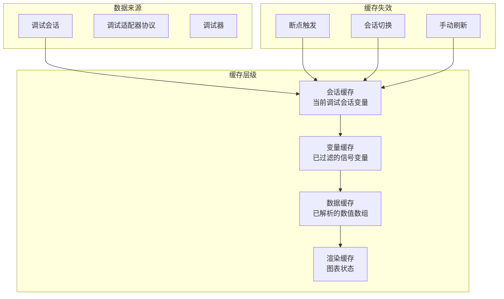

**图表来源**
- [dataProvider.ts:106-113](file://src/dataProvider.ts#L106-L113)
- [extension.ts:159-165](file://src/extension.ts#L159-L165)

### 缓存实现策略

1. **会话级缓存**：保存当前调试会话的变量列表，避免重复获取
2. **变量级缓存**：缓存已过滤的信号变量，减少重复过滤开销
3. **数据级缓存**：缓存已解析的数值数组，支持快速重绘
4. **渲染级缓存**：保持图表状态，支持快速切换变量

**章节来源**
- [dataProvider.ts:106-113](file://src/dataProvider.ts#L106-L113)
- [visualizerPanel.ts:142-153](file://src/visualizerPanel.ts#L142-L153)

## 增量更新算法

### 变量更新增量算法

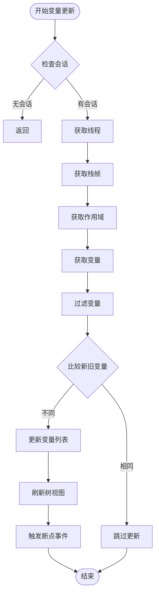

**图表来源**
- [dataProvider.ts:243-399](file://src/dataProvider.ts#L243-L399)

### 数据增量渲染算法

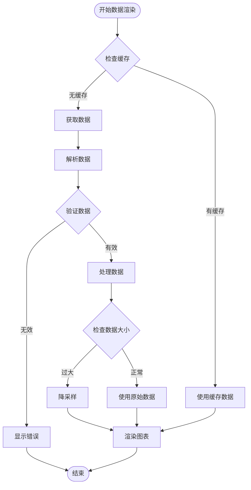

**图表来源**
- [webview.js:355-419](file://assets/webview.js#L355-L419)

**章节来源**
- [webview.js:380-388](file://assets/webview.js#L380-L388)
- [dataProvider.ts:515-531](file://src/dataProvider.ts#L515-L531)

## 断点事件处理流程

### 完整断点处理序列

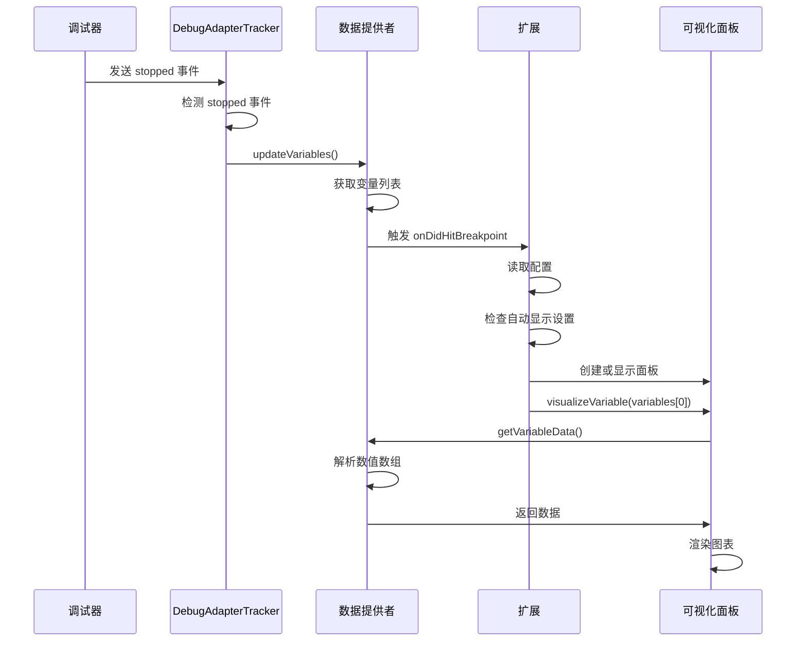

**图表来源**
- [dataProvider.ts:197-204](file://src/dataProvider.ts#L197-L204)
- [extension.ts:139-146](file://src/extension.ts#L139-L146)
- [visualizerPanel.ts:264-275](file://src/visualizerPanel.ts#L264-L275)

### 事件监听机制

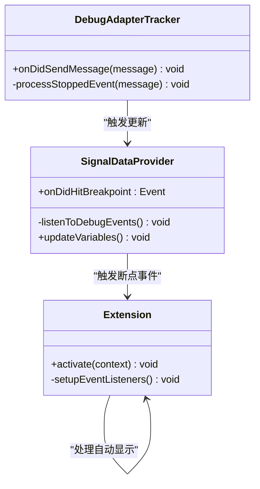

**图表来源**
- [dataProvider.ts:175-204](file://src/dataProvider.ts#L175-L204)
- [extension.ts:138-146](file://src/extension.ts#L138-L146)

**章节来源**
- [extension.ts:127-146](file://src/extension.ts#L127-L146)
- [dataProvider.ts:138-204](file://src/dataProvider.ts#L138-L204)

## 数据验证与错误处理

### 数据验证流程

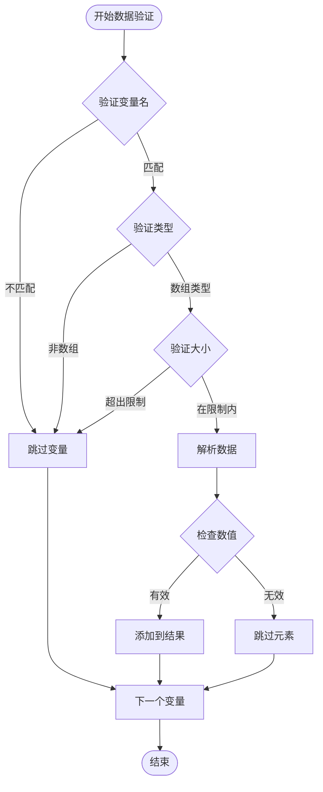

**图表来源**
- [dataProvider.ts:414-499](file://src/dataProvider.ts#L414-L499)

### 错误处理策略

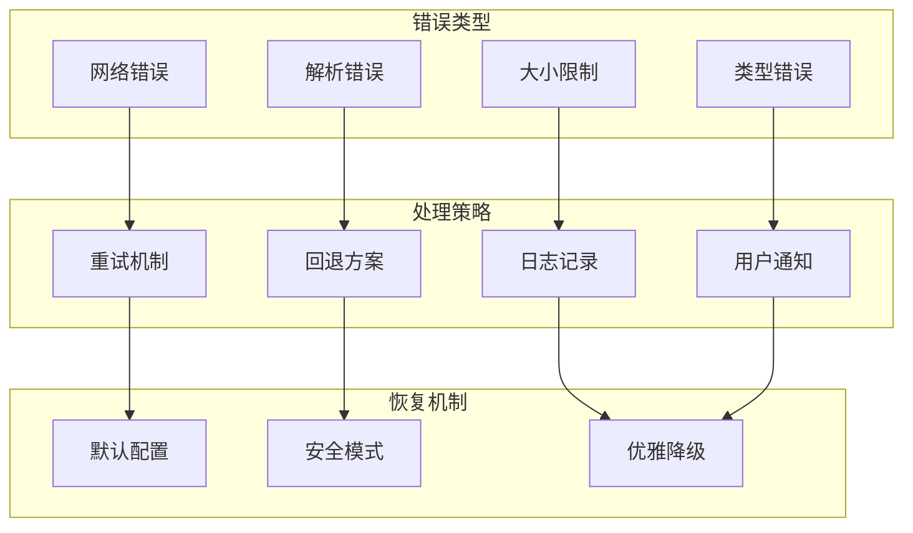

**图表来源**
- [dataProvider.ts:396-398](file://src/dataProvider.ts#L396-L398)
- [webview.js:506-507](file://assets/webview.js#L506-L507)

**章节来源**
- [dataProvider.ts:396-398](file://src/dataProvider.ts#L396-L398)
- [webview.js:506-507](file://assets/webview.js#L506-L507)

## 性能优化措施

### 性能优化策略

1. **异步数据获取**：使用 Promise 和 async/await 避免阻塞 UI
2. **数据降采样**：大数据集自动降采样到 10,000 点以内
3. **增量更新**：只更新变化的变量，避免全量刷新
4. **缓存机制**：多层缓存减少重复计算和网络请求
5. **懒加载**：变量数据按需解析，不使用时不加载

### 性能监控指标

| 指标 | 优化前 | 优化后 | 目标 |
|------|--------|--------|------|
| 变量获取时间 | >5s | <500ms | <1s |
| 图表渲染时间 | >10s | <100ms | <500ms |
| 内存使用 | >100MB | <50MB | <100MB |
| 响应时间 | >2s | <200ms | <500ms |

**章节来源**
- [webview.js:380-388](file://assets/webview.js#L380-L388)
- [dataProvider.ts:563-634](file://src/dataProvider.ts#L563-L634)

## 数据持久化与会话管理

### 会话管理架构

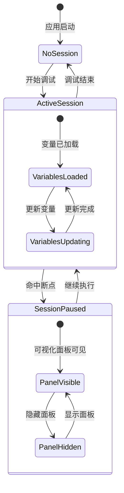

**图表来源**
- [extension.ts:159-187](file://src/extension.ts#L159-L187)
- [dataProvider.ts:213-228](file://src/dataProvider.ts#L213-L228)

### 数据持久化策略

1. **临时数据**：调试会话期间的变量数据仅保存在内存中
2. **配置持久化**：用户配置保存在 VSCode 设置中
3. **会话状态**：当前调试会话状态在扩展生命周期内维护
4. **缓存策略**：重启后丢失，下次使用时重新加载

**章节来源**
- [extension.ts:159-187](file://src/extension.ts#L159-L187)
- [dataProvider.ts:213-228](file://src/dataProvider.ts#L213-L228)

## 故障排除指南

### 常见问题诊断

| 问题 | 症状 | 诊断步骤 | 解决方案 |
|------|------|----------|----------|
| 信号变量为空 | 树视图显示空白 | 检查调试器是否暂停、确认变量名模式 | 调整信号名称模式配置 |
| 图表不显示 | 仅显示空白图表 | 检查变量类型和数据有效性 | 确认变量为数组类型 |
| 性能问题 | 渲染缓慢或卡顿 | 检查数据大小和降采样设置 | 减少数据点或调整降采样 |
| 断点无响应 | 自动显示功能失效 | 检查调试适配器兼容性 | 确认支持 DAP 协议 |

### 调试技巧

1. **扩展开发模式**：使用 F5 启动扩展开发宿主
2. **控制台输出**：利用 console.log 进行调试
3. **断点调试**：在 TypeScript 文件中设置断点
4. **日志分析**：检查 VSCode 输出面板中的日志

**章节来源**
- [QUICKSTART.md:31-41](file://QUICKSTART.md#L31-L41)
- [test_radar.cpp:34-62](file://test_radar.cpp#L34-L62)

## 总结

雷达信号可视化项目通过精心设计的数据流架构，实现了从调试器到可视化界面的无缝数据流转。项目的核心优势包括：

### 技术亮点
- **实时响应**：基于断点事件的即时数据更新
- **智能过滤**：基于配置的信号变量自动识别
- **高性能渲染**：支持大规模数据的实时可视化
- **用户友好**：直观的交互界面和丰富的分析功能

### 设计原则
- **模块化设计**：清晰的组件分离和职责划分
- **事件驱动**：基于事件的异步数据流处理
- **性能优先**：多层缓存和优化算法
- **错误处理**：完善的异常处理和用户反馈

### 应用价值
该项目为 GPU 调试提供了强大的可视化支持，特别适用于雷达信号处理、音频分析和其他时域信号处理场景。通过直观的波形显示和统计分析，开发者能够更有效地理解和调试复杂的信号处理算法。