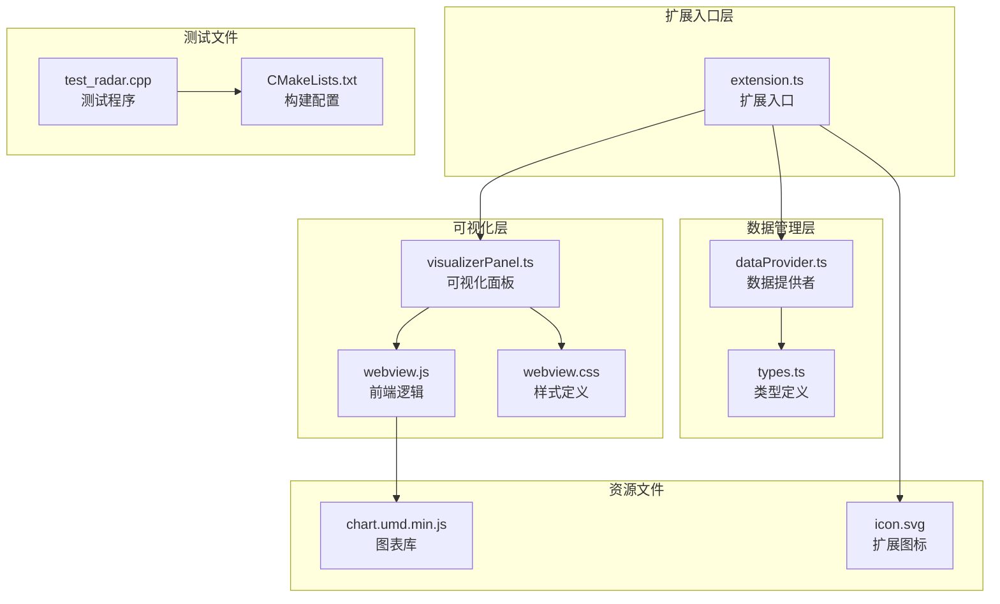
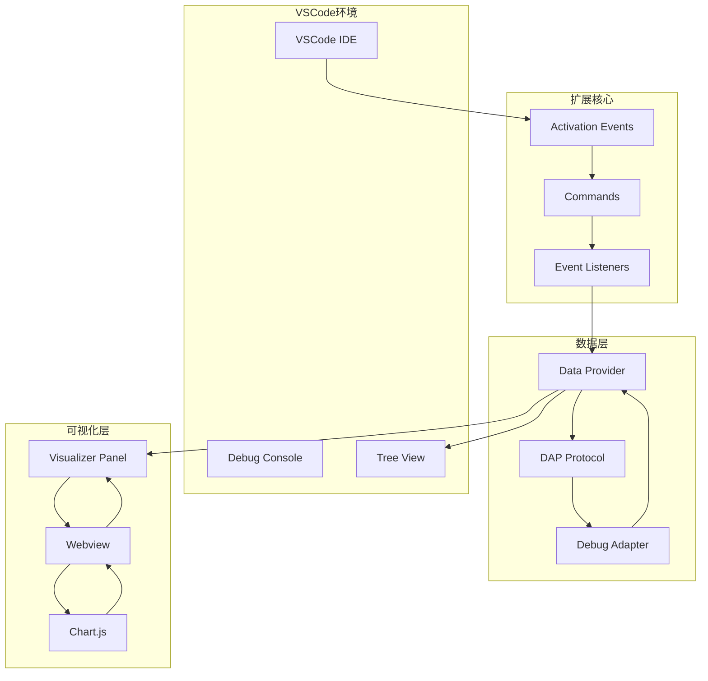
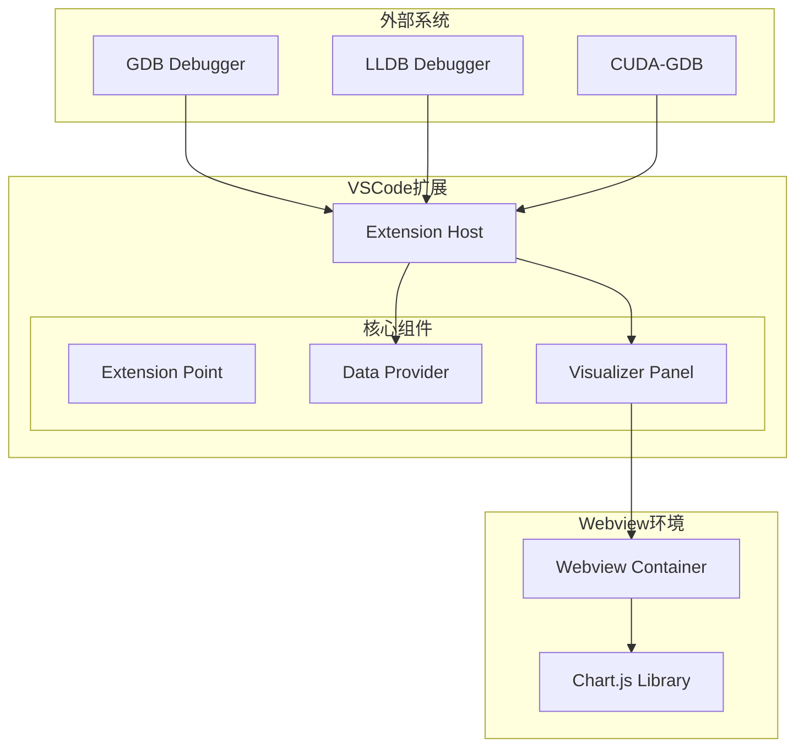
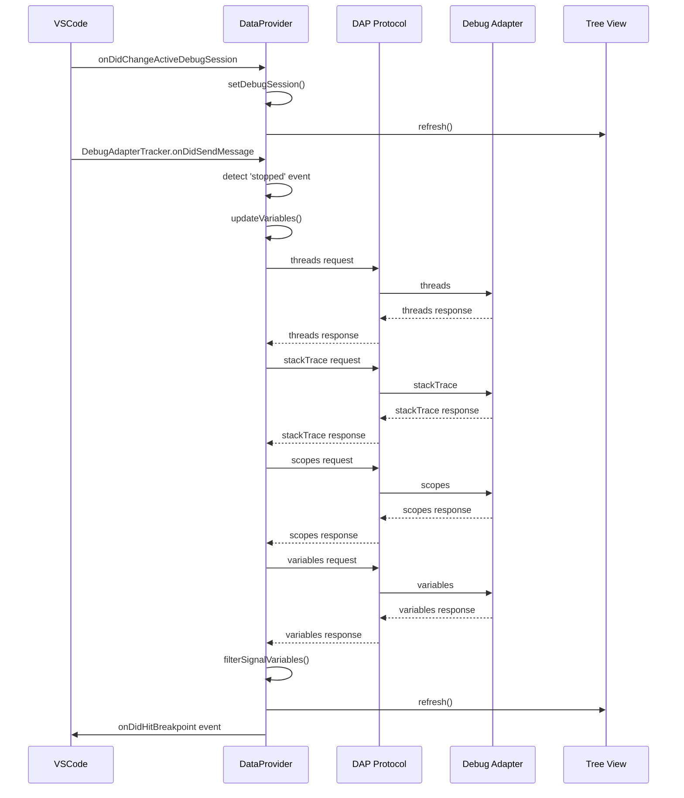
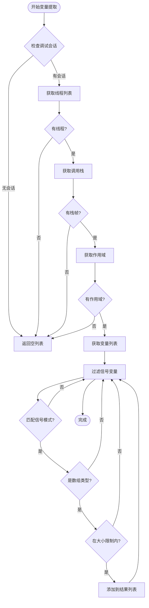
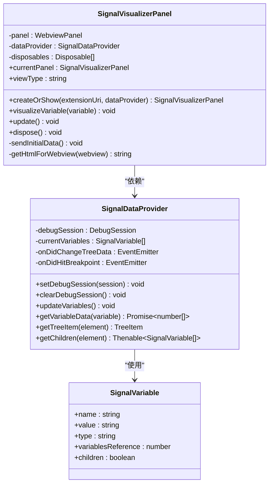
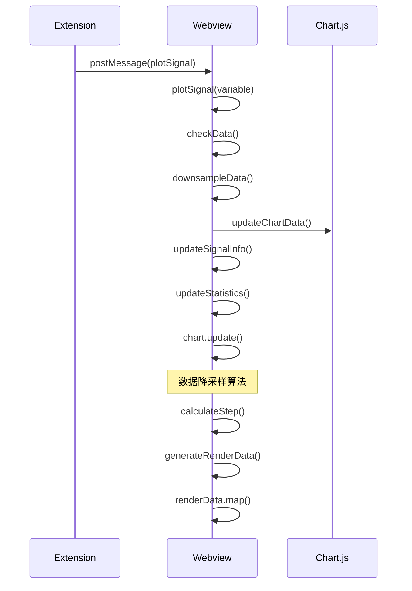
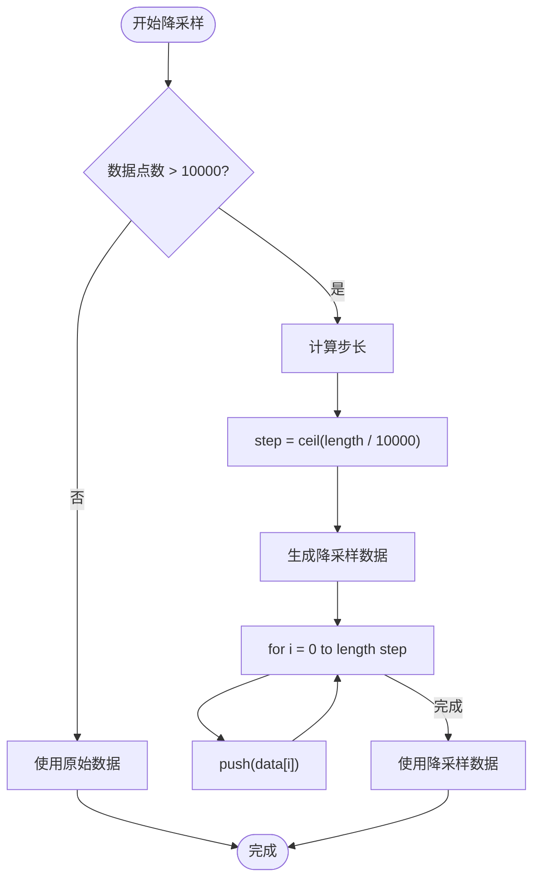
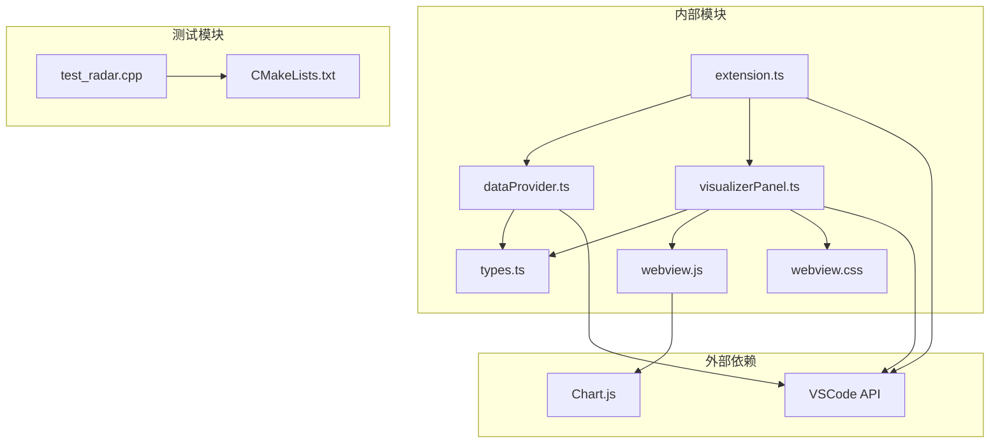

# 整体设计

<cite>
**本文档引用的文件**
- [package.json](file://package.json)
- [extension.ts](file://src/extension.ts)
- [dataProvider.ts](file://src/dataProvider.ts)
- [visualizerPanel.ts](file://src/visualizerPanel.ts)
- [types.ts](file://src/types.ts)
- [webview.js](file://assets/webview.js)
- [webview.css](file://assets/webview.css)
- [QUICKSTART.md](file://QUICKSTART.md)
- [test_radar.cpp](file://test_radar.cpp)
- [CMakeLists.txt](file://CMakeLists.txt)
</cite>

## 目录
1. [引言](#引言)
2. [项目结构](#项目结构)
3. [核心组件](#核心组件)
4. [架构概览](#架构概览)
5. [详细组件分析](#详细组件分析)
6. [依赖关系分析](#依赖关系分析)
7. [性能考虑](#性能考虑)
8. [故障排除指南](#故障排除指南)
9. [结论](#结论)

## 引言

雷达信号可视化项目是一个专为GPU调试设计的VSCode扩展，旨在帮助开发者在调试过程中实时可视化雷达信号数据。该项目采用模块化设计，将调试器集成、数据提取、可视化展示等功能分离到不同的组件中，实现了高度的解耦和可维护性。

项目的核心目标是：
- 提供直观的雷达信号波形可视化
- 支持断点命中时的自动可视化展示
- 实现调试器与可视化系统的分离设计
- 优化大数据集的性能表现
- 确保跨平台和跨调试器的兼容性

## 项目结构

项目采用清晰的模块化组织结构，按照功能职责进行分层：

**图表来源**
- [extension.ts:1-200](file://src/extension.ts#L1-L200)
- [dataProvider.ts:1-703](file://src/dataProvider.ts#L1-L703)
- [visualizerPanel.ts:1-451](file://src/visualizerPanel.ts#L1-L451)

**章节来源**
- [package.json:1-102](file://package.json#L1-L102)
- [QUICKSTART.md:42-57](file://QUICKSTART.md#L42-L57)

## 核心组件

### 扩展入口组件 (extension.ts)

扩展入口文件是整个VSCode扩展的启动点，负责协调各个子系统的初始化和生命周期管理。该组件实现了以下关键功能：

- **激活机制**：基于`onDebug`事件激活，确保在用户开始调试时自动加载
- **命令注册**：注册三个核心命令（打开面板、可视化变量、刷新信号）
- **事件监听**：监听调试会话的生命周期事件
- **资源管理**：通过`context.subscriptions`管理所有注册的资源

### 数据提供者组件 (dataProvider.ts)

数据提供者是系统的核心大脑，负责与调试器交互并提取变量数据。该组件实现了完整的TreeDataProvider接口，提供以下功能：

- **调试事件监听**：通过DebugAdapterTrackerFactory拦截DAP消息
- **变量提取**：实现DAP四级请求链（threads → stackTrace → scopes → variables）
- **数据过滤**：根据配置模式过滤信号相关变量
- **数值提取**：递归收集复合变量中的数值数据

### 可视化面板组件 (visualizerPanel.ts)

可视化面板管理VSCode中的WebviewPanel，提供完整的图表可视化功能。该组件采用单例模式，确保系统中只有一个可视化面板实例。

### 类型定义组件 (types.ts)

提供系统中使用的接口定义，包括SignalVariable和SignalData接口，确保类型安全和代码可维护性。

**章节来源**
- [extension.ts:46-188](file://src/extension.ts#L46-L188)
- [dataProvider.ts:56-703](file://src/dataProvider.ts#L56-L703)
- [visualizerPanel.ts:44-424](file://src/visualizerPanel.ts#L44-L424)
- [types.ts:21-95](file://src/types.ts#L21-L95)

## 架构概览

系统采用事件驱动架构，实现了调试器与可视化系统的完全分离：

**图表来源**
- [extension.ts:129-188](file://src/extension.ts#L129-L188)
- [dataProvider.ts:138-205](file://src/dataProvider.ts#L138-L205)
- [visualizerPanel.ts:102-164](file://src/visualizerPanel.ts#L102-L164)

### 系统边界图

**图表来源**
- [extension.ts:46-124](file://src/extension.ts#L46-L124)
- [dataProvider.ts:175-204](file://src/dataProvider.ts#L175-L204)
- [visualizerPanel.ts:142-153](file://src/visualizerPanel.ts#L142-L153)

## 详细组件分析

### 数据提供者组件深入分析

数据提供者组件实现了复杂的调试器交互逻辑，采用事件驱动的方式处理调试状态变化：

**图表来源**
- [dataProvider.ts:138-205](file://src/dataProvider.ts#L138-L205)
- [dataProvider.ts:243-399](file://src/dataProvider.ts#L243-L399)

#### 数据提取算法流程

数据提供者实现了高效的变量过滤和数值提取算法：

**图表来源**
- [dataProvider.ts:414-441](file://src/dataProvider.ts#L414-L441)
- [dataProvider.ts:454-499](file://src/dataProvider.ts#L454-L499)

### 可视化面板组件分析

可视化面板组件采用单例模式和事件驱动设计，提供了完整的Webview管理功能：

**图表来源**
- [visualizerPanel.ts:44-424](file://src/visualizerPanel.ts#L44-L424)
- [dataProvider.ts:56-703](file://src/dataProvider.ts#L56-L703)
- [types.ts:59-65](file://src/types.ts#L59-L65)

### Webview前端逻辑分析

Webview前端实现了完整的图表渲染和交互功能：

**图表来源**
- [webview.js:355-419](file://assets/webview.js#L355-L419)
- [webview.js:380-388](file://assets/webview.js#L380-L388)

#### 性能优化算法

Webview前端实现了智能的数据降采样算法，确保大数据集的流畅渲染：

**图表来源**
- [webview.js:380-388](file://assets/webview.js#L380-L388)
- [webview.js:384-387](file://assets/webview.js#L384-L387)

**章节来源**
- [dataProvider.ts:243-399](file://src/dataProvider.ts#L243-L399)
- [visualizerPanel.ts:264-275](file://src/visualizerPanel.ts#L264-L275)
- [webview.js:355-419](file://assets/webview.js#L355-L419)

## 依赖关系分析

系统采用了清晰的依赖层次结构，实现了良好的模块解耦：

**图表来源**
- [package.json:98-100](file://package.json#L98-L100)
- [extension.ts:27-29](file://src/extension.ts#L27-L29)
- [visualizerPanel.ts:28-30](file://src/visualizerPanel.ts#L28-L30)

### 模块间通信机制

系统实现了多种通信机制来确保组件间的松耦合：

1. **事件驱动通信**：使用vscode.EventEmitter实现自定义事件
2. **命令模式**：通过vscode.commands.registerCommand实现功能调用
3. **消息传递**：通过postMessage实现Webview与扩展的双向通信
4. **依赖注入**：通过构造函数参数实现组件依赖的明确声明

**章节来源**
- [extension.ts:78-124](file://src/extension.ts#L78-L124)
- [visualizerPanel.ts:207-222](file://src/visualizerPanel.ts#L207-L222)
- [dataProvider.ts:73-94](file://src/dataProvider.ts#L73-L94)

## 性能考虑

### 大数据集优化策略

系统针对大数据集场景实现了多项性能优化：

1. **智能降采样**：Webview前端实现等间隔采样算法，将超过10000个数据点的信号降采样到10000个以内
2. **内存管理**：使用WeakMap和适当的垃圾回收策略避免内存泄漏
3. **懒加载**：变量数据仅在需要时才从调试器获取
4. **缓存机制**：对已获取的数据进行缓存，避免重复请求

### 渲染性能优化

1. **Canvas渲染**：使用Chart.js的Canvas渲染，相比SVG具有更好的性能
2. **增量更新**：仅更新发生变化的数据点，而非重新渲染整个图表
3. **响应式设计**：图表自动适应面板大小变化，避免不必要的重绘

### 调试器交互优化

1. **批量请求**：将DAP请求合并为必要的最少次数
2. **错误恢复**：实现完善的错误处理和重试机制
3. **超时控制**：为长时间运行的请求设置超时限制

## 故障排除指南

### 常见问题及解决方案

#### 1. 侧边栏没有显示Radar Signals图标？

**原因**：扩展未正确激活或调试会话未启动
**解决方案**：
- 确保在Extension Development Host窗口中测试
- 启动调试会话后再查看侧边栏
- 检查扩展是否正确安装

#### 2. 信号变量列表为空？

**原因**：变量名不匹配或调试器未暂停
**解决方案**：
- 确保变量名包含配置的模式（如*signal*, *data*, *pulse*, *sample*）
- 确认调试器已暂停在断点处
- 检查变量类型是否为数组

#### 3. 图表不显示或显示异常？

**原因**：变量数据格式不正确或Webview加载失败
**解决方案**：
- 确认变量是数值类型且包含有效数据
- 检查Webview的CSP设置
- 重启VSCode扩展开发主机

### 调试技巧

1. **扩展代码调试**：在src/目录的TypeScript文件中设置断点，按F5启动扩展开发主机
2. **Webview调试**：在Webview中按Ctrl+Shift+I打开开发者工具
3. **日志查看**：通过VSCode的输出面板查看扩展日志

**章节来源**
- [QUICKSTART.md:31-41](file://QUICKSTART.md#L31-L41)
- [QUICKSTART.md:59-66](file://QUICKSTART.md#L59-L66)

## 结论

雷达信号可视化项目展现了优秀的软件架构设计，通过模块化组织、事件驱动架构和分离设计原则，成功实现了调试器与可视化系统的解耦。项目的主要优势包括：

1. **架构清晰**：采用分层设计，各组件职责明确，便于维护和扩展
2. **性能优秀**：实现了大数据集的智能降采样和增量渲染优化
3. **用户体验良好**：支持断点自动可视化和直观的图表展示
4. **可扩展性强**：模块化设计为未来功能扩展奠定了基础

该系统为GPU调试场景提供了专业的雷达信号可视化解决方案，通过合理的架构决策和技术实现，确保了在复杂调试环境中的稳定性和可靠性。