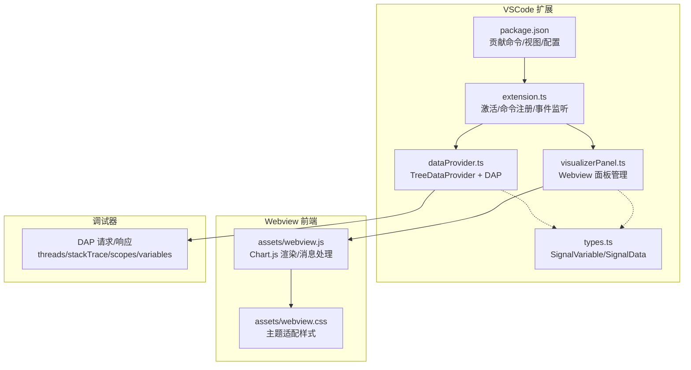
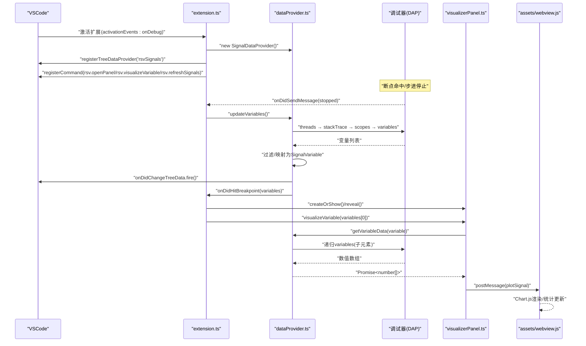
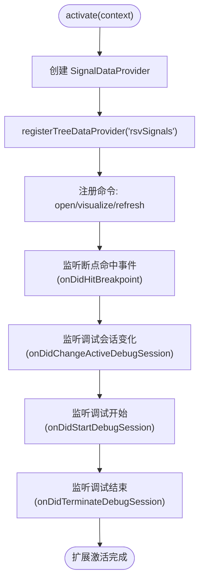
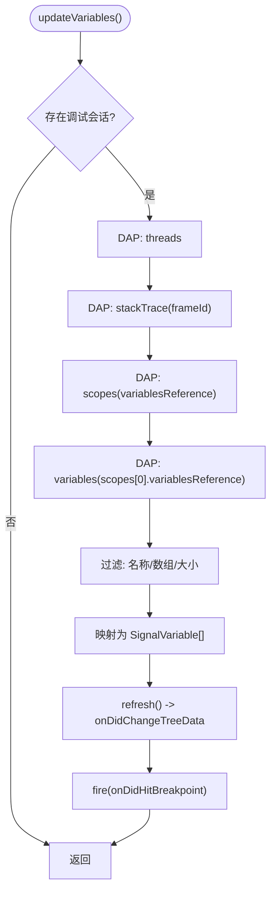
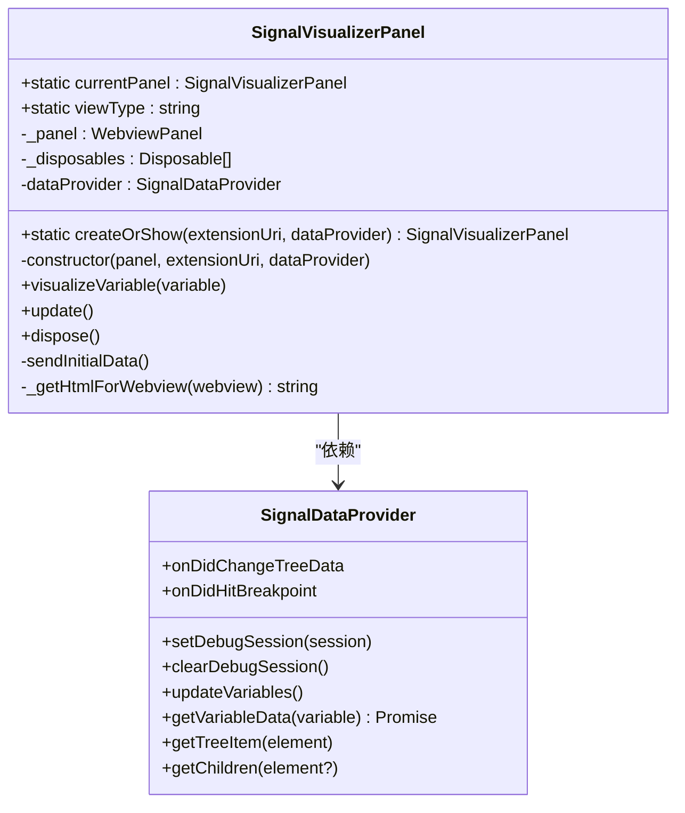
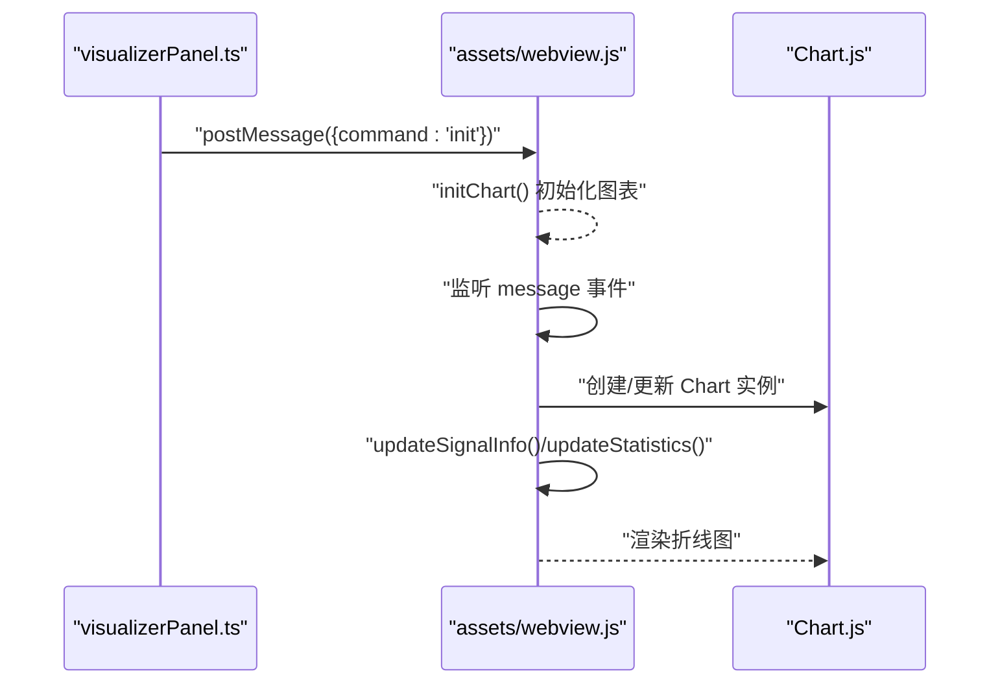
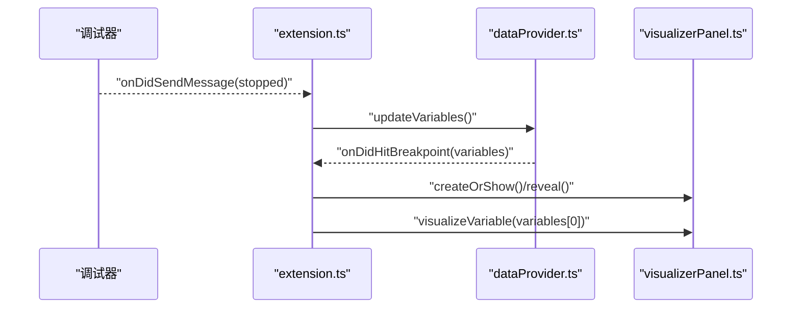
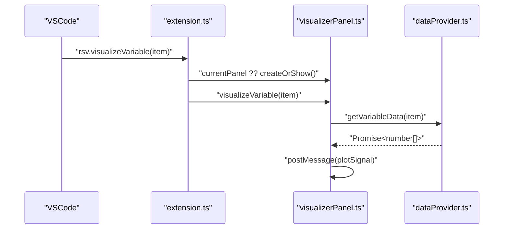
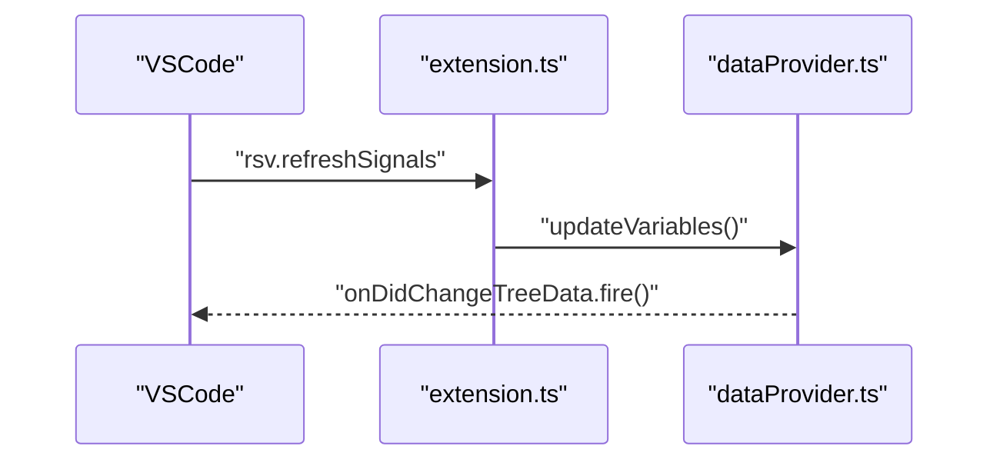
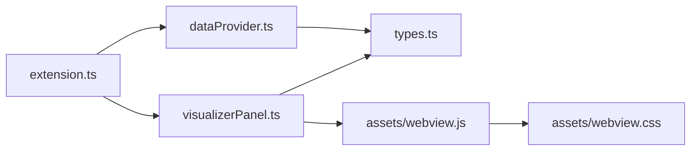

# 组件交互

<cite>
**本文引用的文件**
- [package.json](file://package.json)
- [extension.ts](file://src/extension.ts)
- [dataProvider.ts](file://src/dataProvider.ts)
- [visualizerPanel.ts](file://src/visualizerPanel.ts)
- [types.ts](file://src/types.ts)
- [webview.js](file://assets/webview.js)
- [webview.css](file://assets/webview.css)
- [test_radar.cpp](file://test_radar.cpp)
- [QUICKSTART.md](file://QUICKSTART.md)
</cite>

## 目录
1. [简介](#简介)
2. [项目结构](#项目结构)
3. [核心组件](#核心组件)
4. [架构总览](#架构总览)
5. [详细组件分析](#详细组件分析)
6. [依赖关系分析](#依赖关系分析)
7. [性能考量](#性能考量)
8. [故障排查指南](#故障排查指南)
9. [结论](#结论)
10. [附录](#附录)

## 简介
本文件面向“雷达信号可视化”VSCode扩展，系统化阐述扩展入口点、数据提供者、可视化面板之间的组件交互机制。重点解释事件驱动的数据更新流程、命令系统的调用链路、以及扩展与Webview之间的异步通信模式。文档还给出关键交互场景（断点命中、变量选择、面板创建）的时序图与交互图，覆盖生命周期管理与资源清理策略。

## 项目结构
该项目采用VSCode扩展标准结构，核心文件分布如下：
- 扩展入口与贡献：package.json、src/extension.ts
- 数据层：src/dataProvider.ts（实现TreeDataProvider，负责DAP变量抓取与过滤）
- 视图层：src/visualizerPanel.ts（管理Webview面板，承载Chart.js渲染）
- 类型定义：src/types.ts
- Webview前端：assets/webview.js、assets/webview.css
- 测试程序：test_radar.cpp
- 快速开始与开发指引：QUICKSTART.md

**图表来源**
- [package.json:17-85](file://package.json#L17-L85)
- [extension.ts:46-188](file://src/extension.ts#L46-L188)
- [dataProvider.ts:56-703](file://src/dataProvider.ts#L56-L703)
- [visualizerPanel.ts:44-424](file://src/visualizerPanel.ts#L44-L424)
- [types.ts:59-95](file://src/types.ts#L59-L95)
- [webview.js:50-96](file://assets/webview.js#L50-L96)
- [webview.css:64-174](file://assets/webview.css#L64-L174)

**章节来源**
- [package.json:1-102](file://package.json#L1-L102)
- [QUICKSTART.md:42-57](file://QUICKSTART.md#L42-L57)

## 核心组件
- 扩展入口（extension.ts）
  - 激活时创建数据提供者、注册命令、监听调试事件、自动弹出面板
  - 通过context.subscriptions统一管理资源生命周期
- 数据提供者（dataProvider.ts）
  - 实现TreeDataProvider接口，暴露onDidChangeTreeData与自定义onDidHitBreakpoint事件
  - 通过DebugAdapterTrackerFactory拦截DAP“stopped”事件，自动刷新变量列表
  - 通过DAP四步请求链获取变量，过滤信号变量并提取数值数组
- 可视化面板（visualizerPanel.ts）
  - 单例模式管理WebviewPanel，负责HTML生成、消息初始化、与Webview通信
  - 通过postMessage将SignalData发送至Webview，驱动Chart.js渲染
- 类型定义（types.ts）
  - SignalVariable：树节点元数据（名称、类型、DAP引用、children）
  - SignalData：用于Webview通信的实际数值数组
- Webview前端（assets/webview.js、assets/webview.css）
  - 初始化Chart.js，监听来自扩展的消息，绘制波形并计算统计信息

**章节来源**
- [extension.ts:46-188](file://src/extension.ts#L46-L188)
- [dataProvider.ts:56-703](file://src/dataProvider.ts#L56-L703)
- [visualizerPanel.ts:44-424](file://src/visualizerPanel.ts#L44-L424)
- [types.ts:59-95](file://src/types.ts#L59-L95)
- [webview.js:50-96](file://assets/webview.js#L50-L96)
- [webview.css:64-174](file://assets/webview.css#L64-L174)

## 架构总览
扩展采用“事件驱动 + 命令驱动”的双通道交互：
- 事件驱动：DebugAdapterTracker拦截DAP“stopped”，自动触发变量更新与面板弹出
- 命令驱动：用户通过命令面板或菜单触发“打开面板”“可视化变量”“刷新变量”

**图表来源**
- [extension.ts:139-146](file://src/extension.ts#L139-L146)
- [extension.ts:159-187](file://src/extension.ts#L159-L187)
- [dataProvider.ts:197-204](file://src/dataProvider.ts#L197-L204)
- [dataProvider.ts:243-399](file://src/dataProvider.ts#L243-L399)
- [visualizerPanel.ts:264-275](file://src/visualizerPanel.ts#L264-L275)
- [webview.js:70-96](file://assets/webview.js#L70-L96)

## 详细组件分析

### 扩展入口（extension.ts）
- 激活流程
  - 创建SignalDataProvider实例，注册树视图rsvSignals
  - 注册三条命令：打开面板、可视化变量、刷新变量
  - 监听断点命中事件，按配置自动弹出面板并展示首个信号变量
  - 监听调试会话切换/开始/结束，同步数据提供者的会话状态
- 生命周期管理
  - 所有注册的命令Disposable均加入context.subscriptions，停用时自动dispose

**图表来源**
- [extension.ts:46-188](file://src/extension.ts#L46-L188)

**章节来源**
- [extension.ts:46-188](file://src/extension.ts#L46-L188)

### 数据提供者（dataProvider.ts）
- 核心职责
  - 监听调试事件，拦截DAP“stopped”，自动刷新变量列表
  - 通过DAP四步请求链获取变量，过滤信号变量（名称模式、数组类型、大小限制）
  - 递归提取复合变量的数值，形成可用于绘图的数组
  - 暴露TreeDataProvider接口，支持树视图渲染与事件驱动刷新
- 关键流程
  - updateVariables()：threads → stackTrace → scopes → variables
  - getVariableData()：基于variablesReference递归收集数值
  - 过滤策略：isSignalVariable/isArrayVariable/isWithinSizeLimit
- 事件机制
  - onDidChangeTreeData：通知VSCode刷新树视图
  - onDidHitBreakpoint：通知extension.ts自动弹出面板

**图表来源**
- [dataProvider.ts:243-399](file://src/dataProvider.ts#L243-L399)
- [dataProvider.ts:414-441](file://src/dataProvider.ts#L414-L441)
- [dataProvider.ts:515-531](file://src/dataProvider.ts#L515-L531)
- [dataProvider.ts:563-634](file://src/dataProvider.ts#L563-L634)

**章节来源**
- [dataProvider.ts:56-703](file://src/dataProvider.ts#L56-L703)

### 可视化面板（visualizerPanel.ts）
- 单例模式
  - createOrShow()：若已存在则reveal，否则创建新面板
  - currentPanel静态属性保存唯一实例
- Webview生命周期
  - onDidDispose：面板关闭时清理资源
  - update()：生成HTML并设置到面板
- 与扩展的数据交互
  - visualizeVariable()：调用dataProvider.getVariableData()，通过postMessage发送plotSignal
  - onDidReceiveMessage：接收Webview ready，发送init握手

**图表来源**
- [visualizerPanel.ts:44-424](file://src/visualizerPanel.ts#L44-L424)
- [dataProvider.ts:56-703](file://src/dataProvider.ts#L56-L703)

**章节来源**
- [visualizerPanel.ts:44-424](file://src/visualizerPanel.ts#L44-L424)

### Webview前端（assets/webview.js、assets/webview.css）
- 初始化与消息协议
  - 页面加载后初始化Chart.js，监听来自扩展的消息
  - 支持init与plotSignal两类命令
- 渲染与统计
  - 绘制折线图，支持大数据集降采样
  - 计算并显示样本数、最小值、最大值、平均值
- 主题适配
  - 使用VSCode主题变量，适配深浅主题与高对比度

**图表来源**
- [visualizerPanel.ts:244-248](file://src/visualizerPanel.ts#L244-L248)
- [webview.js:50-96](file://assets/webview.js#L50-L96)
- [webview.js:111-345](file://assets/webview.js#L111-L345)
- [webview.js:355-494](file://assets/webview.js#L355-L494)

**章节来源**
- [webview.js:50-96](file://assets/webview.js#L50-L96)
- [webview.js:111-345](file://assets/webview.js#L111-L345)
- [webview.js:355-494](file://assets/webview.js#L355-L494)
- [webview.css:64-174](file://assets/webview.css#L64-L174)

### 关键交互场景时序图

#### 场景一：断点命中自动弹出面板

**图表来源**
- [extension.ts:139-146](file://src/extension.ts#L139-L146)
- [extension.ts:159-187](file://src/extension.ts#L159-L187)
- [dataProvider.ts:197-204](file://src/dataProvider.ts#L197-L204)
- [dataProvider.ts:394-394](file://src/dataProvider.ts#L394-L394)

#### 场景二：用户右键菜单可视化变量

**图表来源**
- [extension.ts:95-98](file://src/extension.ts#L95-L98)
- [visualizerPanel.ts:264-275](file://src/visualizerPanel.ts#L264-L275)
- [dataProvider.ts:515-531](file://src/dataProvider.ts#L515-L531)

#### 场景三：手动刷新变量列表

**图表来源**
- [extension.ts:109-111](file://src/extension.ts#L109-L111)
- [dataProvider.ts:243-399](file://src/dataProvider.ts#L243-L399)

## 依赖关系分析
- 扩展入口依赖数据提供者与可视化面板
- 数据提供者依赖VSCode调试API与DAP协议
- 可视化面板依赖Chart.js与Webview通信
- 类型定义为数据提供者与可视化面板的契约

**图表来源**
- [extension.ts:27-29](file://src/extension.ts#L27-L29)
- [dataProvider.ts:36-36](file://src/dataProvider.ts#L36-L36)
- [visualizerPanel.ts:28-30](file://src/visualizerPanel.ts#L28-L30)
- [types.ts:59-95](file://src/types.ts#L59-L95)
- [webview.js:38-38](file://assets/webview.js#L38-L38)
- [webview.css:64-174](file://assets/webview.css#L64-L174)

**章节来源**
- [extension.ts:27-29](file://src/extension.ts#L27-L29)
- [dataProvider.ts:36-36](file://src/dataProvider.ts#L36-L36)
- [visualizerPanel.ts:28-30](file://src/visualizerPanel.ts#L28-L30)
- [types.ts:59-95](file://src/types.ts#L59-L95)
- [webview.js:38-38](file://assets/webview.js#L38-L38)
- [webview.css:64-174](file://assets/webview.css#L64-L174)

## 性能考量
- 大数据集降采样：Webview前端对超过阈值的点进行等间隔采样，避免Chart.js渲染卡顿
- 递归深度限制：数据提供者对DAP子元素递归设置最大深度，防止异常数据结构导致无限递归
- 事件驱动刷新：树视图通过事件触发刷新，避免轮询带来的CPU消耗
- Webview上下文保留：retainContextWhenHidden提升切换体验，但需注意内存占用

**章节来源**
- [webview.js:380-388](file://assets/webview.js#L380-L388)
- [dataProvider.ts:570-572](file://src/dataProvider.ts#L570-L572)
- [visualizerPanel.ts:147-148](file://src/visualizerPanel.ts#L147-L148)

## 故障排查指南
- 侧边栏未显示“Radar Signals”
  - 确认在扩展开发宿主窗口中启动调试会话
  - 确认激活事件为onDebug，且调试器已暂停
- 信号变量列表为空
  - 确认变量名匹配配置模式（默认包含*signal*、*data*、*pulse*、*sample*）
  - 确认变量为数组类型且大小在限制范围内
- 图表不显示
  - 检查变量是否为数值数组
  - 检查Webview控制台是否有错误（按Ctrl+Shift+I打开开发者工具）
- 断点命中未自动弹出面板
  - 检查配置项autoDisplayOnBreakpoint是否启用
  - 确认调试适配器能正确发出“stopped”事件

**章节来源**
- [QUICKSTART.md:31-41](file://QUICKSTART.md#L31-L41)
- [extension.ts:139-146](file://src/extension.ts#L139-L146)
- [webview.js:50-96](file://assets/webview.js#L50-L96)

## 结论
本项目通过事件驱动与命令驱动相结合的方式，实现了从调试器到可视化面板的完整数据通路。扩展入口负责协调各组件，数据提供者承担DAP交互与数据过滤，可视化面板负责Webview渲染与用户交互。整体设计遵循VSCode扩展最佳实践，具备良好的可维护性与扩展性。

## 附录
- 测试程序test_radar.cpp生成多种雷达信号变量，便于验证扩展功能
- package.json定义了命令、视图、配置与激活事件，是扩展行为的总纲

**章节来源**
- [test_radar.cpp:34-62](file://test_radar.cpp#L34-L62)
- [package.json:13-15](file://package.json#L13-L15)
- [package.json:55-84](file://package.json#L55-L84)