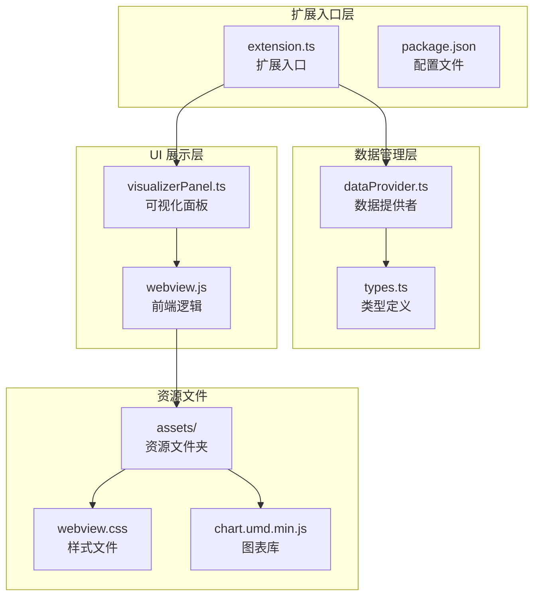
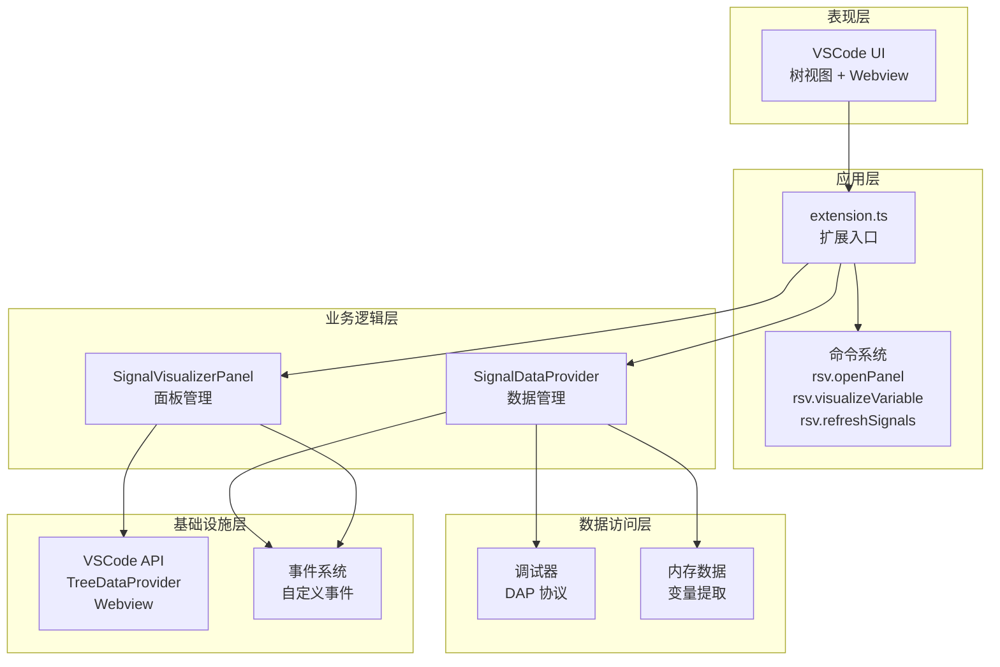
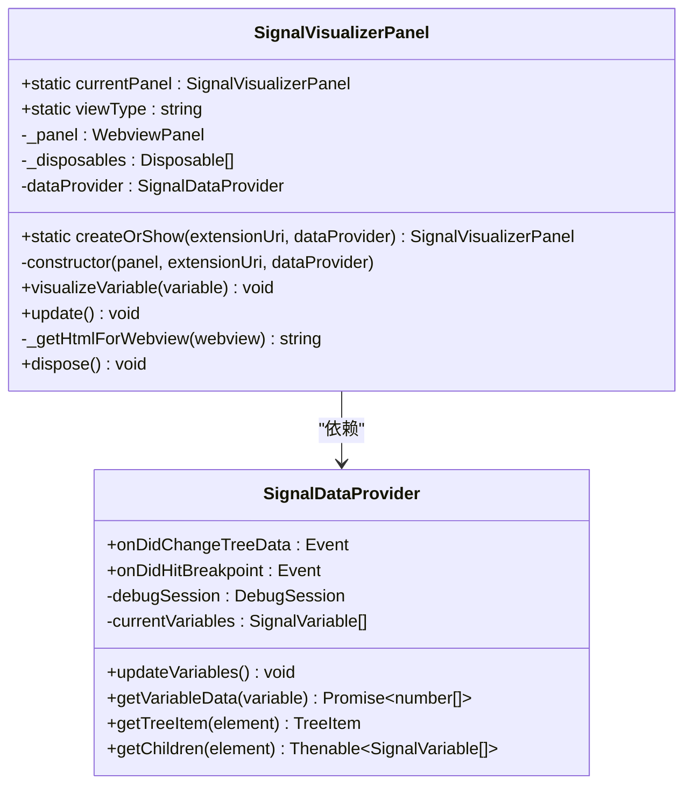
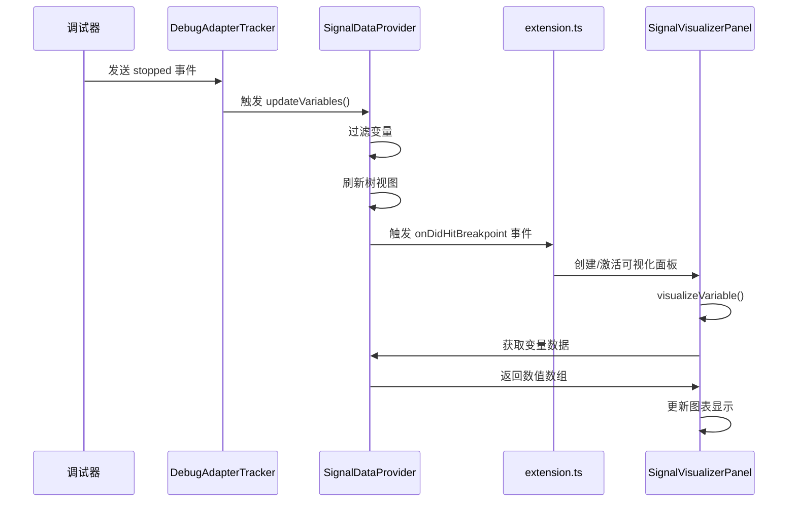
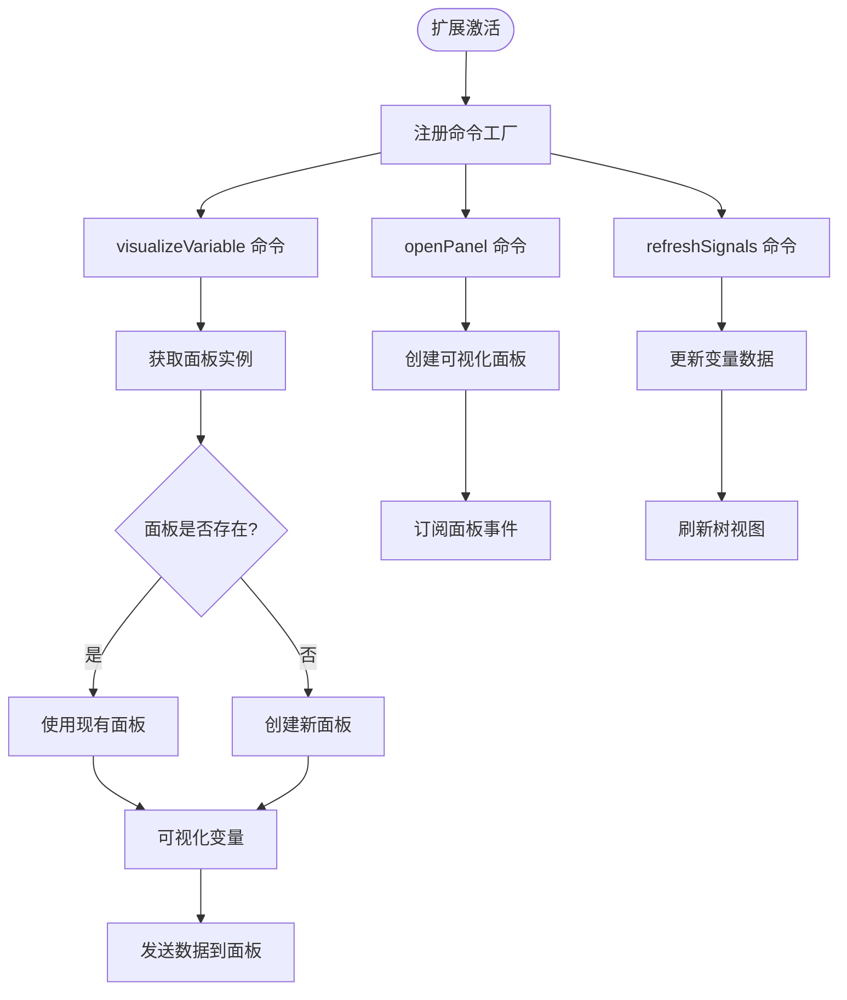
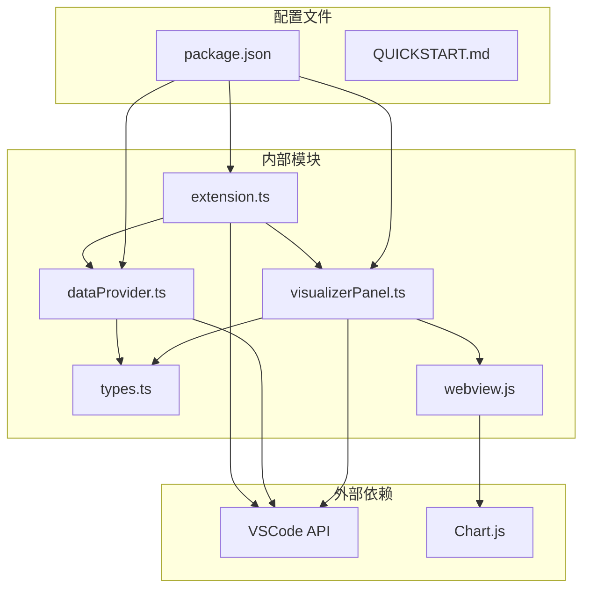

# 设计模式实现

<cite>
**本文档引用的文件**
- [src/extension.ts](file://src/extension.ts)
- [src/dataProvider.ts](file://src/dataProvider.ts)
- [src/visualizerPanel.ts](file://src/visualizerPanel.ts)
- [src/types.ts](file://src/types.ts)
- [assets/webview.js](file://assets/webview.js)
- [package.json](file://package.json)
- [QUICKSTART.md](file://QUICKSTART.md)
</cite>

## 目录
1. [引言](#引言)
2. [项目结构](#项目结构)
3. [核心组件](#核心组件)
4. [架构概览](#架构概览)
5. [详细组件分析](#详细组件分析)
6. [依赖关系分析](#依赖关系分析)
7. [性能考虑](#性能考虑)
8. [故障排除指南](#故障排除指南)
9. [结论](#结论)

## 引言

本项目是一个基于 VSCode 扩展的雷达信号可视化工具，通过集成调试器数据提取和 Webview 图表渲染，为 GPU 调试过程中的信号分析提供直观的可视化支持。项目采用了多种设计模式来解决复杂的系统架构问题，包括单例模式、观察者模式和工厂模式。

该项目的核心价值在于：
- **实时信号可视化**：在调试过程中实时显示雷达信号波形
- **智能变量识别**：自动识别和过滤信号相关变量
- **用户友好界面**：提供直观的波形图表和统计信息
- **扩展性设计**：模块化的架构便于功能扩展

## 项目结构

项目采用典型的 VSCode 扩展架构，主要分为以下几个核心模块：

**图表来源**
- [src/extension.ts:1-200](file://src/extension.ts#L1-L200)
- [src/dataProvider.ts:1-703](file://src/dataProvider.ts#L1-L703)
- [src/visualizerPanel.ts:1-451](file://src/visualizerPanel.ts#L1-L451)

**章节来源**
- [src/extension.ts:1-200](file://src/extension.ts#L1-L200)
- [package.json:1-102](file://package.json#L1-L102)

## 核心组件

### 1. SignalDataProvider - 数据提供者

SignalDataProvider 是整个扩展的核心数据管理组件，实现了 VSCode 的 TreeDataProvider 接口。该组件负责与调试器交互，提取变量数据，并为树视图提供数据源。

**核心职责**：
- 监听调试事件（断点命中、调试启动/结束）
- 通过 DAP 协议与调试器通信
- 过滤和处理信号相关变量
- 为 VSCode 树视图提供数据

**关键技术特性**：
- 实现自定义事件系统（onDidHitBreakpoint）
- 支持多调试会话管理
- 智能变量过滤和大小限制
- 递归数据提取机制

### 2. SignalVisualizerPanel - 可视化面板

SignalVisualizerPanel 采用单例模式管理 VSCode 的 WebviewPanel，负责创建和维护可视化界面。该组件实现了完整的生命周期管理和资源清理机制。

**核心特性**：
- 单例模式确保唯一实例
- 静态工厂方法控制实例创建
- 完整的资源管理（Disposable 模式）
- 安全的 Webview 通信机制

### 3. SignalVariable 接口

SignalVariable 是项目中的核心数据接口，定义了信号变量的完整数据结构。该接口分离了"元数据"和"实际数据"的概念，为系统的模块化提供了基础。

**数据结构**：
- name: 变量名
- value: GDB 显示的值（字符串形式）
- type: 变量的 C++ 类型
- variablesReference: DAP 变量引用 ID
- children: 是否有子节点

**章节来源**
- [src/dataProvider.ts:56-703](file://src/dataProvider.ts#L56-L703)
- [src/visualizerPanel.ts:44-424](file://src/visualizerPanel.ts#L44-L424)
- [src/types.ts:59-95](file://src/types.ts#L59-L95)

## 架构概览

项目采用分层架构设计，各层职责明确，耦合度低，便于维护和扩展。

**图表来源**
- [src/extension.ts:46-199](file://src/extension.ts#L46-L199)
- [src/dataProvider.ts:56-703](file://src/dataProvider.ts#L56-L703)
- [src/visualizerPanel.ts:44-424](file://src/visualizerPanel.ts#L44-L424)

## 详细组件分析

### 单例模式实现 - SignalVisualizerPanel

SignalVisualizerPanel 采用经典的单例模式实现，确保在整个 VSCode 实例中只有一个可视化面板实例。

#### 实现细节

**图表来源**
- [src/visualizerPanel.ts:44-424](file://src/visualizerPanel.ts#L44-L424)
- [src/dataProvider.ts:56-703](file://src/dataProvider.ts#L56-L703)

#### 关键实现要点

1. **静态属性管理**：`currentPanel` 静态属性保存唯一实例
2. **私有构造函数**：防止外部直接实例化
3. **静态工厂方法**：`createOrShow()` 控制实例创建和获取
4. **资源管理**：实现 Disposable 接口确保资源正确释放

#### 适用场景分析

**适用场景**：
- 需要全局唯一实例的组件
- 资源密集型操作（Webview 创建成本高）
- 需要跨组件共享状态的场景

**优点**：
- 确保资源唯一性，避免重复创建
- 提供全局访问点，便于组件间通信
- 简化对象生命周期管理

**缺点**：
- 难以进行单元测试
- 可能隐藏组件间的耦合关系
- 不利于并发场景下的多实例需求

**最佳实践**：
- 使用静态工厂方法替代直接构造
- 实现完整的资源清理机制
- 提供状态查询接口便于调试

**章节来源**
- [src/visualizerPanel.ts:92-164](file://src/visualizerPanel.ts#L92-L164)
- [src/visualizerPanel.ts:181-231](file://src/visualizerPanel.ts#L181-L231)

### 观察者模式实现 - 事件系统

项目广泛使用观察者模式实现松耦合的事件通信机制，特别是在 SignalDataProvider 中实现了自定义事件系统。

#### 事件架构设计

**图表来源**
- [src/dataProvider.ts:175-205](file://src/dataProvider.ts#L175-L205)
- [src/extension.ts:138-146](file://src/extension.ts#L138-L146)
- [src/visualizerPanel.ts:264-275](file://src/visualizerPanel.ts#L264-L275)

#### 事件类型分析

1. **调试器事件**：
   - `onDidChangeActiveDebugSession`：调试会话切换
   - `onDidReceiveDebugSessionCustomEvent`：自定义调试事件

2. **自定义业务事件**：
   - `onDidHitBreakpoint`：断点命中事件
   - `onDidChangeTreeData`：树数据变化事件

#### 实现优势

**解耦效果**：
- 数据提供者专注于数据提取，不关心 UI 展示
- 扩展入口只处理用户交互，不直接操作数据
- 可视化面板独立管理 UI 状态

**扩展性**：
- 新增事件类型无需修改现有代码
- 支持多播事件，多个监听者可同时响应
- 事件传播机制便于功能扩展

**章节来源**
- [src/dataProvider.ts:82-94](file://src/dataProvider.ts#L82-L94)
- [src/extension.ts:138-146](file://src/extension.ts#L138-L146)

### 工厂模式实现 - 命令注册

项目在 extension.ts 中实现了命令注册的工厂模式，通过统一的注册机制管理各种用户操作命令。

#### 命令工厂设计

**图表来源**
- [src/extension.ts:78-111](file://src/extension.ts#L78-L111)

#### 命令注册机制

项目注册了三个核心命令：

1. **rsv.openPanel**：打开雷达可视化面板
2. **rsv.visualizeVariable**：可视化选中的信号变量  
3. **rsv.refreshSignals**：手动刷新信号变量列表

#### 工厂模式优势

**统一管理**：
- 所有命令通过工厂方法注册，便于维护
- 统一的错误处理和资源管理
- 标准化的命令生命周期

**灵活性**：
- 支持动态命令注册和注销
- 易于添加新命令类型
- 命令参数验证和处理

**章节来源**
- [src/extension.ts:78-124](file://src/extension.ts#L78-L124)
- [package.json:55-69](file://package.json#L55-L69)

## 依赖关系分析

项目采用模块化设计，各组件间依赖关系清晰，遵循依赖倒置原则。

**图表来源**
- [src/extension.ts:27-29](file://src/extension.ts#L27-L29)
- [src/dataProvider.ts:35-36](file://src/dataProvider.ts#L35-L36)
- [src/visualizerPanel.ts:28-30](file://src/visualizerPanel.ts#L28-L30)

### 依赖管理策略

**接口隔离**：
- 所有组件通过接口进行通信，避免直接依赖具体实现
- types.ts 提供统一的数据接口定义
- 便于单元测试和模拟对象替换

**生命周期管理**：
- 所有注册的资源都加入 context.subscriptions
- Disposable 模式确保资源正确释放
- 避免内存泄漏和资源竞争

**配置驱动**：
- package.json 定义扩展元数据和贡献点
- 用户配置通过 workspace.getConfiguration() 访问
- 支持运行时配置更新

**章节来源**
- [src/extension.ts:124-124](file://src/extension.ts#L124-L124)
- [package.json:13-85](file://package.json#L13-L85)

## 性能考虑

项目在设计时充分考虑了性能优化，特别是在大数据量处理和资源管理方面。

### 数据处理优化

1. **异步数据提取**：使用 async/await 处理 DAP 请求，避免阻塞 UI
2. **智能降采样**：Webview.js 实现了大数据集的等间隔采样算法
3. **内存管理**：严格的资源清理机制，防止内存泄漏

### 渲染性能优化

1. **Chart.js 配置优化**：
   - 禁用数据点显示，减少渲染开销
   - 设置适当的动画时长
   - 优化坐标轴显示

2. **Webview 性能设置**：
   - retainContextWhenHidden: true 保留 DOM 状态
   - CSP 安全策略确保资源加载效率

### 最佳实践建议

1. **监控内存使用**：定期检查面板实例数量
2. **优化数据传输**：批量处理数据更新
3. **缓存策略**：合理使用缓存避免重复计算
4. **错误处理**：完善的异常捕获和恢复机制

## 故障排除指南

### 常见问题及解决方案

#### 1. 信号变量列表为空

**可能原因**：
- 调试器未暂停或无活动会话
- 变量名不匹配配置模式
- 变量类型不符合要求

**解决步骤**：
1. 确认调试器已暂停（断点命中）
2. 检查变量名是否包含配置模式（如 *signal*, *data*）
3. 验证变量类型为数组或可展开的复合类型

#### 2. 图表不显示数据

**可能原因**：
- 变量数据类型不支持
- 数据量过大导致降采样
- Webview 资源加载失败

**解决步骤**：
1. 检查变量是否为数值类型
2. 验证数据范围和有效性
3. 查看浏览器开发者工具控制台

#### 3. 面板无法创建或重复出现

**可能原因**：
- 单例模式失效
- 资源清理不彻底
- VSCode Webview 限制

**解决步骤**：
1. 检查 currentPanel 静态属性状态
2. 确认 dispose() 方法正确调用
3. 重启 VSCode 开发主机

### 调试技巧

1. **扩展开发模式**：使用 F5 启动扩展开发主机
2. **断点调试**：在 TypeScript 文件中设置断点
3. **日志输出**：利用 console.log 进行调试
4. **Webview 调试**：使用 Ctrl+Shift+I 打开开发者工具

**章节来源**
- [QUICKSTART.md:31-66](file://QUICKSTART.md#L31-L66)

## 结论

本项目成功地将多种设计模式应用于 VSCode 扩展开发中，形成了一个结构清晰、功能完善、易于维护的雷达信号可视化系统。

### 设计模式应用总结

1. **单例模式**：确保可视化面板的唯一性和资源管理
2. **观察者模式**：实现松耦合的事件通信机制
3. **工厂模式**：提供统一的命令注册和管理机制

### 架构优势

- **模块化设计**：各组件职责明确，便于独立开发和测试
- **扩展性强**：良好的抽象层支持功能扩展
- **用户体验优秀**：实时数据更新和直观的可视化界面
- **性能优化**：针对大数据量的专门优化措施

### 改进建议

1. **单元测试**：为关键组件添加自动化测试
2. **错误处理**：增强异常情况的用户反馈
3. **配置管理**：提供更丰富的用户配置选项
4. **性能监控**：添加性能指标收集和分析

该设计模式实现文档为理解项目架构和扩展开发提供了全面的指导，为类似项目的开发奠定了坚实的基础。