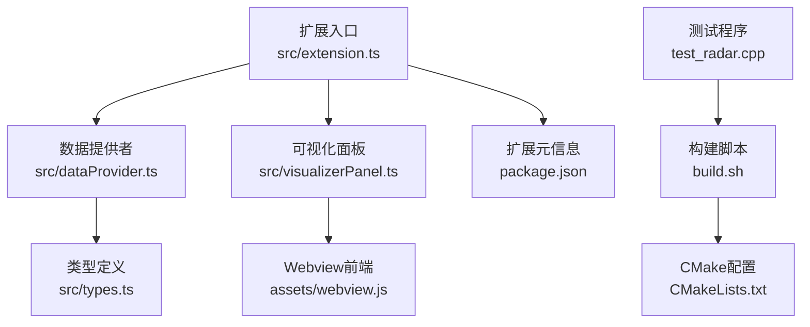
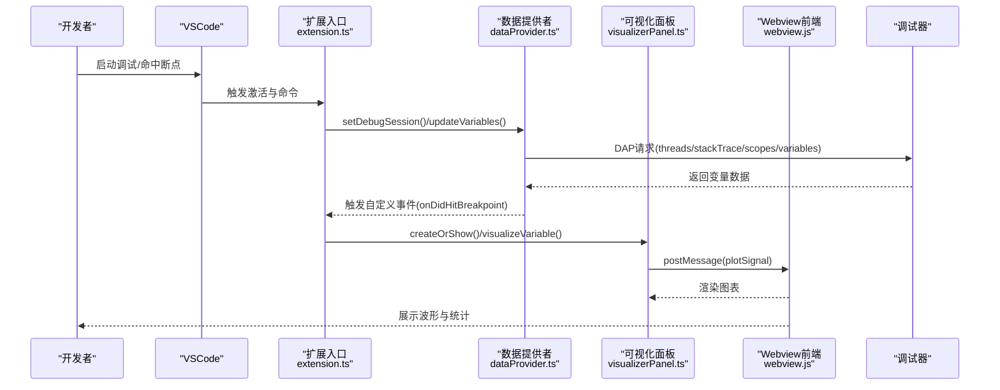
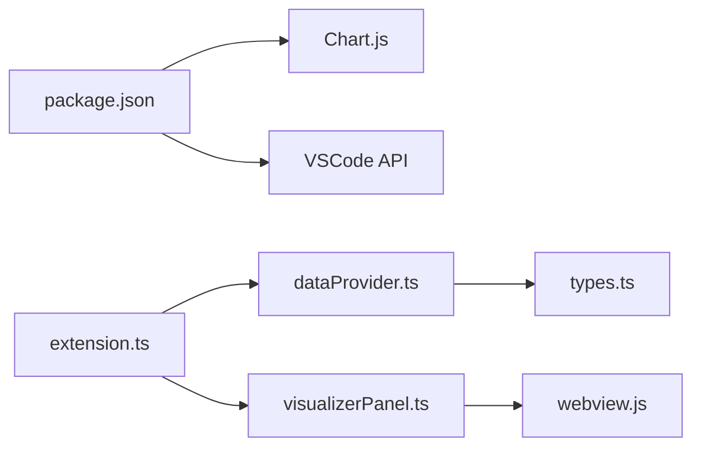

# 故障排除

<cite>
**本文引用的文件**
- [package.json](file://package.json)
- [QUICKSTART.md](file://QUICKSTART.md)
- [src/extension.ts](file://src/extension.ts)
- [src/dataProvider.ts](file://src/dataProvider.ts)
- [src/visualizerPanel.ts](file://src/visualizerPanel.ts)
- [src/types.ts](file://src/types.ts)
- [assets/webview.js](file://assets/webview.js)
- [test_radar.cpp](file://test_radar.cpp)
- [build.sh](file://build.sh)
- [CMakeLists.txt](file://CMakeLists.txt)
</cite>

## 目录
1. [简介](#简介)
2. [项目结构](#项目结构)
3. [核心组件](#核心组件)
4. [架构总览](#架构总览)
5. [详细组件故障排除](#详细组件故障排除)
6. [依赖关系分析](#依赖关系分析)
7. [性能与内存问题排查](#性能与内存问题排查)
8. [系统与环境兼容性](#系统与环境兼容性)
9. [日志与错误信息解读](#日志与错误信息解读)
10. [调试技巧与最佳实践](#调试技巧与最佳实践)
11. [结论](#结论)
12. [附录](#附录)

## 简介
本指南面向使用“雷达信号可视化”VSCode扩展的开发者，提供从安装、扩展加载、调试器连接、图表渲染到性能与内存问题的系统化故障排除方法。文档基于仓库源码与快速入门文档，结合实际代码路径，帮助你在不同操作系统、VSCode版本与调试器版本下快速定位并解决问题。

## 项目结构
该项目采用VSCode扩展标准布局，核心由TypeScript扩展代码与Webview前端组成，配合CMake构建测试程序。关键文件与职责如下：
- 扩展入口与命令注册：src/extension.ts
- 调试器数据抓取与过滤：src/dataProvider.ts
- Webview面板与图表渲染：src/visualizerPanel.ts + assets/webview.js
- 类型定义：src/types.ts
- 测试程序与构建脚本：test_radar.cpp + build.sh + CMakeLists.txt
- 扩展元信息与脚本：package.json
- 快速上手与常见问题：QUICKSTART.md

**图表来源**
- [src/extension.ts:1-200](file://src/extension.ts#L1-L200)
- [src/dataProvider.ts:1-703](file://src/dataProvider.ts#L1-L703)
- [src/visualizerPanel.ts:1-451](file://src/visualizerPanel.ts#L1-L451)
- [assets/webview.js:1-494](file://assets/webview.js#L1-L494)
- [src/types.ts:1-95](file://src/types.ts#L1-L95)
- [package.json:1-102](file://package.json#L1-L102)
- [test_radar.cpp:1-63](file://test_radar.cpp#L1-L63)
- [build.sh:1-12](file://build.sh#L1-L12)
- [CMakeLists.txt:1-10](file://CMakeLists.txt#L1-L10)

**章节来源**
- [package.json:1-102](file://package.json#L1-L102)
- [QUICKSTART.md:1-66](file://QUICKSTART.md#L1-L66)

## 核心组件
- 扩展入口与生命周期：负责注册命令、树视图、调试事件监听与面板创建。
- 数据提供者：通过DAP协议从调试器抓取变量，过滤信号变量并提取数值数组。
- 可视化面板：管理Webview，加载Chart.js，接收数据并渲染波形。
- 类型定义：统一SignalVariable与SignalData结构，确保前后端数据契约。
- 测试程序：生成脉冲、噪声、线性调频等信号，便于断点调试与验证。

**章节来源**
- [src/extension.ts:46-188](file://src/extension.ts#L46-L188)
- [src/dataProvider.ts:56-702](file://src/dataProvider.ts#L56-L702)
- [src/visualizerPanel.ts:44-424](file://src/visualizerPanel.ts#L44-L424)
- [src/types.ts:59-94](file://src/types.ts#L59-L94)
- [test_radar.cpp:34-62](file://test_radar.cpp#L34-L62)

## 架构总览
扩展通过调试适配器追踪器拦截DAP事件，自动刷新变量列表；用户可通过命令或断点触发面板展示；面板通过postMessage与扩展通信，扩展再从调试器拉取数据并降采样渲染。

**图表来源**
- [src/extension.ts:138-187](file://src/extension.ts#L138-L187)
- [src/dataProvider.ts:243-399](file://src/dataProvider.ts#L243-L399)
- [src/visualizerPanel.ts:264-275](file://src/visualizerPanel.ts#L264-L275)
- [assets/webview.js:70-96](file://assets/webview.js#L70-L96)

## 详细组件故障排除

### 安装与扩展加载失败
症状
- 扩展未出现在侧边栏或命令面板中
- 启动开发主机后无反应

排查步骤
- 确认已安装依赖并编译扩展
  - 参考：[QUICKSTART.md:3-11](file://QUICKSTART.md#L3-L11)
- 确认扩展入口与激活事件
  - package.json中activationEvents为onDebug，需先启动调试会话
  - 参考：[package.json:13-15](file://package.json#L13-L15)
- 确认main指向的打包输出
  - 参考：[package.json:16](file://package.json#L16)
- 在开发主机中确认扩展已加载
  - 参考：[QUICKSTART.md:18-21](file://QUICKSTART.md#L18-L21)

常见原因
- 未执行npm install或npm run compile
- VSCode版本过低（engines vs code ^1.85.0）
  - 参考：[package.json:7-8](file://package.json#L7-L8)
- 未启动调试会话，扩展未被激活

解决方案
- 执行安装与编译脚本
  - 参考：[QUICKSTART.md:3-11](file://QUICKSTART.md#L3-L11)
- 升级VSCode至满足engines要求的版本
  - 参考：[package.json:7-8](file://package.json#L7-L8)
- 在开发主机中按F5启动调试，确保扩展被激活

**章节来源**
- [package.json:7-16](file://package.json#L7-L16)
- [QUICKSTART.md:3-21](file://QUICKSTART.md#L3-L21)

### 调试器连接问题
症状
- 侧边栏“Radar Signals”为空
- 图表不显示或空白

排查步骤
- 确认调试器已暂停并处于断点状态
  - 参考：[QUICKSTART.md:24-26](file://QUICKSTART.md#L24-L26)
- 检查变量名模式与大小限制
  - 默认模式包含*signal*、*data*、*pulse*、*sample*
  - 参考：[package.json:26-35](file://package.json#L26-L35)
  - 参考：[src/dataProvider.ts:414-441](file://src/dataProvider.ts#L414-L441)
- 手动刷新变量列表
  - 命令：rsv.refreshSignals
  - 参考：[src/extension.ts:109-111](file://src/extension.ts#L109-L111)
- 检查调试会话切换
  - 参考：[src/extension.ts:159-165](file://src/extension.ts#L159-L165)

常见原因
- 未命中断点或调试器未暂停
- 变量名不匹配模式或数组过大被过滤
- 多调试会话切换导致会话丢失
- DAP事件未被拦截（调试适配器不兼容）

解决方案
- 在断点处暂停并重试
  - 参考：[QUICKSTART.md:24-26](file://QUICKSTART.md#L24-L26)
- 调整信号名模式或增大maxArraySize
  - 参考：[package.json:26-35](file://package.json#L26-L35)
- 手动触发刷新命令
  - 参考：[src/extension.ts:109-111](file://src/extension.ts#L109-L111)
- 确保调试会话有效
  - 参考：[src/extension.ts:159-165](file://src/extension.ts#L159-L165)

**章节来源**
- [src/extension.ts:109-111](file://src/extension.ts#L109-L111)
- [src/dataProvider.ts:414-441](file://src/dataProvider.ts#L414-L441)
- [package.json:26-35](file://package.json#L26-L35)
- [QUICKSTART.md:24-26](file://QUICKSTART.md#L24-L26)

### 图表渲染异常
症状
- 图表空白或不显示
- 数据点过多导致卡顿或崩溃

排查步骤
- 确认Webview已加载完成并发送ready
  - 参考：[assets/webview.js:50-96](file://assets/webview.js#L50-L96)
- 检查postMessage数据结构
  - 参考：[src/visualizerPanel.ts:264-275](file://src/visualizerPanel.ts#L264-L275)
- 检查Chart.js加载与Canvas可用性
  - 参考：[src/visualizerPanel.ts:317-392](file://src/visualizerPanel.ts#L317-L392)
- 检查大数据集降采样
  - 参考：[assets/webview.js:380-388](file://assets/webview.js#L380-L388)

常见原因
- Webview未收到plotSignal消息
- 数据为空或非数值
- Chart.js未正确加载
- 数据点超过渲染上限导致卡顿

解决方案
- 确保扩展成功发送plotSignal
  - 参考：[src/visualizerPanel.ts:264-275](file://src/visualizerPanel.ts#L264-L275)
- 检查变量类型与数值提取
  - 参考：[src/dataProvider.ts:515-531](file://src/dataProvider.ts#L515-L531)
- 确认本地资源URI与CSP配置
  - 参考：[src/visualizerPanel.ts:317-392](file://src/visualizerPanel.ts#L317-L392)
- 降低maxArraySize或等待降采样
  - 参考：[assets/webview.js:380-388](file://assets/webview.js#L380-L388)

**章节来源**
- [src/visualizerPanel.ts:264-275](file://src/visualizerPanel.ts#L264-L275)
- [assets/webview.js:50-96](file://assets/webview.js#L50-L96)
- [src/dataProvider.ts:515-531](file://src/dataProvider.ts#L515-L531)
- [assets/webview.js:380-388](file://assets/webview.js#L380-L388)

### 调试器数据获取与过滤
症状
- 变量列表为空或不完整
- 过滤规则导致误判

排查步骤
- 检查DAP请求链是否成功
  - threads → stackTrace → scopes → variables
  - 参考：[src/dataProvider.ts:243-399](file://src/dataProvider.ts#L243-L399)
- 检查变量过滤逻辑
  - 名称模式匹配、数组类型判断、大小限制
  - 参考：[src/dataProvider.ts:414-499](file://src/dataProvider.ts#L414-L499)
- 检查递归采集数值
  - 参考：[src/dataProvider.ts:563-634](file://src/dataProvider.ts#L563-L634)

常见原因
- DAP响应为空或无栈帧
- 变量类型不符合数组特征
- 变量引用ID无效或递归深度不足

解决方案
- 确保调试器返回有效响应
  - 参考：[src/dataProvider.ts:243-399](file://src/dataProvider.ts#L243-L399)
- 调整名称模式或增大maxArraySize
  - 参考：[package.json:26-35](file://package.json#L26-L35)
- 检查变量引用ID与递归深度
  - 参考：[src/dataProvider.ts:563-634](file://src/dataProvider.ts#L563-L634)

**章节来源**
- [src/dataProvider.ts:243-399](file://src/dataProvider.ts#L243-L399)
- [src/dataProvider.ts:414-499](file://src/dataProvider.ts#L414-L499)
- [src/dataProvider.ts:563-634](file://src/dataProvider.ts#L563-L634)
- [package.json:26-35](file://package.json#L26-L35)

### Webview与面板生命周期
症状
- 面板无法复用或重复创建
- 关闭面板后仍残留事件监听

排查步骤
- 检查单例模式与currentPanel
  - 参考：[src/visualizerPanel.ts:102-164](file://src/visualizerPanel.ts#L102-L164)
- 检查dispose与_disposables
  - 参考：[src/visualizerPanel.ts:407-423](file://src/visualizerPanel.ts#L407-L423)
- 检查onDidDispose事件
  - 参考：[src/visualizerPanel.ts:195](file://src/visualizerPanel.ts#L195)

常见原因
- 未正确设置currentPanel或未调用reveal
- 未将事件订阅加入_disposables
- 未调用dispose释放资源

解决方案
- 使用createOrShow统一创建与复用
  - 参考：[src/visualizerPanel.ts:102-164](file://src/visualizerPanel.ts#L102-L164)
- 确保所有订阅加入_disposables并在dispose中释放
  - 参考：[src/visualizerPanel.ts:407-423](file://src/visualizerPanel.ts#L407-L423)

**章节来源**
- [src/visualizerPanel.ts:102-164](file://src/visualizerPanel.ts#L102-L164)
- [src/visualizerPanel.ts:407-423](file://src/visualizerPanel.ts#L407-L423)

## 依赖关系分析
- 扩展依赖VSCode API与Chart.js
  - 参考：[package.json:98-100](file://package.json#L98-L100)
- Webview通过asWebviewUri加载本地资源
  - 参考：[src/visualizerPanel.ts:317-392](file://src/visualizerPanel.ts#L317-L392)
- DAP协议用于调试器交互
  - 参考：[src/dataProvider.ts:243-399](file://src/dataProvider.ts#L243-L399)

**图表来源**
- [package.json:98-100](file://package.json#L98-L100)
- [src/extension.ts:27-29](file://src/extension.ts#L27-L29)
- [src/visualizerPanel.ts:28-30](file://src/visualizerPanel.ts#L28-L30)
- [src/dataProvider.ts:35-36](file://src/dataProvider.ts#L35-L36)
- [src/types.ts:59-94](file://src/types.ts#L59-L94)

**章节来源**
- [package.json:98-100](file://package.json#L98-L100)
- [src/visualizerPanel.ts:317-392](file://src/visualizerPanel.ts#L317-L392)
- [src/dataProvider.ts:243-399](file://src/dataProvider.ts#L243-L399)

## 性能与内存问题排查
识别要点
- 大数据集导致渲染缓慢或卡顿
  - 参考：[assets/webview.js:380-388](file://assets/webview.js#L380-L388)
- Webview retainContextWhenHidden占用内存
  - 参考：[src/visualizerPanel.ts:142-153](file://src/visualizerPanel.ts#L142-L153)
- 事件监听未释放导致内存泄漏
  - 参考：[src/visualizerPanel.ts:407-423](file://src/visualizerPanel.ts#L407-L423)

优化策略
- 降采样渲染：超过阈值时等间隔采样
  - 参考：[assets/webview.js:380-388](file://assets/webview.js#L380-L388)
- 合理使用retainContextWhenHidden
  - 参考：[src/visualizerPanel.ts:142-153](file://src/visualizerPanel.ts#L142-L153)
- 确保_disposables释放所有订阅
  - 参考：[src/visualizerPanel.ts:407-423](file://src/visualizerPanel.ts#L407-L423)

**章节来源**
- [assets/webview.js:380-388](file://assets/webview.js#L380-L388)
- [src/visualizerPanel.ts:142-153](file://src/visualizerPanel.ts#L142-L153)
- [src/visualizerPanel.ts:407-423](file://src/visualizerPanel.ts#L407-L423)

## 系统与环境兼容性
- VSCode版本要求
  - engines: ^1.85.0
  - 参考：[package.json:7-8](file://package.json#L7-L8)
- 调试器适配器
  - 通过DebugAdapterTrackerFactory拦截DAP事件，适用于GDB/LLDB/CUDA-GDB等
  - 参考：[src/dataProvider.ts:175-204](file://src/dataProvider.ts#L175-L204)
- 操作系统
  - Linux/macOS/Windows均可，需正确安装调试器与依赖
  - 参考：[build.sh:1-12](file://build.sh#L1-12)
  - 参考：[CMakeLists.txt:1-10](file://CMakeLists.txt#L1-L10)

兼容性问题处理
- 升级VSCode至满足engines要求
  - 参考：[package.json:7-8](file://package.json#L7-L8)
- 确保调试器已安装并可被VSCode识别
  - 参考：[QUICKSTART.md:23-29](file://QUICKSTART.md#L23-L29)
- 在Linux环境下正确编译测试程序
  - 参考：[build.sh:1-12](file://build.sh#L1-12)
  - 参考：[CMakeLists.txt:1-10](file://CMakeLists.txt#L1-L10)

**章节来源**
- [package.json:7-8](file://package.json#L7-L8)
- [src/dataProvider.ts:175-204](file://src/dataProvider.ts#L175-L204)
- [QUICKSTART.md:23-29](file://QUICKSTART.md#L23-L29)
- [build.sh:1-12](file://build.sh#L1-12)
- [CMakeLists.txt:1-10](file://CMakeLists.txt#L1-L10)

## 日志与错误信息解读
- 扩展日志位置
  - 在VSCode开发主机中查看输出面板（扩展日志）
  - 参考：[src/dataProvider.ts:245-247](file://src/dataProvider.ts#L245-L247)
  - 参考：[src/dataProvider.ts:396-398](file://src/dataProvider.ts#L396-L398)
- 常见错误
  - “No debug session”：未启动调试会话
  - “No threads found”/“No stack frames found”：调试器未返回有效数据
  - “Failed to get variable data”：数据提取失败
  - 参考：[src/dataProvider.ts:245-247](file://src/dataProvider.ts#L245-L247)
  - 参考：[src/dataProvider.ts:295-298](file://src/dataProvider.ts#L295-L298)
  - 参考：[src/dataProvider.ts:526](file://src/dataProvider.ts#L526)

调试技巧
- 在Webview中按Ctrl+Shift+I打开开发者工具查看console
  - 参考：[assets/webview.js:22-25](file://assets/webview.js#L22-L25)
- 在扩展代码中设置断点进行调试
  - 参考：[QUICKSTART.md:61-65](file://QUICKSTART.md#L61-L65)

**章节来源**
- [src/dataProvider.ts:245-247](file://src/dataProvider.ts#L245-L247)
- [src/dataProvider.ts:295-298](file://src/dataProvider.ts#L295-L298)
- [src/dataProvider.ts:526](file://src/dataProvider.ts#L526)
- [assets/webview.js:22-25](file://assets/webview.js#L22-L25)
- [QUICKSTART.md:61-65](file://QUICKSTART.md#L61-L65)

## 调试技巧与最佳实践
- 断点与变量观察
  - 在test_radar.cpp设置断点，观察变量列表
  - 参考：[QUICKSTART.md:23-29](file://QUICKSTART.md#L23-L29)
- 自动显示与手动刷新
  - 启用autoDisplayOnBreakpoint或手动触发rsv.refreshSignals
  - 参考：[package.json:21-24](file://package.json#L21-L24)
  - 参考：[src/extension.ts:109-111](file://src/extension.ts#L109-L111)
- 面板复用与资源释放
  - 使用createOrShow单例模式，确保dispose释放
  - 参考：[src/visualizerPanel.ts:102-164](file://src/visualizerPanel.ts#L102-L164)
  - 参考：[src/visualizerPanel.ts:407-423](file://src/visualizerPanel.ts#L407-L423)
- 配置优化
  - 调整信号名模式与maxArraySize以平衡准确性与性能
  - 参考：[package.json:26-35](file://package.json#L26-L35)

**章节来源**
- [QUICKSTART.md:23-29](file://QUICKSTART.md#L23-L29)
- [package.json:21-24](file://package.json#L21-L24)
- [src/extension.ts:109-111](file://src/extension.ts#L109-L111)
- [src/visualizerPanel.ts:102-164](file://src/visualizerPanel.ts#L102-L164)
- [src/visualizerPanel.ts:407-423](file://src/visualizerPanel.ts#L407-L423)
- [package.json:26-35](file://package.json#L26-L35)

## 结论
本指南围绕扩展的安装、调试器连接、数据获取、Webview渲染与性能优化提供了系统化的故障排除方法。通过理解DAP请求链、单例面板管理与降采样策略，可在不同平台与调试器版本下稳定运行。建议在日常使用中定期调整配置、监控日志并遵循资源释放的最佳实践，以获得最佳的调试体验。

## 附录
- 快速上手与常见问题
  - 参考：[QUICKSTART.md:1-66](file://QUICKSTART.md#L1-L66)
- 测试程序与构建
  - 参考：[test_radar.cpp:1-63](file://test_radar.cpp#L1-L63)
  - 参考：[build.sh:1-12](file://build.sh#L1-L12)
  - 参考：[CMakeLists.txt:1-10](file://CMakeLists.txt#L1-L10)