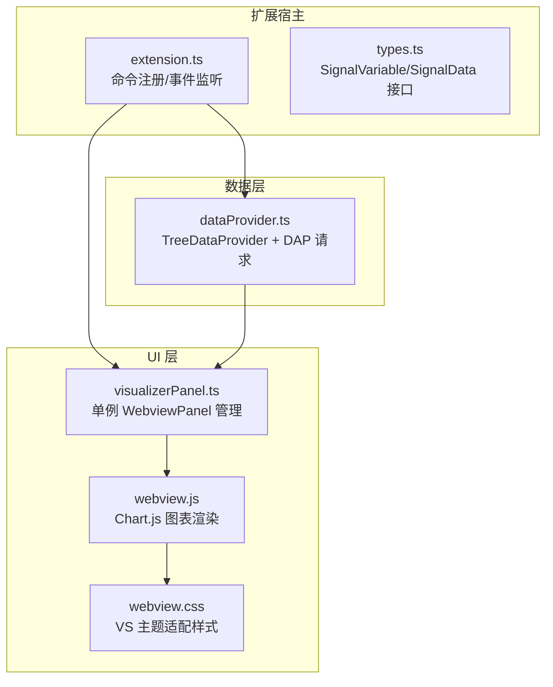
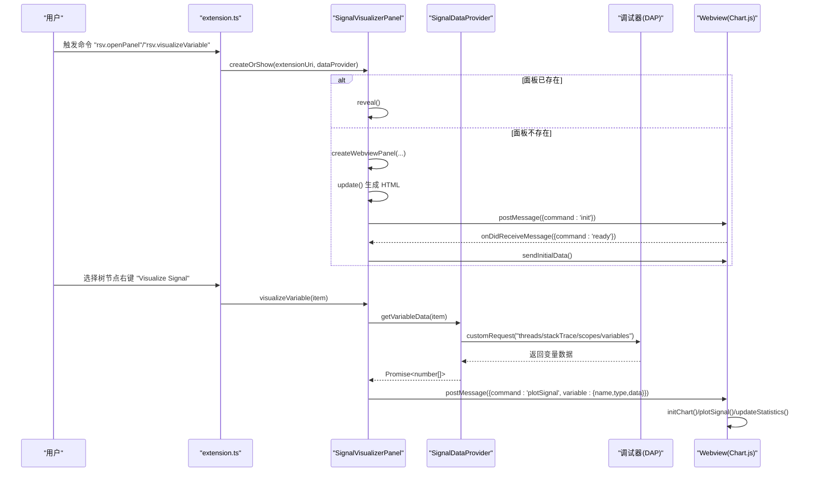
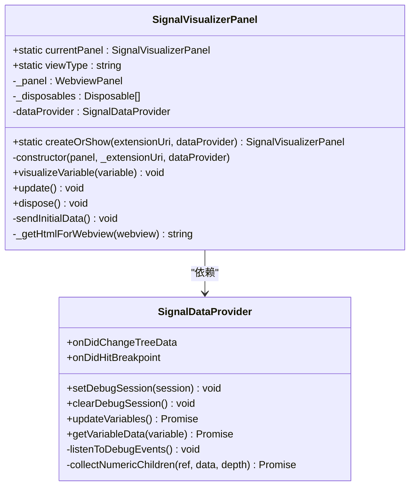
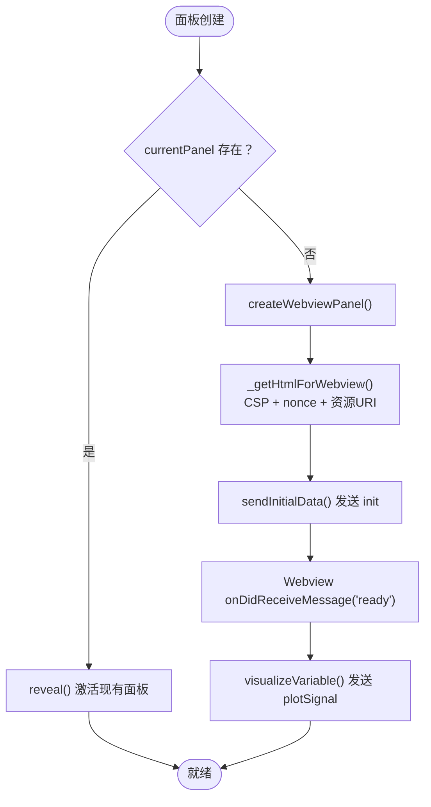
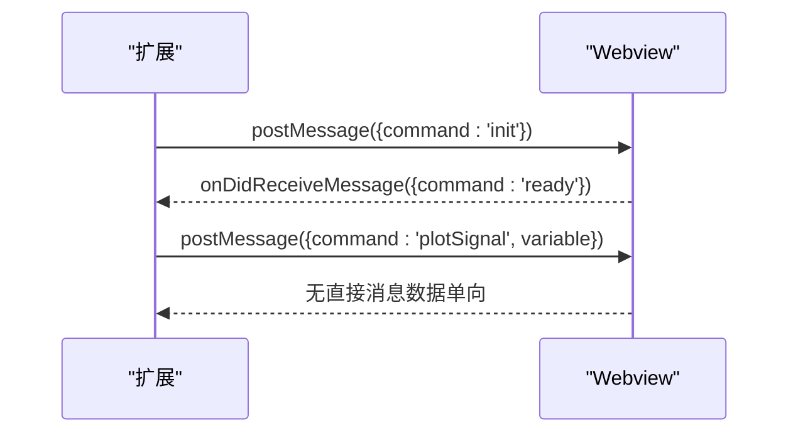
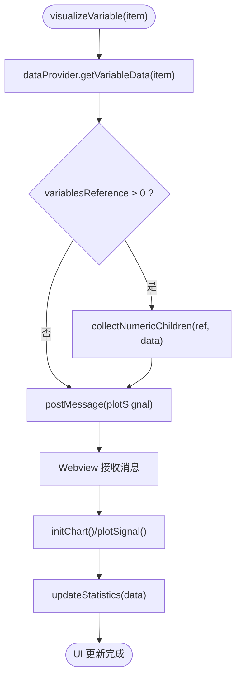
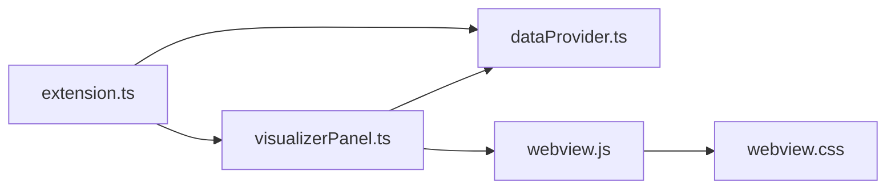

# 可视化面板管理

<cite>
**本文引用的文件**
- [src/extension.ts](file://src/extension.ts)
- [src/visualizerPanel.ts](file://src/visualizerPanel.ts)
- [src/dataProvider.ts](file://src/dataProvider.ts)
- [src/types.ts](file://src/types.ts)
- [assets/webview.js](file://assets/webview.js)
- [assets/webview.css](file://assets/webview.css)
- [package.json](file://package.json)
- [QUICKSTART.md](file://QUICKSTART.md)
- [test_radar.cpp](file://test_radar.cpp)
</cite>

## 目录
1. [简介](#简介)
2. [项目结构](#项目结构)
3. [核心组件](#核心组件)
4. [架构总览](#架构总览)
5. [详细组件分析](#详细组件分析)
6. [依赖关系分析](#依赖关系分析)
7. [性能考量](#性能考量)
8. [故障排查指南](#故障排查指南)
9. [结论](#结论)
10. [附录](#附录)

## 简介
本文件面向“可视化面板管理”模块，围绕 SignalVisualizerPanel 类的单例模式实现、Webview 生命周期管理、消息通信协议、面板状态与数据传递机制、UI 更新策略进行深入解析。文档同时提供代码级架构图与流程图，帮助读者快速理解从扩展入口到 Webview 图表渲染的完整链路。

## 项目结构
该项目采用 VSCode 扩展标准结构，核心文件分布如下：
- 扩展入口与命令注册：src/extension.ts
- 可视化面板管理：src/visualizerPanel.ts
- 调试数据提供者：src/dataProvider.ts
- 类型定义：src/types.ts
- Webview 前端：assets/webview.js、assets/webview.css
- 扩展元数据与激活事件：package.json
- 快速启动与测试程序：QUICKSTART.md、test_radar.cpp

**图表来源**
- [src/extension.ts:46-188](file://src/extension.ts#L46-L188)
- [src/dataProvider.ts:56-702](file://src/dataProvider.ts#L56-L702)
- [src/visualizerPanel.ts:44-424](file://src/visualizerPanel.ts#L44-L424)
- [assets/webview.js:50-96](file://assets/webview.js#L50-L96)
- [assets/webview.css:64-237](file://assets/webview.css#L64-L237)

**章节来源**
- [src/extension.ts:46-188](file://src/extension.ts#L46-L188)
- [package.json:13-84](file://package.json#L13-L84)

## 核心组件
- SignalVisualizerPanel：单例 WebviewPanel 管理器，负责面板创建、激活、销毁与消息通信。
- SignalDataProvider：TreeDataProvider 实现，负责与调试器交互、变量过滤与数据提取。
- SignalVariable/SignalData：类型定义，描述变量元数据与绘图数据结构。
- Webview 前端（webview.js/webview.css）：Chart.js 图表渲染与 UI 样式。

**章节来源**
- [src/visualizerPanel.ts:44-424](file://src/visualizerPanel.ts#L44-L424)
- [src/dataProvider.ts:56-702](file://src/dataProvider.ts#L56-L702)
- [src/types.ts:59-94](file://src/types.ts#L59-L94)
- [assets/webview.js:50-96](file://assets/webview.js#L50-L96)
- [assets/webview.css:64-237](file://assets/webview.css#L64-L237)

## 架构总览
扩展启动后，通过命令注册与调试事件监听建立数据与 UI 的桥接。SignalVisualizerPanel 采用单例模式，统一管理 WebviewPanel 生命周期；SignalDataProvider 通过 DAP 协议从调试器抓取变量数据，过滤后供面板可视化。

**图表来源**
- [src/extension.ts:78-98](file://src/extension.ts#L78-L98)
- [src/visualizerPanel.ts:102-164](file://src/visualizerPanel.ts#L102-L164)
- [src/visualizerPanel.ts:244-275](file://src/visualizerPanel.ts#L244-L275)
- [src/dataProvider.ts:243-399](file://src/dataProvider.ts#L243-L399)
- [assets/webview.js:70-96](file://assets/webview.js#L70-L96)

## 详细组件分析

### SignalVisualizerPanel 单例与 createOrShow 工厂方法
- 单例设计要点
  - 静态属性 currentPanel 保存唯一实例，避免重复创建。
  - 私有构造函数，强制通过静态工厂方法 createOrShow 获取实例。
  - 面板关闭时 dispose() 将 currentPanel 置空，支持后续重建。
- createOrShow 设计思路
  - 若 currentPanel 存在，直接 reveal() 激活现有面板。
  - 若不存在，创建 WebviewPanel，设置启用脚本、保留上下文、本地资源根目录。
  - 生成 HTML（含 CSP + nonce），注入 Chart.js 与自定义脚本。
  - 初始化消息通道：监听 Webview 的 ready 事件，发送握手消息；注册面板关闭事件清理资源。
- 面板状态与 UI 更新
  - update() 重新设置 HTML 内容，title 与 webview.html。
  - visualizeVariable() 通过 dataProvider 获取数值数组，封装为 plotSignal 消息发送至 Webview。

**图表来源**
- [src/visualizerPanel.ts:44-424](file://src/visualizerPanel.ts#L44-L424)
- [src/dataProvider.ts:56-702](file://src/dataProvider.ts#L56-L702)

**章节来源**
- [src/visualizerPanel.ts:102-164](file://src/visualizerPanel.ts#L102-L164)
- [src/visualizerPanel.ts:181-231](file://src/visualizerPanel.ts#L181-L231)
- [src/visualizerPanel.ts:244-275](file://src/visualizerPanel.ts#L244-L275)
- [src/visualizerPanel.ts:282-392](file://src/visualizerPanel.ts#L282-L392)

### Webview 生命周期管理
- 创建与激活
  - createWebviewPanel(viewType, title, showOptions, options) 创建面板。
  - enableScripts=true 允许 Chart.js 运行；retainContextWhenHidden=true 保留 DOM 状态。
  - localResourceRoots 指定 assets 目录，确保本地资源可访问。
- HTML 生成与安全
  - _getHtmlForWebview 生成完整 HTML，设置 CSP 与 nonce，加载本地样式与脚本。
  - asWebviewUri 将本地路径转换为 Webview 可访问 URI。
- 销毁与清理
  - onDidDispose 注册关闭回调，调用 dispose() 清理 currentPanel、面板与 Disposable 列表。
  - while 循环弹出并 dispose()，避免索引变化导致遗漏。

**图表来源**
- [src/visualizerPanel.ts:102-164](file://src/visualizerPanel.ts#L102-L164)
- [src/visualizerPanel.ts:244-275](file://src/visualizerPanel.ts#L244-L275)
- [assets/webview.js:70-96](file://assets/webview.js#L70-L96)

**章节来源**
- [src/visualizerPanel.ts:142-153](file://src/visualizerPanel.ts#L142-L153)
- [src/visualizerPanel.ts:317-392](file://src/visualizerPanel.ts#L317-L392)
- [src/visualizerPanel.ts:195-231](file://src/visualizerPanel.ts#L195-L231)
- [src/visualizerPanel.ts:407-423](file://src/visualizerPanel.ts#L407-L423)

### 消息通信协议
- VSCode 扩展 → Webview
  - handshake：扩展发送 {command:'init'}，Webview 收到后可进行初始化。
  - 数据传输：扩展发送 {command:'plotSignal', variable:{name,type,data}}。
- Webview → VSCode 扩展
  - 初始化：Webview 发送 {command:'ready'}，扩展据此准备数据。
- 消息格式与事件处理
  - 扩展侧：onDidReceiveMessage(message) 使用 switch-case 分发。
  - Webview 侧：window.addEventListener('message', ...) 处理 init/plotSignal。

**图表来源**
- [src/visualizerPanel.ts:207-222](file://src/visualizerPanel.ts#L207-L222)
- [src/visualizerPanel.ts:244-248](file://src/visualizerPanel.ts#L244-L248)
- [assets/webview.js:70-96](file://assets/webview.js#L70-L96)

**章节来源**
- [src/visualizerPanel.ts:207-222](file://src/visualizerPanel.ts#L207-L222)
- [assets/webview.js:70-96](file://assets/webview.js#L70-L96)

### 面板状态管理、数据传递与 UI 更新策略
- 状态管理
  - currentPanel 单例状态；面板关闭时置空，支持重建。
  - _disposables 管理事件订阅与资源，dispose() 时统一释放。
- 数据传递
  - visualizeVariable() 通过 dataProvider.getVariableData() 获取数值数组。
  - DAP 请求链：threads → stackTrace → scopes → variables，递归收集数值。
- UI 更新策略
  - Webview 初始化 Chart.js，响应 plotSignal 更新数据与统计。
  - 大数据集降采样（最多 10000 点）提升渲染性能。
  - 统计信息基于原始数据计算，避免降采样误差。

**图表来源**
- [src/visualizerPanel.ts:264-275](file://src/visualizerPanel.ts#L264-L275)
- [src/dataProvider.ts:515-531](file://src/dataProvider.ts#L515-L531)
- [src/dataProvider.ts:563-634](file://src/dataProvider.ts#L563-L634)
- [assets/webview.js:355-419](file://assets/webview.js#L355-L419)
- [assets/webview.js:456-493](file://assets/webview.js#L456-L493)

**章节来源**
- [src/dataProvider.ts:515-531](file://src/dataProvider.ts#L515-L531)
- [src/dataProvider.ts:563-634](file://src/dataProvider.ts#L563-L634)
- [assets/webview.js:355-419](file://assets/webview.js#L355-L419)
- [assets/webview.js:456-493](file://assets/webview.js#L456-L493)

### 面板初始化、配置与事件监听
- 面板初始化
  - createOrShow() 内部创建 WebviewPanel 并立即 update() 生成 HTML。
  - _getHtmlForWebview() 注入 CSP、nonce 与本地资源 URI。
- 配置选项
  - package.json 中的 rsv.* 配置项（自动显示、名称模式、最大数组大小）在 dataProvider 中读取。
- 事件监听
  - extension.ts 注册命令、调试会话切换与断点命中事件，自动触发面板展示与数据刷新。

**章节来源**
- [src/visualizerPanel.ts:142-153](file://src/visualizerPanel.ts#L142-L153)
- [src/visualizerPanel.ts:317-392](file://src/visualizerPanel.ts#L317-L392)
- [package.json:18-36](file://package.json#L18-L36)
- [src/extension.ts:139-146](file://src/extension.ts#L139-L146)
- [src/extension.ts:159-187](file://src/extension.ts#L159-L187)

## 依赖关系分析
- 扩展入口依赖数据提供者与可视化面板。
- 可视化面板依赖数据提供者与 Webview 资源。
- 数据提供者依赖 VSCode 调试 API 与 DAP 协议。
- Webview 前端依赖 Chart.js 与本地样式。

**图表来源**
- [src/extension.ts:27-29](file://src/extension.ts#L27-L29)
- [src/visualizerPanel.ts:28-30](file://src/visualizerPanel.ts#L28-L30)
- [assets/webview.js:1-27](file://assets/webview.js#L1-L27)

**章节来源**
- [src/extension.ts:27-29](file://src/extension.ts#L27-L29)
- [src/visualizerPanel.ts:28-30](file://src/visualizerPanel.ts#L28-L30)

## 性能考量
- 大数据集降采样
  - Webview 端对超过 10000 点的数据进行等间隔采样，保证渲染流畅。
- 保留上下文
  - retainContextWhenHidden=true，隐藏时保留 DOM，减少重复加载成本。
- 事件与资源释放
  - 所有事件订阅加入 _disposables，dispose() 时统一释放，避免内存泄漏。
- 渲染优化
  - Chart.js 配置中禁用点标记、使用直线张力，降低大数据集渲染开销。

**章节来源**
- [assets/webview.js:380-388](file://assets/webview.js#L380-L388)
- [src/visualizerPanel.ts:147-148](file://src/visualizerPanel.ts#L147-L148)
- [src/visualizerPanel.ts:417-423](file://src/visualizerPanel.ts#L417-L423)

## 故障排查指南
- 侧边栏无“Radar Signals”图标
  - 确认在 Extension Development Host 窗口中，并已启动调试会话。
- 信号变量列表为空
  - 确保调试器已暂停，变量名匹配配置模式（默认包含 *signal*, *data*, *pulse*, *sample*）。
- 图表不显示
  - 检查变量是否为数组类型且包含数值数据。
- 断点命中未自动弹窗
  - 检查 rsv.autoDisplayOnBreakpoint 配置项是否启用。
- 面板无法关闭或资源未释放
  - 确认面板关闭事件已触发 dispose()，currentPanel 已置空。

**章节来源**
- [QUICKSTART.md:31-41](file://QUICKSTART.md#L31-L41)
- [src/extension.ts:139-146](file://src/extension.ts#L139-L146)
- [src/visualizerPanel.ts:195](file://src/visualizerPanel.ts#L195)

## 结论
本模块通过单例模式的 SignalVisualizerPanel 统一管理 Webview 生命周期，结合 SignalDataProvider 的 DAP 数据抓取与过滤，形成从调试器到可视化面板的完整链路。消息协议简洁明确，前端具备大数据集降采样与统计信息展示能力。通过严格的资源释放与配置项管理，系统在性能与稳定性方面表现良好。

## 附录
- 测试程序 test_radar.cpp 生成脉冲、噪声与线性调频信号，便于断点调试与可视化验证。
- package.json 定义了激活事件、视图容器、命令与菜单项，确保扩展在调试场景下自动加载并提供 UI。

**章节来源**
- [test_radar.cpp:34-62](file://test_radar.cpp#L34-L62)
- [package.json:13-84](file://package.json#L13-L84)