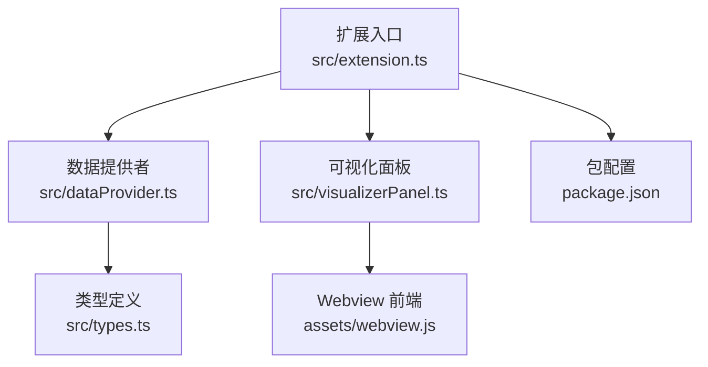
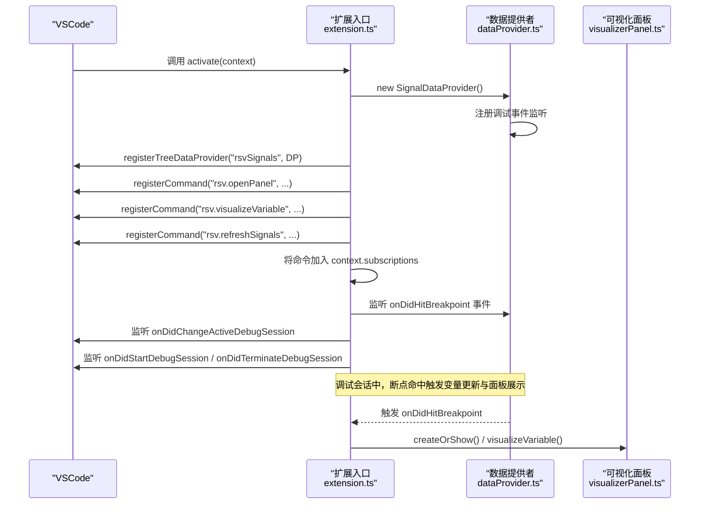
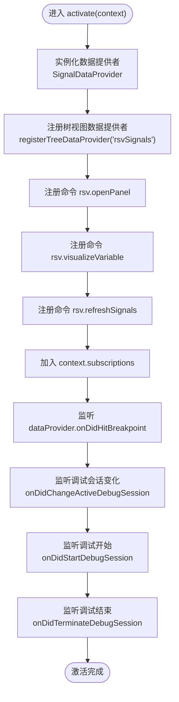
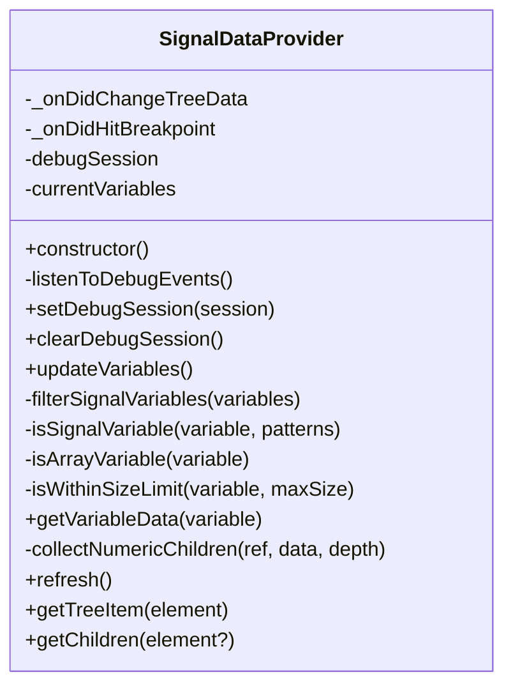
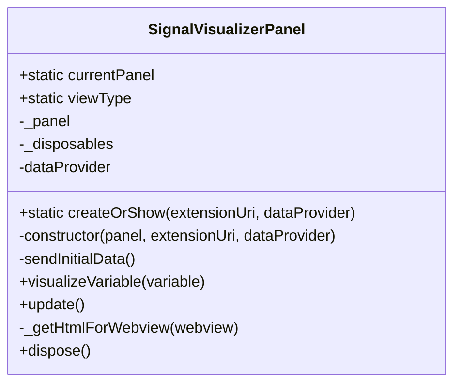
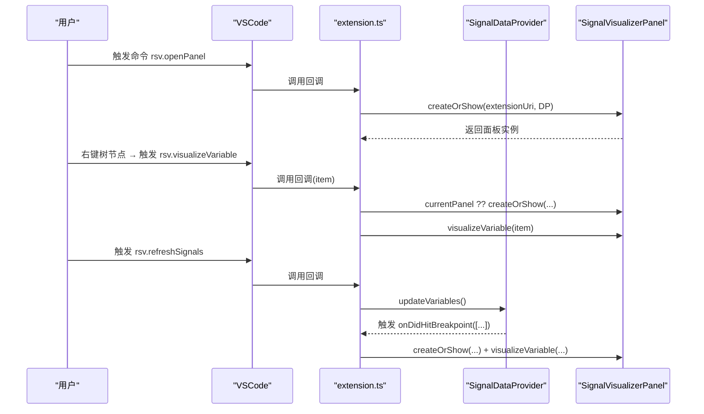
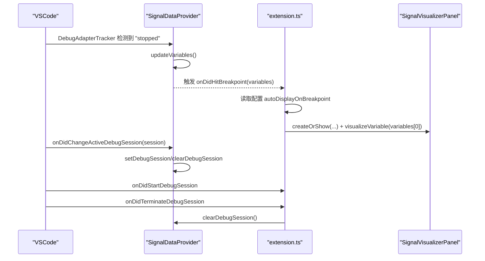
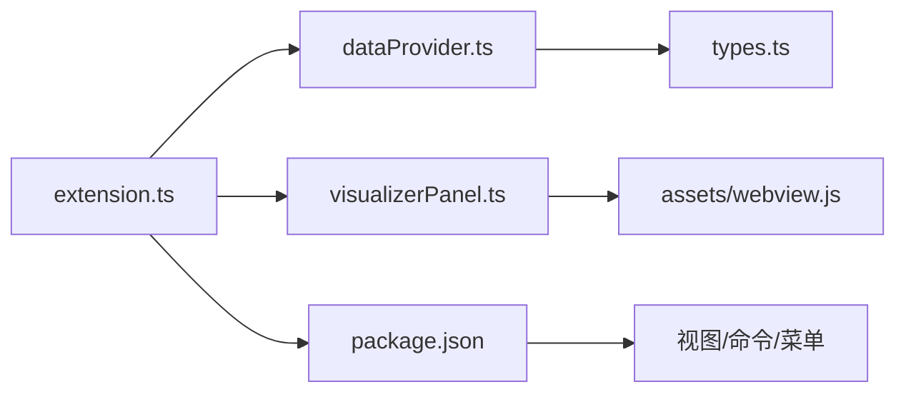

# 扩展入口点

<cite>
**本文引用的文件**
- [src/extension.ts](file://src/extension.ts)
- [package.json](file://package.json)
- [src/dataProvider.ts](file://src/dataProvider.ts)
- [src/visualizerPanel.ts](file://src/visualizerPanel.ts)
- [src/types.ts](file://src/types.ts)
- [assets/webview.js](file://assets/webview.js)
</cite>

## 目录
1. [简介](#简介)
2. [项目结构](#项目结构)
3. [核心组件](#核心组件)
4. [架构总览](#架构总览)
5. [详细组件分析](#详细组件分析)
6. [依赖分析](#依赖分析)
7. [性能考虑](#性能考虑)
8. [故障排查指南](#故障排查指南)
9. [结论](#结论)

## 简介
本文件围绕 VSCode 扩展的入口点进行深入技术解析，重点阐述扩展激活函数 activate() 的工作原理与控制流，涵盖数据提供者实例化、树视图注册、命令系统初始化、调试事件监听器注册、VSCode 扩展生命周期管理与资源清理策略。同时，详细说明三个核心命令的注册机制：rsv.openPanel、rsv.visualizeVariable、rsv.refreshSignals，并给出组件初始化顺序、依赖关系、错误处理与最佳实践建议。

## 项目结构
该项目采用“入口文件 + 数据提供者 + 可视化面板 + 类型定义 + Webview 前端”的分层组织方式，入口文件负责扩展生命周期与命令/事件注册，数据提供者负责与调试器交互并为树视图提供数据，可视化面板负责管理 Webview 并与前端脚本通信，类型定义统一约束数据结构。

**图表来源**
- [src/extension.ts:46-188](file://src/extension.ts#L46-L188)
- [src/dataProvider.ts:56-702](file://src/dataProvider.ts#L56-L702)
- [src/visualizerPanel.ts:44-424](file://src/visualizerPanel.ts#L44-L424)
- [src/types.ts:21-95](file://src/types.ts#L21-L95)
- [assets/webview.js:1-494](file://assets/webview.js#L1-L494)
- [package.json:1-102](file://package.json#L1-L102)

**章节来源**
- [src/extension.ts:46-188](file://src/extension.ts#L46-L188)
- [package.json:13-84](file://package.json#L13-L84)

## 核心组件
- 扩展入口（activate/deactivate）：负责扩展激活、命令注册、调试事件监听、生命周期资源管理。
- 数据提供者（SignalDataProvider）：实现 TreeDataProvider 接口，负责与调试器交互、变量过滤、树视图数据源与自定义事件。
- 可视化面板（SignalVisualizerPanel）：管理 WebviewPanel 生命周期、与前端通信、初始化图表与渲染。
- 类型定义（SignalVariable/SignalData）：统一变量元数据与绘图数据结构。
- Webview 前端（assets/webview.js）：Chart.js 图表初始化、消息处理、数据渲染与统计计算。

**章节来源**
- [src/extension.ts:46-188](file://src/extension.ts#L46-L188)
- [src/dataProvider.ts:56-702](file://src/dataProvider.ts#L56-L702)
- [src/visualizerPanel.ts:44-424](file://src/visualizerPanel.ts#L44-L424)
- [src/types.ts:21-95](file://src/types.ts#L21-L95)
- [assets/webview.js:1-494](file://assets/webview.js#L1-L494)

## 架构总览
扩展入口点通过 activate() 完成以下关键流程：
1) 实例化数据提供者，内部注册调试事件监听；
2) 注册树视图数据提供者并与 package.json 中的视图绑定；
3) 注册三个命令（rsv.openPanel、rsv.visualizeVariable、rsv.refreshSignals）；
4) 将命令与事件监听器加入 context.subscriptions；
5) 监听断点命中与调试会话状态变化，驱动自动展示与数据刷新。

**图表来源**
- [src/extension.ts:46-188](file://src/extension.ts#L46-L188)
- [src/dataProvider.ts:138-205](file://src/dataProvider.ts#L138-L205)
- [src/visualizerPanel.ts:102-164](file://src/visualizerPanel.ts#L102-L164)

## 详细组件分析

### 扩展入口点（activate/deactivate）
- 激活时机：由 package.json 的 activationEvents 控制（onDebug），当用户开始调试时 VSCode 加载扩展并调用 activate(context)。
- 生命周期管理：context.subscriptions 用于集中管理命令、事件监听器等资源，VSCode 停用扩展时自动调用 dispose()。
- 初始化顺序与依赖：
  1) 实例化数据提供者（内部注册调试事件监听）；
  2) 注册树视图数据提供者；
  3) 注册三个命令；
  4) 将命令加入 subscriptions；
  5) 监听断点命中与调试会话状态变化。

**图表来源**
- [src/extension.ts:46-188](file://src/extension.ts#L46-L188)

**章节来源**
- [src/extension.ts:46-188](file://src/extension.ts#L46-L188)
- [package.json:13-15](file://package.json#L13-L15)

### 数据提供者（SignalDataProvider）
- 角色与职责：实现 TreeDataProvider 接口，负责与调试器交互（DAP 四级请求链）、变量过滤、树视图数据源、自定义断点命中事件。
- 关键机制：
  - 调试事件监听：通过 DebugAdapterTrackerFactory 拦截 DAP 消息，检测 "stopped" 事件后自动更新变量列表；
  - 变量过滤：基于名称模式、数组类型与大小限制；
  - 数据获取：递归收集复合变量的数值，支持 std::vector 等复杂结构；
  - 事件驱动：通过 onDidChangeTreeData 与自定义 onDidHitBreakpoint 驱动 UI 更新与自动展示。

**图表来源**
- [src/dataProvider.ts:56-702](file://src/dataProvider.ts#L56-L702)

**章节来源**
- [src/dataProvider.ts:56-702](file://src/dataProvider.ts#L56-L702)

### 可视化面板（SignalVisualizerPanel）
- 角色与职责：管理 WebviewPanel 生命周期、初始化 HTML 内容、与前端通信、接收数据并渲染图表。
- 关键机制：
  - 单例模式：createOrShow() 控制唯一实例；
  - 安全加载：通过 asWebviewUri 与 CSP nonce 加载本地资源；
  - 通信协议：postMessage 与 onDidReceiveMessage 双向通信；
  - 资源清理：dispose() 释放面板与事件监听。

**图表来源**
- [src/visualizerPanel.ts:44-424](file://src/visualizerPanel.ts#L44-L424)

**章节来源**
- [src/visualizerPanel.ts:44-424](file://src/visualizerPanel.ts#L44-L424)

### 命令系统与注册机制
- rsv.openPanel：打开/激活可视化面板，采用单例模式，若面板已存在则激活，否则创建新面板。
- rsv.visualizeVariable：在树视图右键菜单中触发，自动获取面板实例并可视化选中变量。
- rsv.refreshSignals：手动刷新变量列表，触发数据提供者的 updateVariables()。

**图表来源**
- [src/extension.ts:78-111](file://src/extension.ts#L78-L111)
- [src/dataProvider.ts:394-394](file://src/dataProvider.ts#L394-L394)
- [src/visualizerPanel.ts:264-275](file://src/visualizerPanel.ts#L264-L275)

**章节来源**
- [src/extension.ts:78-111](file://src/extension.ts#L78-L111)
- [package.json:55-84](file://package.json#L55-L84)

### 调试事件监听器注册
- 断点命中监听：通过 dataProvider.onDidHitBreakpoint 事件，结合用户配置实现“断点命中 → 自动展示可视化面板”。
- 调试会话监听：
  - onDidChangeActiveDebugSession：切换/结束调试会话时更新数据提供者的会话状态；
  - onDidStartDebugSession：调试开始时提示用户；
  - onDidTerminateDebugSession：调试结束时清理数据并刷新视图。

**图表来源**
- [src/dataProvider.ts:197-204](file://src/dataProvider.ts#L197-L204)
- [src/extension.ts:139-187](file://src/extension.ts#L139-L187)

**章节来源**
- [src/dataProvider.ts:138-205](file://src/dataProvider.ts#L138-L205)
- [src/extension.ts:139-187](file://src/extension.ts#L139-L187)

### VSCode 扩展生命周期管理与资源清理
- context.subscriptions：所有注册类资源（命令、事件监听、视图提供者等）均需加入，VSCode 停用时自动 dispose()。
- 数据提供者与可视化面板的资源清理：
  - 数据提供者：通过事件监听器与会话状态管理避免悬挂引用；
  - 可视化面板：dispose() 中释放面板与事件监听，确保单例状态正确复位。

**章节来源**
- [src/extension.ts:114-124](file://src/extension.ts#L114-L124)
- [src/visualizerPanel.ts:407-423](file://src/visualizerPanel.ts#L407-L423)

## 依赖分析
- 入口点依赖数据提供者与可视化面板；数据提供者依赖调试器（DAP）与类型定义；可视化面板依赖 Webview 前端脚本。
- package.json 中的 contributes 定义了视图容器、视图、命令与菜单项，与入口点注册形成强耦合。

**图表来源**
- [src/extension.ts:27-29](file://src/extension.ts#L27-L29)
- [src/dataProvider.ts:35-36](file://src/dataProvider.ts#L35-L36)
- [src/visualizerPanel.ts:28-30](file://src/visualizerPanel.ts#L28-L30)
- [package.json:38-84](file://package.json#L38-L84)

**章节来源**
- [package.json:38-84](file://package.json#L38-L84)

## 性能考虑
- 大数据集降采样：Webview 前端对超过阈值的点数进行等间隔采样，保证渲染性能与交互流畅。
- 事件驱动更新：树视图通过 onDidChangeTreeData 事件驱动刷新，避免轮询带来的性能浪费。
- 递归深度限制：数据提供者在递归收集复合变量数值时设置最大深度，防止异常数据结构导致无限递归。

**章节来源**
- [assets/webview.js:380-388](file://assets/webview.js#L380-L388)
- [src/dataProvider.ts:570-572](file://src/dataProvider.ts#L570-L572)

## 故障排查指南
- 侧边栏未显示“Radar Signals”图标：确认在扩展开发宿主窗口中并已启动调试会话。
- 信号变量列表为空：确认调试器已暂停，变量名符合配置的模式（默认包含 *signal*, *data*, *pulse*, *sample*）。
- 图表不显示：检查变量类型为数组且包含数值数据。
- 断点命中未自动展示面板：检查配置项 rsv.autoDisplayOnBreakpoint 是否启用，以及数据提供者是否成功更新变量列表。

**章节来源**
- [package.json:18-36](file://package.json#L18-L36)
- [src/extension.ts:139-146](file://src/extension.ts#L139-L146)

## 结论
扩展入口点通过 activate() 将数据提供者、树视图、命令系统与调试事件监听有机整合，形成“断点命中 → 自动刷新 → 自动展示”的闭环体验。借助 context.subscriptions 与单例模式，扩展在生命周期管理与资源清理方面遵循 VSCode 最佳实践。数据提供者与可视化面板分别承担“数据获取/过滤”和“UI 渲染/交互”，二者通过事件与消息通信解耦协作，具备良好的可维护性与扩展性。