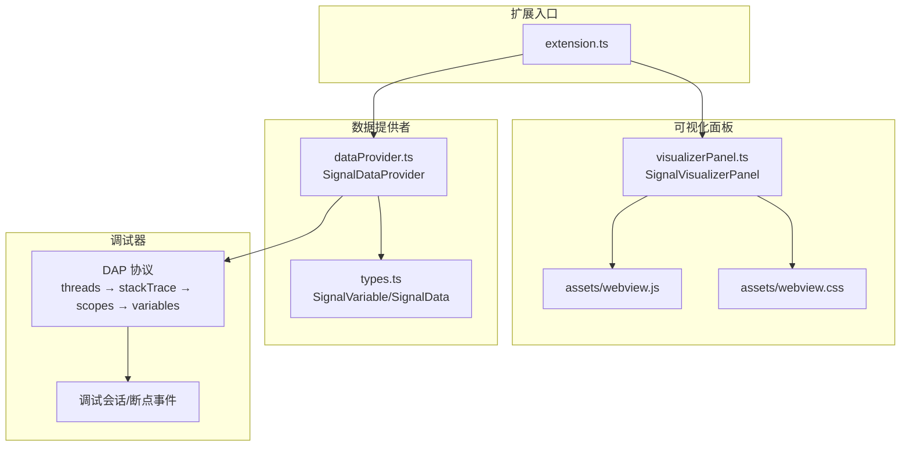
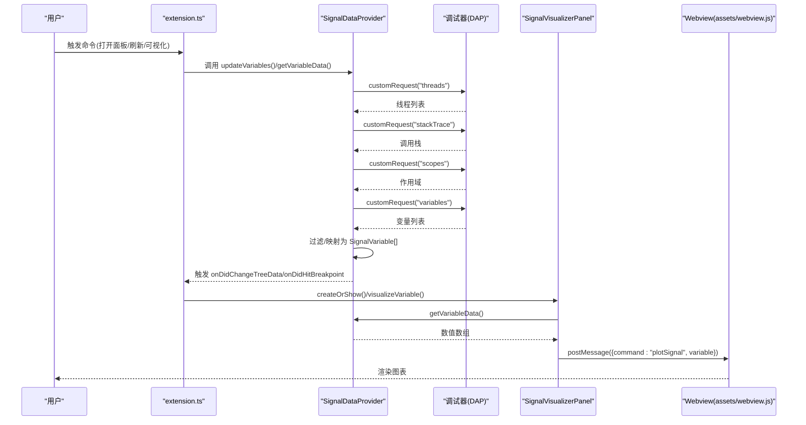
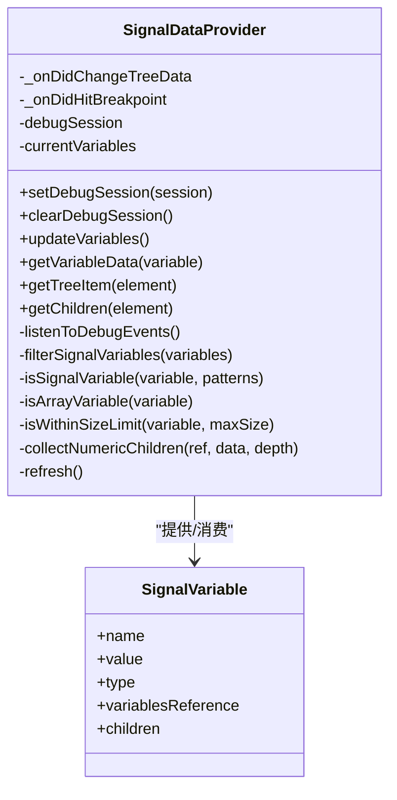
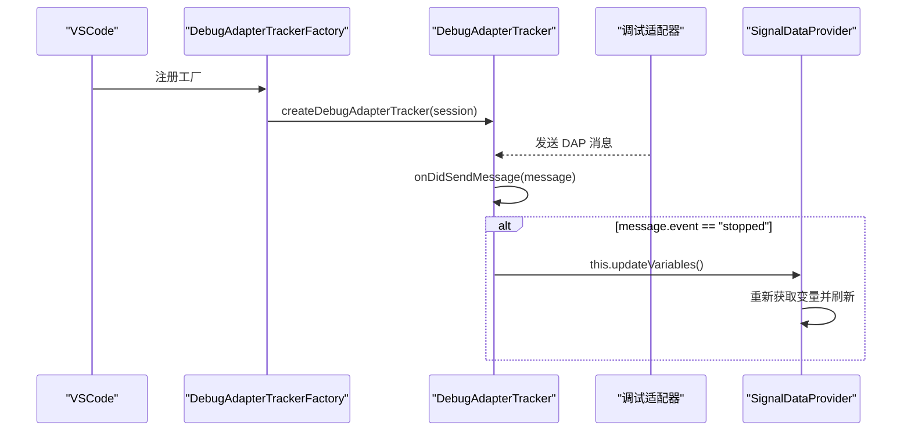
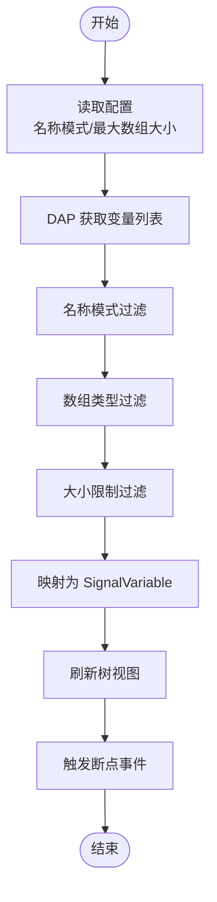
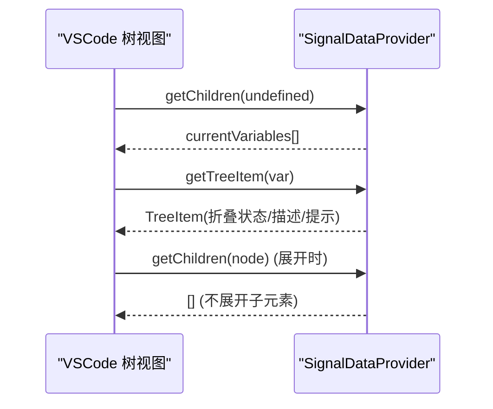
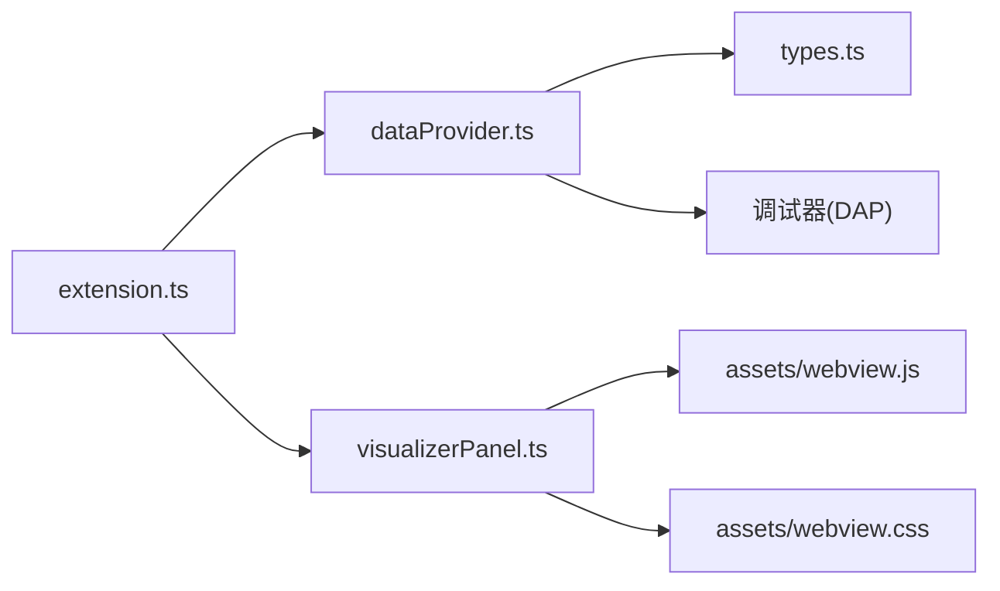

# 数据提供者模块

<cite>
**本文引用的文件**
- [extension.ts](file://src/extension.ts)
- [dataProvider.ts](file://src/dataProvider.ts)
- [visualizerPanel.ts](file://src/visualizerPanel.ts)
- [types.ts](file://src/types.ts)
- [package.json](file://package.json)
- [test_radar.cpp](file://test_radar.cpp)
- [webview.js](file://assets/webview.js)
- [webview.css](file://assets/webview.css)
</cite>

## 目录
1. [简介](#简介)
2. [项目结构](#项目结构)
3. [核心组件](#核心组件)
4. [架构总览](#架构总览)
5. [详细组件分析](#详细组件分析)
6. [依赖关系分析](#依赖关系分析)
7. [性能考虑](#性能考虑)
8. [故障排查指南](#故障排查指南)
9. [结论](#结论)
10. [附录](#附录)

## 简介
本文件面向“数据提供者模块”的实现，围绕 SignalDataProvider 类展开，系统性阐述其设计理念、接口实现、调试器集成机制、信号变量检测算法、数据缓存与性能优化、内存管理策略，并结合扩展入口、可视化面板与前端资源，给出完整的端到端流程说明。读者无需深入底层即可理解模块如何从调试器获取变量、过滤信号、为树视图提供数据，并将信号数据传递至 Webview 进行可视化。

## 项目结构
该项目采用 VSCode 扩展标准结构，核心文件如下：
- 扩展入口：负责注册命令、树视图、调试事件监听与面板管理
- 数据提供者：实现 TreeDataProvider 接口，负责变量获取、过滤与数据提取
- 可视化面板：管理 Webview 面板，承载图表渲染
- 类型定义：统一数据结构，确保前后端契约一致
- 资源文件：前端 JS/CSS、图表库与测试程序

**图表来源**
- [extension.ts:46-188](file://src/extension.ts#L46-L188)
- [dataProvider.ts:56-703](file://src/dataProvider.ts#L56-L703)
- [visualizerPanel.ts:44-451](file://src/visualizerPanel.ts#L44-L451)
- [types.ts:21-95](file://src/types.ts#L21-L95)

**章节来源**
- [extension.ts:1-200](file://src/extension.ts#L1-L200)
- [package.json:1-102](file://package.json#L1-L102)

## 核心组件
- SignalDataProvider：实现 VSCode TreeDataProvider 接口，负责：
  - 监听调试事件（断点命中、会话切换）
  - 通过 DAP 四级请求链获取变量
  - 过滤信号变量（名称模式、数组类型、大小限制）
  - 为树视图提供节点数据（getTreeItem/getChildren）
  - 递归提取变量数值用于绘图（getVariableData）
- SignalVisualizerPanel：管理 Webview 面板，负责：
  - 创建/复用面板、生命周期管理
  - 与扩展通信、接收变量数据并渲染图表
- SignalVariable/SignalData：类型定义，约束前后端数据结构
- extension.ts：扩展入口，注册命令、树视图、调试事件监听

**章节来源**
- [dataProvider.ts:56-703](file://src/dataProvider.ts#L56-L703)
- [visualizerPanel.ts:44-451](file://src/visualizerPanel.ts#L44-L451)
- [types.ts:21-95](file://src/types.ts#L21-L95)
- [extension.ts:46-188](file://src/extension.ts#L46-L188)

## 架构总览
数据提供者模块的运行时架构如下：

**图表来源**
- [extension.ts:78-146](file://src/extension.ts#L78-L146)
- [dataProvider.ts:243-399](file://src/dataProvider.ts#L243-L399)
- [visualizerPanel.ts:264-275](file://src/visualizerPanel.ts#L264-L275)
- [webview.js:70-96](file://assets/webview.js#L70-L96)

## 详细组件分析

### SignalDataProvider 设计与实现
- 接口实现
  - onDidChangeTreeData：事件驱动刷新树视图
  - onDidHitBreakpoint：自定义断点命中事件，供扩展层自动展示面板
  - setDebugSession/clearDebugSession：维护调试会话状态
  - getTreeItem/getChildren：为树视图提供节点 UI 与层级
- 调试器集成
  - DebugAdapterTrackerFactory：拦截 DAP 消息，检测 "stopped" 事件，触发变量更新
  - DAP 四级请求链：threads → stackTrace → scopes → variables
- 变量过滤与提取
  - 过滤规则：名称模式匹配、数组类型判断、大小限制
  - 数值提取：递归遍历复合变量，收集叶子节点数值
- 数据缓存与刷新
  - currentVariables 缓存当前过滤后的变量列表
  - refresh() 触发视图更新；updateVariables() 重新拉取并刷新

**图表来源**
- [dataProvider.ts:56-703](file://src/dataProvider.ts#L56-L703)
- [types.ts:59-65](file://src/types.ts#L59-L65)

**章节来源**
- [dataProvider.ts:56-703](file://src/dataProvider.ts#L56-L703)
- [types.ts:21-95](file://src/types.ts#L21-L95)

### 调试器集成机制
- DebugAdapterTrackerFactory
  - 为所有调试适配器类型注册跟踪器
  - onDidSendMessage 拦截 DAP 事件，识别 "stopped"（断点/步进/暂停）
  - 触发 this.updateVariables() 自动刷新变量列表
- DAP 协议使用
  - 通过 debugSession.customRequest() 发送 "threads"/"stackTrace"/"scopes"/"variables"
  - 依据 variablesReference 递归获取子元素
- 断点事件监听
  - onDidChangeActiveDebugSession：记录当前会话
  - onDidReceiveDebugSessionCustomEvent：仅接收自定义事件，不适用于标准 "stopped"

**图表来源**
- [dataProvider.ts:175-204](file://src/dataProvider.ts#L175-L204)

**章节来源**
- [dataProvider.ts:138-205](file://src/dataProvider.ts#L138-L205)

### 信号变量检测算法
- 变量过滤规则
  - 名称模式匹配：将通配符模式转换为正则，匹配变量名（大小写不敏感）
  - 数组类型判断：基于显示值包含 "[0]" 或 "array"，或 variablesReference > 0
  - 大小限制：从显示值提取数组长度，不超过配置阈值
- 数据提取逻辑
  - getVariableData：若变量有子元素，递归收集数值
  - collectNumericChildren：区分数组元素与嵌套结构，优先尝试直接解析数值，否则递归
  - 递归深度限制：防止异常数据结构导致无限递归
- 类型判断机制
  - 依赖 DAP 返回的 variablesReference 与 value 字段
  - 通过正则与字符串包含判断，兼容不同调试器的 pretty-print 输出

**图表来源**
- [dataProvider.ts:414-441](file://src/dataProvider.ts#L414-L441)
- [dataProvider.ts:454-499](file://src/dataProvider.ts#L454-L499)

**章节来源**
- [dataProvider.ts:414-499](file://src/dataProvider.ts#L414-L499)

### 数据缓存策略与性能优化
- 缓存策略
  - currentVariables：缓存过滤后的变量列表，避免重复 DAP 请求
  - Webview 面板：retainContextWhenHidden=true，隐藏时保留上下文，提升切换体验
- 性能优化
  - DAP 请求链：按需分层请求，减少一次性传输
  - 递归深度限制：防止深层嵌套导致的性能问题
  - Webview 渲染降采样：超过阈值时等间隔采样，控制渲染点数
  - 事件驱动刷新：仅在数据变化时触发视图更新
- 内存管理
  - 所有注册的事件监听与面板资源均纳入 Disposable 管理
  - 面板 dispose() 时释放事件监听与面板实例

**章节来源**
- [dataProvider.ts:113](file://src/dataProvider.ts#L113)
- [visualizerPanel.ts:148-152](file://src/visualizerPanel.ts#L148-L152)
- [webview.js:380-388](file://assets/webview.js#L380-L388)
- [visualizerPanel.ts:407-423](file://src/visualizerPanel.ts#L407-L423)

### getTreeItem() 与 getChildren() 实现细节
- getTreeItem(element)
  - 基于 SignalVariable 构造 TreeItem
  - 叶子节点：None；有子节点：Collapsed（可折叠）
  - description 显示类型；tooltip 显示名称与值；contextValue 用于菜单条件
- getChildren(element)
  - element 为 undefined：返回所有信号变量（根节点）
  - element 非 undefined：返回空数组（本扩展不展开子元素）

**图表来源**
- [dataProvider.ts:670-701](file://src/dataProvider.ts#L670-L701)

**章节来源**
- [dataProvider.ts:670-701](file://src/dataProvider.ts#L670-L701)

### 调试器兼容性与错误恢复
- 兼容性处理
  - 通过 DebugAdapterTrackerFactory 拦截所有 DAP 消息，确保捕获 "stopped"
  - 支持多调试器类型（'*'），自动适配不同调试器
- 错误恢复
  - updateVariables() 包裹 try/catch，失败时记录日志
  - getVariableData() 捕获异常并提示用户
  - clearDebugSession() 清空状态，避免残留数据

**章节来源**
- [dataProvider.ts:175-204](file://src/dataProvider.ts#L175-L204)
- [dataProvider.ts:396-398](file://src/dataProvider.ts#L396-L398)
- [dataProvider.ts:515-531](file://src/dataProvider.ts#L515-L531)

### 配置选项说明
- rsv.autoDisplayOnBreakpoint：断点命中后是否自动展示面板
- rsv.signalNamePatterns：识别信号的变量名模式（默认包含 *signal*, *data*, *pulse*, *sample*）
- rsv.maxArraySize：最大数组大小，超过则不自动可视化

**章节来源**
- [package.json:21-35](file://package.json#L21-L35)

## 依赖关系分析
- 扩展入口依赖数据提供者与可视化面板
- 数据提供者依赖 DAP 协议与调试会话
- 可视化面板依赖前端资源与数据提供者
- 类型定义贯穿前后端契约

**图表来源**
- [extension.ts:27-29](file://src/extension.ts#L27-L29)
- [dataProvider.ts:35-36](file://src/dataProvider.ts#L35-L36)
- [visualizerPanel.ts:28-30](file://src/visualizerPanel.ts#L28-L30)

**章节来源**
- [extension.ts:27-29](file://src/extension.ts#L27-L29)
- [dataProvider.ts:35-36](file://src/dataProvider.ts#L35-L36)
- [visualizerPanel.ts:28-30](file://src/visualizerPanel.ts#L28-L30)

## 性能考虑
- DAP 请求分层：避免一次性请求过多数据
- 递归深度限制：防止异常数据结构导致性能问题
- Webview 降采样：大数据集时降低渲染点数
- 事件驱动刷新：仅在必要时更新 UI
- 面板上下文保留：隐藏时保留状态，避免重复初始化

[本节为通用指导，无需列出章节来源]

## 故障排查指南
- 侧边栏未显示 Radar Signals
  - 确认在扩展开发宿主窗口中启动调试会话
- 信号变量列表为空
  - 确认调试器已暂停，变量名符合配置模式
- 图表不显示
  - 检查变量是否为数组类型且包含数值数据
- 断点命中未自动弹窗
  - 检查 rsv.autoDisplayOnBreakpoint 配置
  - 若调试器不兼容，可使用“刷新信号变量”命令手动触发

**章节来源**
- [QUICKSTART.md:31-41](file://QUICKSTART.md#L31-L41)
- [extension.ts:139-146](file://src/extension.ts#L139-L146)

## 结论
数据提供者模块通过 DebugAdapterTrackerFactory 与 DAP 协议紧密集成调试器，实现断点命中后的自动变量刷新与信号筛选；借助事件驱动与缓存策略，兼顾性能与用户体验；配合可视化面板与前端资源，形成从变量提取到波形可视化的完整链路。模块设计清晰、扩展性强，便于后续迭代与兼容更多调试器。

[本节为总结性内容，无需列出章节来源]

## 附录

### 代码示例路径参考
- getTreeItem() 实现路径：[dataProvider.ts:670-679](file://src/dataProvider.ts#L670-L679)
- getChildren() 实现路径：[dataProvider.ts:696-701](file://src/dataProvider.ts#L696-L701)
- updateVariables() 核心流程路径：[dataProvider.ts:243-399](file://src/dataProvider.ts#L243-L399)
- getVariableData() 与递归提取路径：[dataProvider.ts:515-634](file://src/dataProvider.ts#L515-L634)
- 断点事件拦截与刷新路径：[dataProvider.ts:197-204](file://src/dataProvider.ts#L197-L204)
- 扩展入口命令注册与面板管理路径：[extension.ts:78-146](file://src/extension.ts#L78-L146)
- Webview 初始化与绘图路径：[visualizerPanel.ts:282-392](file://src/visualizerPanel.ts#L282-L392), [webview.js:355-419](file://assets/webview.js#L355-L419)

**章节来源**
- [dataProvider.ts:670-701](file://src/dataProvider.ts#L670-L701)
- [dataProvider.ts:243-399](file://src/dataProvider.ts#L243-L399)
- [dataProvider.ts:515-634](file://src/dataProvider.ts#L515-L634)
- [extension.ts:78-146](file://src/extension.ts#L78-L146)
- [visualizerPanel.ts:282-392](file://src/visualizerPanel.ts#L282-L392)
- [webview.js:355-419](file://assets/webview.js#L355-L419)