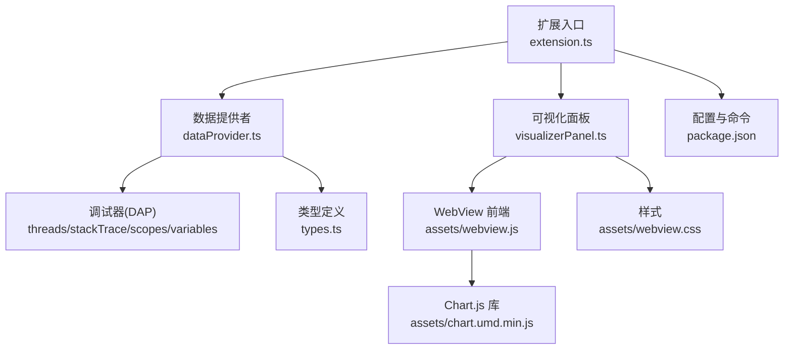
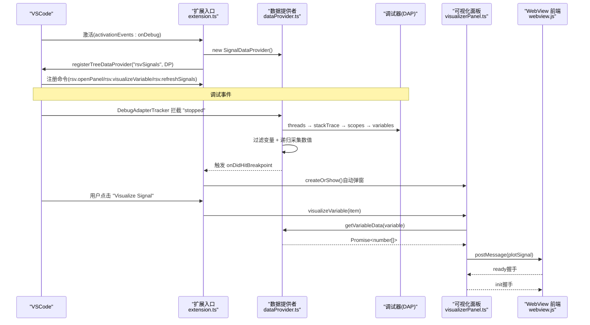
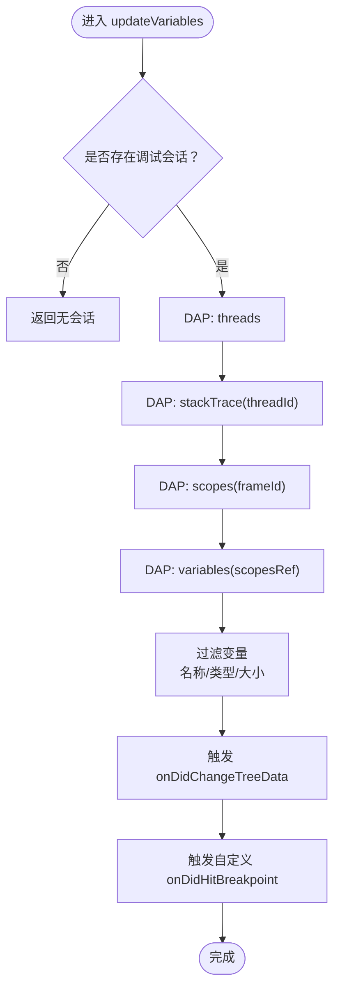
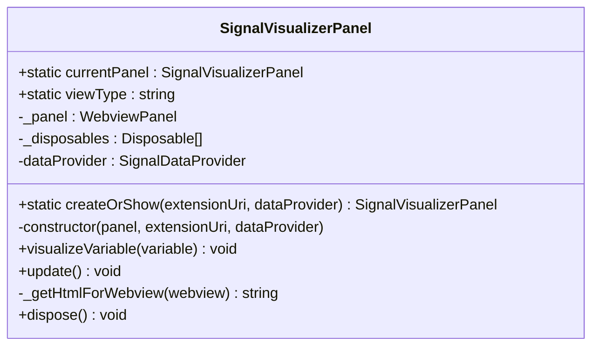
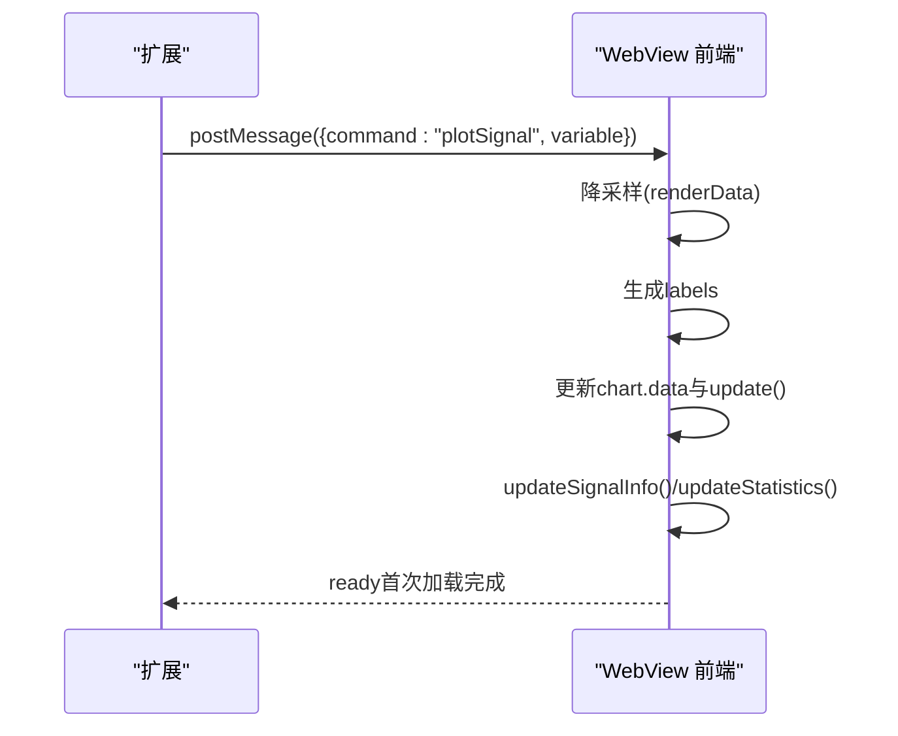
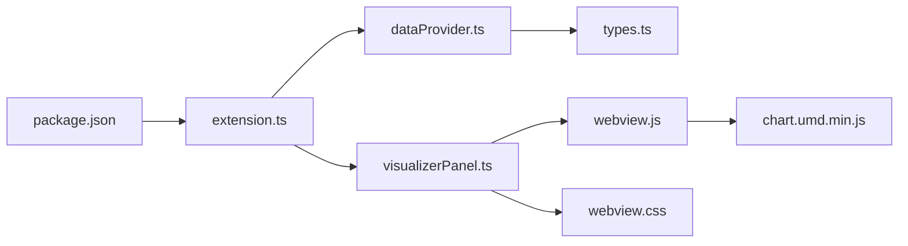

# 核心功能实现

<cite>
**本文引用的文件**
- [package.json](file://package.json)
- [extension.ts](file://src/extension.ts)
- [dataProvider.ts](file://src/dataProvider.ts)
- [visualizerPanel.ts](file://src/visualizerPanel.ts)
- [types.ts](file://src/types.ts)
- [webview.js](file://assets/webview.js)
- [webview.css](file://assets/webview.css)
- [test_radar.cpp](file://test_radar.cpp)
- [QUICKSTART.md](file://QUICKSTART.md)
</cite>

## 目录
1. [简介](#简介)
2. [项目结构](#项目结构)
3. [核心组件](#核心组件)
4. [架构总览](#架构总览)
5. [详细组件分析](#详细组件分析)
6. [依赖分析](#依赖分析)
7. [性能考虑](#性能考虑)
8. [故障排查指南](#故障排查指南)
9. [结论](#结论)
10. [附录](#附录)

## 简介
本项目为 VSCode 扩展，旨在在 GPU/本地调试过程中可视化雷达信号变量。核心目标包括：
- 通过调试事件自动发现并筛选信号变量
- 提供树视图展示与手动/自动可视化
- 通过 WebView 面板实时渲染波形图
- 支持断点命中自动弹窗与手动刷新

项目采用 VSCode 扩展标准架构：扩展入口负责注册命令与事件监听；数据提供者负责与调试器交互并过滤变量；可视化面板管理 WebView 生命周期与消息通信。

## 项目结构
- 扩展入口与贡献项：package.json 定义激活事件、命令、视图容器与菜单；extension.ts 注册命令与调试事件监听。
- 数据层：dataProvider.ts 实现 TreeDataProvider 接口，基于 DAP 协议抓取变量并过滤。
- 视图层：visualizerPanel.ts 管理单例 WebView 面板，负责 HTML 生成、消息通信与资源加载。
- 类型定义：types.ts 统一 SignalVariable/SignalData 接口。
- 前端资源：assets/webview.js（Chart.js 图表与消息处理）、assets/webview.css（主题适配样式）。
- 测试程序：test_radar.cpp 生成脉冲、噪声、线性调频等信号，便于调试验证。

**图表来源**
- [extension.ts:46-188](file://src/extension.ts#L46-L188)
- [dataProvider.ts:56-703](file://src/dataProvider.ts#L56-L703)
- [visualizerPanel.ts:44-451](file://src/visualizerPanel.ts#L44-L451)
- [webview.js:1-494](file://assets/webview.js#L1-L494)
- [webview.css:1-237](file://assets/webview.css#L1-L237)
- [package.json:13-85](file://package.json#L13-L85)

**章节来源**
- [package.json:13-85](file://package.json#L13-L85)
- [extension.ts:46-188](file://src/extension.ts#L46-L188)
- [QUICKSTART.md:42-57](file://QUICKSTART.md#L42-L57)

## 核心组件
- 扩展入口与命令系统
  - 注册三个命令：打开面板、可视化变量、刷新变量列表。
  - 通过 context.subscriptions 管理生命周期，确保资源释放。
  - 监听调试会话事件，实现断点命中自动展示与手动刷新。
- 数据提供者（TreeDataProvider）
  - 实现 getTreeItem()/getChildren()，暴露 onDidChangeTreeData 事件。
  - 通过 DebugAdapterTrackerFactory 拦截 DAP "stopped" 事件，自动更新变量列表。
  - 过滤逻辑：名称模式匹配、数组类型判断、大小限制。
  - 递归采集变量数值，支持 vector 等复杂结构。
- 可视化面板（单例 WebView）
  - 单例模式：currentPanel 静态属性与 createOrShow 工厂方法。
  - 生命周期管理：onDidDispose、dispose() 清理资源。
  - 消息协议：扩展 → WebView 发送 plotSignal；WebView → 扩展发送 ready。
  - 安全策略：CSP + nonce，本地资源通过 asWebviewUri 加载。
- 类型系统
  - SignalVariable：树节点元数据（名称、类型、DAP 引用、是否可折叠）。
  - SignalData：绘图数据载体（名称、数值数组、类型）。

**章节来源**
- [extension.ts:66-124](file://src/extension.ts#L66-L124)
- [extension.ts:126-188](file://src/extension.ts#L126-L188)
- [dataProvider.ts:56-703](file://src/dataProvider.ts#L56-L703)
- [visualizerPanel.ts:44-451](file://src/visualizerPanel.ts#L44-L451)
- [types.ts:59-94](file://src/types.ts#L59-L94)

## 架构总览
扩展采用“事件驱动 + 单例面板”的架构：
- 事件驱动：调试事件触发数据更新；自定义事件触发自动弹窗。
- 单例面板：避免重复创建，复用现有面板。
- DAP 协议：四步请求链获取变量，再递归采集数值。
- WebView 通信：postMessage 双向通信，握手与绘图数据分离。

**图表来源**
- [extension.ts:46-188](file://src/extension.ts#L46-L188)
- [dataProvider.ts:138-205](file://src/dataProvider.ts#L138-L205)
- [dataProvider.ts:243-399](file://src/dataProvider.ts#L243-L399)
- [visualizerPanel.ts:102-164](file://src/visualizerPanel.ts#L102-L164)
- [visualizerPanel.ts:264-275](file://src/visualizerPanel.ts#L264-L275)
- [webview.js:50-96](file://assets/webview.js#L50-L96)

## 详细组件分析

### 扩展入口与命令系统
- 注册命令
  - rsv.openPanel：打开/激活雷达可视化面板（单例）。
  - rsv.visualizeVariable：右键菜单触发，可视化当前变量。
  - rsv.refreshSignals：手动刷新变量列表。
- 事件监听
  - onDidChangeActiveDebugSession：切换/结束调试会话时更新数据提供者。
  - onDidStartDebugSession/onDidTerminateDebugSession：用户体验提示与清理。
  - 自定义 onDidHitBreakpoint：断点命中后自动弹窗并展示首个变量。
- 生命周期管理
  - 所有注册对象加入 context.subscriptions，停用时自动 dispose。

**章节来源**
- [extension.ts:66-124](file://src/extension.ts#L66-L124)
- [extension.ts:126-188](file://src/extension.ts#L126-L188)
- [package.json:55-84](file://package.json#L55-L84)

### 数据提供者（TreeDataProvider）实现
- 核心接口
  - getTreeItem(element)：返回 TreeItem，控制显示与上下文。
  - getChildren(element?)：返回顶层信号变量列表。
  - onDidChangeTreeData：事件驱动刷新树视图。
- 调试事件监听
  - DebugAdapterTrackerFactory 拦截 DAP "stopped" 事件，自动调用 updateVariables()。
  - setDebugSession()/clearDebugSession()：会话切换与结束时维护状态。
- 变量过滤与处理
  - 过滤规则：名称模式匹配、数组类型判断、大小限制。
  - 递归采集：collectNumericChildren() 支持 vector 等结构，深度限制防递归。
- DAP 请求链
  - threads → stackTrace → scopes → variables，逐层获取变量并解析数值。

**图表来源**
- [dataProvider.ts:243-399](file://src/dataProvider.ts#L243-L399)
- [dataProvider.ts:414-441](file://src/dataProvider.ts#L414-L441)
- [dataProvider.ts:515-531](file://src/dataProvider.ts#L515-L531)
- [dataProvider.ts:563-634](file://src/dataProvider.ts#L563-L634)

**章节来源**
- [dataProvider.ts:56-703](file://src/dataProvider.ts#L56-L703)

### 可视化面板管理（单例模式与 WebView 生命周期）
- 单例模式
  - static currentPanel：保存唯一实例。
  - static createOrShow()：若存在则 reveal，否则创建并保存。
- WebView 配置
  - enableScripts=true，retainContextWhenHidden=true，提升体验。
  - localResourceRoots 指向 assets，确保本地资源加载。
- 消息通信
  - 扩展 → WebView：postMessage({ command: 'plotSignal', variable })。
  - WebView → 扩展：window.addEventListener('message', ...) 接收 ready/init。
- 生命周期
  - onDidDispose → dispose()：清理 currentPanel、面板与所有 Disposable。

**图表来源**
- [visualizerPanel.ts:44-451](file://src/visualizerPanel.ts#L44-L451)

**章节来源**
- [visualizerPanel.ts:44-451](file://src/visualizerPanel.ts#L44-L451)

### WebView 前端与消息协议
- 初始化与握手
  - load 事件中初始化 Chart.js；监听扩展消息；收到 init 后可进行后续处理。
- 绘图流程
  - 收到 plotSignal：降采样大数据集、生成 X 轴标签、更新图表与统计面板。
- 统计计算
  - 使用单次遍历计算 min/max/sum，避免展开运算符导致的调用栈限制。
- 安全与资源
  - CSP + nonce，本地资源通过 asWebviewUri 加载，避免跨站风险。

**图表来源**
- [webview.js:50-96](file://assets/webview.js#L50-L96)
- [webview.js:355-419](file://assets/webview.js#L355-L419)
- [webview.js:456-493](file://assets/webview.js#L456-L493)

**章节来源**
- [webview.js:1-494](file://assets/webview.js#L1-L494)

### 信号检测与变量过滤逻辑
- 名称模式匹配
  - 读取配置 rsv.signalNamePatterns，转换为正则进行匹配。
- 数组类型判断
  - 依据 value 字符串包含 "[0]" 或 "array"，或 variablesReference > 0。
- 大小限制
  - 从 value 中提取数组长度，与 rsv.maxArraySize 比较。
- 递归采集数值
  - 对数组元素优先尝试直接解析，否则递归；对嵌套结构递归查找数值。
  - 递归深度限制为 5，防止异常数据结构导致无限递归。

**章节来源**
- [dataProvider.ts:414-441](file://src/dataProvider.ts#L414-L441)
- [dataProvider.ts:454-499](file://src/dataProvider.ts#L454-L499)
- [dataProvider.ts:563-634](file://src/dataProvider.ts#L563-L634)

## 依赖分析
- 扩展入口依赖
  - package.json：激活事件、命令、视图容器与菜单。
  - extension.ts：注册命令、事件监听、树视图提供者。
- 数据提供者依赖
  - DAP 协议：threads/stackTrace/scopes/variables。
  - VSCode API：EventEmitter、DebugAdapterTrackerFactory、DebugSession。
- 可视化面板依赖
  - VSCode Webview API：createWebviewPanel、asWebviewUri、postMessage。
  - Chart.js：前端图表渲染。
- 类型定义
  - SignalVariable/SignalData：统一数据结构。

**图表来源**
- [package.json:13-85](file://package.json#L13-L85)
- [extension.ts:27-29](file://src/extension.ts#L27-L29)
- [dataProvider.ts:35-36](file://src/dataProvider.ts#L35-L36)
- [visualizerPanel.ts:28-30](file://src/visualizerPanel.ts#L28-L30)
- [webview.js:388-389](file://assets/webview.js#L388-L389)

**章节来源**
- [package.json:13-85](file://package.json#L13-L85)
- [extension.ts:27-29](file://src/extension.ts#L27-L29)
- [dataProvider.ts:35-36](file://src/dataProvider.ts#L35-L36)
- [visualizerPanel.ts:28-30](file://src/visualizerPanel.ts#L28-L30)

## 性能考虑
- 大数据集降采样
  - WebView 端对 >10000 点进行等间隔采样，保证渲染流畅。
- 递归深度限制
  - 数据提供者端限制 collectNumericChildren 的递归深度，避免异常结构导致性能问题。
- 事件驱动刷新
  - TreeDataProvider 使用事件触发刷新，避免轮询，降低 CPU 占用。
- WebView 上下文保留
  - retainContextWhenHidden=true，隐藏时保留 DOM，减少重建开销。
- 资源本地化与 CSP
  - 本地资源 + nonce 策略，减少网络与安全开销。

**章节来源**
- [webview.js:380-388](file://assets/webview.js#L380-L388)
- [dataProvider.ts:570-572](file://src/dataProvider.ts#L570-L572)
- [visualizerPanel.ts:147-149](file://src/visualizerPanel.ts#L147-L149)

## 故障排查指南
- 侧边栏未显示 Radar Signals 图标
  - 确认在 Extension Development Host 窗口中，并已启动调试会话。
- 信号变量列表为空
  - 确保调试器已暂停；检查变量名是否匹配配置模式（默认包含 *signal*, *data*, *pulse*, *sample*）。
- 图表不显示
  - 检查变量是否为数组类型且包含数值数据；确认断点命中后自动弹窗。
- 断点命中未自动弹窗
  - 检查 rsv.autoDisplayOnBreakpoint 配置；确认调试适配器兼容 DAP "stopped" 事件。
- 面板无法关闭或重复创建
  - 单例模式下应复用面板；若仍异常，检查 dispose() 是否被调用。

**章节来源**
- [QUICKSTART.md:31-41](file://QUICKSTART.md#L31-L41)
- [extension.ts:138-146](file://src/extension.ts#L138-L146)
- [package.json:21-35](file://package.json#L21-L35)

## 结论
本项目通过标准 VSCode 扩展机制，结合 DAP 协议与 WebView 技术，实现了从调试器自动提取信号变量、在树视图中展示、并通过图表实时可视化的完整闭环。扩展入口负责注册与事件驱动，数据提供者承担变量过滤与数值采集，可视化面板采用单例模式与安全策略保障用户体验与性能。整体设计模块清晰、可维护性强，具备良好的扩展性与稳定性。

## 附录
- 测试程序
  - test_radar.cpp 生成脉冲、噪声、线性调频信号并在断点处暂停，便于验证扩展功能。
- 快速启动
  - 安装依赖 → 编译扩展 → 编译测试程序 → F5 启动调试 → 在侧边栏点击 Radar Signals 查看变量并可视化。

**章节来源**
- [test_radar.cpp:34-62](file://test_radar.cpp#L34-L62)
- [QUICKSTART.md:18-30](file://QUICKSTART.md#L18-L30)