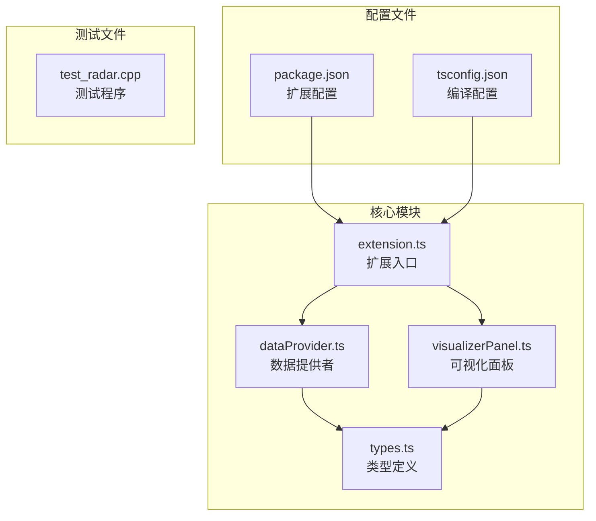
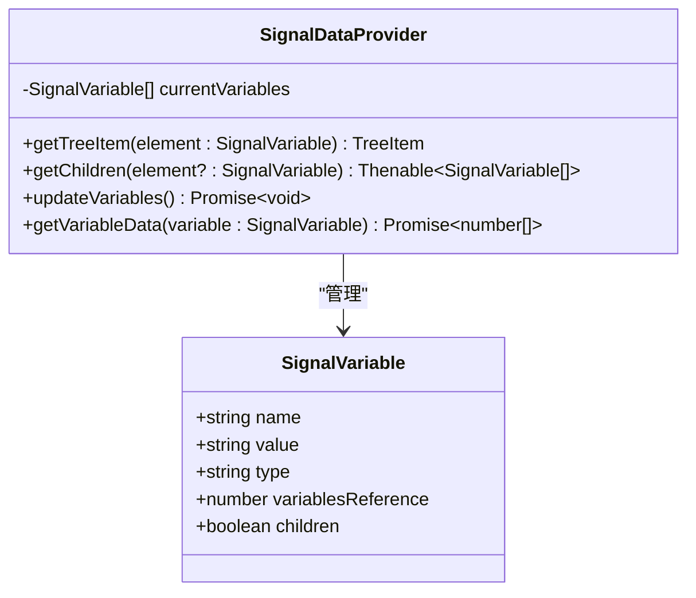
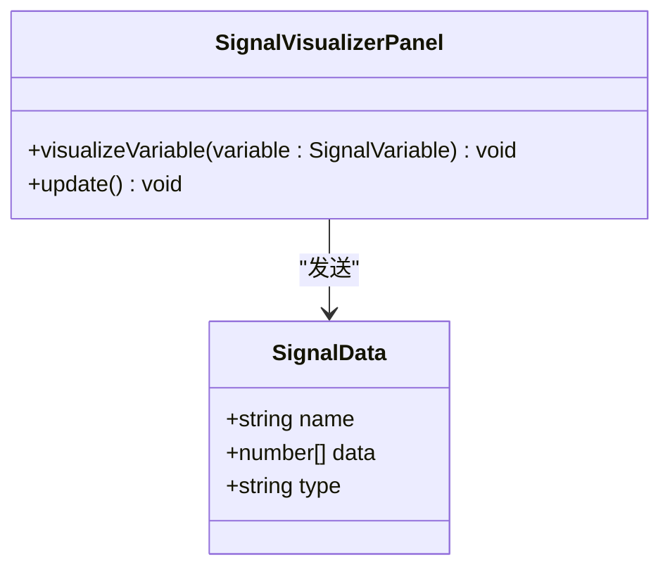
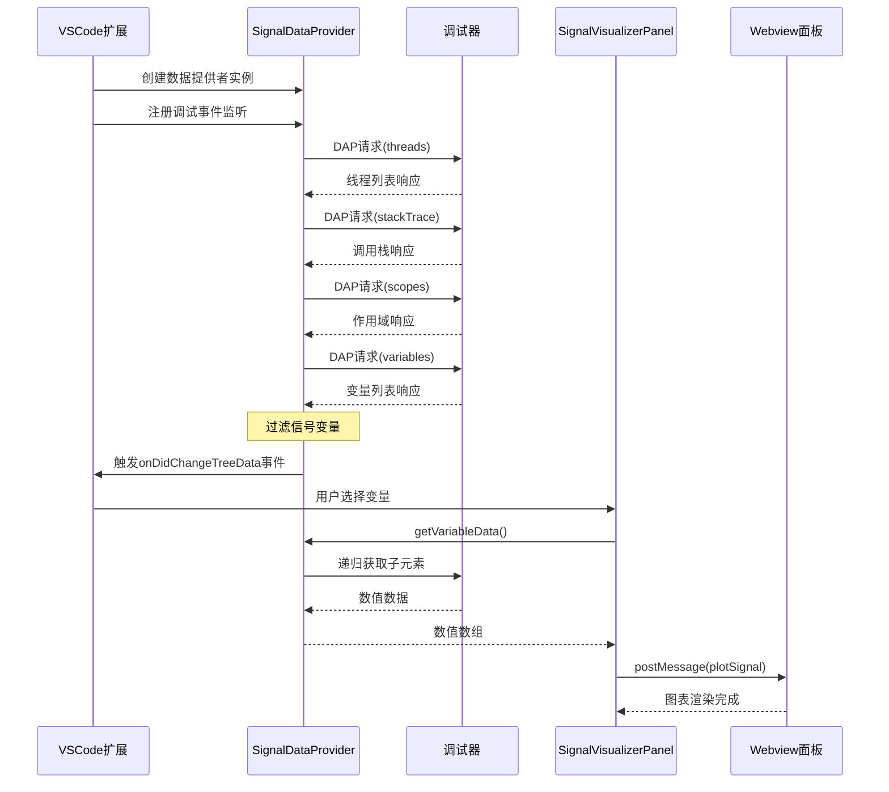
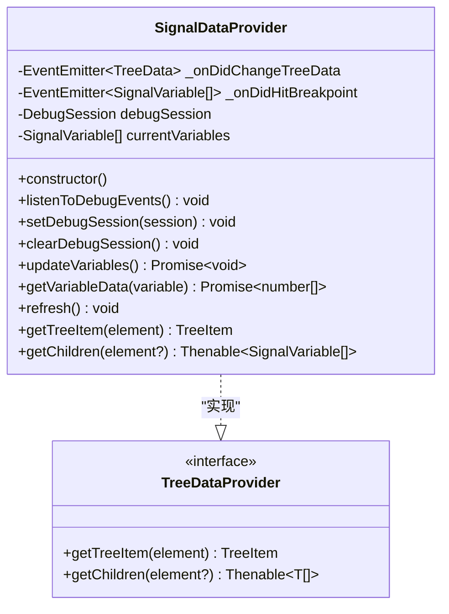
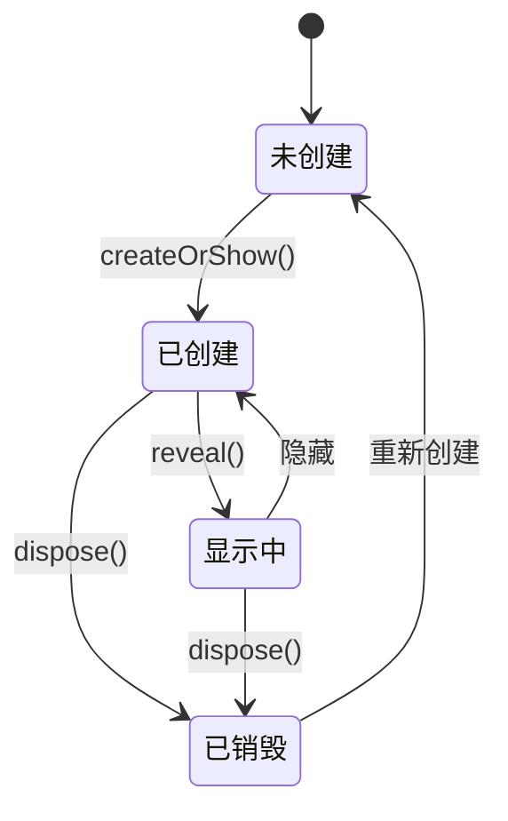
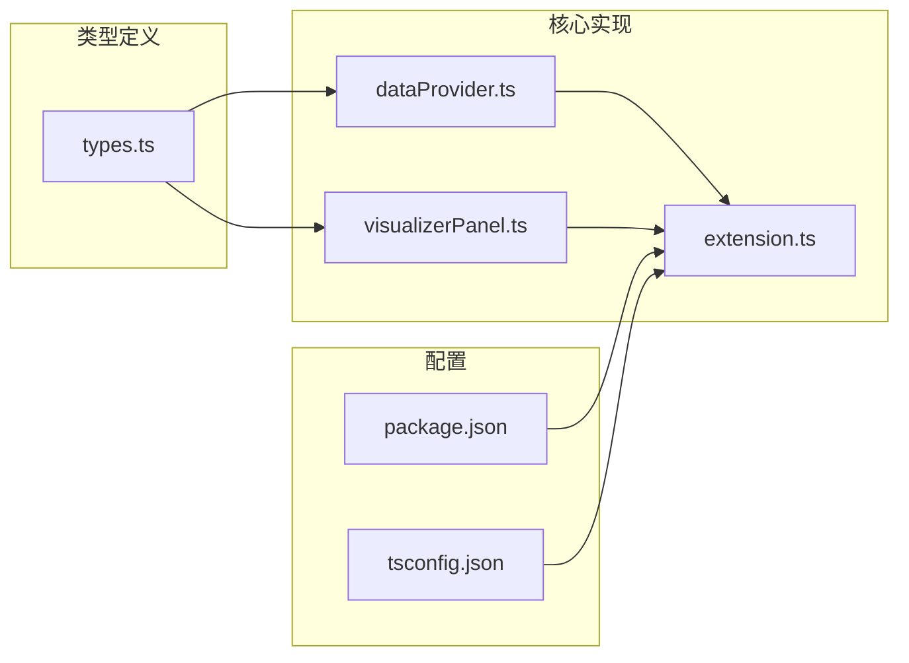

# 类型定义系统

<cite>
**本文档引用的文件**
- [types.ts](file://src/types.ts)
- [dataProvider.ts](file://src/dataProvider.ts)
- [visualizerPanel.ts](file://src/visualizerPanel.ts)
- [extension.ts](file://src/extension.ts)
- [package.json](file://package.json)
- [tsconfig.json](file://tsconfig.json)
- [test_radar.cpp](file://test_radar.cpp)
</cite>

## 目录
1. [简介](#简介)
2. [项目结构](#项目结构)
3. [核心类型定义](#核心类型定义)
4. [架构概览](#架构概览)
5. [详细组件分析](#详细组件分析)
6. [依赖关系分析](#依赖关系分析)
7. [性能考虑](#性能考虑)
8. [故障排除指南](#故障排除指南)
9. [结论](#结论)

## 简介

本项目是一个用于GPU调试的雷达信号可视化VSCode扩展。本文档详细分析了项目中的类型定义系统，包括核心数据模型、接口定义、枚举类型以及泛型应用。系统通过严格的类型安全设计，确保调试器数据与可视化界面之间的可靠通信。

## 项目结构

项目采用模块化架构，主要包含以下核心文件：



**图表来源**
- [extension.ts:1-200](file://src/extension.ts#L1-L200)
- [dataProvider.ts:1-703](file://src/dataProvider.ts#L1-L703)
- [visualizerPanel.ts:1-451](file://src/visualizerPanel.ts#L1-L451)
- [types.ts:1-95](file://src/types.ts#L1-L95)

**章节来源**
- [extension.ts:1-200](file://src/extension.ts#L1-L200)
- [package.json:1-102](file://package.json#L1-L102)

## 核心类型定义

### SignalVariable 接口

SignalVariable是树视图中每个节点的核心数据结构，用于描述调试器变量的元数据。



**图表来源**
- [types.ts:59-65](file://src/types.ts#L59-L65)
- [dataProvider.ts:56-703](file://src/dataProvider.ts#L56-L703)

**字段定义与约束**：

| 字段名 | 类型 | 约束 | 业务含义 |
|--------|------|------|----------|
| name | string | 必填，非空 | 变量名称（如"pulse_data"） |
| value | string | 必填，GDB返回的显示字符串 | 变量值的文本表示，包含数组大小信息 |
| type | string | 必填，C++类型描述 | 变量的C++类型（如"std::vector<float>"） |
| variablesReference | number | 0表示简单类型，>0表示复合类型 | DAP变量引用ID，用于获取子元素 |
| children | boolean | 基于variablesReference推导 | 是否有子节点（用于树视图折叠状态） |

### SignalData 接口

SignalData用于表示完整的信号数据集，包含实际的数值数组。



**图表来源**
- [types.ts:90-94](file://src/types.ts#L90-L94)
- [visualizerPanel.ts:264-275](file://src/visualizerPanel.ts#L264-L275)

**字段定义与约束**：

| 字段名 | 类型 | 约束 | 业务含义 |
|--------|------|------|----------|
| name | string | 必填，非空 | 信号变量名称（用于图表标题） |
| data | number[] | 必填，数值数组 | 实际的数值数据，用于绘图 |
| type | string | 可选，调试信息 | 变量类型描述 |

### 配置类型

项目通过VSCode配置系统提供运行时配置选项：

```mermaid
flowchart TD
A[用户配置] --> B[vscode.workspace.getConfiguration('rsv')]
B --> C[signalNamePatterns: string[]]
B --> D[maxArraySize: number]
B --> E[autoDisplayOnBreakpoint: boolean]
C --> F[变量名称匹配模式]
D --> G[最大数组大小限制]
E --> H[断点命中自动显示]
```

**图表来源**
- [package.json:18-36](file://package.json#L18-L36)
- [dataProvider.ts:426-428](file://src/dataProvider.ts#L426-L428)

**配置约束**：

| 配置项 | 类型 | 默认值 | 业务含义 |
|--------|------|--------|----------|
| rsv.signalNamePatterns | string[] | ["*signal*", "*data*", "*pulse*", "*sample*"] | 变量名称匹配模式 |
| rsv.maxArraySize | number | 100000 | 最大数组大小限制 |
| rsv.autoDisplayOnBreakpoint | boolean | true | 断点命中时自动显示面板 |

**章节来源**
- [types.ts:1-95](file://src/types.ts#L1-L95)
- [package.json:18-36](file://package.json#L18-L36)

## 架构概览

系统采用分层架构，类型定义贯穿整个数据流：



**图表来源**
- [extension.ts:46-188](file://src/extension.ts#L46-L188)
- [dataProvider.ts:243-399](file://src/dataProvider.ts#L243-L399)
- [visualizerPanel.ts:264-275](file://src/visualizerPanel.ts#L264-L275)

## 详细组件分析

### 数据提供者组件

SignalDataProvider是系统的核心组件，实现了TreeDataProvider接口：



**图表来源**
- [dataProvider.ts:56-703](file://src/dataProvider.ts#L56-L703)

**核心方法分析**：

1. **updateVariables()方法**：实现DAP四级请求链，获取完整的变量数据
2. **getVariableData()方法**：异步获取变量的实际数值数组
3. **collectNumericChildren()方法**：递归处理复合变量结构

### 可视化面板组件

SignalVisualizerPanel采用单例模式管理Webview面板：



**图表来源**
- [visualizerPanel.ts:44-164](file://src/visualizerPanel.ts#L44-L164)

**单例模式实现要点**：
- 静态属性`currentPanel`保存唯一实例
- 私有构造函数防止外部直接实例化
- 静态工厂方法`createOrShow()`控制实例创建

### 类型安全最佳实践

系统在多个层面实现了类型安全：

1. **编译时类型检查**：通过严格类型定义确保代码质量
2. **运行时验证**：使用类型守卫和条件检查
3. **泛型应用**：TreeDataProvider<T>确保数据一致性

**章节来源**
- [dataProvider.ts:1-703](file://src/dataProvider.ts#L1-L703)
- [visualizerPanel.ts:1-451](file://src/visualizerPanel.ts#L1-L451)

## 依赖关系分析



**图表来源**
- [types.ts:1-95](file://src/types.ts#L1-L95)
- [dataProvider.ts:1-703](file://src/dataProvider.ts#L1-L703)
- [visualizerPanel.ts:1-451](file://src/visualizerPanel.ts#L1-L451)
- [extension.ts:1-200](file://src/extension.ts#L1-L200)

**依赖关系特点**：
- types.ts为底层依赖，被其他模块广泛使用
- dataProvider.ts和visualizerPanel.ts相互协作
- extension.ts协调各组件工作
- 配置文件影响编译和运行时行为

**章节来源**
- [extension.ts:27-29](file://src/extension.ts#L27-L29)
- [package.json:1-102](file://package.json#L1-L102)

## 性能考虑

### 类型系统对性能的影响

1. **编译时优化**：TypeScript编译器利用类型信息进行优化
2. **运行时开销**：类型检查在编译阶段完成，运行时无额外开销
3. **内存效率**：接口定义避免了不必要的数据复制

### 数据处理优化

1. **递归深度限制**：防止无限递归导致的性能问题
2. **数组大小限制**：通过配置控制最大处理数组大小
3. **事件驱动更新**：避免轮询机制的性能浪费

## 故障排除指南

### 常见类型相关问题

1. **类型不匹配错误**
   - 检查接口字段定义是否完整
   - 确认泛型参数使用正确

2. **编译错误**
   - 检查tsconfig.json配置
   - 验证类型导入路径

3. **运行时类型错误**
   - 添加类型守卫检查
   - 使用可选链操作符

### 调试技巧

1. **类型断言**：使用`as`关键字进行类型转换
2. **类型守卫**：使用`typeof`和`instanceof`进行运行时检查
3. **泛型约束**：使用`extends`关键字限制类型范围

**章节来源**
- [tsconfig.json:1-19](file://tsconfig.json#L1-L19)
- [dataProvider.ts:563-634](file://src/dataProvider.ts#L563-L634)

## 结论

本项目展示了如何在VSCode扩展开发中有效运用TypeScript类型系统。通过精心设计的接口定义、严格的类型约束和合理的架构组织，系统实现了：

1. **强类型安全保障**：从编译时到运行时的全方位类型检查
2. **清晰的职责分离**：各组件职责明确，接口定义清晰
3. **良好的扩展性**：类型系统支持未来的功能扩展
4. **优秀的开发体验**：IDE智能提示和重构支持

类型定义系统为整个雷达信号可视化工具提供了坚实的基础，确保了代码质量和开发效率。通过遵循本文档介绍的最佳实践，开发者可以在此基础上进一步扩展和维护这个项目。