# 开发环境搭建

<cite>
**本文档引用的文件**
- [package.json](file://package.json)
- [tsconfig.json](file://tsconfig.json)
- [QUICKSTART.md](file://QUICKSTART.md)
- [src/extension.ts](file://src/extension.ts)
- [src/dataProvider.ts](file://src/dataProvider.ts)
- [src/visualizerPanel.ts](file://src/visualizerPanel.ts)
- [src/types.ts](file://src/types.ts)
- [build.sh](file://build.sh)
- [CMakeLists.txt](file://CMakeLists.txt)
- [test_radar.cpp](file://test_radar.cpp)
- [assets/webview.css](file://assets/webview.css)
</cite>

## 目录
1. [简介](#简介)
2. [项目结构](#项目结构)
3. [开发环境要求](#开发环境要求)
4. [Node.js 和包管理器配置](#nodejs-和包管理器配置)
5. [TypeScript 配置详解](#typescript-配置详解)
6. [VS Code 扩展开发环境配置](#vs-code-扩展开发环境配置)
7. [项目依赖安装](#项目依赖安装)
8. [开发工具链配置](#开发工具链配置)
9. [热重载机制](#热重载机制)
10. [调试环境设置](#调试环境设置)
11. [IDE 配置建议](#ide-配置建议)
12. [开发工作流优化](#开发工作流优化)
13. [常见开发问题解决](#常见开发问题解决)
14. [性能优化技巧](#性能优化技巧)
15. [本地测试和调试](#本地测试和调试)
16. [最佳实践](#最佳实践)
17. [故障排除指南](#故障排除指南)
18. [总结](#总结)

## 简介

Radar Signal Visualizer 是一个专为 GPU 调试设计的 VS Code 扩展，能够实时可视化雷达信号数据。该项目采用现代前端技术栈，结合 VS Code 扩展框架和 Chart.js 图表库，为开发者提供了强大的信号分析工具。

该扩展的核心功能包括：
- 实时断点命中检测和自动可视化
- 多种信号类型的识别和过滤
- Webview 面板的交互式图表展示
- 支持多种调试器（GDB、LLDB、CUDA-GDB）

## 项目结构

项目采用模块化架构设计，主要分为以下几个核心部分：

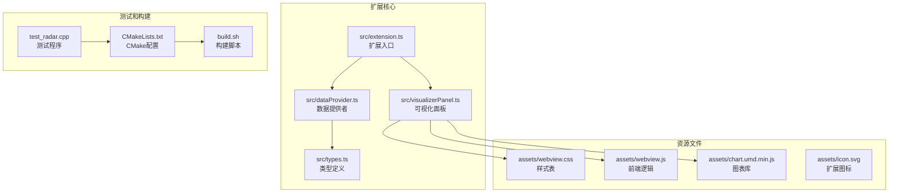

**图表来源**
- [src/extension.ts:1-200](file://src/extension.ts#L1-L200)
- [src/dataProvider.ts:1-703](file://src/dataProvider.ts#L1-L703)
- [src/visualizerPanel.ts:1-451](file://src/visualizerPanel.ts#L1-L451)

**章节来源**
- [QUICKSTART.md:42-57](file://QUICKSTART.md#L42-L57)

## 开发环境要求

### 系统要求

为了成功开发和运行 Radar Signal Visualizer 扩展，需要满足以下最低系统要求：

- **操作系统**: Windows 10/11、macOS 10.15+ 或 Linux (Ubuntu 18.04+)
- **VS Code**: 版本 1.85.0 或更高版本
- **Node.js**: LTS 版本 (推荐 18.x 或 20.x)
- **CMake**: 版本 3.10 或更高版本
- **C++ 编译器**: 支持 C++14 标准

### 开发工具链

项目使用以下核心技术栈：

| 组件 | 版本要求 | 用途 |
|------|----------|------|
| TypeScript | ^6.0.3 | 类型安全的 JavaScript 超集 |
| esbuild | ^0.28.0 | 快速 JavaScript 打包器 |
| @types/vscode | ^1.116.0 | VS Code 扩展 API 类型定义 |
| @types/node | ^25.6.0 | Node.js 类型定义 |
| chart.js | ^4.5.1 | 2D 图表绘制库 |
| @types/chart.js | ^2.9.41 | Chart.js 类型定义 |

**章节来源**
- [package.json:7-100](file://package.json#L7-L100)

## Node.js 和包管理器配置

### Node.js 版本管理

推荐使用以下方式管理 Node.js 版本：

1. **nvm (Node Version Manager)** - 推荐用于多版本管理
2. **Node.js 官方安装包** - 直接安装 LTS 版本
3. **包管理器** - npm 或 yarn

### 包管理器选择

项目使用 npm 作为包管理器，但完全兼容 yarn 和 pnpm：

```bash
# 使用 npm (推荐)
npm install

# 使用 yarn
yarn install

# 使用 pnpm
pnpm install
```

### 依赖管理策略

项目采用分层依赖管理：

```mermaid
graph TD
A[package.json] --> B[生产依赖]
A --> C[开发依赖]
B --> D[chart.js ^4.5.1<br/>图表库]
C --> E[typescript ^6.0.3<br/>TypeScript 编译器]
C --> F[@types/vscode ^1.116.0<br/>VS Code 类型]
C --> G[@types/node ^25.6.0<br/>Node.js 类型]
C --> H[@types/chart.js ^2.9.41<br/>Chart.js 类型]
C --> I[esbuild ^0.28.0<br/>打包工具]
```

**图表来源**
- [package.json:86-100](file://package.json#L86-L100)

**章节来源**
- [package.json:86-100](file://package.json#L86-L100)

## TypeScript 配置详解

### 编译选项分析

TypeScript 配置文件提供了严格的类型检查和现代化的编译目标：

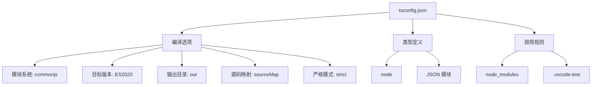

**图表来源**
- [tsconfig.json:1-19](file://tsconfig.json#L1-L19)

### 关键配置说明

| 配置项 | 值 | 说明 |
|--------|-----|------|
| `module` | `commonjs` | 与 VS Code 扩展运行时兼容 |
| `target` | `ES2020` | 支持现代 JavaScript 特性 |
| `strict` | `true` | 启用所有严格类型检查 |
| `esModuleInterop` | `true` | 改善 CommonJS/ES 模块互操作性 |
| `skipLibCheck` | `true` | 跳过库文件类型检查，提升编译速度 |
| `moduleResolution` | `node` | 使用 Node.js 模块解析策略 |

### 类型安全特性

项目充分利用 TypeScript 的类型系统：

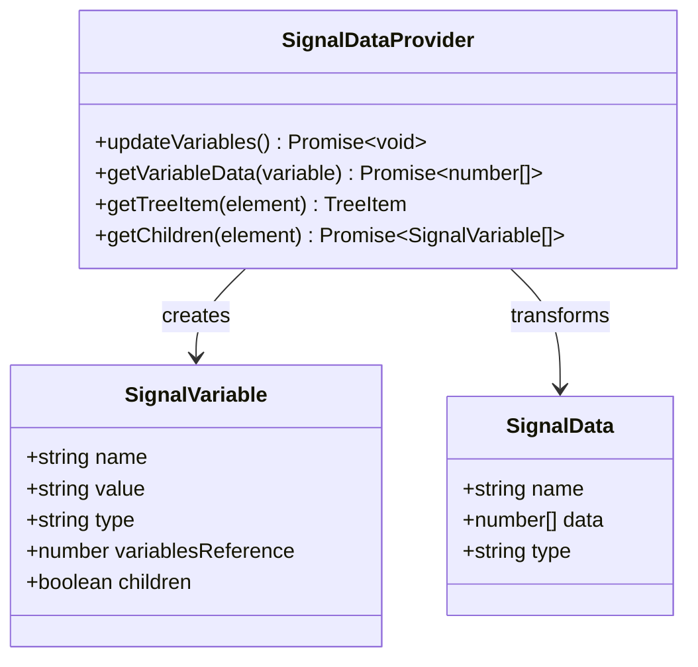

**图表来源**
- [src/types.ts:59-94](file://src/types.ts#L59-L94)
- [src/dataProvider.ts:56-702](file://src/dataProvider.ts#L56-L702)

**章节来源**
- [tsconfig.json:1-19](file://tsconfig.json#L1-L19)
- [src/types.ts:1-95](file://src/types.ts#L1-L95)

## VS Code 扩展开发环境配置

### VS Code 扩展开发模式

VS Code 提供了专门的扩展开发环境：

1. **扩展开发主机**: F5 启动后打开的新 VS Code 窗口
2. **调试配置**: 自动配置断点和调试会话
3. **热重载**: 修改代码后自动重新加载扩展

### 扩展清单配置

package.json 文件定义了扩展的核心元数据：

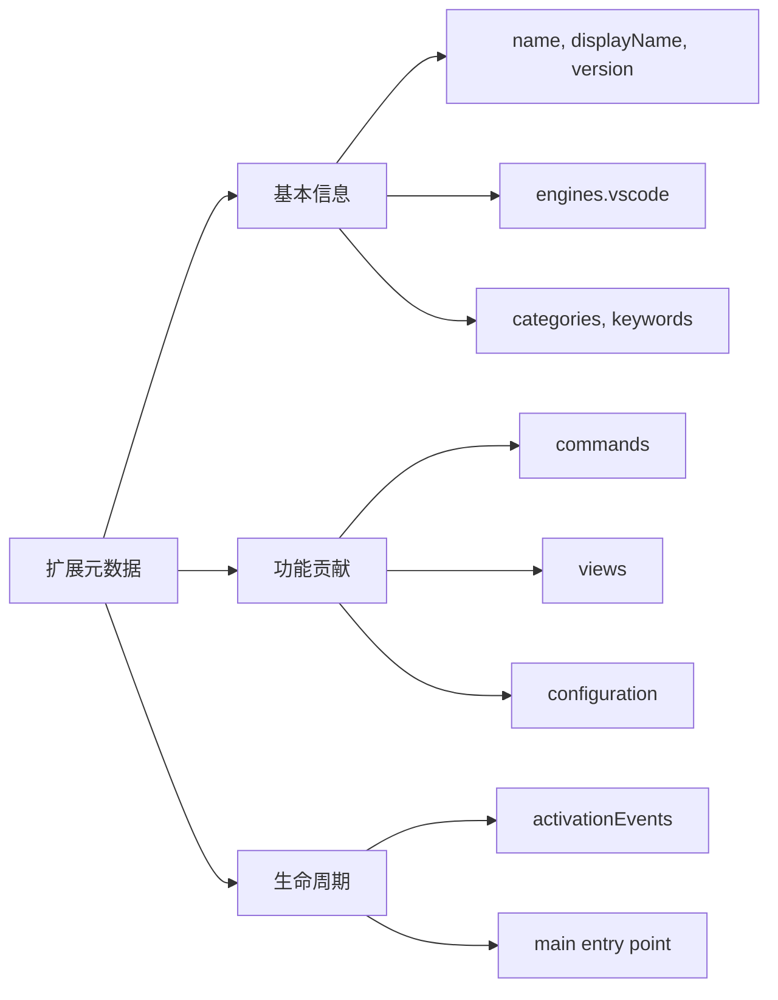

**图表来源**
- [package.json:1-102](file://package.json#L1-L102)

### 核心功能贡献

扩展通过 package.json 提供以下功能：

| 功能类别 | 配置项 | 说明 |
|----------|--------|------|
| 命令 | rsv.visualizeVariable, rsv.openPanel, rsv.refreshSignals | 用户交互命令 |
| 视图 | rsvSignals (树视图) | 信号变量列表 |
| 配置 | rsv.autoDisplayOnBreakpoint, rsv.signalNamePatterns | 用户自定义设置 |
| 菜单 | 视图标题和上下文菜单 | 右键操作支持 |

**章节来源**
- [package.json:17-85](file://package.json#L17-L85)

## 项目依赖安装

### 依赖安装流程

按照以下步骤安装项目依赖：

```bash
# 1. 安装项目依赖
npm install

# 2. 验证安装
npm list

# 3. 查看已安装的依赖
npm ls
```

### 依赖分类说明

项目依赖分为两类：

```mermaid
graph TB
subgraph "生产依赖"
A[chart.js ^4.5.1<br/>运行时必需]
end
subgraph "开发依赖"
B[typescript ^6.0.3<br/>编译时必需]
C[@types/vscode ^1.116.0<br/>类型定义]
D[@types/node ^25.6.0<br/>类型定义]
E[@types/chart.js ^2.9.41<br/>类型定义]
F[esbuild ^0.28.0<br/>打包工具]
end
subgraph "脚本依赖"
G[vscode:prepublish<br/>发布前编译]
H[compile<br/>编译扩展]
I[watch<br/>监视模式]
end
```

**图表来源**
- [package.json:86-100](file://package.json#L86-L100)

### 依赖版本管理

使用以下命令管理依赖版本：

```bash
# 更新所有依赖
npm update

# 安装特定版本
npm install @types/vscode@^1.116.0

# 删除依赖
npm uninstall chart.js

# 查看过时依赖
npm outdated
```

**章节来源**
- [package.json:86-100](file://package.json#L86-L100)

## 开发工具链配置

### esbuild 配置详解

项目使用 esbuild 作为构建工具，提供快速的打包能力：

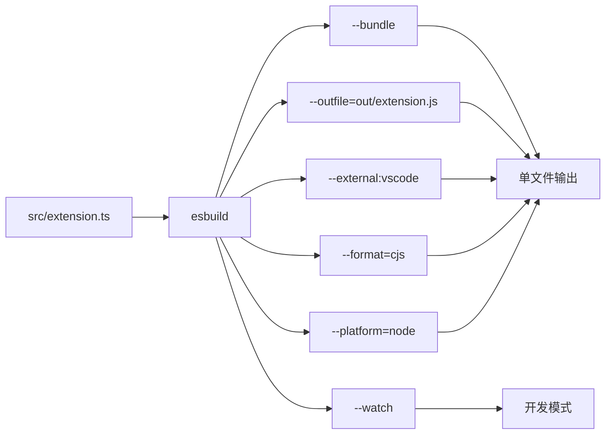

**图表来源**
- [package.json:86-90](file://package.json#L86-L90)

### 编译脚本说明

项目提供三种编译模式：

| 脚本 | 用途 | 特点 |
|------|------|------|
| `vscode:prepublish` | 发布前编译 | 生成生产版本 |
| `compile` | 一次性编译 | 生成可运行文件 |
| `watch` | 开发监视 | 自动重新编译 |

### 开发工具集成

推荐的开发工具配置：

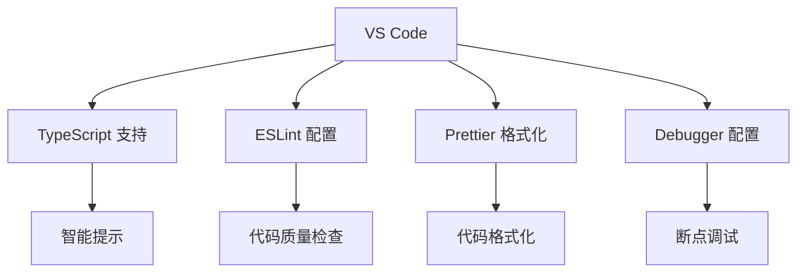

**章节来源**
- [package.json:86-90](file://package.json#L86-L90)

## 热重载机制

### 开发时热重载

项目支持实时热重载，提升开发效率：

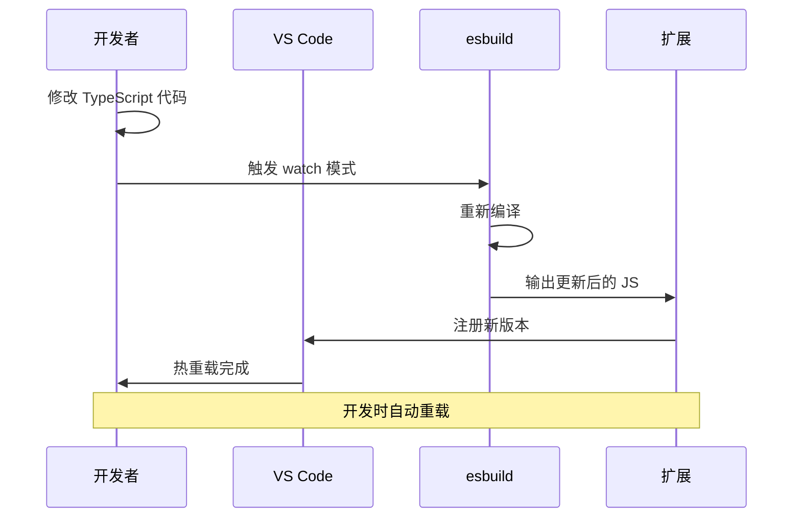

**图表来源**
- [package.json:89](file://package.json#L89)

### 热重载配置

热重载机制的关键配置：

| 配置项 | 值 | 说明 |
|--------|-----|------|
| `--watch` | 启用 | 监视文件变化 |
| `--format=cjs` | CommonJS | 与 Node.js 兼容 |
| `--platform=node` | Node.js 平台 | 与 VS Code 运行时匹配 |
| `--external:vscode` | 外部依赖 | 避免打包 VS Code API |

### Webview 热重载

Webview 内容的热重载支持：

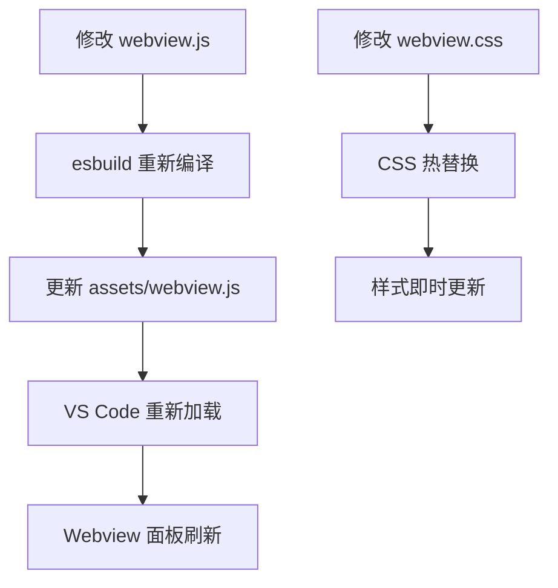

**章节来源**
- [package.json:89](file://package.json#L89)

## 调试环境设置

### VS Code 调试配置

项目支持两种调试模式：

1. **扩展开发模式**: 调试扩展代码本身
2. **测试程序模式**: 调试生成的 C++ 程序

### 调试配置文件

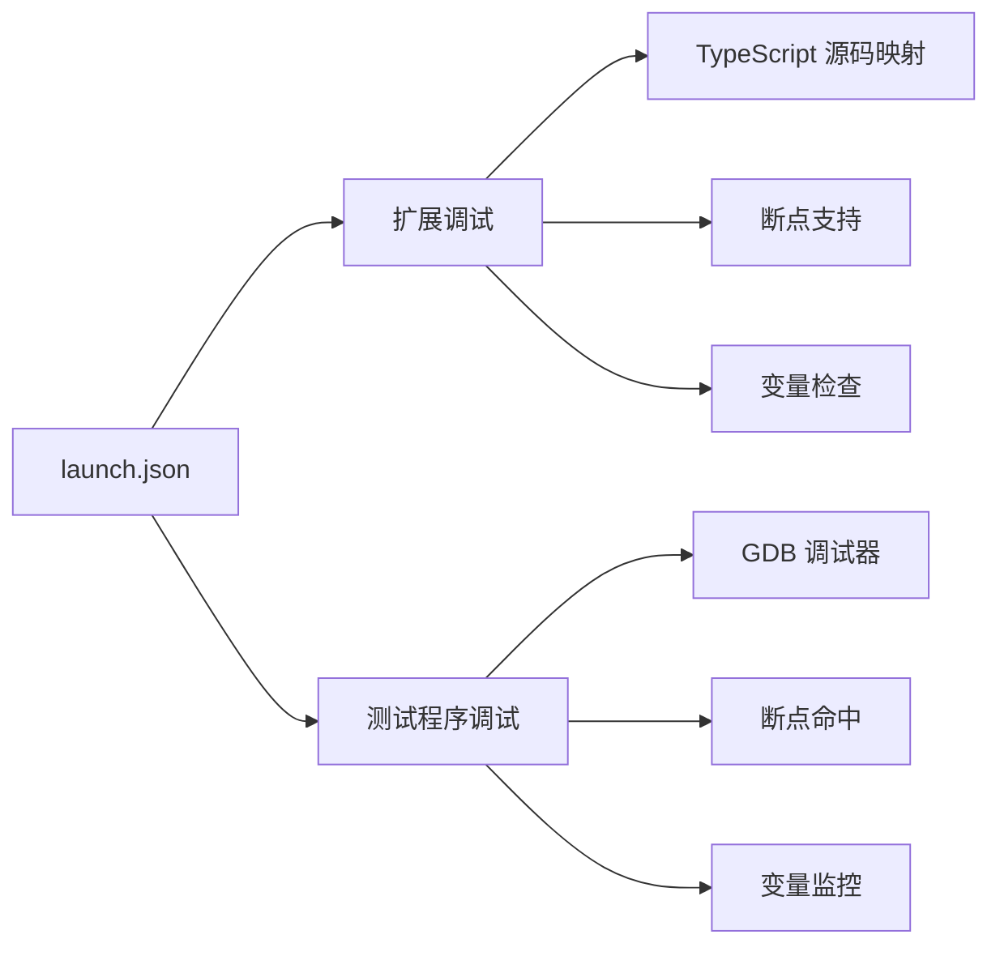

### 调试流程

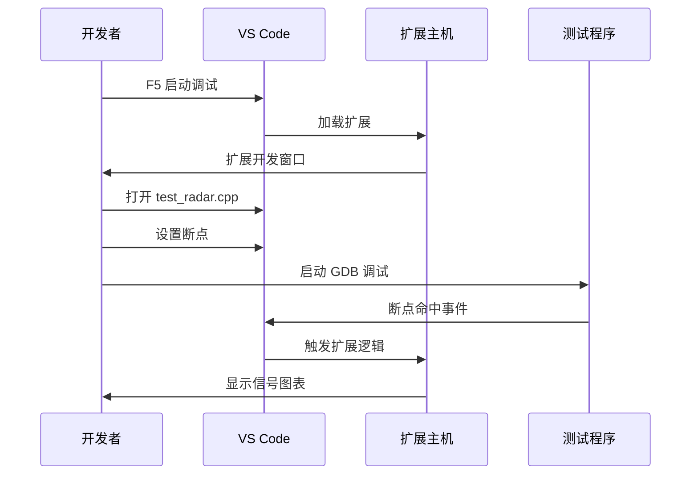

**图表来源**
- [QUICKSTART.md:18-30](file://QUICKSTART.md#L18-L30)

### 调试最佳实践

| 调试场景 | 推荐方法 | 工具 |
|----------|----------|------|
| 扩展逻辑 | 在 extension.ts 设置断点 | VS Code 断点 |
| 数据获取 | 在 dataProvider.ts 设置断点 | DAP 请求检查 |
| Webview 交互 | 在 webview.js 设置断点 | 浏览器调试器 |
| C++ 程序 | 使用 GDB 调试 | VS Code 调试器 |

**章节来源**
- [QUICKSTART.md:18-30](file://QUICKSTART.md#L18-L30)

## IDE 配置建议

### VS Code 扩展推荐

推荐安装以下 VS Code 扩展提升开发体验：

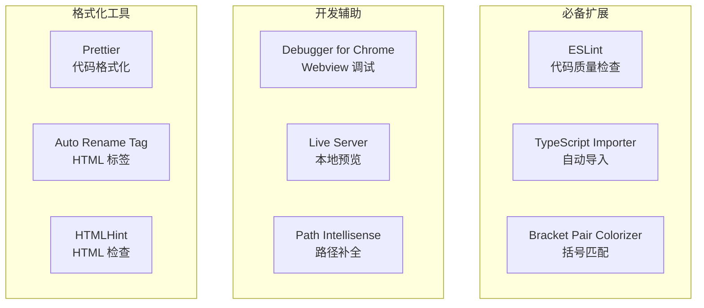

### IDE 设置优化

推荐的 VS Code 设置：

| 设置项 | 值 | 说明 |
|--------|-----|------|
| `editor.formatOnSave` | `true` | 保存时自动格式化 |
| `editor.codeActionsOnSave` | `{ "source.fixAll.eslint": true }` | 保存时修复 ESLint 问题 |
| `typescript.preferences.importModuleSpecifier` | `relative` | 相对路径导入 |
| `files.exclude` | `{ "**/node_modules": true }` | 隐藏 node_modules |
| `search.exclude` | `{ "**/node_modules": true }` | 搜索时排除 node_modules |

### TypeScript 配置优化

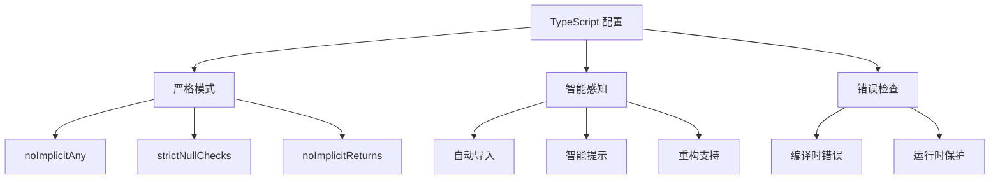

**章节来源**
- [tsconfig.json:9-15](file://tsconfig.json#L9-L15)

## 开发工作流优化

### 代码组织原则

项目遵循以下代码组织原则：

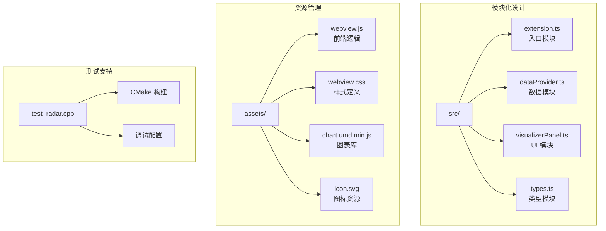

### 开发流程建议

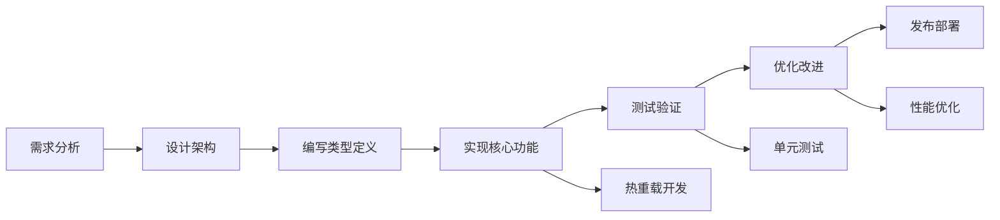

### 代码质量保证

| 质量保证措施 | 实施方式 | 效果 |
|-------------|----------|------|
| 类型检查 | TypeScript 严格模式 | 编译时错误检测 |
| 代码格式 | Prettier + ESLint | 一致性代码风格 |
| 单元测试 | Jest + 测试框架 | 功能稳定性 |
| 代码审查 | Pull Request 流程 | 质量把关 |

**章节来源**
- [src/extension.ts:1-200](file://src/extension.ts#L1-L200)

## 常见开发问题解决

### 环境配置问题

| 问题 | 症状 | 解决方案 |
|------|------|----------|
| Node.js 版本不兼容 | 编译失败或运行时错误 | 使用 nvm 管理 Node.js 版本 |
| TypeScript 编译错误 | 无法生成 JS 文件 | 检查 tsconfig.json 配置 |
| esbuild 打包失败 | 构建中断 | 确认依赖安装完整 |
| VS Code 扩展加载失败 | 扩展不显示 | 检查 activationEvents 配置 |

### 调试器兼容性问题

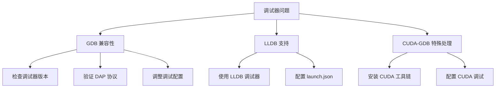

### Webview 加载问题

| 问题类型 | 症状 | 解决方案 |
|----------|------|----------|
| 资源加载失败 | 图表不显示 | 检查 asWebviewUri 调用 |
| CSP 安全策略 | 脚本被阻止 | 验证 nonce 生成 |
| 样式不生效 | 界面显示异常 | 检查 VS Code 主题变量 |

**章节来源**
- [QUICKSTART.md:31-41](file://QUICKSTART.md#L31-L41)

## 性能优化技巧

### 编译性能优化

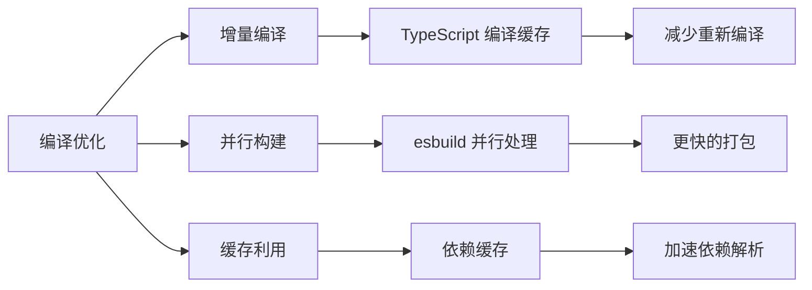

### 运行时性能优化

| 优化策略 | 实现方式 | 效果 |
|----------|----------|------|
| 数据过滤 | 早期过滤信号变量 | 减少不必要的处理 |
| 内存管理 | 及时释放资源 | 防止内存泄漏 |
| 异步处理 | Promise 链式调用 | 避免阻塞 UI |
| 缓存机制 | 重复数据缓存 | 提升响应速度 |

### 内存管理最佳实践

```mermaid
flowchart TD
A[内存管理] --> B[资源注册]
A --> C[事件监听]
A --> D[定时器清理]
B --> E[context.subscriptions]
C --> F[dispose() 方法]
D --> G[clearInterval() 清理]
E --> H[自动释放]
F --> I[手动释放]
G --> J[防止内存泄漏]
```

**章节来源**
- [src/dataProvider.ts:122-205](file://src/dataProvider.ts#L122-L205)

## 本地测试和调试

### 测试程序构建

项目包含完整的测试程序，用于验证扩展功能：

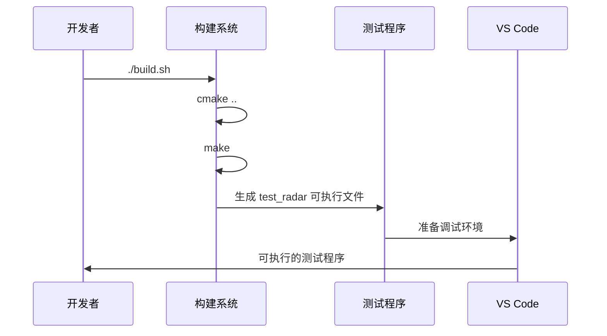

**图表来源**
- [build.sh:1-12](file://build.sh#L1-L12)

### 测试程序功能

测试程序生成多种类型的雷达信号数据：

| 信号类型 | 用途 | 数据特点 |
|----------|------|----------|
| 脉冲信号 | 脉冲雷达 | 高斯包络调制 |
| 噪声信号 | 背景噪声 | 正态分布 |
| 线性调频信号 | FMCW 雷达 | 线性频率调制 |
| 混合信号 | 实际场景 | 脉冲 + 噪声组合 |

### 调试测试流程

```mermaid
flowchart TD
A[启动测试] --> B[设置断点]
B --> C[触发断点]
C --> D[检查变量]
D --> E[验证信号]
E --> F[扩展自动响应]
G[手动触发] --> H[刷新信号列表]
H --> I[检查过滤逻辑]
I --> J[验证显示效果]
```

**章节来源**
- [test_radar.cpp:34-63](file://test_radar.cpp#L34-L63)
- [build.sh:1-12](file://build.sh#L1-L12)

## 最佳实践

### 代码组织最佳实践

```mermaid
graph TB
subgraph "模块设计"
A[单一职责] --> B[每个模块专注一个功能]
C[高内聚低耦合] --> D[模块间依赖最小化]
E[接口抽象] --> F[使用 TypeScript 接口]
end
subgraph "错误处理"
G[防御性编程] --> H[参数验证]
I[异常处理] --> J[try-catch 包装]
K[日志记录] --> L[console.log 错误信息]
end
subgraph "性能考虑"
M[异步处理] --> N[Promise/async-await]
O[资源管理] --> P[及时释放]
Q[内存优化] --> R[避免大数据复制]
end
```

### 开发规范

| 规范类别 | 具体要求 | 说明 |
|----------|----------|------|
| 命名规范 | PascalCase 类名, camelCase 变量 | TypeScript 命名约定 |
| 注释规范 | JSDoc 注释, 详细说明 | 提升代码可读性 |
| 错误处理 | 明确的错误类型, 用户友好提示 | 改善用户体验 |
| 性能优化 | 异步操作, 资源及时释放 | 保持响应性 |

### 质量保证流程

```mermaid
flowchart LR
A[代码编写] --> B[本地测试]
B --> C[代码审查]
C --> D[集成测试]
D --> E[性能测试]
E --> F[发布部署]
G[持续集成] --> H[自动化测试]
H --> I[代码质量检查]
I --> J[构建验证]
```

**章节来源**
- [src/extension.ts:1-200](file://src/extension.ts#L1-L200)

## 故障排除指南

### 常见问题诊断

```mermaid
flowchart TD
A[问题出现] --> B[症状分析]
B --> C[日志检查]
C --> D[环境验证]
D --> E[解决方案实施]
E --> F[验证修复]
G[编译问题] --> H[TypeScript 错误]
G --> I[esbuild 构建失败]
G --> J[依赖缺失]
H --> K[检查 tsconfig.json]
I --> L[验证 esbuild 配置]
J --> M[npm install 重新安装]
```

### 调试技巧

| 调试技巧 | 使用场景 | 实现方法 |
|----------|----------|----------|
| 日志记录 | 问题定位 | console.log 输出 |
| 断点调试 | 逻辑检查 | VS Code 断点 |
| 网络监控 | API 调用 | 浏览器开发者工具 |
| 性能分析 | 性能瓶颈 | VS Code 性能分析器 |

### 环境恢复

```mermaid
flowchart TD
A[环境损坏] --> B[备份恢复]
B --> C[重新安装]
C --> D[重新配置]
D --> E[功能验证]
F[依赖问题] --> G[npm cache clean]
F --> H[删除 node_modules]
F --> I[重新安装依赖]
G --> J[清理缓存]
H --> K[重新构建]
I --> L[验证安装]
```

**章节来源**
- [QUICKSTART.md:31-41](file://QUICKSTART.md#L31-L41)

## 总结

Radar Signal Visualizer 项目提供了一个完整的 VS Code 扩展开发环境，涵盖了现代前端开发的最佳实践。通过合理的架构设计、严格的类型检查和完善的调试支持，该项目为开发者提供了高效、可靠的开发体验。

### 核心优势

1. **现代化技术栈**: TypeScript + esbuild + Chart.js
2. **完善的开发工具链**: 热重载、自动编译、实时调试
3. **优秀的用户体验**: 自动断点检测、智能信号识别
4. **良好的扩展性**: 模块化设计、清晰的接口定义

### 学习价值

该项目展示了：
- VS Code 扩展开发的完整流程
- 现代前端技术在 VS Code 环境中的应用
- 调试器与前端可视化结合的技术方案
- 开发工作流的优化实践

通过深入理解和实践该项目，开发者可以掌握 VS Code 扩展开发的核心技能，为构建更复杂的开发工具奠定坚实基础。