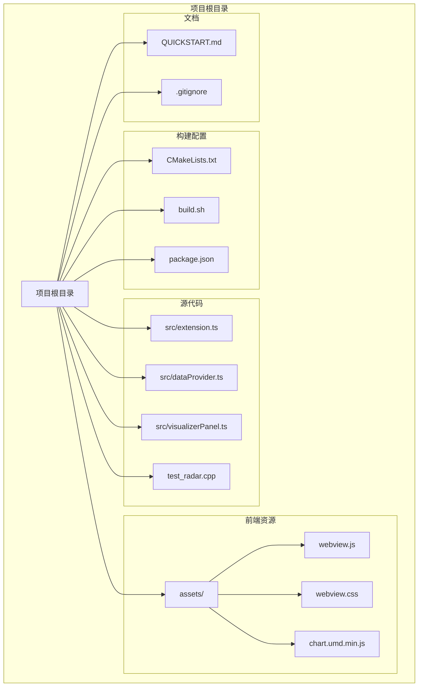
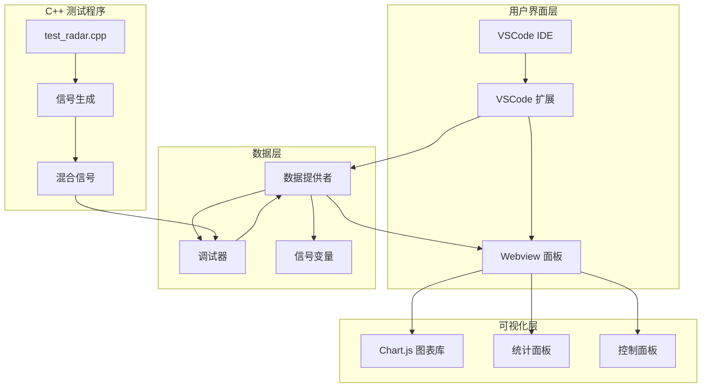
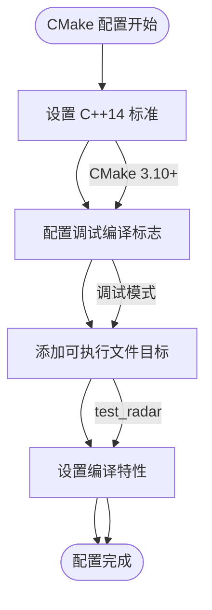
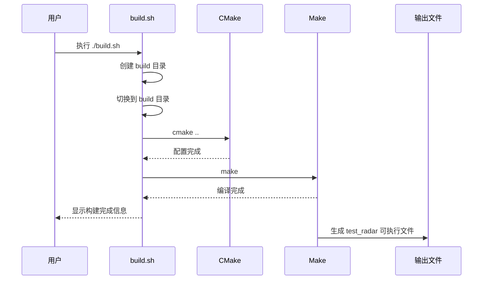
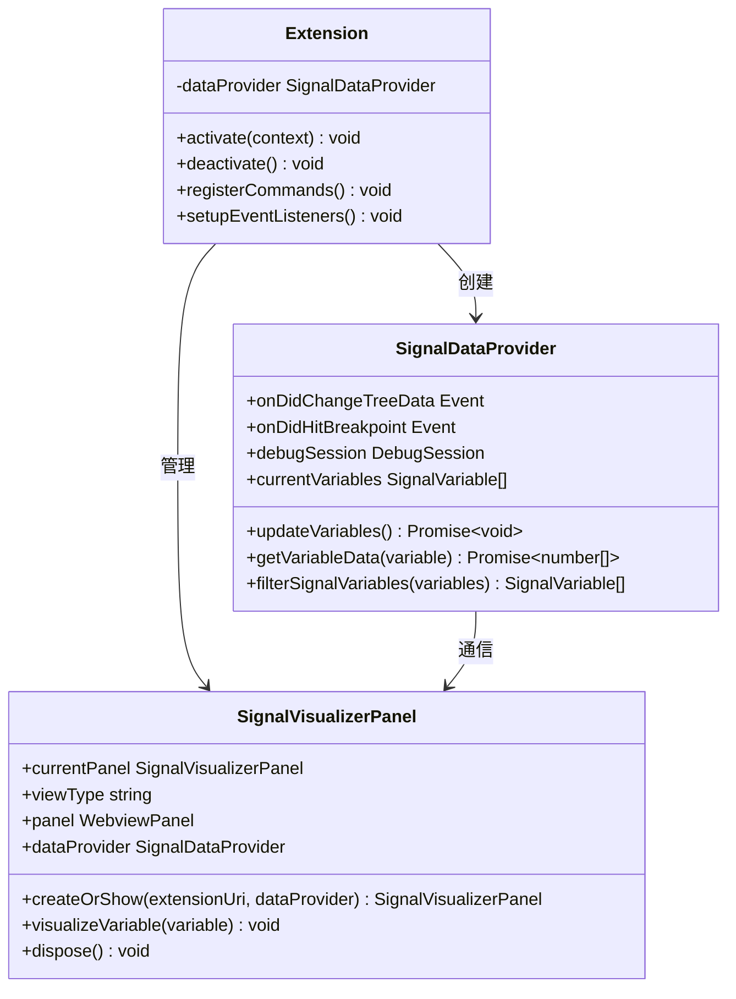
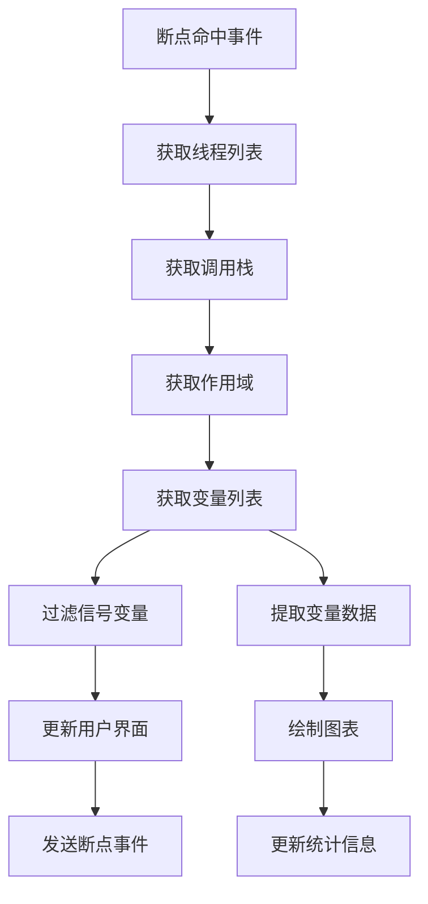
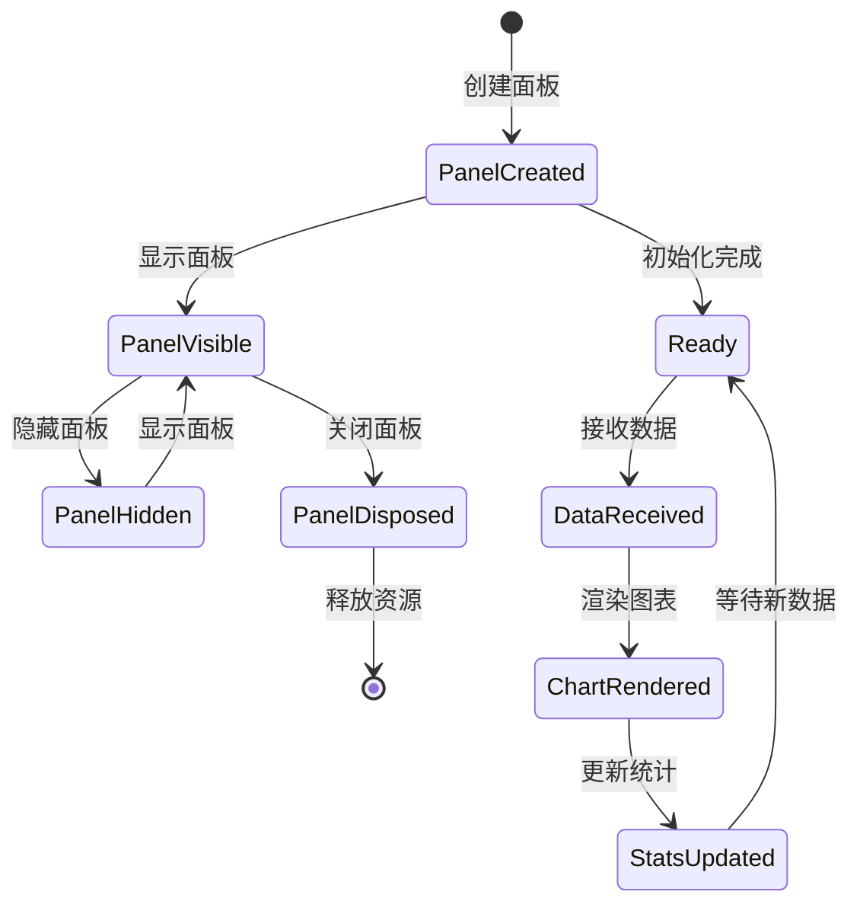
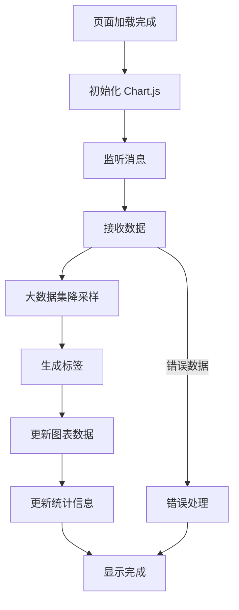
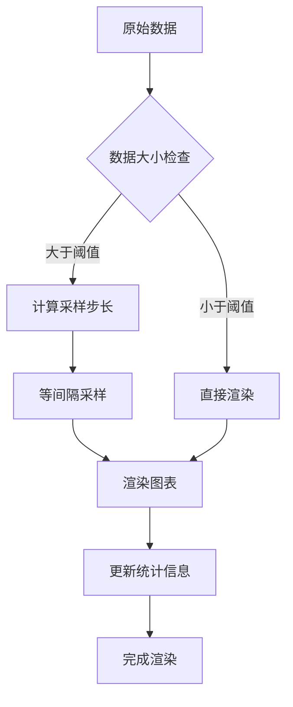

# 构建配置

<cite>
**本文档引用的文件**
- [CMakeLists.txt](file://CMakeLists.txt)
- [build.sh](file://build.sh)
- [package.json](file://package.json)
- [QUICKSTART.md](file://QUICKSTART.md)
- [test_radar.cpp](file://test_radar.cpp)
- [src/extension.ts](file://src/extension.ts)
- [src/dataProvider.ts](file://src/dataProvider.ts)
- [src/visualizerPanel.ts](file://src/visualizerPanel.ts)
- [assets/webview.js](file://assets/webview.js)
- [assets/webview.css](file://assets/webview.css)
</cite>

## 目录
1. [简介](#简介)
2. [项目结构](#项目结构)
3. [核心组件](#核心组件)
4. [架构概览](#架构概览)
5. [详细组件分析](#详细组件分析)
6. [依赖关系分析](#依赖关系分析)
7. [性能考虑](#性能考虑)
8. [故障排除指南](#故障排除指南)
9. [结论](#结论)

## 简介

本项目是一个基于 VSCode 扩展的雷达信号可视化工具，结合了 C++ 测试程序和前端可视化组件。该项目提供了完整的构建配置，包括 CMake 构建系统、Shell 脚本自动化构建流程，以及 VSCode 扩展的打包和开发环境配置。

项目的主要目标是在 GPU 调试过程中可视化雷达信号数据，通过 VSCode 的调试器与扩展的集成，实现实时信号波形显示和分析功能。

## 项目结构

项目采用模块化设计，主要分为以下几个核心部分：



**图表来源**
- [CMakeLists.txt:1-10](file://CMakeLists.txt#L1-L10)
- [build.sh:1-12](file://build.sh#L1-L12)
- [package.json:1-102](file://package.json#L1-L102)

**章节来源**
- [CMakeLists.txt:1-10](file://CMakeLists.txt#L1-L10)
- [build.sh:1-12](file://build.sh#L1-L12)
- [package.json:1-102](file://package.json#L1-L102)

## 核心组件

### CMake 构建系统

CMakeLists.txt 文件定义了项目的 C++ 构建配置，采用简洁而高效的配置方式：

- **最低版本要求**: CMake 3.10+
- **项目设置**: 项目名为 RadarSignalTest
- **C++ 标准**: 使用 C++14 标准
- **编译标志**: 调试模式下启用 `-g -O0` 优化级别
- **目标定义**: 创建名为 `test_radar` 的可执行文件

### Shell 构建脚本

build.sh 脚本提供了简化的构建流程，支持跨平台构建：

- **构建目录管理**: 自动创建 build 目录并切换到该目录
- **CMake 集成**: 使用 cmake .. 配置构建
- **Make 构建**: 执行 make 进行编译
- **输出信息**: 提供构建完成的反馈信息

### VSCode 扩展配置

package.json 文件定义了完整的 VSCode 扩展配置：

- **扩展元数据**: 名称、版本、描述、发布者信息
- **引擎要求**: VSCode 1.85.0+ 版本支持
- **激活事件**: 调试启动时激活
- **贡献点**: 配置界面、视图容器、命令定义
- **脚本配置**: esbuild 打包、开发服务器、监控模式

**章节来源**
- [CMakeLists.txt:1-10](file://CMakeLists.txt#L1-L10)
- [build.sh:1-12](file://build.sh#L1-L12)
- [package.json:1-102](file://package.json#L1-L102)

## 架构概览

项目采用分层架构设计，将 C++ 测试程序与 VSCode 扩展功能分离，通过调试器接口实现数据交互：



**图表来源**
- [src/extension.ts:46-188](file://src/extension.ts#L46-L188)
- [src/dataProvider.ts:233-399](file://src/dataProvider.ts#L233-L399)
- [src/visualizerPanel.ts:142-231](file://src/visualizerPanel.ts#L142-L231)
- [test_radar.cpp:34-62](file://test_radar.cpp#L34-L62)

## 详细组件分析

### CMake 构建系统分析

#### 项目配置
CMakeLists.txt 采用了现代化的 C++14 标准配置，确保了跨平台兼容性和现代语言特性支持。

#### 编译选项配置
- **C++14 标准**: `set(CMAKE_CXX_STANDARD 14)`
- **强制标准**: `set(CMAKE_CXX_STANDARD_REQUIRED ON)`
- **调试标志**: `set(CMAKE_CXX_FLAGS_DEBUG "-g -O0")`

#### 目标定义
项目定义了一个单一的可执行文件目标，便于测试和演示：



**图表来源**
- [CMakeLists.txt:1-10](file://CMakeLists.txt#L1-L10)

**章节来源**
- [CMakeLists.txt:1-10](file://CMakeLists.txt#L1-L10)

### Shell 构建脚本分析

#### 构建流程
build.sh 脚本提供了简化的构建流程，支持一键构建：



**图表来源**
- [build.sh:1-12](file://build.sh#L1-L12)

#### 错误处理
脚本采用简单的错误处理机制：
- 目录创建失败时会显示相应错误
- 构建过程中的任何错误都会中断脚本执行
- 提供清晰的构建完成反馈

**章节来源**
- [build.sh:1-12](file://build.sh#L1-L12)

### VSCode 扩展架构分析

#### 扩展入口点
extension.ts 文件定义了扩展的主入口，实现了完整的生命周期管理：



**图表来源**
- [src/extension.ts:46-188](file://src/extension.ts#L46-L188)
- [src/dataProvider.ts:56-703](file://src/dataProvider.ts#L56-L703)
- [src/visualizerPanel.ts:44-424](file://src/visualizerPanel.ts#L44-L424)

#### 数据提供者核心功能
dataProvider.ts 实现了复杂的数据获取和处理逻辑：



**图表来源**
- [src/dataProvider.ts:243-399](file://src/dataProvider.ts#L243-L399)

**章节来源**
- [src/extension.ts:1-200](file://src/extension.ts#L1-L200)
- [src/dataProvider.ts:1-703](file://src/dataProvider.ts#L1-L703)
- [src/visualizerPanel.ts:1-451](file://src/visualizerPanel.ts#L1-L451)

### 前端可视化组件分析

#### Webview 面板架构
visualizerPanel.ts 实现了 VSCode Webview 的完整生命周期管理：



**图表来源**
- [src/visualizerPanel.ts:102-164](file://src/visualizerPanel.ts#L102-L164)

#### 前端 JavaScript 功能
webview.js 实现了完整的图表渲染和交互功能：



**图表来源**
- [assets/webview.js:50-96](file://assets/webview.js#L50-L96)
- [assets/webview.js:355-419](file://assets/webview.js#L355-L419)

**章节来源**
- [src/visualizerPanel.ts:1-451](file://src/visualizerPanel.ts#L1-L451)
- [assets/webview.js:1-494](file://assets/webview.js#L1-L494)

## 依赖关系分析

### 构建系统依赖

```mermaid
graph TB
subgraph "构建工具链"
CMake[CMake 3.10+]
GCC[GCC/Clang]
Make[GNU Make]
end
subgraph "项目依赖"
TestProgram[test_radar.cpp]
StdLib[标准 C++ 库]
MathLib[数学库]
end
subgraph "开发工具"
VSCode[VSCode 1.85+]
NodeJS[Node.js]
NPM[NPM 包管理器]
Esbuild[Esbuild 打包器]
end
subgraph "前端库"
ChartJS[Chart.js 4.5.1]
Typescript[TypeScript 6.0+]
TypesNode[@types/node]
TypesVSCode[@types/vscode]
end
CMake --> GCC
GCC --> Make
Make --> TestProgram
TestProgram --> StdLib
TestProgram --> MathLib
VSCode --> NodeJS
NodeJS --> NPM
NPM --> Esbuild
Esbuild --> Extension[扩展打包]
Extension --> ChartJS
Extension --> Typescript
Typescript --> TypesNode
Typescript --> TypesVSCode
```

**图表来源**
- [CMakeLists.txt:1-10](file://CMakeLists.txt#L1-L10)
- [package.json:7-96](file://package.json#L7-L96)

### 运行时依赖

项目的主要运行时依赖包括：

- **C++ 运行时**: C++14 标准支持
- **VSCode 扩展运行时**: VSCode 1.85.0+ 版本
- **Node.js 环境**: 用于扩展开发和打包
- **Chart.js 库**: 前端图表渲染
- **调试器支持**: GDB/LLDB 等 C/C++ 调试器

**章节来源**
- [package.json:7-96](file://package.json#L7-L96)
- [CMakeLists.txt:1-10](file://CMakeLists.txt#L1-L10)

## 性能考虑

### 编译性能优化

#### CMake 配置优化
- **标准设置**: 使用 C++14 标准确保编译器优化支持
- **调试配置**: 调试模式下启用完整调试信息
- **目标优化**: 单一可执行文件减少链接开销

#### 构建脚本优化
- **增量构建**: Make 工具支持增量编译
- **并行编译**: 支持多核并行编译
- **缓存利用**: CMake 缓存提高重复构建速度

### 运行时性能优化

#### 大数据集处理
前端实现了智能降采样算法，确保大数据集的流畅显示：



**图表来源**
- [assets/webview.js:380-388](file://assets/webview.js#L380-L388)

#### 内存管理
- **资源清理**: 扩展停用时自动清理所有资源
- **事件监听**: 使用 Disposable 模式管理事件监听器
- **Webview 生命周期**: 完整的创建、显示、隐藏、销毁流程

**章节来源**
- [assets/webview.js:380-419](file://assets/webview.js#L380-L419)
- [src/visualizerPanel.ts:407-423](file://src/visualizerPanel.ts#L407-L423)

## 故障排除指南

### 构建问题

#### CMake 配置问题
- **版本不兼容**: 确保 CMake 版本 >= 3.10
- **编译器不支持**: 确保 C++14 标准支持
- **路径问题**: 检查相对路径和绝对路径配置

#### 构建脚本问题
- **权限问题**: 确保 build.sh 脚本具有执行权限
- **目录权限**: 检查当前用户对项目目录的写权限
- **依赖缺失**: 确保系统已安装必要的构建工具

### VSCode 扩展问题

#### 扩展加载问题
- **版本兼容**: 确保 VSCode 版本 >= 1.85.0
- **调试器支持**: 确保安装了合适的 C/C++ 调试器
- **扩展权限**: 检查 VSCode 的扩展权限设置

#### 数据获取问题
- **调试会话**: 确保调试会话处于活动状态
- **变量可见性**: 检查变量是否在当前作用域内
- **数据类型**: 确保变量是数组类型且包含数值数据

### 前端显示问题

#### 图表渲染问题
- **库加载**: 确保 Chart.js 库正确加载
- **资源路径**: 检查 assets 目录的资源路径配置
- **CSP 限制**: 确保 Content Security Policy 配置正确

#### 性能问题
- **大数据集**: 使用降采样功能处理大数据集
- **内存泄漏**: 检查扩展的资源清理机制
- **渲染优化**: 调整 Chart.js 的渲染配置

**章节来源**
- [QUICKSTART.md:31-41](file://QUICKSTART.md#L31-L41)
- [src/dataProvider.ts:396-398](file://src/dataProvider.ts#L396-L398)

## 结论

本项目展示了现代 C++ 开发与 VSCode 扩展开发的完美结合。通过精心设计的构建配置和模块化的架构，项目实现了以下目标：

### 技术优势

1. **跨平台兼容**: CMake 构建系统支持多种操作系统
2. **现代开发实践**: 使用 C++14 标准和 TypeScript
3. **完整工具链**: 从构建到部署的一站式解决方案
4. **用户体验**: 无缝的调试器集成和可视化体验

### 架构特点

1. **分层设计**: 清晰的抽象层次和职责分离
2. **事件驱动**: 基于事件的异步数据处理
3. **资源管理**: 完善的生命周期管理和资源清理
4. **性能优化**: 智能的数据处理和渲染优化

### 扩展性考虑

项目为未来的功能扩展预留了良好的基础：
- **模块化设计**: 易于添加新的信号处理算法
- **配置灵活性**: 支持用户自定义参数和行为
- **插件架构**: 可扩展的第三方库集成能力
- **平台适配**: 良好的跨平台移植性

通过本项目的构建配置，开发者可以快速理解现代 C++ 项目与 VSCode 扩展开发的最佳实践，为类似的调试工具开发提供参考模板。