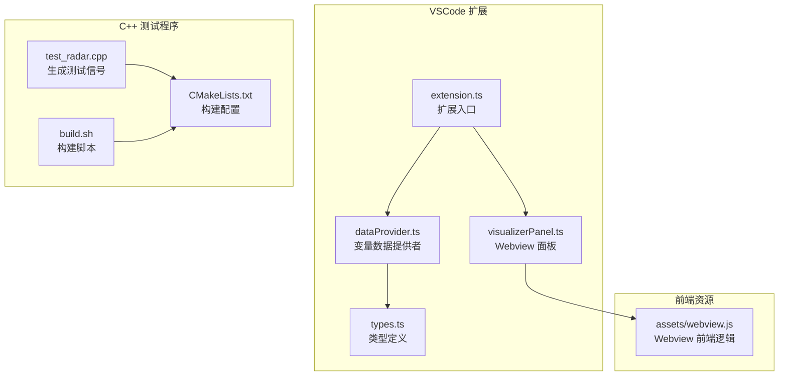
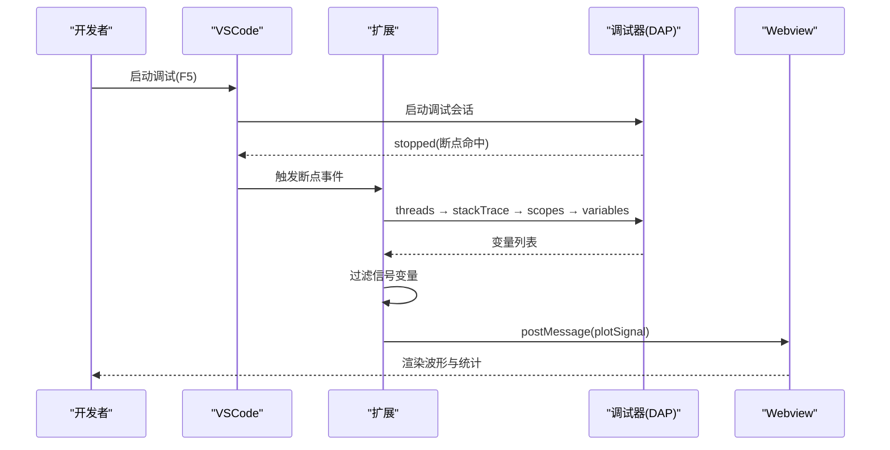
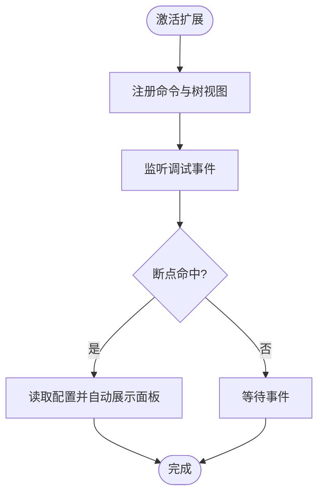
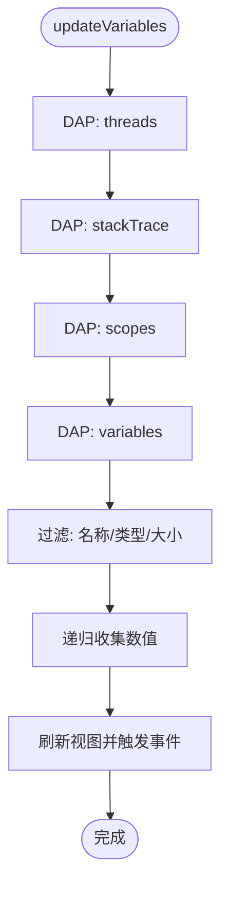
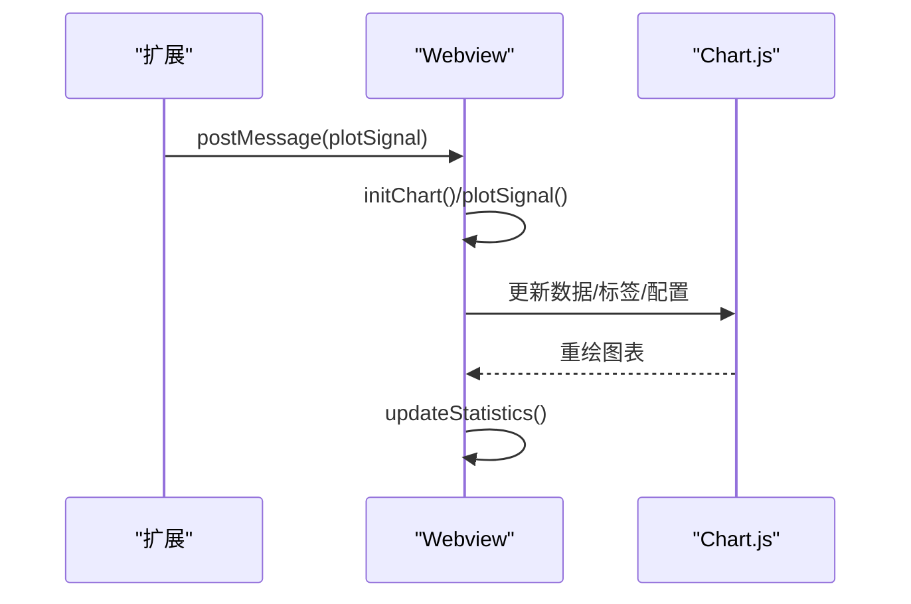
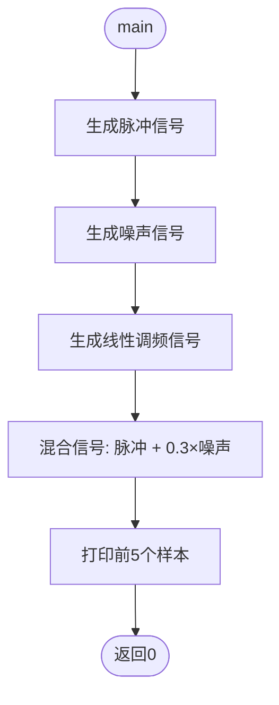
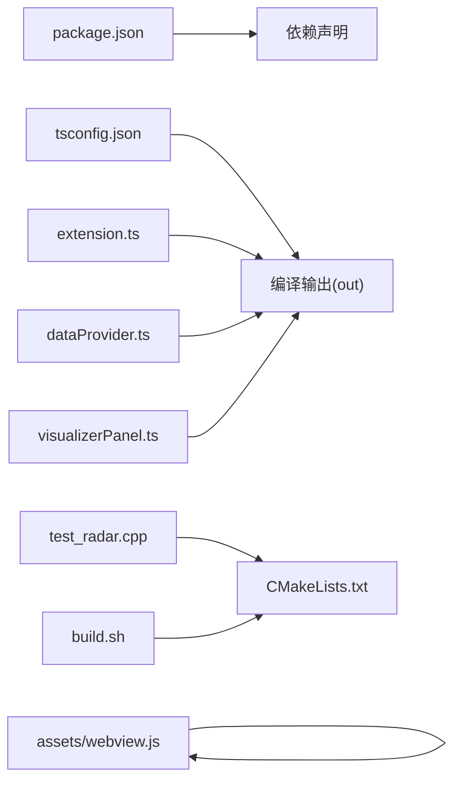

# 测试与开发

<cite>
**本文引用的文件**
- [package.json](file://package.json)
- [CMakeLists.txt](file://CMakeLists.txt)
- [test_radar.cpp](file://test_radar.cpp)
- [build.sh](file://build.sh)
- [QUICKSTART.md](file://QUICKSTART.md)
- [tsconfig.json](file://tsconfig.json)
- [src/extension.ts](file://src/extension.ts)
- [src/dataProvider.ts](file://src/dataProvider.ts)
- [src/visualizerPanel.ts](file://src/visualizerPanel.ts)
- [src/types.ts](file://src/types.ts)
- [assets/webview.js](file://assets/webview.js)
</cite>

## 目录
1. [简介](#简介)
2. [项目结构](#项目结构)
3. [核心组件](#核心组件)
4. [架构总览](#架构总览)
5. [详细组件分析](#详细组件分析)
6. [依赖关系分析](#依赖关系分析)
7. [性能考量](#性能考量)
8. [故障排查指南](#故障排查指南)
9. [结论](#结论)
10. [附录](#附录)

## 简介
本指南面向开发者与测试工程师，围绕“雷达信号可视化”VSCode扩展与其配套的C++测试程序，提供从开发环境搭建、调试扩展、构建与编译、测试信号生成与验证，到单元/集成测试与性能基准测试的完整实践路径。文档同时给出开发工具推荐、IDE配置建议、代码热重载与构建优化策略，以及测试数据准备、用例设计与质量保证流程。

## 项目结构
该项目采用“VSCode扩展 + C++测试程序”的双轨结构：
- VSCode扩展：TypeScript实现，负责与调试器交互、变量提取、Webview可视化。
- C++测试程序：生成典型雷达信号（脉冲、噪声、线性调频），便于在GPU调试场景下验证扩展。

**图表来源**
- [src/extension.ts:1-200](file://src/extension.ts#L1-L200)
- [src/dataProvider.ts:1-703](file://src/dataProvider.ts#L1-L703)
- [src/visualizerPanel.ts:1-451](file://src/visualizerPanel.ts#L1-L451)
- [src/types.ts:1-95](file://src/types.ts#L1-L95)
- [assets/webview.js:1-494](file://assets/webview.js#L1-L494)
- [test_radar.cpp:1-63](file://test_radar.cpp#L1-L63)
- [CMakeLists.txt:1-10](file://CMakeLists.txt#L1-L10)
- [build.sh:1-12](file://build.sh#L1-L12)

**章节来源**
- [QUICKSTART.md:42-57](file://QUICKSTART.md#L42-L57)
- [package.json:1-102](file://package.json#L1-L102)
- [tsconfig.json:1-19](file://tsconfig.json#L1-L19)

## 核心组件
- 扩展入口与生命周期管理：负责注册命令、树视图、调试事件监听、自动弹窗等。
- 数据提供者：通过DAP协议从调试器抓取变量，过滤信号变量，提取数值数组。
- 可视化面板：管理Webview，加载Chart.js，渲染波形与统计信息。
- 类型定义：统一SignalVariable/SignalData结构，保证前后端契约稳定。
- C++测试程序：生成脉冲、噪声、线性调频信号，混合后断点验证。

**章节来源**
- [src/extension.ts:46-188](file://src/extension.ts#L46-L188)
- [src/dataProvider.ts:56-702](file://src/dataProvider.ts#L56-L702)
- [src/visualizerPanel.ts:44-424](file://src/visualizerPanel.ts#L44-L424)
- [src/types.ts:59-94](file://src/types.ts#L59-L94)
- [test_radar.cpp:6-62](file://test_radar.cpp#L6-L62)

## 架构总览
扩展通过DAP协议与调试器交互，自动在断点命中时抓取变量，过滤出信号变量，再通过Webview将波形与统计信息呈现给用户。

**图表来源**
- [src/dataProvider.ts:243-399](file://src/dataProvider.ts#L243-L399)
- [src/visualizerPanel.ts:264-275](file://src/visualizerPanel.ts#L264-L275)
- [assets/webview.js:70-96](file://assets/webview.js#L70-L96)

## 详细组件分析

### 扩展入口与命令体系
- 注册命令：打开面板、可视化变量、刷新变量列表。
- 监听调试事件：断点命中自动展示面板；会话切换/开始/结束时清理数据。
- 配置项：自动显示、变量名模式、最大数组长度。

**图表来源**
- [src/extension.ts:46-188](file://src/extension.ts#L46-L188)
- [package.json:13-84](file://package.json#L13-L84)

**章节来源**
- [src/extension.ts:46-188](file://src/extension.ts#L46-L188)
- [package.json:17-84](file://package.json#L17-L84)

### 数据提供者：DAP变量抓取与过滤
- DAP四步请求链：threads → stackTrace → scopes → variables。
- 过滤策略：名称模式匹配、数组类型判断、大小限制。
- 数值提取：递归遍历复合变量，收集数值数组。
- 事件驱动：刷新树视图、触发断点事件。

**图表来源**
- [src/dataProvider.ts:243-399](file://src/dataProvider.ts#L243-L399)
- [src/dataProvider.ts:414-499](file://src/dataProvider.ts#L414-L499)
- [src/dataProvider.ts:515-634](file://src/dataProvider.ts#L515-L634)

**章节来源**
- [src/dataProvider.ts:243-399](file://src/dataProvider.ts#L243-L399)
- [src/dataProvider.ts:414-499](file://src/dataProvider.ts#L414-L499)
- [src/dataProvider.ts:515-634](file://src/dataProvider.ts#L515-L634)

### 可视化面板：Webview与Chart.js
- 单例面板：createOrShow工厂方法，避免重复创建。
- 安全策略：CSP + nonce，仅允许本地资源。
- 数据流：扩展→Webview，postMessage(plotSignal)。
- 前端渲染：Chart.js折线图，统计面板实时更新。

**图表来源**
- [src/visualizerPanel.ts:264-275](file://src/visualizerPanel.ts#L264-L275)
- [assets/webview.js:50-96](file://assets/webview.js#L50-L96)
- [assets/webview.js:355-419](file://assets/webview.js#L355-L419)

**章节来源**
- [src/visualizerPanel.ts:102-164](file://src/visualizerPanel.ts#L102-L164)
- [src/visualizerPanel.ts:317-392](file://src/visualizerPanel.ts#L317-L392)
- [assets/webview.js:355-419](file://assets/webview.js#L355-L419)

### C++测试程序：信号生成与断点验证
- 生成三类信号：脉冲、噪声、线性调频。
- 混合信号：脉冲叠加噪声，便于断点后观察。
- 断点位置：混合信号后输出前5个样本，便于验证扩展抓取与可视化。

**图表来源**
- [test_radar.cpp:34-62](file://test_radar.cpp#L34-L62)

**章节来源**
- [test_radar.cpp:6-62](file://test_radar.cpp#L6-L62)

## 依赖关系分析
- 扩展依赖：@types/vscode、@types/node、chart.js、esbuild。
- 构建工具：CMake（C++测试程序）、esbuild（TypeScript打包）。
- 运行时：VSCode扩展主机、调试器（GDB/LLDB/CUDA-GDB）。

**图表来源**
- [package.json:91-101](file://package.json#L91-L101)
- [tsconfig.json:2-16](file://tsconfig.json#L2-L16)
- [src/extension.ts:1-200](file://src/extension.ts#L1-L200)
- [src/dataProvider.ts:1-703](file://src/dataProvider.ts#L1-L703)
- [src/visualizerPanel.ts:1-451](file://src/visualizerPanel.ts#L1-L451)
- [assets/webview.js:1-494](file://assets/webview.js#L1-L494)
- [test_radar.cpp:1-63](file://test_radar.cpp#L1-L63)
- [CMakeLists.txt:1-10](file://CMakeLists.txt#L1-L10)
- [build.sh:1-12](file://build.sh#L1-L12)

**章节来源**
- [package.json:91-101](file://package.json#L91-L101)
- [tsconfig.json:2-16](file://tsconfig.json#L2-L16)
- [CMakeLists.txt:1-10](file://CMakeLists.txt#L1-L10)

## 性能考量
- Webview渲染优化：大数据集降采样至1万点以内，避免Chart.js卡顿。
- DAP请求链：按需请求，避免一次性拉取过多变量。
- 事件驱动刷新：仅在数据变化时触发视图更新，减少UI抖动。
- 配置上限：通过配置限制最大数组长度，避免内存压力。

**章节来源**
- [assets/webview.js:360-419](file://assets/webview.js#L360-L419)
- [src/dataProvider.ts:426-428](file://src/dataProvider.ts#L426-L428)
- [src/dataProvider.ts:492-499](file://src/dataProvider.ts#L492-L499)

## 故障排查指南
- 侧边栏无“Radar Signals”图标
  - 确认在“Extension Development Host”窗口中，并已启动调试会话。
- 信号变量列表为空
  - 确保调试器已暂停，变量名匹配配置模式（默认包含 *signal*, *data*, *pulse*, *sample*）。
- 图表不显示
  - 检查变量是否为数组类型且包含数值数据。
- 断点后未自动弹窗
  - 检查配置项“自动显示”是否启用，且存在匹配变量。
- C++测试程序构建失败
  - 确认已安装CMake与编译器，执行构建脚本。

**章节来源**
- [QUICKSTART.md:31-41](file://QUICKSTART.md#L31-L41)
- [src/extension.ts:138-146](file://src/extension.ts#L138-L146)

## 结论
本项目通过VSCode扩展与C++测试程序的协同，提供了从GPU调试到信号可视化的闭环验证能力。扩展以DAP协议为核心，结合Webview与Chart.js，实现断点自动弹窗、变量过滤与波形渲染。C++测试程序提供标准化信号生成，便于快速验证与回归测试。建议在开发过程中充分利用配置项、事件驱动与降采样策略，持续优化调试体验与性能表现。

## 附录

### 开发环境搭建与调试扩展
- 安装依赖与编译扩展
  - 安装Node.js与npm，执行安装依赖与编译。
- 启动扩展开发模式
  - 在VSCode中按F5启动“Extension Development Host”，在新窗口中触发扩展功能。
- 调试扩展代码
  - 在src目录的TypeScript文件中设置断点，按F5启动扩展开发主机，在新窗口中触发扩展功能。

**章节来源**
- [QUICKSTART.md:18-21](file://QUICKSTART.md#L18-L21)
- [QUICKSTART.md:59-65](file://QUICKSTART.md#L59-L65)
- [package.json:86-90](file://package.json#L86-L90)

### C++测试程序构建与编译流程
- 使用CMake构建
  - 创建build目录，进入build执行cmake ..与make。
- 构建脚本
  - ./build.sh一键创建build目录并执行cmake与make。
- 运行与断点验证
  - 在混合信号后设置断点，运行程序观察前5个样本输出。

**章节来源**
- [CMakeLists.txt:1-10](file://CMakeLists.txt#L1-L10)
- [build.sh:1-12](file://build.sh#L1-L12)
- [QUICKSTART.md:13-16](file://QUICKSTART.md#L13-L16)
- [test_radar.cpp:34-62](file://test_radar.cpp#L34-L62)

### 单元测试策略与集成测试方案
- 单元测试（TypeScript）
  - 针对dataProvider.ts中的过滤与数值提取逻辑编写单元测试，模拟DAP响应与变量结构。
  - 针对visualizerPanel.ts中的Webview消息处理与Chart初始化进行断言。
- 集成测试（VSCode扩展）
  - 使用VSCode Test Runner，编写测试场景：启动调试、命中断点、抓取变量、渲染图表。
  - 验证自动弹窗、刷新命令、多调试会话切换等行为。
- C++测试程序验证
  - 断点命中后，检查扩展是否正确识别并可视化脉冲、噪声、线性调频与混合信号。
  - 验证统计面板的最小值、最大值、均值与点数。

**章节来源**
- [src/dataProvider.ts:414-499](file://src/dataProvider.ts#L414-L499)
- [src/visualizerPanel.ts:264-275](file://src/visualizerPanel.ts#L264-L275)
- [assets/webview.js:456-493](file://assets/webview.js#L456-L493)

### 性能基准测试
- Webview渲染
  - 生成不同规模的信号数据（如1k、10k、100k、1M），测量渲染时间与内存占用。
  - 验证降采样策略在不同数据规模下的效果。
- DAP请求链
  - 统计threads/stackTrace/scopes/variables请求的往返时间，评估调试器性能。
- 配置敏感性
  - 调整最大数组长度与自动显示开关，评估对UI响应的影响。

**章节来源**
- [assets/webview.js:360-419](file://assets/webview.js#L360-L419)
- [src/dataProvider.ts:426-428](file://src/dataProvider.ts#L426-L428)

### 开发工具推荐与IDE配置
- VSCode扩展开发
  - 使用ESLint与Prettier规范代码风格；启用TypeScript严格模式。
  - 使用“Extension Development Host”进行热重载与调试。
- C++开发
  - 使用CMake与编译器（GCC/Clang）；配置断点与变量监视。
- 调试技巧
  - 在Webview中按Ctrl+Shift+I打开开发者工具，查看Console与Network。
  - 在扩展代码中设置断点，观察DAP请求与变量过滤过程。

**章节来源**
- [tsconfig.json:2-16](file://tsconfig.json#L2-L16)
- [assets/webview.js:22-25](file://assets/webview.js#L22-L25)

### 测试数据准备与用例设计
- 测试数据
  - 脉冲信号：用于验证瞬态响应与峰值检测。
  - 噪声信号：用于验证统计面板与分布特性。
  - 线性调频信号：用于验证频率变化与时域特征。
  - 混合信号：脉冲叠加噪声，验证叠加与可视化。
- 用例设计
  - 断点命中后自动弹窗，展示首个匹配变量。
  - 手动刷新命令触发变量更新。
  - 多调试会话切换时，面板数据正确更新。
  - 大数组降采样与统计准确性。

**章节来源**
- [test_radar.cpp:6-62](file://test_radar.cpp#L6-L62)
- [src/extension.ts:138-146](file://src/extension.ts#L138-L146)
- [src/dataProvider.ts:414-499](file://src/dataProvider.ts#L414-L499)
- [assets/webview.js:456-493](file://assets/webview.js#L456-L493)