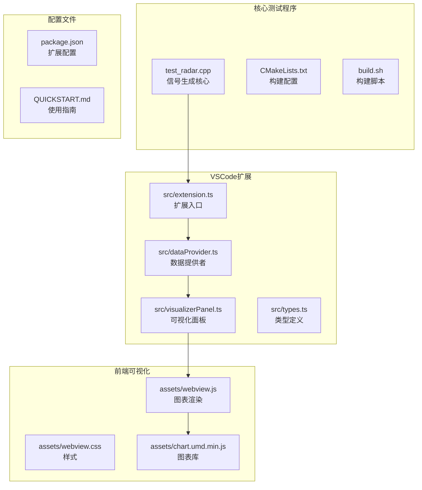
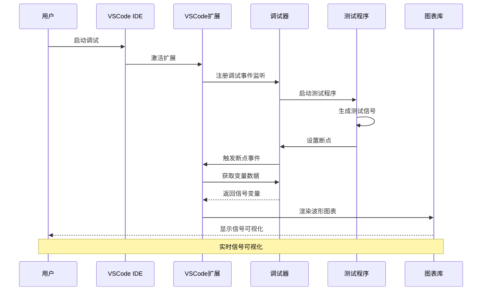
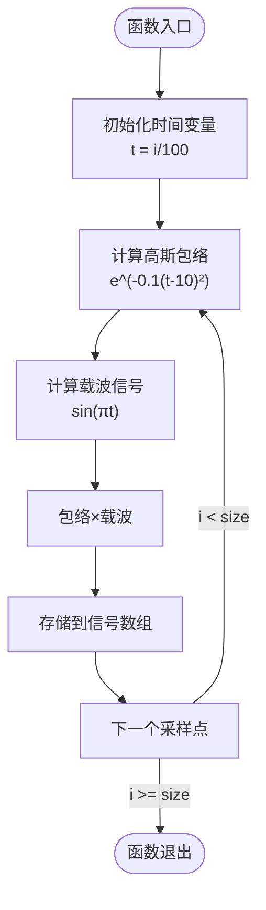
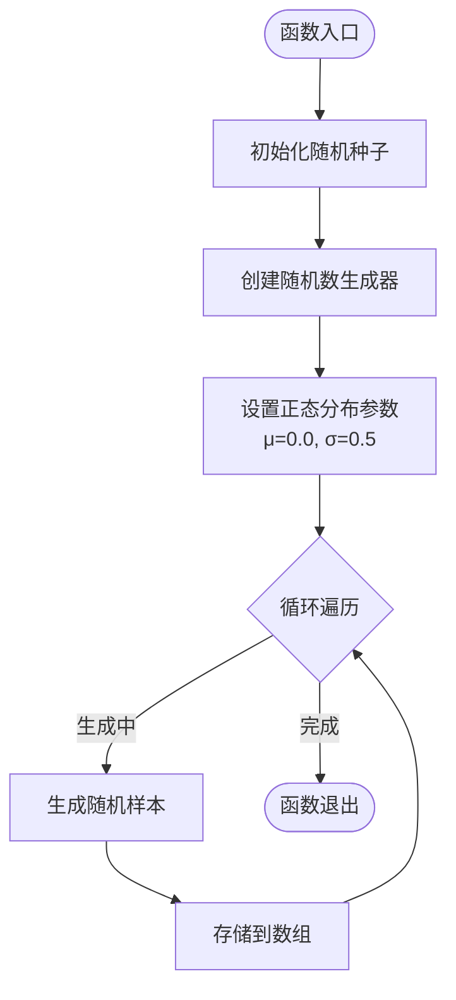
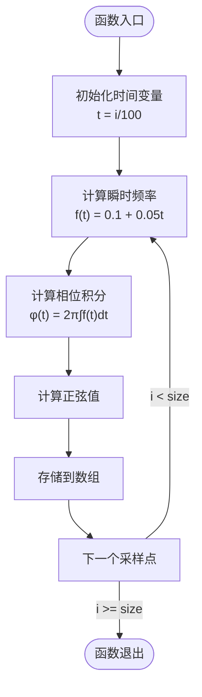
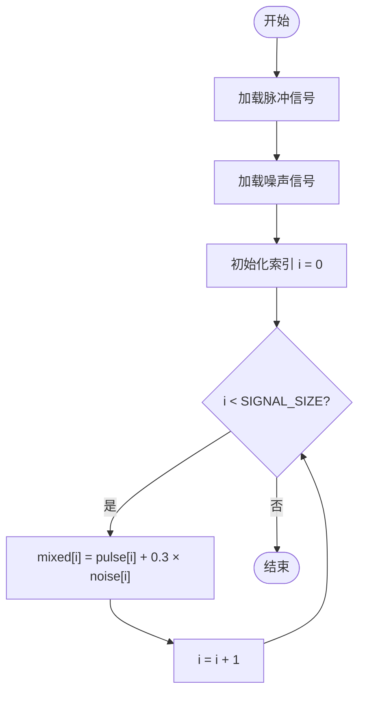
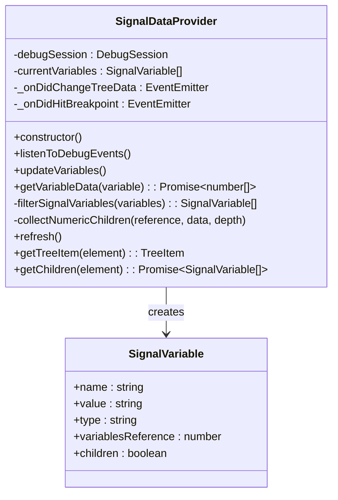
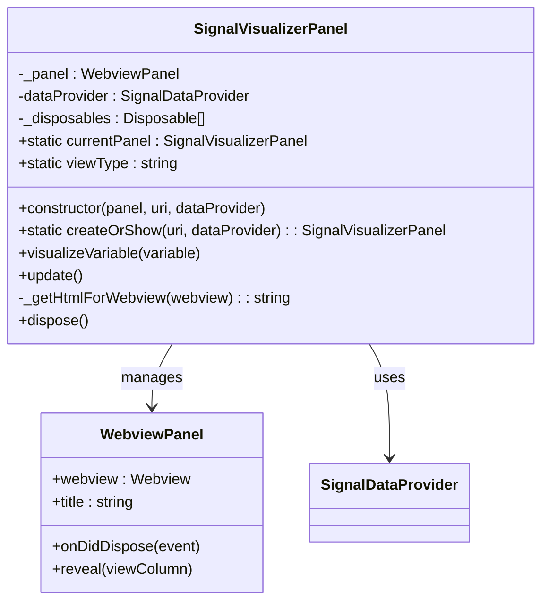
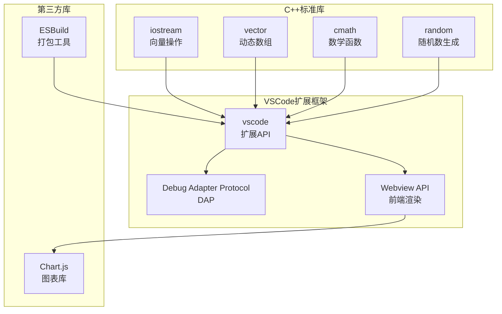
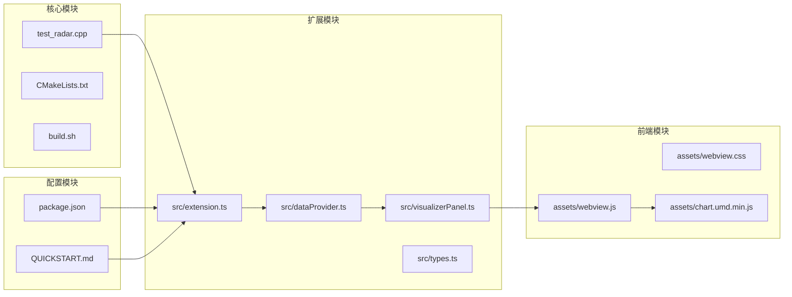

# 测试信号生成程序

<cite>
**本文档引用的文件**
- [test_radar.cpp](file://test_radar.cpp)
- [CMakeLists.txt](file://CMakeLists.txt)
- [QUICKSTART.md](file://QUICKSTART.md)
- [build.sh](file://build.sh)
- [src/extension.ts](file://src/extension.ts)
- [src/dataProvider.ts](file://src/dataProvider.ts)
- [src/visualizerPanel.ts](file://src/visualizerPanel.ts)
- [src/types.ts](file://src/types.ts)
- [assets/webview.js](file://assets/webview.js)
- [package.json](file://package.json)
</cite>

## 目录
1. [简介](#简介)
2. [项目结构](#项目结构)
3. [核心组件](#核心组件)
4. [架构概览](#架构概览)
5. [详细组件分析](#详细组件分析)
6. [依赖关系分析](#依赖关系分析)
7. [性能考虑](#性能考虑)
8. [故障排除指南](#故障排除指南)
9. [结论](#结论)
10. [附录](#附录)

## 简介

测试信号生成程序是一个专为雷达信号可视化设计的C++测试程序，结合VSCode扩展实现完整的信号生成、调试和可视化工作流程。该程序能够生成三种类型的测试信号：脉冲信号、噪声信号和线性调频信号，并支持将这些信号混合生成复合信号。

该系统的核心价值在于为雷达信号处理算法提供高质量的测试数据，支持开发者在调试过程中实时观察信号波形，验证信号处理算法的正确性和性能表现。

## 项目结构

该项目采用模块化设计，主要分为以下几个核心部分：



**图表来源**
- [test_radar.cpp:1-63](file://test_radar.cpp#L1-L63)
- [src/extension.ts:1-200](file://src/extension.ts#L1-L200)
- [src/dataProvider.ts:1-703](file://src/dataProvider.ts#L1-L703)

**章节来源**
- [test_radar.cpp:1-63](file://test_radar.cpp#L1-L63)
- [CMakeLists.txt:1-10](file://CMakeLists.txt#L1-L10)
- [QUICKSTART.md:42-57](file://QUICKSTART.md#L42-L57)

## 核心组件

### 信号生成器 (Signal Generator)

测试程序的核心是三个信号生成函数，每个函数都实现了特定的数学模型：

1. **脉冲信号生成器** (`generatePulseSignal`)
2. **噪声信号生成器** (`generateNoiseSignal`)
3. **线性调频信号生成器** (`generateChirpSignal`)

### 混合信号处理器

程序实现了信号混合功能，将脉冲信号和噪声信号按比例混合，生成复合信号用于更真实的雷达场景模拟。

### VSCode可视化扩展

扩展提供了完整的调试可视化环境，包括：
- 自动变量检测和过滤
- 实时波形图表显示
- 信号统计信息计算
- 断点自动触发功能

**章节来源**
- [test_radar.cpp:6-62](file://test_radar.cpp#L6-L62)
- [src/extension.ts:46-200](file://src/extension.ts#L46-L200)

## 架构概览

该系统采用分层架构设计，实现了测试程序与可视化界面的无缝集成：



**图表来源**
- [src/extension.ts:138-146](file://src/extension.ts#L138-L146)
- [src/dataProvider.ts:243-399](file://src/dataProvider.ts#L243-L399)
- [src/visualizerPanel.ts:264-275](file://src/visualizerPanel.ts#L264-L275)

## 详细组件分析

### 脉冲信号生成器 (generatePulseSignal)

脉冲信号是雷达系统中最基本的信号类型，具有明确的时域特征和频域特性。

#### 数学模型

脉冲信号采用高斯包络调制的正弦振荡器模型：

```
s(t) = e^(-α(t-t₀)²) × sin(2πf₀t)
```

其中：
- α = 0.1：高斯包络衰减系数
- t₀ = 10.0：脉冲中心时刻
- f₀ = 0.5：调制频率（Hz）

#### 实现特点



**图表来源**
- [test_radar.cpp:7-13](file://test_radar.cpp#L7-L13)

#### 参数设置

- **采样率**：100 Hz（时间分辨率）
- **信号长度**：256 个采样点
- **包络参数**：α = 0.1, t₀ = 10.0
- **调制频率**：f₀ = 0.5 Hz

**章节来源**
- [test_radar.cpp:7-13](file://test_radar.cpp#L7-L13)

### 噪声信号生成器 (generateNoiseSignal)

噪声信号用于模拟雷达系统中的各种噪声干扰，包括热噪声、量化噪声等。

#### 数学模型

采用正态分布（高斯分布）模型：

```
n(t) ~ N(μ, σ²)
```

其中：
- μ = 0.0：均值（零均值噪声）
- σ = 0.5：标准差（噪声强度控制）

#### 实现特点



**图表来源**
- [test_radar.cpp:15-23](file://test_radar.cpp#L15-L23)

#### 参数设置

- **分布类型**：正态分布 N(0, 0.5²)
- **采样点数**：256 个
- **随机种子**：基于硬件随机源
- **数值范围**：约 [-2.5, 2.5]（99.7%概率）

**章节来源**
- [test_radar.cpp:15-23](file://test_radar.cpp#L15-L23)

### 线性调频信号生成器 (generateChirpSignal)

线性调频（LFM）信号是现代雷达系统广泛使用的信号类型，具有良好的距离-速度分辨能力。

#### 数学模型

线性调频信号的瞬时频率随时间线性变化：

```
f(t) = f₀ + βt
```

其中：
- f₀ = 0.1：初始频率
- β = 0.05：频率斜率（Hz/sample）

总信号表达式：
```
s(t) = sin(2π∫f(t)dt) = sin(2π(f₀t + ½βt²))
```

#### 实现特点



**图表来源**
- [test_radar.cpp:25-32](file://test_radar.cpp#L25-L32)

#### 参数设置

- **采样频率**：100 Hz
- **信号长度**：256 个采样点
- **调频斜率**：β = 0.05 Hz/sample
- **频率范围**：[0.1, 13.2] Hz
- **调频带宽**：13.1 Hz

**章节来源**
- [test_radar.cpp:25-32](file://test_radar.cpp#L25-L32)

### 混合信号生成器

混合信号结合了脉冲信号和噪声信号的特点，模拟真实的雷达回波场景。

#### 生成算法

```
mixed[i] = pulse[i] + λ × noise[i]
```

其中：
- λ = 0.3：噪声权重系数
- pulse[i]：脉冲信号样本
- noise[i]：噪声信号样本

#### 实现流程



**图表来源**
- [test_radar.cpp:45-49](file://test_radar.cpp#L45-L49)

**章节来源**
- [test_radar.cpp:45-49](file://test_radar.cpp#L45-L49)

### VSCode扩展架构

#### 数据提供者 (SignalDataProvider)

数据提供者是扩展的核心组件，负责与调试器交互并提取变量数据：



**图表来源**
- [src/dataProvider.ts:56-703](file://src/dataProvider.ts#L56-L703)
- [src/types.ts:59-65](file://src/types.ts#L59-L65)

#### 可视化面板 (SignalVisualizerPanel)

可视化面板管理Webview的生命周期和内容：



**图表来源**
- [src/visualizerPanel.ts:44-424](file://src/visualizerPanel.ts#L44-L424)

**章节来源**
- [src/dataProvider.ts:56-703](file://src/dataProvider.ts#L56-L703)
- [src/visualizerPanel.ts:44-424](file://src/visualizerPanel.ts#L44-L424)

## 依赖关系分析

### 外部依赖

该系统依赖于以下关键组件：



**图表来源**
- [package.json:98-100](file://package.json#L98-L100)
- [src/extension.ts:27-29](file://src/extension.ts#L27-L29)

### 内部模块依赖



**图表来源**
- [src/extension.ts:27-29](file://src/extension.ts#L27-L29)
- [src/dataProvider.ts:35-36](file://src/dataProvider.ts#L35-L36)

**章节来源**
- [package.json:98-100](file://package.json#L98-L100)
- [src/extension.ts:27-29](file://src/extension.ts#L27-L29)

## 性能考虑

### 信号生成性能

1. **内存效率**：使用连续内存布局的std::vector，减少内存碎片
2. **计算优化**：避免重复计算，缓存中间结果
3. **循环优化**：单次遍历完成多个计算任务

### 可视化性能

1. **大数据集降采样**：超过10000点时自动降采样到10000点
2. **增量更新**：图表只更新变化的部分，避免全量重绘
3. **内存管理**：及时释放不再使用的数据和资源

### 调试性能

1. **断点智能检测**：只在断点命中时才更新变量列表
2. **延迟加载**：变量数据按需获取，避免不必要的网络请求
3. **缓存机制**：最近使用的变量数据保持在内存中

## 故障排除指南

### 常见问题及解决方案

#### 1. 信号变量列表为空

**症状**：侧边栏显示"Signals"但没有变量

**可能原因**：
- 调试器未正确连接
- 变量名不符合过滤模式
- 变量作用域超出当前栈帧

**解决方法**：
1. 确认调试器已启动并连接
2. 检查变量名是否包含"*signal*"、"*data*"、"*pulse*"、"*sample*"模式
3. 确保变量在当前断点作用域内

#### 2. 图表不显示或空白

**症状**：面板打开但没有波形显示

**可能原因**：
- Chart.js库加载失败
- 信号数据格式不正确
- Webview安全策略阻止脚本执行

**解决方法**：
1. 检查控制台错误信息
2. 验证信号数据类型为数值数组
3. 确认Webview CSP策略正确配置

#### 3. 断点不触发自动显示

**症状**：命中断点但面板不自动显示

**可能原因**：
- 自动显示功能被禁用
- 变量过滤规则过于严格
- 调试适配器不支持断点事件

**解决方法**：
1. 检查配置项"rsv.autoDisplayOnBreakpoint"
2. 调整"rsv.signalNamePatterns"配置
3. 确认调试适配器版本兼容性

#### 4. 构建失败

**症状**：执行build.sh时报错

**可能原因**：
- CMake版本过低
- 缺少必要的编译器
- 依赖库未安装

**解决方法**：
1. 确认CMake版本≥3.10
2. 安装GCC或Clang编译器
3. 检查系统依赖完整性

**章节来源**
- [QUICKSTART.md:31-41](file://QUICKSTART.md#L31-L41)

## 结论

测试信号生成程序提供了一个完整的雷达信号测试和可视化解决方案。通过精心设计的信号生成算法和直观的可视化界面，该系统能够：

1. **准确模拟真实信号**：三种信号类型覆盖了雷达系统的主要应用场景
2. **提供高质量测试数据**：稳定的信号生成确保测试结果的可靠性
3. **支持实时调试**：与VSCode深度集成，提供流畅的调试体验
4. **易于扩展和定制**：模块化设计便于添加新的信号类型和功能

该系统特别适用于雷达信号处理算法的开发和验证，为开发者提供了一个可靠的测试平台。

## 附录

### 编译和运行步骤

#### 基础编译

```bash
# 创建构建目录
mkdir -p build
cd build

# 使用CMake配置
cmake ..

# 编译项目
make
```

#### VSCode扩展开发

```bash
# 安装依赖
npm install

# 编译扩展
npm run compile

# 启动调试
F5
```

#### 测试程序运行

```bash
# 构建测试程序
./build.sh

# 运行测试程序
./build/test_radar
```

### 调试配置

#### 断点设置

1. 在VSCode中打开`test_radar.cpp`
2. 在第46行（混合信号生成后）设置断点
3. 按F5启动GDB调试
4. 程序将在断点处暂停

#### 变量监控

断点暂停后，可以在侧边栏找到"Radar Signals"图标：
- 查看`pulse_data`、`noise_data`、`chirp_signal`、`mixed_signal`变量
- 点击任意变量查看波形图

### 信号参数调整指南

#### 脉冲信号参数

| 参数 | 默认值 | 调整范围 | 影响 |
|------|--------|----------|------|
| 包络衰减系数α | 0.1 | 0.01-1.0 | 控制脉冲持续时间 |
| 脉冲中心时刻t₀ | 10.0 | 0-256 | 脉冲起始时间 |
| 调制频率f₀ | 0.5 | 0.1-2.0 | 载波频率 |

#### 噪声信号参数

| 参数 | 默认值 | 调整范围 | 影响 |
|------|--------|----------|------|
| 均值μ | 0.0 | -1.0-1.0 | 噪声直流偏移 |
| 标准差σ | 0.5 | 0.1-2.0 | 噪声强度 |

#### 线性调频信号参数

| 参数 | 默认值 | 调整范围 | 影响 |
|------|--------|----------|------|
| 初始频率f₀ | 0.1 | 0.01-1.0 | 调频起始频率 |
| 频率斜率β | 0.05 | 0.01-0.2 | 调频带宽 |

### 数据输出格式

#### 控制台输出

程序运行时输出：
- 测试程序标识信息
- 生成的采样点数量
- 混合信号前5个采样的具体数值

#### 可视化输出

Webview面板显示：
- 信号波形图表
- 信号统计信息（样本数、最小值、最大值、平均值）
- 变量元数据（名称、类型、数据点数）

### 测试数据验证方法

#### 数学验证

1. **脉冲信号验证**：检查高斯包络的对称性和峰值位置
2. **噪声信号验证**：验证正态分布的统计特性
3. **线性调频信号验证**：确认频率随时间线性变化

#### 功能验证

1. **边界条件测试**：验证极端参数设置下的行为
2. **性能测试**：评估大数据集处理能力
3. **兼容性测试**：验证不同调试器的兼容性

#### 调试技巧

1. **变量检查**：使用VSCode变量面板实时监控信号状态
2. **断点调试**：在关键位置设置断点观察信号生成过程
3. **图表对比**：同时显示多个信号进行对比分析