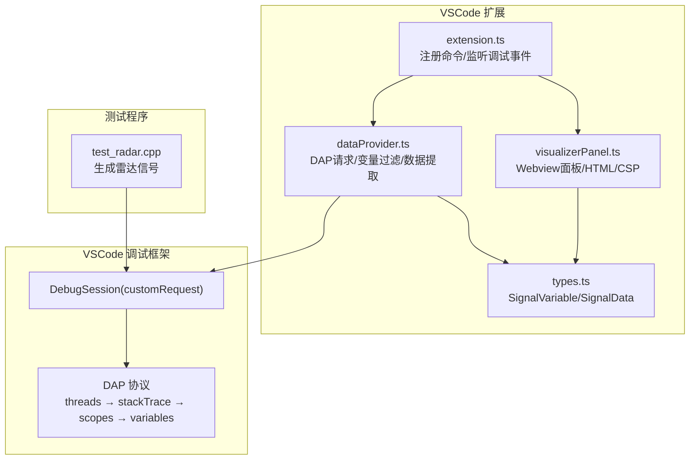
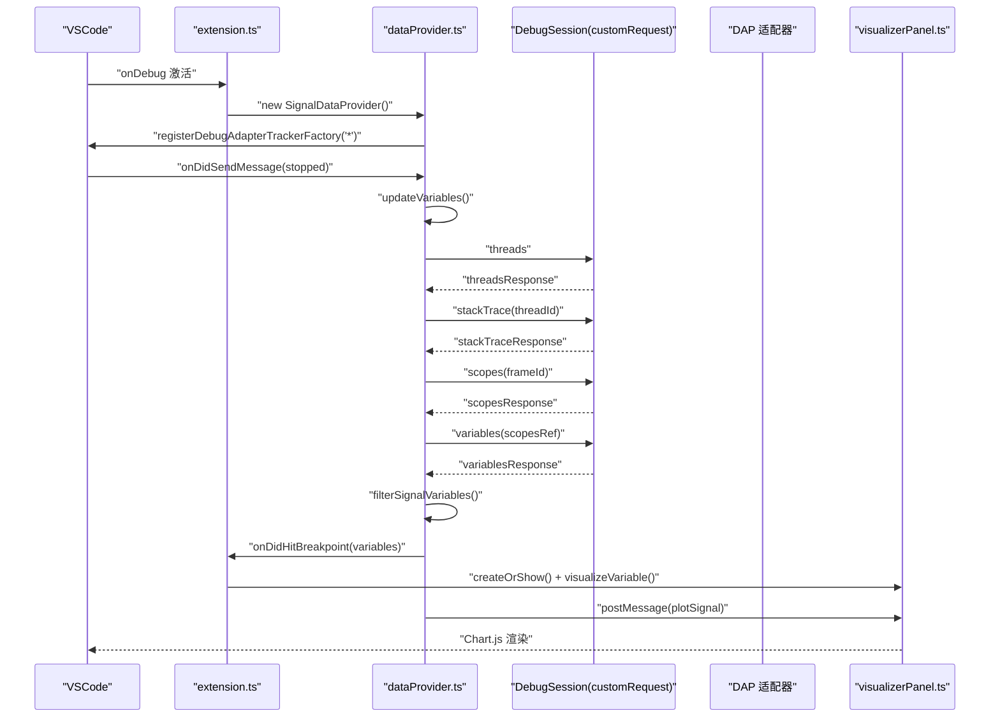
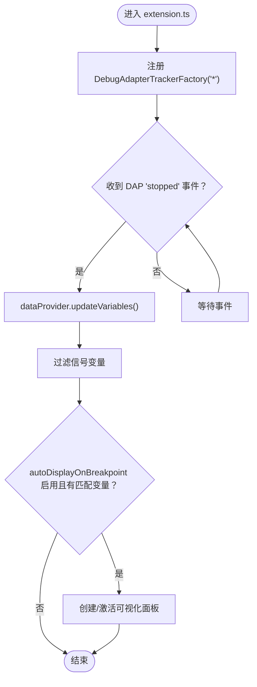
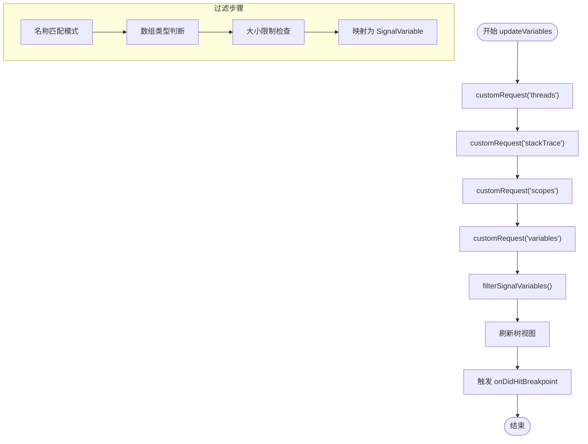
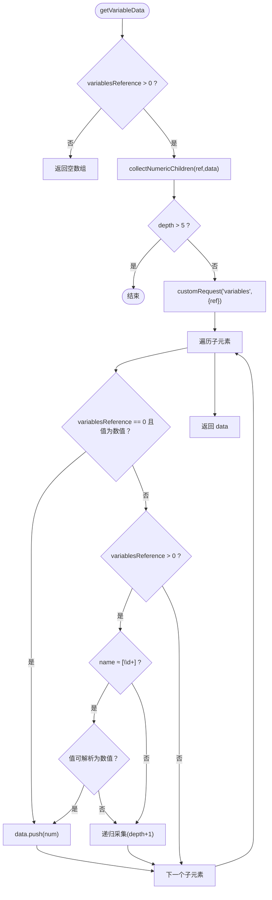
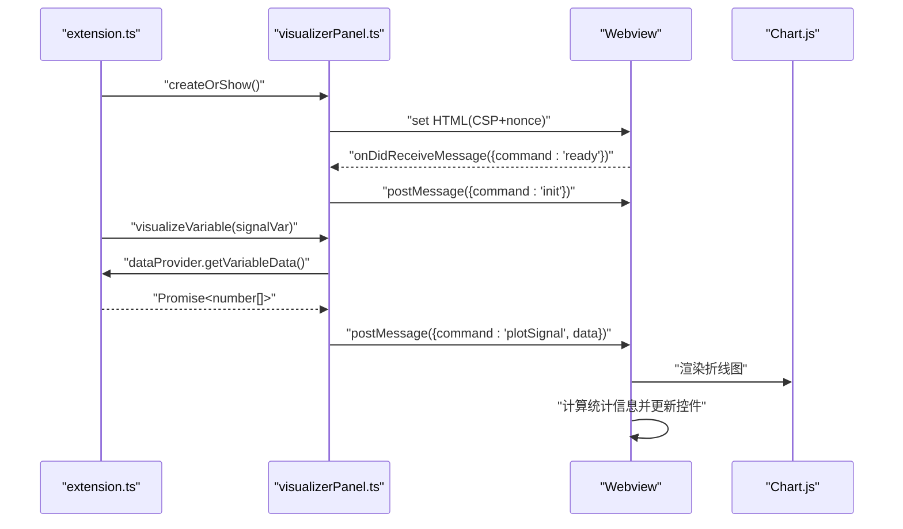
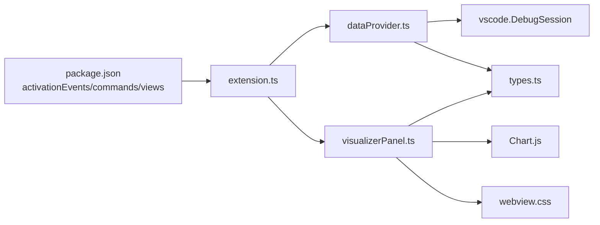

# 调试器集成

<cite>
**本文引用的文件**
- [package.json](file://package.json)
- [QUICKSTART.md](file://QUICKSTART.md)
- [src/extension.ts](file://src/extension.ts)
- [src/dataProvider.ts](file://src/dataProvider.ts)
- [src/visualizerPanel.ts](file://src/visualizerPanel.ts)
- [src/types.ts](file://src/types.ts)
- [assets/webview.css](file://assets/webview.css)
- [test_radar.cpp](file://test_radar.cpp)
</cite>

## 目录
1. [简介](#简介)
2. [项目结构](#项目结构)
3. [核心组件](#核心组件)
4. [架构总览](#架构总览)
5. [详细组件分析](#详细组件分析)
6. [依赖关系分析](#依赖关系分析)
7. [性能考量](#性能考量)
8. [故障排查指南](#故障排查指南)
9. [结论](#结论)
10. [附录](#附录)

## 简介
本项目为 VSCode 调试器扩展，专注于在调试过程中可视化雷达信号数据。它通过 Debug Adapter Protocol（DAP）与调试器（如 GDB、CUDA-GDB）交互，自动识别并提取符合“信号”语义的变量（通常为数组或容器类型），并在内置的 Webview 面板中以折线图呈现，同时提供样本数、最小值、最大值、均值等统计信息。扩展还支持断点命中自动弹窗、手动刷新、会话生命周期管理以及与 VSCode 调试框架的深度集成。

## 项目结构
- 扩展入口与贡献项：package.json 定义激活事件、命令、视图容器与菜单项；QUICKSTART.md 提供快速上手与常见问题。
- 核心实现：
  - extension.ts：扩展入口，注册命令、树视图、调试事件监听与会话生命周期管理。
  - dataProvider.ts：DAP 四级请求链实现、变量过滤、数据提取与递归采集、树视图数据源。
  - visualizerPanel.ts：Webview 面板管理、HTML 生成、CSP 安全策略、与扩展的数据通信。
  - types.ts：SignalVariable、SignalData 等类型定义。
- 资产与测试：
  - assets/webview.css：Webview 样式，适配 VSCode 主题。
  - test_radar.cpp：生成脉冲、噪声、线性调频等信号的测试程序，便于断点调试与验证。

**图表来源**
- [src/extension.ts:46-188](file://src/extension.ts#L46-L188)
- [src/dataProvider.ts:243-399](file://src/dataProvider.ts#L243-L399)
- [src/visualizerPanel.ts:142-231](file://src/visualizerPanel.ts#L142-L231)
- [src/types.ts:59-94](file://src/types.ts#L59-L94)

**章节来源**
- [package.json:13-85](file://package.json#L13-L85)
- [QUICKSTART.md:42-57](file://QUICKSTART.md#L42-L57)

## 核心组件
- 扩展入口与命令
  - 注册打开面板、可视化变量、刷新变量等命令。
  - 监听调试会话切换、开始与结束事件，维护当前会话状态。
- 数据提供者（SignalDataProvider）
  - 通过 DebugAdapterTrackerFactory 拦截 DAP 事件，断点命中后自动更新变量列表。
  - 实现 DAP 四级请求链：threads → stackTrace → scopes → variables。
  - 变量过滤：名称模式匹配、数组类型判断、大小限制。
  - 递归采集数值：对复合类型（如 std::vector）递归获取子元素，提取数值数组。
  - 树视图数据源：实现 TreeDataProvider 接口，提供节点 UI 描述与子节点。
- 可视化面板（SignalVisualizerPanel）
  - 单例模式管理 Webview 面板，支持多列显示与上下文保留。
  - 生成安全 HTML（CSP + nonce），加载本地资源（Chart.js、webview.js、webview.css）。
  - 与扩展通信：接收初始化消息、发送绘图数据，渲染折线图与统计信息。
- 类型定义（types.ts）
  - SignalVariable：树节点元数据（名称、显示值、类型、DAP 引用、是否有子节点）。
  - SignalData：绘图数据载体（名称、数值数组、类型）。

**章节来源**
- [src/extension.ts:46-188](file://src/extension.ts#L46-L188)
- [src/dataProvider.ts:56-702](file://src/dataProvider.ts#L56-L702)
- [src/visualizerPanel.ts:44-424](file://src/visualizerPanel.ts#L44-L424)
- [src/types.ts:21-94](file://src/types.ts#L21-L94)

## 架构总览
扩展围绕“DAP → 变量过滤 → 数据提取 → 可视化”的主流程工作。调试器事件通过 DebugAdapterTrackerFactory 捕获，断点命中后触发变量更新；随后通过 customRequest 发送 DAP 请求，逐层获取变量并过滤；最后将数值数组通过 postMessage 发送到 Webview，由 Chart.js 渲染。

**图表来源**
- [src/extension.ts:138-187](file://src/extension.ts#L138-L187)
- [src/dataProvider.ts:175-204](file://src/dataProvider.ts#L175-L204)
- [src/dataProvider.ts:243-399](file://src/dataProvider.ts#L243-L399)
- [src/visualizerPanel.ts:264-275](file://src/visualizerPanel.ts#L264-L275)

## 详细组件分析

### 组件一：调试器事件监听与会话生命周期
- DebugAdapterTrackerFactory
  - 为所有调试适配器类型注册跟踪器，拦截 onDidSendMessage。
  - 检测到 DAP 事件类型为 event 且事件名为 stopped 时，触发变量更新。
- 调试会话管理
  - onDidChangeActiveDebugSession：保存当前会话，必要时刷新视图。
  - onDidStartDebugSession/onDidTerminateDebugSession：提示与清理。
- 断点命中自动展示
  - 读取配置项 autoDisplayOnBreakpoint，若启用且匹配到信号变量，则自动创建面板并展示首个变量。

**图表来源**
- [src/extension.ts:138-187](file://src/extension.ts#L138-L187)
- [src/dataProvider.ts:175-204](file://src/dataProvider.ts#L175-L204)

**章节来源**
- [src/extension.ts:138-187](file://src/extension.ts#L138-L187)
- [src/dataProvider.ts:138-205](file://src/dataProvider.ts#L138-L205)

### 组件二：DAP 请求链与变量数据获取
- 四级请求链
  - threads：获取线程列表，取首个线程 ID。
  - stackTrace：获取调用栈，取最内层帧 ID。
  - scopes：获取作用域，取局部作用域（Locals）。
  - variables：获取变量列表，过滤后映射为 SignalVariable。
- 变量过滤机制
  - 名称模式匹配：支持通配符模式（如 *signal*），转换为正则表达式匹配。
  - 数组类型判断：依据显示值包含 [0]、array 或 variablesReference > 0。
  - 大小限制：从显示值提取数组长度，超过阈值则剔除。
- 变量数据提取与递归采集
  - 对复合类型（如 std::vector）递归调用 variables，按名称判断是否为数组元素（[0]、[1]…）。
  - 叶子节点且值可解析为数值时直接采集；否则继续递归。
  - 递归深度限制为 5，防止异常数据结构导致无限递归。

**图表来源**
- [src/dataProvider.ts:243-399](file://src/dataProvider.ts#L243-L399)
- [src/dataProvider.ts:414-441](file://src/dataProvider.ts#L414-L441)
- [src/dataProvider.ts:454-499](file://src/dataProvider.ts#L454-L499)

**章节来源**
- [src/dataProvider.ts:243-399](file://src/dataProvider.ts#L243-L399)
- [src/dataProvider.ts:414-499](file://src/dataProvider.ts#L414-L499)

### 组件三：变量数据提取与统计信息计算
- 递归采集流程
  - 若 variablesReference > 0：递归获取子元素。
  - 若子元素名称为数组元素（[0]、[1]…）：优先尝试解析值；失败则继续递归。
  - 叶子节点且值为数值：加入结果数组。
- 统计信息
  - 样本数：数组长度。
  - 最小值、最大值、均值：在 Webview 端基于数据数组计算并展示。

**图表来源**
- [src/dataProvider.ts:515-634](file://src/dataProvider.ts#L515-L634)

**章节来源**
- [src/dataProvider.ts:515-634](file://src/dataProvider.ts#L515-L634)

### 组件四：与不同调试器的兼容性与协议适配
- 适配范围
  - DebugAdapterTrackerFactory 使用通配符 '*'，对所有调试适配器类型生效，包括 GDB、CUDA-GDB 等。
- 协议适配
  - 通过 debugSession.customRequest('threads'|'stackTrace'|'scopes'|'variables') 直接发送 DAP 请求，绕过 VSCode 标准 UI 流程，获取原始变量数据。
- 数据转换逻辑
  - 将 DAP 返回的字符串显示值转换为可绘制的数值数组，处理不同调试器的 pretty-print 输出差异（如包含 [0]、array、长度信息等）。

**章节来源**
- [src/dataProvider.ts:175-204](file://src/dataProvider.ts#L175-L204)
- [src/dataProvider.ts:259-369](file://src/dataProvider.ts#L259-L369)

### 组件五：Webview 面板与 VSCode 深度集成
- 单例模式与生命周期
  - createOrShow 静态工厂方法确保面板唯一；onDidDispose 时清理资源。
- 安全策略与资源加载
  - CSP + nonce 严格控制脚本执行；本地资源通过 asWebviewUri 转换为安全 URI。
- 与扩展通信
  - Webview 加载完成后发送 ready，扩展响应 init；扩展在可视化变量时发送 plotSignal，Webview 接收后渲染图表与统计信息。
- 主题适配
  - 使用 VSCode 主题变量（如 --vscode-editor-background）确保在深色/浅色主题下一致显示。

**图表来源**
- [src/visualizerPanel.ts:102-164](file://src/visualizerPanel.ts#L102-L164)
- [src/visualizerPanel.ts:207-222](file://src/visualizerPanel.ts#L207-L222)
- [src/visualizerPanel.ts:264-275](file://src/visualizerPanel.ts#L264-L275)
- [assets/webview.css:64-237](file://assets/webview.css#L64-L237)

**章节来源**
- [src/visualizerPanel.ts:102-231](file://src/visualizerPanel.ts#L102-L231)
- [src/visualizerPanel.ts:244-275](file://src/visualizerPanel.ts#L244-L275)
- [assets/webview.css:64-237](file://assets/webview.css#L64-L237)

### 组件六：断点处理与会话生命周期控制
- 断点处理
  - DebugAdapterTrackerFactory 捕获 stopped 事件，触发变量更新与自动展示。
- 会话生命周期
  - onDidChangeActiveDebugSession：切换会话时更新当前会话并刷新视图。
  - onDidStartDebugSession：提示调试开始。
  - onDidTerminateDebugSession：清理会话与变量列表，避免残留数据。

**章节来源**
- [src/extension.ts:159-187](file://src/extension.ts#L159-L187)
- [src/dataProvider.ts:213-228](file://src/dataProvider.ts#L213-L228)

## 依赖关系分析
- 扩展入口依赖数据提供者与可视化面板；数据提供者依赖 VSCode 调试会话与 DAP；可视化面板依赖 Chart.js 与本地资源。
- package.json 中的 activationEvents、commands、views、menus 等贡献项定义了扩展与 VSCode 的集成点。

**图表来源**
- [package.json:13-85](file://package.json#L13-L85)
- [src/extension.ts:46-124](file://src/extension.ts#L46-L124)
- [src/dataProvider.ts:56-74](file://src/dataProvider.ts#L56-L74)
- [src/visualizerPanel.ts:44-83](file://src/visualizerPanel.ts#L44-L83)
- [src/types.ts:21-94](file://src/types.ts#L21-L94)

**章节来源**
- [package.json:13-85](file://package.json#L13-L85)
- [src/extension.ts:46-124](file://src/extension.ts#L46-L124)

## 性能考量
- 变量过滤与大小限制
  - 通过名称模式与 maxArraySize 配置减少无效变量与超大数据集的处理开销。
- 递归深度限制
  - collectNumericChildren 限制最大深度，避免异常数据结构导致的性能问题。
- Webview 上下文保留
  - retainContextWhenHidden 为 true，隐藏时保留 DOM 与状态，提升切换体验；代价是占用更多内存。
- DAP 请求批量化
  - 在一次断点命中中一次性完成 threads → stackTrace → scopes → variables 的链路，减少重复请求。

**章节来源**
- [src/dataProvider.ts:426-428](file://src/dataProvider.ts#L426-L428)
- [src/dataProvider.ts:570](file://src/dataProvider.ts#L570)
- [src/visualizerPanel.ts:142-153](file://src/visualizerPanel.ts#L142-L153)

## 故障排查指南
- 侧边栏没有显示 Radar Signals 图标
  - 确保在 Extension Development Host 窗口中，并已启动调试会话。
- 信号变量列表为空
  - 确认调试器已暂停；检查变量名是否匹配配置的模式（默认包含 *signal*, *data*, *pulse*, *sample*）。
- 图表不显示
  - 检查变量是否为数组类型且包含数值数据；确认断点命中后已触发自动展示或手动刷新。
- 断点命中未自动弹窗
  - 检查配置项 autoDisplayOnBreakpoint 是否启用；确认有匹配到的信号变量。
- 调试会话结束仍显示旧变量
  - onDidTerminateDebugSession 会清理会话与变量列表；若未清理，可手动刷新。

**章节来源**
- [QUICKSTART.md:31-41](file://QUICKSTART.md#L31-L41)
- [src/extension.ts:159-187](file://src/extension.ts#L159-L187)
- [src/dataProvider.ts:224-228](file://src/dataProvider.ts#L224-L228)

## 结论
本扩展通过 DebugAdapterTrackerFactory 与 DAP 四级请求链，实现了对 GDB/CUDA-GDB 等调试器的兼容与变量提取；结合变量过滤、递归采集与 Webview 图表渲染，提供了从断点命中到可视化展示的一体化体验。配合会话生命周期管理与 VSCode 主题适配，满足了雷达信号调试过程中的可视化需求。建议在复杂容器结构与超大数据集场景下，合理配置过滤规则与大小限制，以平衡性能与功能。

## 附录
- 快速启动与测试
  - 安装依赖、编译扩展、编译测试程序、在 Extension Development Host 中启动调试、在 test_radar.cpp 设置断点并验证变量列表与图表显示。
- 测试程序说明
  - 生成脉冲信号、噪声信号、线性调频信号与混合信号，便于断点调试与验证变量提取与可视化。

**章节来源**
- [QUICKSTART.md:1-66](file://QUICKSTART.md#L1-L66)
- [test_radar.cpp:34-62](file://test_radar.cpp#L34-L62)