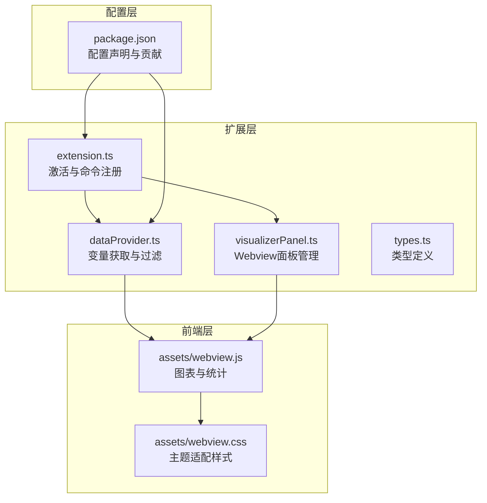
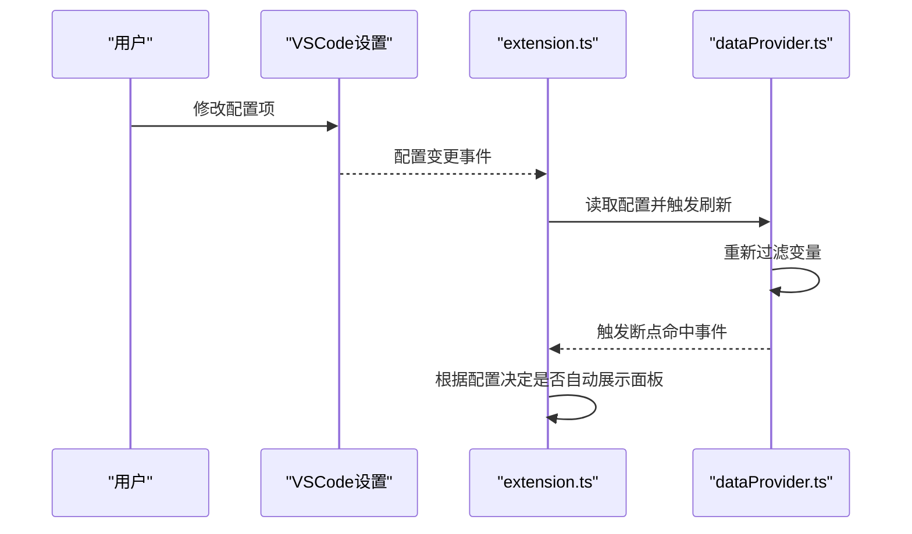
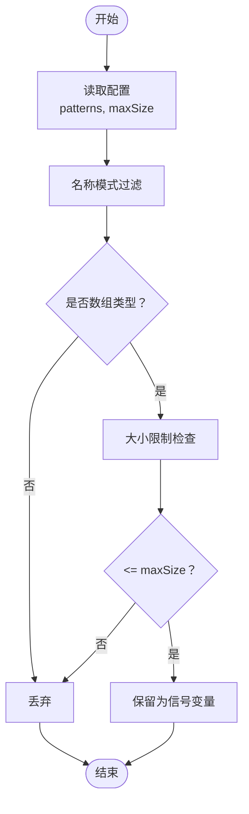
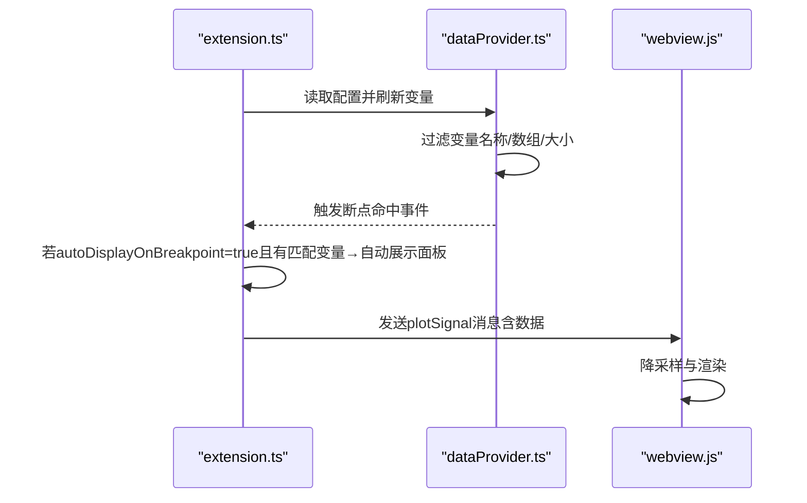
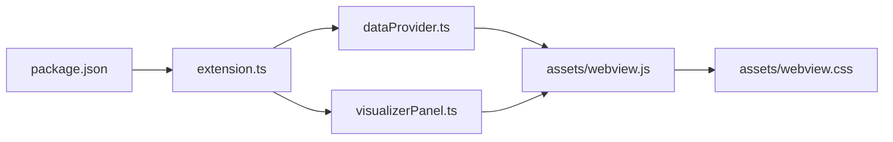

# 配置与定制

<cite>
**本文引用的文件**
- [package.json](file://package.json)
- [extension.ts](file://src/extension.ts)
- [dataProvider.ts](file://src/dataProvider.ts)
- [visualizerPanel.ts](file://src/visualizerPanel.ts)
- [types.ts](file://src/types.ts)
- [webview.js](file://assets/webview.js)
- [webview.css](file://assets/webview.css)
- [test_radar.cpp](file://test_radar.cpp)
- [QUICKSTART.md](file://QUICKSTART.md)
</cite>

## 目录
1. [简介](#简介)
2. [项目结构](#项目结构)
3. [核心组件](#核心组件)
4. [架构总览](#架构总览)
5. [详细组件分析](#详细组件分析)
6. [依赖关系分析](#依赖关系分析)
7. [性能考量](#性能考量)
8. [故障排除指南](#故障排除指南)
9. [结论](#结论)
10. [附录](#附录)

## 简介
本文件面向使用者与维护者，系统化梳理“雷达信号可视化”VSCode扩展的配置与定制能力，涵盖：
- 用户配置选项与默认值
- 自定义变量模式与过滤规则
- 性能调优参数与动态更新机制
- 配置文件结构与验证
- 高级配置（信号名称模式匹配、数组大小限制）
- 配置迁移与版本兼容性建议
- 常见场景示例、性能优化与故障排除
- 配置对系统性能与用户体验的影响

## 项目结构
该扩展采用典型的VSCode扩展分层结构：
- 扩展入口与生命周期管理：extension.ts
- 数据提供与变量过滤：dataProvider.ts
- 可视化面板与Webview集成：visualizerPanel.ts
- 类型定义：types.ts
- Webview前端逻辑与样式：assets/webview.js、assets/webview.css
- 测试程序与快速入门：test_radar.cpp、QUICKSTART.md
- 配置声明与贡献：package.json

**图表来源**
- [extension.ts:46-188](file://src/extension.ts#L46-L188)
- [dataProvider.ts:56-702](file://src/dataProvider.ts#L56-L702)
- [visualizerPanel.ts:44-424](file://src/visualizerPanel.ts#L44-L424)
- [types.ts:21-95](file://src/types.ts#L21-L95)
- [webview.js:1-494](file://assets/webview.js#L1-L494)
- [webview.css:1-237](file://assets/webview.css#L1-L237)
- [package.json:17-85](file://package.json#L17-L85)

**章节来源**
- [package.json:17-85](file://package.json#L17-L85)
- [extension.ts:46-188](file://src/extension.ts#L46-L188)
- [dataProvider.ts:56-702](file://src/dataProvider.ts#L56-L702)
- [visualizerPanel.ts:44-424](file://src/visualizerPanel.ts#L44-L424)
- [webview.js:1-494](file://assets/webview.js#L1-L494)
- [webview.css:1-237](file://assets/webview.css#L1-L237)
- [QUICKSTART.md:42-57](file://QUICKSTART.md#L42-L57)

## 核心组件
- 配置声明与贡献：在package.json中声明配置标题与属性，定义布尔、数组、数值类型及默认值。
- 数据提供者：读取用户配置，执行变量过滤（名称模式、数组类型、大小限制），并提供给树视图与可视化面板。
- 扩展入口：注册命令、监听调试事件、读取配置并触发自动展示。
- 可视化面板：管理Webview生命周期、与前端通信、渲染图表与统计。

**章节来源**
- [package.json:18-37](file://package.json#L18-L37)
- [extension.ts:138-146](file://src/extension.ts#L138-L146)
- [dataProvider.ts:414-441](file://src/dataProvider.ts#L414-L441)

## 架构总览
配置贯穿扩展的“读取—应用—反馈”闭环：
- 配置声明（package.json）→ 用户在设置中修改 → 扩展/数据提供者读取 → 影响变量过滤与UI行为 → 用户体验反馈。

**图表来源**
- [extension.ts:138-146](file://src/extension.ts#L138-L146)
- [dataProvider.ts:414-441](file://src/dataProvider.ts#L414-L441)
- [package.json:18-37](file://package.json#L18-L37)

## 详细组件分析

### 配置声明与默认值
- 配置前缀：rsv
- 配置项：
  - rsv.autoDisplayOnBreakpoint：布尔，缺省true，控制断点命中时是否自动弹出可视化面板。
  - rsv.signalNamePatterns：数组，缺省["*signal*", "*data*", "*pulse*", "*sample*"]，用于匹配信号变量名。
  - rsv.maxArraySize：数值，缺省100000，限制自动可视化的数组最大长度。

这些配置在扩展激活时被读取，用于变量过滤与自动展示逻辑。

**章节来源**
- [package.json:18-37](file://package.json#L18-L37)
- [extension.ts:140-141](file://src/extension.ts#L140-L141)
- [dataProvider.ts:426-428](file://src/dataProvider.ts#L426-L428)

### 自定义变量模式与过滤规则
- 名称模式匹配：将通配符模式转换为正则，匹配变量名（大小写不敏感）。默认模式覆盖常见信号关键词。
- 数组类型判定：依据显示值包含"[0]"、"array"或variablesReference>0来识别数组/复合类型。
- 大小限制：从显示值中提取数组长度，与maxArraySize比较，避免过大数组影响性能。

**图表来源**
- [dataProvider.ts:414-441](file://src/dataProvider.ts#L414-L441)
- [dataProvider.ts:454-460](file://src/dataProvider.ts#L454-L460)
- [dataProvider.ts:472-476](file://src/dataProvider.ts#L472-L476)
- [dataProvider.ts:492-499](file://src/dataProvider.ts#L492-L499)

**章节来源**
- [dataProvider.ts:414-441](file://src/dataProvider.ts#L414-L441)
- [QUICKSTART.md:36-40](file://QUICKSTART.md#L36-L40)

### 性能调优参数与动态更新机制
- 自动展示开关：命中断点时根据配置决定是否自动弹出面板，减少手动操作。
- 数组大小上限：通过maxArraySize限制潜在的大数组，避免UI卡顿与内存压力。
- Webview渲染优化：前端对大数据集进行降采样（最多10000点），保证渲染流畅。
- 配置动态读取：扩展与数据提供者均通过工作区配置读取最新值，无需重启。

**图表来源**
- [extension.ts:138-146](file://src/extension.ts#L138-L146)
- [dataProvider.ts:414-441](file://src/dataProvider.ts#L414-L441)
- [webview.js:380-388](file://assets/webview.js#L380-L388)

**章节来源**
- [extension.ts:138-146](file://src/extension.ts#L138-L146)
- [webview.js:380-388](file://assets/webview.js#L380-L388)
- [dataProvider.ts:492-499](file://src/dataProvider.ts#L492-L499)

### 配置文件结构与验证
- 结构：package.json的contributes.configuration.properties定义配置标题与各属性的类型、默认值与描述。
- 验证：VSCode对类型进行基础校验；数值与布尔默认值在读取失败时回退。
- 动态更新：扩展通过事件监听与配置读取实现即时生效。

**章节来源**
- [package.json:18-37](file://package.json#L18-L37)
- [extension.ts:140-141](file://src/extension.ts#L140-L141)
- [dataProvider.ts:426-428](file://src/dataProvider.ts#L426-L428)

### 高级配置与行为控制
- 信号名称模式匹配：支持通配符，大小写不敏感，便于覆盖自定义命名约定。
- 数组大小限制：基于显示值解析长度，若无法解析则放宽限制（假设可接受）。
- 自动展示控制：结合断点事件与用户偏好，平衡自动化与干扰。

**章节来源**
- [dataProvider.ts:454-460](file://src/dataProvider.ts#L454-L460)
- [dataProvider.ts:492-499](file://src/dataProvider.ts#L492-L499)
- [extension.ts:138-146](file://src/extension.ts#L138-L146)

### 配置迁移与版本兼容性
- 建议：新增配置项时保留默认值，避免破坏现有用户设置；删除或重命名配置时提供迁移提示或兼容映射。
- 兼容性：当前配置均为基础类型（布尔/数组/数值），与VSCode设置系统完全兼容。

**章节来源**
- [package.json:18-37](file://package.json#L18-L37)

### 常见配置场景与最佳实践
- 场景1：调试GPU信号，变量名含"data"或"pulse"
  - 建议：保持默认patterns即可；如变量名不匹配，可在设置中追加自定义模式。
- 场景2：变量过多导致面板卡顿
  - 建议：适当降低maxArraySize；或在断点处手动选择变量可视化。
- 场景3：频繁自动弹窗影响调试节奏
  - 建议：将autoDisplayOnBreakpoint设为false，手动打开面板。

**章节来源**
- [QUICKSTART.md:36-40](file://QUICKSTART.md#L36-L40)
- [package.json:21-35](file://package.json#L21-L35)

## 依赖关系分析
- extension.ts依赖vscode工作区配置读取与命令注册，依赖dataProvider事件。
- dataProvider.ts依赖vscode调试会话与DAP请求，依赖配置进行变量过滤。
- visualizerPanel.ts依赖webview通信与前端资源，依赖dataProvider获取数据。
- webview.js依赖Chart.js进行渲染，依赖webview.css进行主题适配。

**图表来源**
- [package.json:17-85](file://package.json#L17-L85)
- [extension.ts:46-188](file://src/extension.ts#L46-L188)
- [dataProvider.ts:56-702](file://src/dataProvider.ts#L56-L702)
- [visualizerPanel.ts:44-424](file://src/visualizerPanel.ts#L44-L424)
- [webview.js:1-494](file://assets/webview.js#L1-L494)
- [webview.css:1-237](file://assets/webview.css#L1-L237)

**章节来源**
- [extension.ts:46-188](file://src/extension.ts#L46-L188)
- [dataProvider.ts:56-702](file://src/dataProvider.ts#L56-L702)
- [visualizerPanel.ts:44-424](file://src/visualizerPanel.ts#L44-L424)
- [webview.js:1-494](file://assets/webview.js#L1-L494)
- [webview.css:1-237](file://assets/webview.css#L1-L237)

## 性能考量
- 变量过滤阶段的限制：
  - 名称模式匹配为O(n模式×n变量)，默认模式较少，开销可控。
  - 数组判定与大小检查为线性扫描，复杂度低。
- 渲染阶段的限制：
  - 前端对超过10000点的数据进行等间隔降采样，避免Chart.js渲染瓶颈。
- 配置读取：
  - 通过工作区配置读取，避免重复解析，延迟到需要时才读取。

**章节来源**
- [webview.js:380-388](file://assets/webview.js#L380-L388)
- [dataProvider.ts:492-499](file://src/dataProvider.ts#L492-L499)

## 故障排除指南
- 侧边栏未显示“Radar Signals”
  - 确认在扩展开发宿主窗口中并已启动调试会话。
- 信号变量列表为空
  - 确认调试器已暂停；检查变量名是否匹配默认模式（包含"*signal*"、"*data*"、"*pulse*"、"*sample*"）。
- 图表不显示
  - 检查变量是否为数组类型且包含数值数据；确认面板已正确创建并收到数据。
- 大数组导致卡顿
  - 降低maxArraySize；或在断点处手动选择较小数组进行可视化。

**章节来源**
- [QUICKSTART.md:31-41](file://QUICKSTART.md#L31-L41)
- [extension.ts:138-146](file://src/extension.ts#L138-L146)
- [dataProvider.ts:472-476](file://src/dataProvider.ts#L472-L476)

## 结论
本扩展通过清晰的配置声明与严格的过滤逻辑，实现了对雷达信号变量的自动识别与可视化。合理使用配置项（名称模式、数组大小限制、自动展示开关）可在保证性能的同时提升调试效率。建议在团队内统一变量命名规范，并根据项目规模调整maxArraySize与展示策略。

## 附录
- 测试程序与断点位置参考：test_radar.cpp中包含混合信号生成与断点设置示例，便于验证配置效果。
- 快速入门与项目结构说明：QUICKSTART.md提供了安装、编译、调试与常见问题解答。

**章节来源**
- [test_radar.cpp:34-62](file://test_radar.cpp#L34-L62)
- [QUICKSTART.md:18-66](file://QUICKSTART.md#L18-L66)