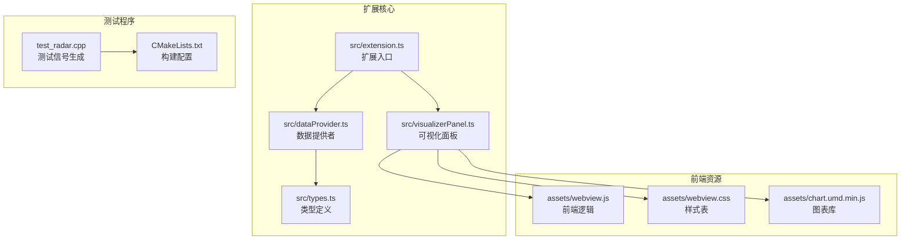
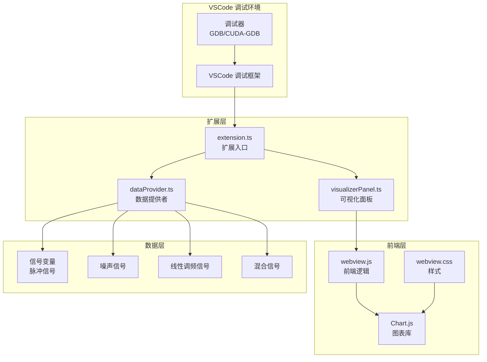
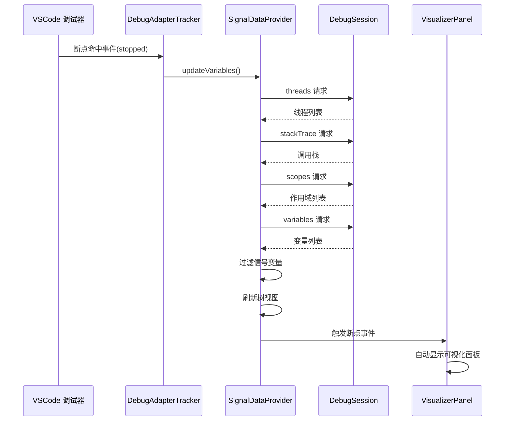
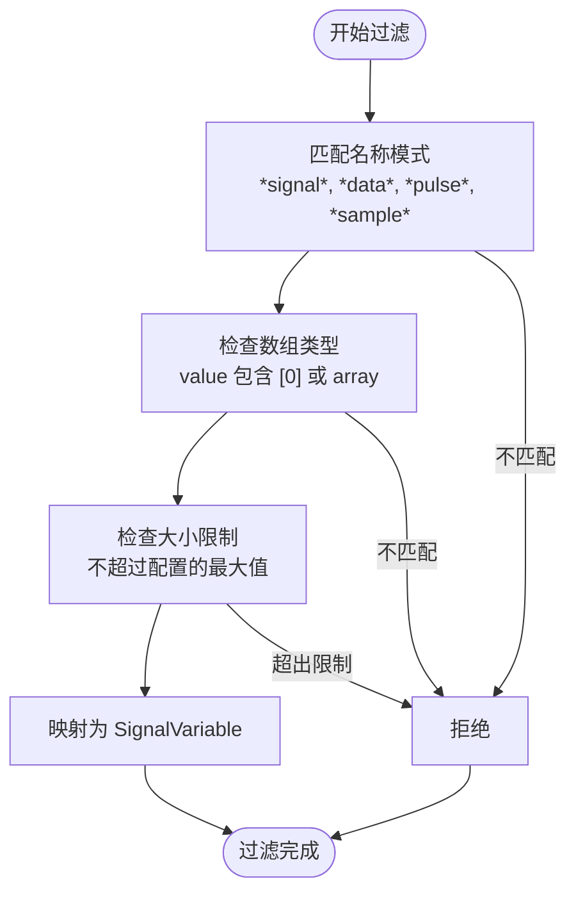
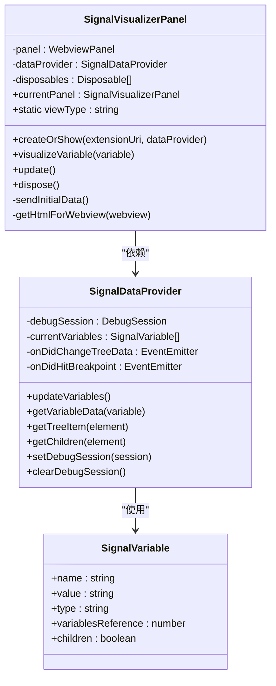
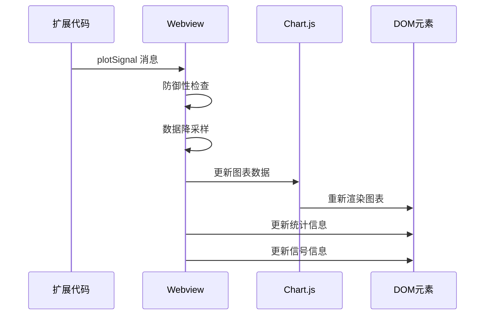
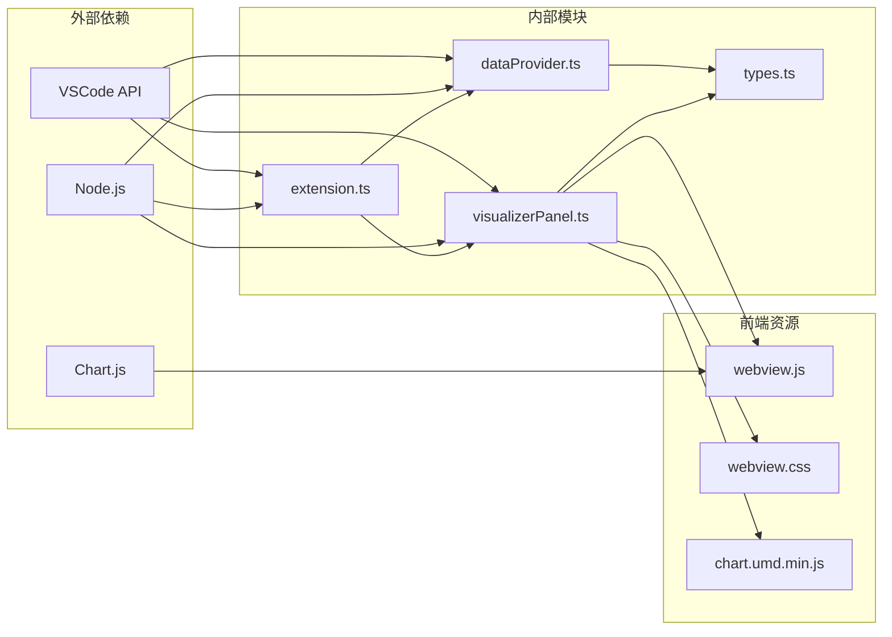

# 项目概述

<cite>
**本文档引用的文件**
- [package.json](file://package.json)
- [QUICKSTART.md](file://QUICKSTART.md)
- [src/extension.ts](file://src/extension.ts)
- [src/dataProvider.ts](file://src/dataProvider.ts)
- [src/visualizerPanel.ts](file://src/visualizerPanel.ts)
- [src/types.ts](file://src/types.ts)
- [assets/webview.js](file://assets/webview.js)
- [assets/webview.css](file://assets/webview.css)
- [test_radar.cpp](file://test_radar.cpp)
- [CMakeLists.txt](file://CMakeLists.txt)
</cite>

## 目录
1. [项目简介](#项目简介)
2. [项目结构](#项目结构)
3. [核心组件](#核心组件)
4. [架构概览](#架构概览)
5. [详细组件分析](#详细组件分析)
6. [依赖关系分析](#依赖关系分析)
7. [性能考虑](#性能考虑)
8. [故障排除指南](#故障排除指南)
9. [结论](#结论)

## 项目简介

Radar Signal Visualizer（雷达信号可视化）是一个专为 VSCode 设计的扩展程序，旨在在 GPU 调试过程中实时可视化雷达信号数据。该项目的核心目标是帮助开发者在调试 C++ 程序时，能够直观地观察和分析雷达信号的波形特征，从而提高调试效率和准确性。

### 项目核心价值

- **实时可视化**：在断点命中时自动显示雷达信号波形
- **GPU 调试集成**：无缝集成到 VSCode 的调试工作流中
- **智能变量识别**：自动过滤和识别信号相关变量
- **高性能渲染**：支持大规模信号数据的实时渲染
- **用户友好界面**：提供直观的波形图表和统计信息

### 目标用户群体

- **GPU 开发者**：需要调试 CUDA、OpenCL 等并行计算程序
- **雷达信号处理工程师**：开发和调试雷达信号处理算法
- **嵌入式系统开发者**：调试实时信号处理应用
- **学术研究人员**：进行信号处理算法研究和验证

## 项目结构

该项目采用模块化设计，主要分为以下几个核心部分：

**图表来源**
- [src/extension.ts:1-200](file://src/extension.ts#L1-L200)
- [src/dataProvider.ts:1-703](file://src/dataProvider.ts#L1-L703)
- [src/visualizerPanel.ts:1-451](file://src/visualizerPanel.ts#L1-L451)

**章节来源**
- [package.json:1-102](file://package.json#L1-L102)
- [QUICKSTART.md:42-57](file://QUICKSTART.md#L42-L57)

## 核心组件

### 扩展入口组件

扩展入口文件 `src/extension.ts` 是整个扩展的启动点，负责协调各个组件的工作。它实现了 VSCode 扩展的标准生命周期管理，包括激活、命令注册和事件监听。

### 数据提供者组件

`src/dataProvider.ts` 是扩展的核心大脑，负责与调试器交互并提取变量数据。它实现了 VSCode 的 TreeDataProvider 接口，为侧边栏提供信号变量列表。

### 可视化面板组件

`src/visualizerPanel.ts` 管理 VSCode 的 WebviewPanel，负责创建和维护可视化界面。它采用单例模式确保同一时间只有一个可视化面板存在。

### 类型定义组件

`src/types.ts` 定义了扩展中使用的所有接口，包括 `SignalVariable` 和 `SignalData`，确保代码的类型安全性和可维护性。

**章节来源**
- [src/extension.ts:46-188](file://src/extension.ts#L46-L188)
- [src/dataProvider.ts:56-703](file://src/dataProvider.ts#L56-L703)
- [src/visualizerPanel.ts:44-424](file://src/visualizerPanel.ts#L44-L424)
- [src/types.ts:21-95](file://src/types.ts#L21-L95)

## 架构概览

该项目采用了分层架构设计，将数据获取、处理和展示分离，形成了清晰的职责分工：

**图表来源**
- [src/extension.ts:138-146](file://src/extension.ts#L138-L146)
- [src/dataProvider.ts:243-399](file://src/dataProvider.ts#L243-L399)
- [src/visualizerPanel.ts:264-275](file://src/visualizerPanel.ts#L264-L275)

### 核心设计理念

1. **事件驱动架构**：通过 VSCode 的事件系统实现松耦合的组件通信
2. **模块化设计**：每个组件职责单一，便于测试和维护
3. **性能优先**：针对大规模信号数据的优化处理
4. **用户体验**：自动化的断点响应和友好的界面设计

## 详细组件分析

### 数据提供者组件深入分析

数据提供者组件是整个扩展的核心，负责与调试器的深度集成：

**图表来源**
- [src/dataProvider.ts:197-204](file://src/dataProvider.ts#L197-L204)
- [src/dataProvider.ts:243-399](file://src/dataProvider.ts#L243-L399)
- [src/extension.ts:139-146](file://src/extension.ts#L139-L146)

#### 数据获取流程

数据提供者通过 DAP（Debug Adapter Protocol）实现四层请求链：

1. **threads**：获取所有线程信息
2. **stackTrace**：获取当前线程的调用栈
3. **scopes**：获取当前栈帧的作用域
4. **variables**：获取作用域内的所有变量

#### 变量过滤机制

组件实现了智能的变量过滤系统：

**图表来源**
- [src/dataProvider.ts:414-441](file://src/dataProvider.ts#L414-L441)
- [src/dataProvider.ts:454-476](file://src/dataProvider.ts#L454-L476)
- [src/dataProvider.ts:492-499](file://src/dataProvider.ts#L492-L499)

**章节来源**
- [src/dataProvider.ts:138-205](file://src/dataProvider.ts#L138-L205)
- [src/dataProvider.ts:414-499](file://src/dataProvider.ts#L414-L499)

### 可视化面板组件分析

可视化面板组件负责管理 VSCode 的 WebviewPanel，提供完整的可视化界面：

**图表来源**
- [src/visualizerPanel.ts:44-424](file://src/visualizerPanel.ts#L44-L424)
- [src/dataProvider.ts:56-703](file://src/dataProvider.ts#L56-L703)
- [src/types.ts:59-65](file://src/types.ts#L59-L65)

#### Webview 安全机制

组件实现了严格的安全机制来保护用户安全：

- **CSP（内容安全策略）**：限制资源加载来源
- **Nonce 验证**：为每个脚本标签生成一次性随机数
- **本地资源访问**：通过 `vscode-resource://` 协议访问扩展资源

#### 图表渲染优化

前端组件针对大规模数据进行了专门优化：

- **降采样算法**：超过 10,000 个点时自动降采样
- **增量更新**：只更新变化的数据点
- **内存管理**：合理管理图表实例和数据缓存

**章节来源**
- [src/visualizerPanel.ts:102-164](file://src/visualizerPanel.ts#L102-L164)
- [src/visualizerPanel.ts:317-392](file://src/visualizerPanel.ts#L317-L392)
- [assets/webview.js:379-388](file://assets/webview.js#L379-L388)

### 前端可视化组件分析

前端组件使用 Chart.js 实现高性能的信号波形可视化：

**图表来源**
- [src/visualizerPanel.ts:264-275](file://src/visualizerPanel.ts#L264-L275)
- [assets/webview.js:355-419](file://assets/webview.js#L355-L419)

#### 统计计算优化

前端实现了高效的统计计算算法：

- **单次遍历**：同时计算最小值、最大值和总和
- **避免函数调用开销**：使用 for 循环替代 Math.min/max
- **精度控制**：使用 toFixed(6) 保持 6 位小数精度

**章节来源**
- [assets/webview.js:456-493](file://assets/webview.js#L456-L493)
- [assets/webview.js:355-419](file://assets/webview.js#L355-L419)

## 依赖关系分析

项目采用了清晰的依赖关系设计，确保模块间的松耦合：

**图表来源**
- [package.json:98-100](file://package.json#L98-L100)
- [src/extension.ts:27-29](file://src/extension.ts#L27-L29)

### 关键依赖说明

- **Chart.js**：用于高性能的波形图表渲染
- **VSCode API**：提供扩展开发框架和调试集成能力
- **TypeScript**：提供静态类型检查和更好的开发体验

**章节来源**
- [package.json:91-100](file://package.json#L91-L100)
- [src/extension.ts:27-29](file://src/extension.ts#L27-L29)

## 性能考虑

### 数据处理优化

项目在多个层面实现了性能优化：

1. **异步数据获取**：使用 Promise 和 async/await 避免阻塞 UI
2. **智能降采样**：针对大规模数据的自动降采样算法
3. **内存管理**：合理的对象生命周期管理和垃圾回收
4. **事件驱动**：基于事件的更新机制，避免轮询

### 渲染性能优化

前端组件采用了多项渲染优化技术：

- **Canvas 渲染**：使用 HTML5 Canvas 进行高性能渲染
- **增量更新**：只更新变化的部分，避免全量重绘
- **响应式设计**：自动适应面板大小变化
- **主题适配**：与 VSCode 主题无缝集成

## 故障排除指南

### 常见问题及解决方案

#### 问题：侧边栏没有显示 Radar Signals 图标？

**原因**：未在扩展开发主机窗口中运行或调试会话未启动

**解决方案**：
1. 确保在 VSCode 扩展开发主机窗口中运行
2. 启动调试会话后再查看侧边栏
3. 检查扩展是否正确激活

#### 问题：信号变量列表为空？

**原因**：调试器未暂停或变量名不匹配配置模式

**解决方案**：
1. 确保调试器已暂停（断点已命中）
2. 检查变量名是否包含配置的模式（如 *signal*, *data*, *pulse*, *sample*）
3. 调整 `rsv.signalNamePatterns` 配置

#### 问题：图表不显示或显示异常？

**原因**：变量类型不正确或数据格式问题

**解决方案**：
1. 确认变量是数组类型且包含数值数据
2. 检查变量大小是否超过 `rsv.maxArraySize` 限制
3. 验证变量在当前作用域内可见

**章节来源**
- [QUICKSTART.md:31-41](file://QUICKSTART.md#L31-L41)

### 调试扩展本身

项目提供了专门的调试扩展开发模式：

1. 在 `src/` 目录的 TypeScript 文件中设置断点
2. 按 `F5` 启动扩展开发主机
3. 在新窗口中触发扩展功能
4. 断点会在原窗口中触发

**章节来源**
- [QUICKSTART.md:59-66](file://QUICKSTART.md#L59-L66)

## 结论

Radar Signal Visualizer 是一个设计精良的 VSCode 扩展，成功地将复杂的雷达信号可视化功能集成到现代 IDE 中。项目采用了清晰的架构设计、严格的类型安全和优秀的性能优化，为 GPU 调试提供了强大的支持。

### 主要优势

1. **无缝集成**：与 VSCode 调试框架深度集成，提供自然的用户体验
2. **智能识别**：自动识别和过滤信号相关变量，减少手动筛选工作
3. **高性能**：针对大规模信号数据的优化处理，确保流畅的交互体验
4. **可扩展性**：模块化设计便于功能扩展和维护

### 技术亮点

- **事件驱动架构**：基于 VSCode 事件系统的松耦合设计
- **Webview 技术**：利用 VSCode Webview 提供丰富的可视化界面
- **CSP 安全机制**：严格的安全策略保护用户环境
- **主题适配**：完美适配 VSCode 的各种主题设置

该项目为雷达信号处理和 GPU 开发提供了一个强大而易用的工具，显著提高了开发和调试效率。其优雅的架构设计和完善的性能优化使其成为 VSCode 扩展开发的优秀范例。